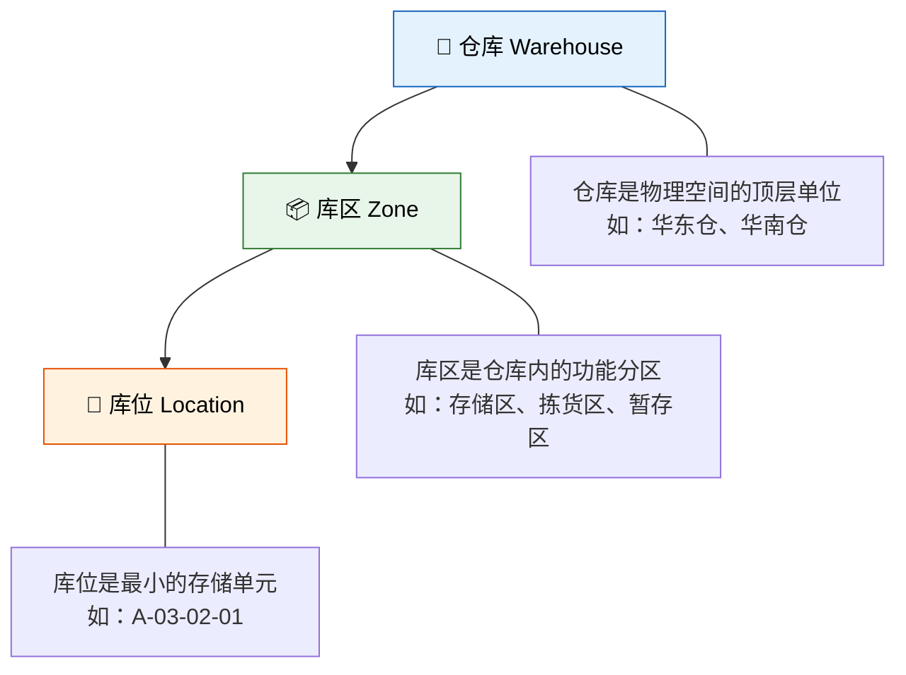
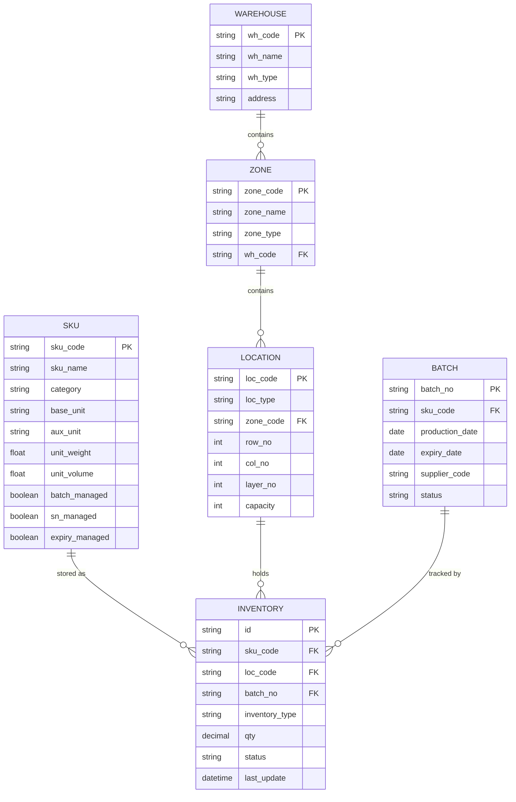

# 核心概念与数据模型

> WMS 的底层逻辑是数据模型——理解了仓库三级结构、物料主数据、批次与序列号，才能真正读懂系统的每一次"上架推荐"和"先进先出"。

## 1. 仓库三级结构

WMS 通过三级结构精确定位每一件货物：



### 1.1 仓库（Warehouse）

仓库是最顶层的管理单位，对应一个物理仓库或虚拟仓库：

| 类型 | 说明 | 举例 |
|------|------|------|
| 实体仓 | 有明确物理边界的仓库 | 上海嘉定仓、苏州工业园仓 |
| 虚拟仓 | 逻辑上的仓库，用于特殊管理 | 在途仓、待检仓、客供料仓 |
| 线边仓 | 生产车间旁的物料暂存区 | 冲压线边仓、组装线边仓 |

### 1.2 库区（Zone）

库区是仓库内的功能分区，不同库区承担不同作业职责：

| 库区类型 | 功能 | 特点 |
|---------|------|------|
| 存储区 | 大批量存放，补货给拣货区 | 高位货架，叉车作业 |
| 拣货区 | 面向订单拣选 | 黄金区域，人工或电子标签 |
| 暂存区 | 入库待上架/出库待发货 | 临时性，快进快出 |
| 质检区 | 来料检验 | 隔离管理，质检通过才可上架 |
| 退货区 | 退货收货与处理 | 独立区域，避免与正品混淆 |
| 危险品区 | 特殊存储条件 | 温控、防爆、通风 |

### 1.3 库位（Location）

库位是最小的存储单元，是库存定位的精确坐标。

## 2. 库位编码规则设计

好的库位编码是仓库高效运作的基础。常见编码方案：

```
[仓库代码]-[库区代码]-[排]-[列]-[层]
  WH01  -  ST    - 03 - 02 - 01

含义：1号仓库 - 存储区 - 第3排 - 第2列 - 第1层
```

**编码设计原则**：

| 原则 | 说明 | 示例 |
|------|------|------|
| 唯一性 | 每个编码全局唯一 | WH01-ST-030201 |
| 可读性 | 看编码就能定位 | 排列层有序，不走无意义流水号 |
| 可扩展 | 预留编码空间 | 排用 2 位，最多 99 排 |
| 区分类型 | 编码中体现库位属性 | ST=存储，PK=拣货，TM=暂存 |

**库位类型编码对照表**：

| 编码 | 类型 | 英文 | 说明 |
|------|------|------|------|
| ST | 存储位 | Storage | 大批量存放位 |
| PK | 拣货位 | Picking | 订单拣选位 |
| TM | 暂存位 | Temporary | 临时存放位 |
| QC | 质检位 | Quality Check | 待检/隔离位 |
| RT | 退货位 | Return | 退货处理位 |
| DP | 发货位 | Dispatch | 发货暂存位 |

## 3. 物料主数据

物料主数据是 WMS 的核心基础数据，描述了"管的是什么东西"：

| 字段 | 说明 | 示例 |
|------|------|------|
| SKU | 最小库存单元，唯一标识一种物料 | SKU-2024-00123 |
| SKU 名称 | 物料描述 | M10×50 不锈钢六角螺栓 |
| 分类 | 物料类别 | 紧固件 > 螺栓 > 六角螺栓 |
| 基本单位 | 最小计量单位 | 个 |
| 辅助单位 | 采购/存储使用的换算单位 | 盒（1盒=100个） |
| 重量 | 单件重量 | 0.025 kg |
| 体积 | 单件体积 | 0.000012 m³ |
| 危险品等级 | 危险品分类 | 无 |
| 存储条件 | 温湿度要求 | 常温干燥 |
| 效期管控 | 是否启用效期管理 | 否 |
| 批次管控 | 是否启用批次管理 | 是 |
| 序列号管控 | 是否启用序列号管理 | 否 |

### SKU 与 SKU 属性

SKU（Stock Keeping Unit）是库存管理的最小单元。同一个产品如果有不同属性组合，就是不同的 SKU：

| 产品 | 颜色 | 尺寸 | SKU 编码 |
|------|------|------|---------|
| T恤 | 白 | M | SKU-TS-WH-M |
| T恤 | 白 | L | SKU-TS-WH-L |
| T恤 | 黑 | M | SKU-TS-BK-M |
| T恤 | 黑 | L | SKU-TS-BK-L |

### 单位换算

WMS 支持多级单位换算，满足不同场景的计量需求：

```
1 箱 = 10 盒 = 1000 个

采购入库：按"箱"收货（供应商以箱为单位发货）
存储管理：按"盒"上架（仓库以盒为单位管理）
订单拣货：按"个"拣货（客户以个为单位下单）
```

## 4. 批次与序列号

批次和序列号是两种不同的追溯粒度：

| 维度 | 批次号 | 序列号 |
|------|--------|--------|
| 粒度 | 一批物料共用一个号 | 每一件物料唯一编号 |
| 管理成本 | 低 | 高 |
| 适用场景 | 大批量同质物料 | 高价值单品、需要单品追溯 |
| 举例 | 生产批次 20240601 | 设备序列号 SN-2024-00001 |
| 追溯范围 | 同批次全部物料 | 单个产品 |

**何时用批次，何时用序列号？**

- **批次管理**：原材料、快消品、药品——同一批次的物料属性相同，无需区分到单件
- **序列号管理**：电子设备、汽车零部件、医疗器械——每件产品需要独立追溯生命周期

**批次号的生成规则**：

```
常见格式：[日期]-[供应商代码]-[流水号]

示例：20240601-SUP01-001
含义：2024年6月1日 - 供应商SUP01 - 当日第1批
```

## 5. 数据模型 ER 图

WMS 核心实体及其关系：



**关键关系解读**：

- 一个仓库包含多个库区，一个库区包含多个库位
- 库存记录（INVENTORY）是 SKU、库位、批次的交叉点——确定"什么物料在什么位置的哪个批次有多少"
- `inventory_type` 区分可用库存、冻结库存、在途库存、质检库存

## 6. ABC 分类法

ABC 分类法是库存管理中最经典的分类工具，基于帕累托原则（80/20 法则）：

| 分类 | 占 SKU 比例 | 占价值比例 | 管理策略 |
|------|------------|-----------|---------|
| A 类 | 10%~20% | 70%~80% | 严格管控，高频盘点，安全库存低 |
| B 类 | 20%~30% | 15%~20% | 常规管理，定期盘点 |
| C 类 | 50%~70% | 5%~10% | 简化管理，大批量采购，高安全库存 |

**ABC 分类的应用**：

- **储位分配**：A 类物料放在离出库口最近的拣货位（黄金区域）
- **盘点频率**：A 类每月盘点，B 类每季盘点，C 类半年盘点
- **安全库存**：A 类低安全库存（高周转、高价值，减少资金占用），C 类高安全库存（低价值，避免频繁缺货）
- **采购策略**：A 类小批量多频次，C 类大批量低频次

**ABC 分类计算步骤**：

1. 统计各 SKU 的年消耗金额（年消耗量 × 单价）
2. 按金额从高到低排序
3. 计算累计金额占比
4. 按累计占比划分 A/B/C

```
示例：
SKU-001  年消耗 10000 件 × ¥50 = ¥500,000   → 累计 50%   → A类
SKU-002  年消耗 5000 件  × ¥30 = ¥150,000   → 累计 65%   → A类
SKU-003  年消耗 8000 件  × ¥10 = ¥80,000    → 累计 73%   → B类
SKU-004  年消耗 2000 件  × ¥15 = ¥30,000    → 累计 76%   → B类
SKU-005  年消耗 500 件   × ¥8  = ¥4,000     → 累计 76.4% → C类
...（其余 SKU 合计占 23.6%）
```

## 7. 小结

| 概念 | 核心要点 |
|------|---------|
| 仓库三级结构 | 仓库→库区→库位，实现精确定位 |
| 库位编码 | 唯一、可读、可扩展、区分类型 |
| 物料主数据 | SKU 是最小库存单元，支持多级单位换算 |
| 批次 vs 序列号 | 批次管"一批"，序列号管"一件" |
| ABC 分类 | 按价值占比划分 A/B/C，差异化管控 |
| 数据模型 | 库存 = SKU + 库位 + 批次的交叉记录 |

下一章我们将从数据模型上升到技术架构，看看 WMS 系统本身是怎么设计和部署的。
