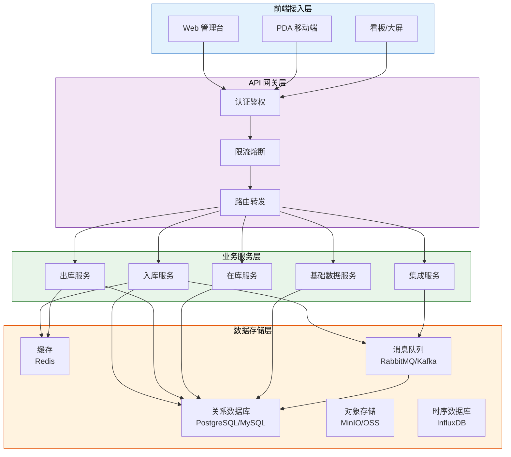
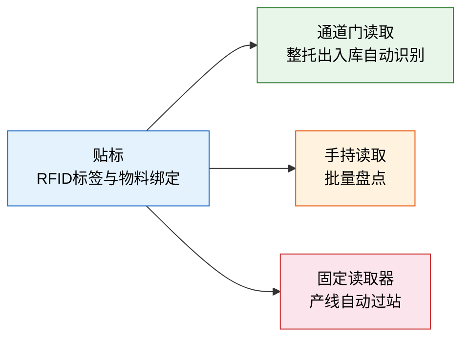
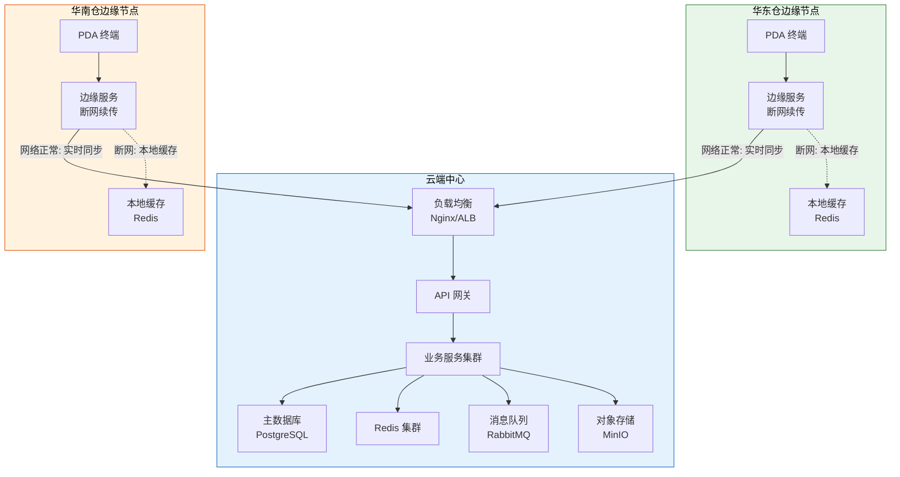

# WMS 整体架构

> 好的架构不是设计出来的，而是在业务演进中生长出来的。理解 WMS 的技术架构与集成拓扑，才能做出正确的选型与部署决策。

## 1. 技术架构分层

典型的 WMS 系统采用分层架构，从上到下分为四层：



### 各层职责

| 层次 | 职责 | 典型技术选型 |
|------|------|-------------|
| 前端接入层 | 用户交互、数据展示 | Vue 3 / React、UniApp（PDA）、ECharts（看板） |
| API 网关层 | 统一入口、安全控制 | Spring Cloud Gateway / Kong / Nginx |
| 业务服务层 | 核心业务逻辑 | Spring Boot / .NET / Django |
| 数据存储层 | 数据持久化与消息传递 | PostgreSQL、Redis、RabbitMQ、MinIO |

### 消息队列在 WMS 中的角色

WMS 是一个事件驱动的系统，消息队列承担了关键的异步通信职责：

| 场景 | 生产者 | 消费者 | 消息内容 |
|------|--------|--------|---------|
| 入库确认 | 入库服务 | ERP 同步服务 | 入库单号、物料、数量、库位 |
| 库存变更 | 各业务服务 | 看板服务 | 变更类型、SKU、库位、变化量 |
| 设备指令 | 出库服务 | WCS（仓控系统） | 任务ID、目标库位、动作类型 |
| 预警通知 | 在库服务 | 通知服务 | 预警类型、物料、阈值、当前值 |

## 2. 单体 vs 微服务部署模式

| 维度 | 单体架构 | 微服务架构 |
|------|---------|-----------|
| 部署复杂度 | 低，一个进程 | 高，多服务协同 |
| 开发效率 | 前期快，后期慢 | 前期慢，后期快 |
| 扩展性 | 整体扩展 | 按需扩展（如单独扩拣货服务） |
| 技术栈 | 统一 | 可异构 |
| 运维成本 | 低 | 高（需要服务发现、链路追踪等） |
| 适用规模 | 单仓、日均单量 < 5万 | 多仓、日均单量 > 5万 |

**选型建议**：

- **初创期/单仓**：选择单体架构，快速上线，验证业务
- **成长期/多仓**：渐进式拆分——先从集成服务开始拆出，因为集成最容易出问题
- **成熟期/大规模**：全面微服务化，配合容器化部署


## 3. 关键集成点

WMS 不是孤岛，它需要与上下游系统深度集成：

| 集成系统 | 数据流向 | 集成方式 | 关键数据 |
|---------|---------|---------|---------|
| ERP | 双向 | API + 消息队列 | 采购订单、销售订单、库存同步 |
| MES | 双向 | API + 消息队列 | 领料需求、报工消耗、成品入库 |
| TMS | WMS→TMS | API | 发货通知、运单信息 |
| WCS | 双向 | TCP/MQTT | 设备指令、设备状态 |
| BMS | WMS→BMS | API | 计费数据 |
| OMS | OMS→WMS | API | 订单下发、订单状态回传 |

### 3.1 与 ERP 集成

ERP 与 WMS 的集成是最核心的集成关系：

| 接口 | 方向 | 触发时机 | 说明 |
|------|------|---------|------|
| 采购订单同步 | ERP→WMS | 采购订单审核通过 | WMS 创建预期到货通知 |
| 入库确认回写 | WMS→ERP | 入库完成 | ERP 增加库存与应付 |
| 销售订单下发 | ERP→WMS | 销售订单审核通过 | WMS 创建出库任务 |
| 出库确认回写 | WMS→ERP | 出库完成 | ERP 减少库存与增加应收 |
| 库存快照同步 | WMS→ERP | 定时/实时 | ERP 对账与成本核算 |

### 3.2 与 MES 集成

| 接口 | 方向 | 触发时机 | 说明 |
|------|------|---------|------|
| 领料需求推送 | MES→WMS | 工单释放 | WMS 生成拣货配送任务 |
| 配送确认回传 | WMS→MES | 物料送达线边仓 | MES 更新线边库存 |
| 报工消耗同步 | MES→WMS | 工序报工 | WMS 扣减线边库存 |
| 成品入库推送 | MES→WMS | 工单完工 | WMS 创建成品入库任务 |

### 3.3 与 TMS 集成

| 接口 | 方向 | 触发时机 | 说明 |
|------|------|---------|------|
| 发货通知 | WMS→TMS | 出库复核完成 | TMS 创建运单 |
| 车辆调度 | TMS→WMS | 车辆到站 | WMS 安排月台与装卸 |
| 运单状态 | TMS→WMS | 运输途中 | WMS 更新发货状态 |

## 4. RFID / 条码 / PDA 终端接入

数据采集是 WMS 的"神经末梢"，决定了系统数据的实时性与准确性：

| 采集方式 | 识别精度 | 读取速度 | 适用场景 | 成本 |
|---------|---------|---------|---------|------|
| 一维条码 | 单件 | 每秒 1~3 次 | 单件扫码收货/拣货 | 低 |
| 二维码 | 单件 | 每秒 1~3 次 | 信息量大的标签 | 低 |
| RFID（无源） | 批量 | 每秒 100+ | 整箱/整托出入库、盘点 | 中 |
| RFID（有源） | 批量+实时定位 | 实时 | 高价值资产追踪 | 高 |
| PDA | 单件+移动作业 | 随时 | 仓内移动作业 | 中 |

**PDA 终端的功能**：

```
┌─────────────────────────┐
│       PDA 终端功能        │
├─────────────────────────┤
│  📥 收货扫码             │
│  📤 拣货任务接收与确认     │
│  📦 上架库位扫描          │
│  🔄 移库扫码             │
│  📋 盘点数据采集          │
│  🔍 库存查询             │
│  📸 拍照上传（异常记录）   │
└─────────────────────────┘
```

**RFID 在仓储中的应用模式**：



## 5. 部署拓扑图

典型的多仓 WMS 部署架构：



**边缘节点设计**：

仓库网络不稳定是常态。边缘节点在断网时可以：

1. 本地缓存作业数据，恢复网络后批量上传
2. 本地执行拣货、上架等基础操作
3. 冲突检测：网络恢复后与中心端进行数据合并

## 6. 性能考量

### 6.1 关键性能指标

| 场景 | 性能要求 | 优化手段 |
|------|---------|---------|
| 并发入库 | 大促期间 500+ 单/分钟 | 批量接口、异步处理、库存缓存 |
| 批量拣货 | 单波次 1000+ 订单 | 并行拣货、路径优化、预分配 |
| 库存查询 | PDA 响应 < 500ms | Redis 缓存热点 SKU、读写分离 |
| 盘点上报 | 10000+ 库位/小时 | 批量提交、RFID 批量读取 |
| 接口同步 | ERP 回写延迟 < 3s | 消息队列削峰、失败重试 |

### 6.2 高并发入库场景

大促期间入库量可能暴增 10 倍，需要以下保障：

```
优化链路：

1. 入库接口 → 异步化（先接单，后处理）
2. 库存更新 → Redis 先扣减，DB 异步落盘
3. 上架推荐 → 预计算 + 缓存，避免实时计算
4. ERP 回写 → 消息队列削峰，控制回写速率
5. 数据库   → 分库分表（按仓库分片）、读写分离
```

### 6.3 批量拣货性能优化

| 优化点 | 做法 | 效果 |
|--------|------|------|
| 波次合并 | 将多个小订单合并为同一波次 | 减少拣货行走距离 40%~60% |
| 分区拣选 | 不同库区并行拣货 | 拣货时间缩短 50% |
| 预分配 | 波次释放前预分配库位 | 避免拣货时库存冲突 |
| 边拣边分 | 拣货同时按订单分拣 | 省去二次分拣环节 |
| 路径优化 | S 型/U 型路径规划 | 减少无效行走 30% |

## 7. 小结

| 维度 | 核心要点 |
|------|---------|
| 架构分层 | 前端→网关→服务→数据，职责清晰 |
| 部署模式 | 单体起步，渐进拆分，微服务成熟 |
| 系统集成 | ERP（订单/库存）、MES（物料/报工）、TMS（发货/运输） |
| 数据采集 | 条码单件精确，RFID 批量高效，PDA 移动作业 |
| 边缘部署 | 断网续传，网络恢复后数据合并 |
| 性能优化 | 异步入库、缓存热数据、消息削峰、分区并行 |

下一章进入业务模块，首先详解入库管理的完整流程与策略。
