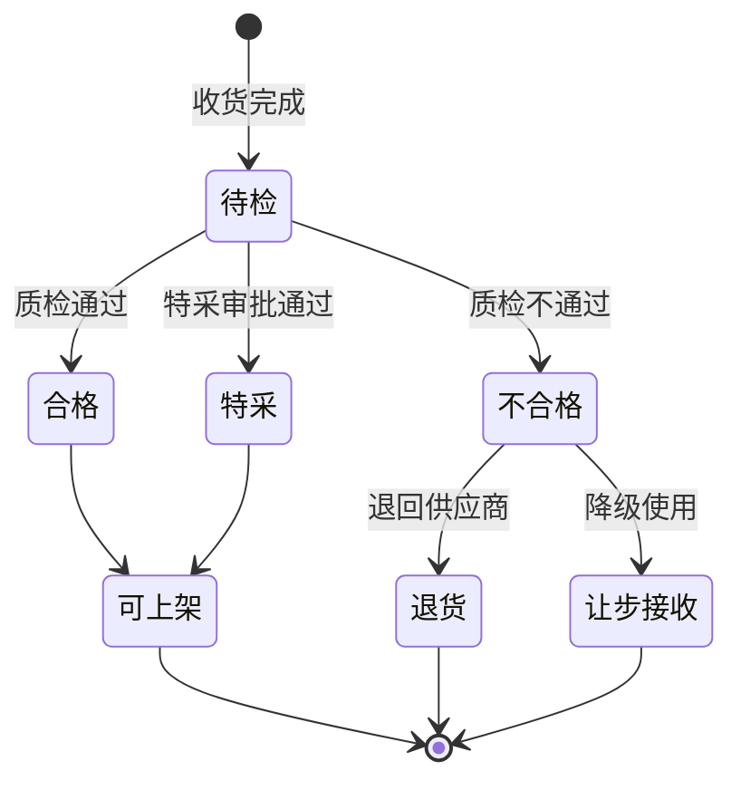
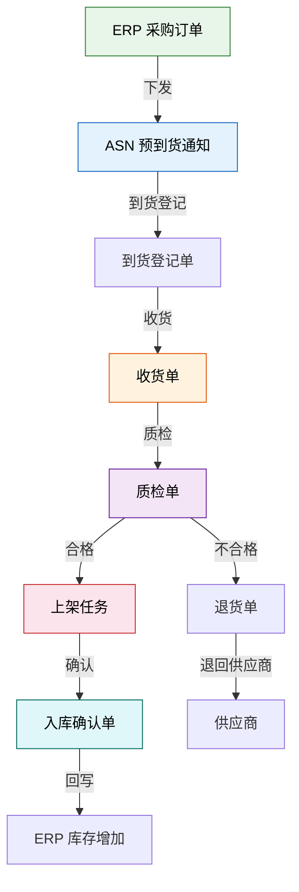
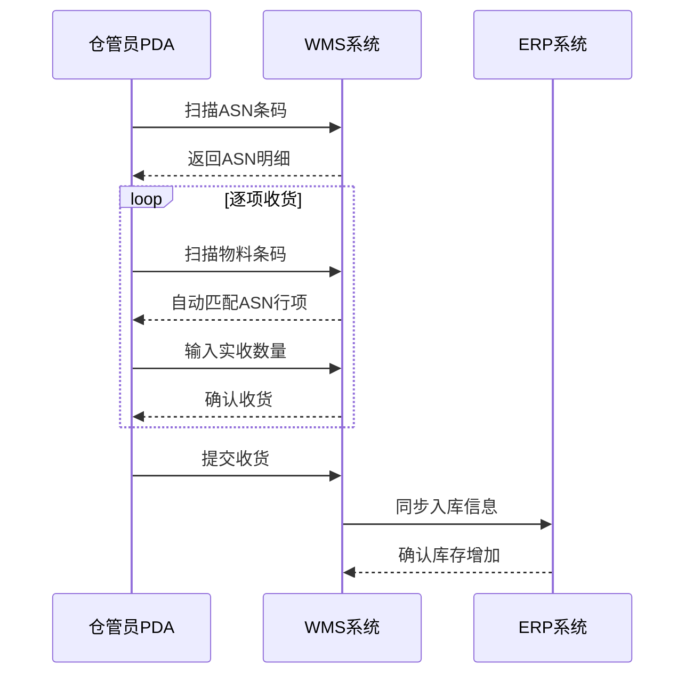

# 入库流程全解析

## 1. 完整入库流程

入库是仓储作业的起点，标准入库流程包含六个核心环节：


### 1.1 到货登记

供应商车辆到达仓库后，首先进行到货登记：

| 操作 | 说明 |
|------|------|
| 核对 ASN | 比对预期到货通知（ASN），确认是否为计划内到货 |
| 登记车辆信息 | 车牌号、司机信息、到货时间 |
| 分配月台 | 根据货物类型和仓库布局分配卸货月台 |
| 打印到货单 | 生成到货单据，作为后续作业的依据 |

**ASN（Advanced Shipping Notice）** 是供应商在发货前提前发送的到货通知，包含物料编码、数量、预计到货时间等信息。WMS 收到 ASN 后会预生成收货计划，仓管员到货时直接对照验收。

### 1.2 卸货

| 操作 | 说明 |
|------|------|
| 车辆停靠 | 按指定月台停靠 |
| 卸货作业 | 叉车/人工卸货到暂存区 |
| 外观检查 | 检查外包装是否有明显破损、水渍 |
| 异常记录 | 外观异常立即拍照记录，通知收货员 |

### 1.3 收货

收货是入库流程的核心环节，需要逐项核对：

```
收货核对清单：
✓ 物料编码与 ASN 一致
✓ 实收数量与 ASN 数量匹配
✓ 批次号/生产日期已记录
✓ 外包装完好无破损
✓ 数量差异在容差范围内
```

**收货方式对比**：

| 收货方式 | 操作流程 | 适用场景 | 效率 |
|---------|---------|---------|------|
| 盲收 | 不显示 ASN 数量，按实收录入 | 防止仓管员凑数 | 低 |
| 明收 | 显示 ASN 数量，按实收确认 | 常规采购入库 | 高 |
| 扫码收货 | 扫描物料条码自动匹配 ASN | 条码规范的环境 | 最高 |
| RFID 收货 | 整托通过 RFID 通道门 | 批量到货、RFID 环境 | 批量最高 |

### 1.4 质检

根据物料类型和质检策略，收货后可能需要进行质量检验：

| 质检模式 | 说明 | 适用场景 |
|---------|------|---------|
| 免检 | 直接进入上架环节 | 长期合格供应商、非关键物料 |
| 抽检 | 按比例抽样检验 | 常规物料，AQL 抽检标准 |
| 全检 | 逐件检验 | 新供应商、曾出问题的物料 |
| 特采 | 质量不达标但经审批放行 | 紧急用料、可降级使用 |

**质检状态流转**：



### 1.5 上架

质检合格的物料根据上架策略分配储位并上架：

| 步骤 | 操作 | 系统 |
|------|------|------|
| 推荐储位 | 系统根据策略推荐目标库位 | WMS |
| 确认/调整 | 仓管员确认或手动调整库位 | PDA |
| 搬运上架 | 将物料放到指定库位 | 叉车/AGV |
| 扫码确认 | 扫描库位码和物料码确认 | PDA |
| 更新库存 | 系统增加该库位库存 | WMS |

### 1.6 确认

入库确认后，触发以下联动：

- WMS 库存增加（库位级）
- ERP 库存同步增加（仓库级）
- 采购订单更新为已收货
- 应付账款生成（ERP 侧）

## 2. 入库单据流转图



## 3. 采购入库 / 退货入库 / 生产入库

三种入库类型在流程上有差异：

| 维度 | 采购入库 | 退货入库 | 生产入库 |
|------|---------|---------|---------|
| 触发 | ERP 采购订单 | 客户退货/生产退料 | MES 工单完工 |
| 来源 | 供应商 | 客户/产线 | 生产车间 |
| 质检 | 通常需要 | 必须全检 | 抽检或免检 |
| 库存影响 | 增加 | 增加（可能入退货区） | 增加 |
| 批次管理 | 供应商批次 | 原出库批次追溯 | 生产批次 |
| 特殊处理 | 无 | 退货原因码、责任判定 | 成品编码与工单关联 |

### 3.1 采购入库流程

```
供应商发货 → ERP创建采购订单 → WMS接收ASN → 到货登记 → 卸货
→ 收货核对 → 质检 → 上架 → 入库确认 → ERP库存增加
```

### 3.2 退货入库流程

退货入库需要额外关注：

- **退货原因分类**：质量问题、发错货、客户拒收、7天无理由
- **质检要求**：退货商品必须全检，判断是否可二次销售
- **库存分类**：合格品入正品区，不合格品入报废/返修区
- **批次追溯**：关联原出库批次，用于质量分析

```
客户退货申请 → 客服审批 → 退货到仓 → 全检
  ├─ 合格 → 重新上架（正品区）
  ├─ 可修复 → 送修 → 修复后上架
  └─ 不可修复 → 报废处理
```

### 3.3 生产入库流程

```
MES工单完工 → WMS创建成品入库任务 → 线边仓取货
→ 质检（抽检） → 推荐储位 → 上架确认 → ERP库存增加
```

## 4. 异常处理

### 4.1 超收

实收数量大于 ASN 数量：

| 场景 | 处理方式 |
|------|---------|
| 容差范围内（如 ±2%） | 按实收数量入库，系统自动调整 |
| 超出容差但供应商允许 | 创建超收记录，采购员审批后入库 |
| 未经授权的超收 | 拒收超出部分，通知采购员 |

**容差设置示例**：

| 物料类型 | 上浮容差 | 下浮容差 |
|---------|---------|---------|
| 原材料 | 5% | 0% |
| 包装材料 | 10% | 5% |
| 精密零件 | 0% | 0% |

### 4.2 短收

实收数量小于 ASN 数量：

1. 记录短收数量与原因
2. 通知采购员联系供应商确认
3. 短收部分可以创建待办跟踪
4. 如果供应商确认不再补发，关闭短收记录

### 4.3 质检不合格

| 处理方式 | 说明 | 后续操作 |
|---------|------|---------|
| 退回供应商 | 不合格品整批退回 | 生成退货单，通知采购员 |
| 让步接收 | 降级使用，打折结算 | 标记质量等级，限制出库渠道 |
| 挑选返工 | 从批次中挑出合格品 | 合格品入库，不合格品退回 |
| 报废 | 无法修复或退回 | 生成报废单，财务核销 |

## 5. 条码 / RFID 在收货环节的应用

### 5.1 条码收货流程



### 5.2 RFID 收货流程

```
1. 供应商发货时已贴RFID标签
2. 整托货物通过RFID通道门
3. 通道门自动读取托盘上所有RFID标签
4. 系统自动比对ASN，生成收货记录
5. 差异项标记为异常，人工复核
```

**效率对比**：

| 收货方式 | 1000件耗时 | 准确率 | 人力投入 |
|---------|-----------|--------|---------|
| 人工逐件核对 | 2~3 小时 | 95% | 2 人 |
| 条码逐件扫描 | 1~2 小时 | 99% | 1 人 |
| RFID 批量读取 | 5~10 分钟 | 99.5% | 1 人 |

## 6. 入库效率 KPI

| KPI 指标 | 定义 | 目标值 | 计算公式 |
|---------|------|--------|---------|
| 收货及时率 | 规定时间内完成收货的比例 | ≥ 95% | 按时完成单数 / 总单数 |
| 入库准确率 | 入库数量与实际一致的比例 | ≥ 99.5% | 无差错单数 / 总单数 |
| 上架及时率 | 收货后规定时间内完成上架 | ≥ 90% | 按时上架单数 / 总单数 |
| 入库周期 | 从到货到上架完成的平均时长 | < 4 小时 | 总入库时长 / 总单数 |
| 质检合格率 | 质检通过的批次比例 | ≥ 98% | 合格批次数 / 总批次数 |
| 单据完整率 | 入库单据齐全的比例 | 100% | 完整单数 / 总单数 |

**入库效率优化方向**：

1. **提前准备**：ASN 到达后预生成收货计划，预分配月台和暂存区
2. **并行作业**：卸货与收货同步进行，收货与质检并行
3. **自动化设备**：AGV 自动搬运、RFID 批量收货
4. **流程简化**：免检物料直接上架，减少等待环节
5. **异常前置**：到货登记时即做外观检查，尽早发现异常

## 7. 小结

| 要点 | 核心内容 |
|------|---------|
| 入库六步 | 到货登记→卸货→收货→质检→上架→确认 |
| 三种入库 | 采购入库（最常见）、退货入库（需全检）、生产入库（与MES协同） |
| 异常处理 | 超收看容差、短收要跟踪、不合格看策略（退回/让步/挑选/报废） |
| 技术手段 | 条码精准、RFID高效、PDA移动作业 |
| KPI | 收货及时率、入库准确率、上架及时率、入库周期 |
