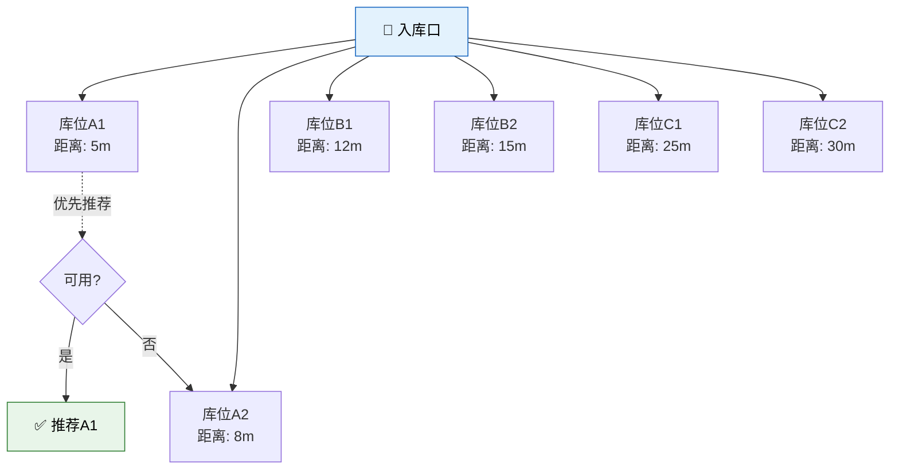
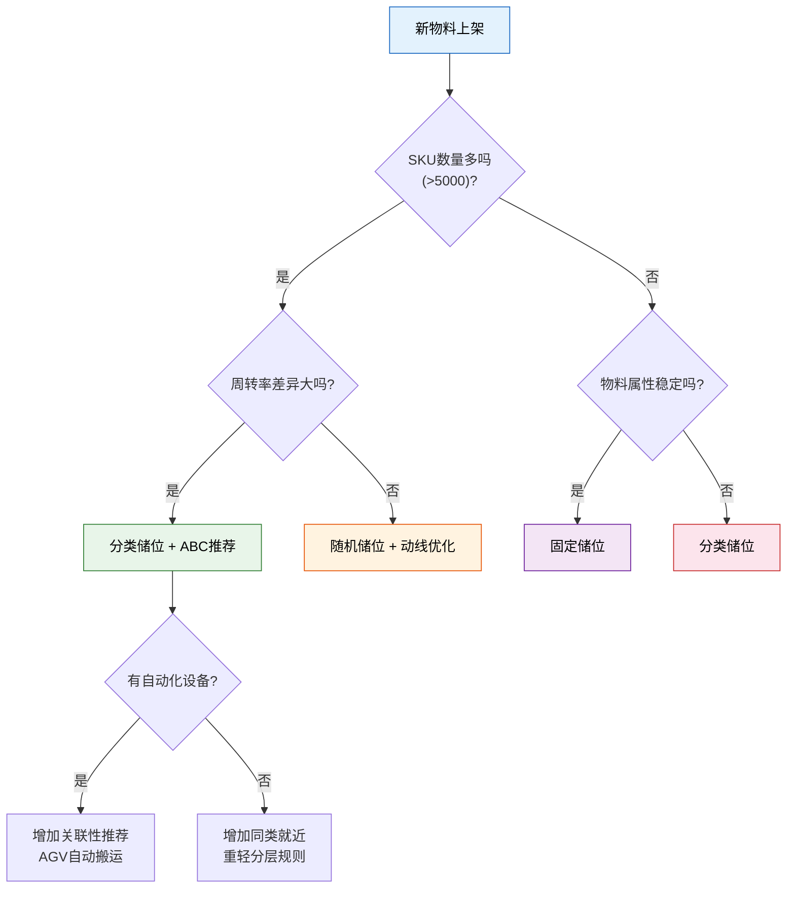
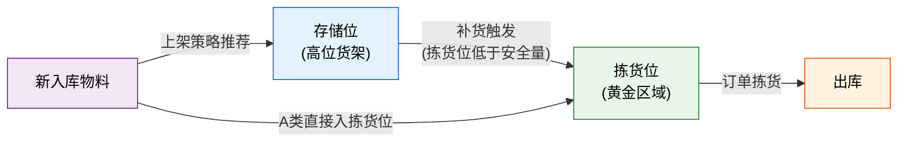

# 智能上架策略

> 上架不只是"找空位放进去"——好的上架策略决定了后续拣货的效率。把高频物料放在离出口近的地方，同类物料就近存放，重货放下轻货放上……这些看似简单的规则，累积起来就是仓库效率的胜负手。

## 1. 上架策略分类

| 策略 | 原理 | 优点 | 缺点 | 适用场景 |
|------|------|------|------|---------|
| 固定储位 | 每种物料分配固定库位 | 易管理、易培训 | 空间利用率低 | SKU少、物料属性稳定 |
| 随机储位 | 哪里有空位放哪里 | 空间利用率最高 | 拣货路径不可预测 | 存储空间紧张 |
| 分类储位 | 按物料类别分区存放 | 兼顾效率与空间 | 需要合理分类 | 最常用，大多数仓库 |

**三种策略的空间利用率对比**：

```
固定储位：████░░░░░░  40%~60%（预留空位应对波动）
随机储位：████████░░  85%~95%（见缝插针）
分类储位：██████░░░░  60%~80%（同类集中，类间可能浪费）
```

## 2. 储位推荐算法

WMS 的上架推荐不是随机的，而是综合考虑多个因素后的最优选择：

### 2.1 基于 ABC 分类的推荐

A 类物料（高周转）放在黄金区域，C 类物料（低周转）放在偏远区域：

```
仓库俯视图（入库口在左下角）：

┌─────────────────────────────────┐
│  C类存储区  │  B类存储区  │  C类存储区│
│  (高位货架)  │  (中位货架)  │  (高位货架)│
├──────────────┼──────────────┼──────────┤
│  B类存储区  │ ★A类拣货区★ │  B类存储区│
│  (中位货架)  │  (黄金区域)  │  (中位货架)│
├──────────────┼──────────────┼──────────┤
│  暂存区     │   入库口    │  发货区   │
│             │     🚪      │          │
└─────────────────────────────────┘

A类：距离出入库口最近的拣货区
B类：中间位置
C类：最高层/最远端
```

### 2.2 基于周转率的推荐

周转率 = 出库频次 / 时间周期。周转率越高的物料，越应靠近拣货区入口。

**推荐逻辑**：

```python
# 伪代码：储位推荐算法
def recommend_location(sku, warehouse):
    # 1. 获取SKU属性
    abc_class = sku.abc_class          # A/B/C分类
    turnover_rate = sku.turnover_rate  # 周转率
    weight = sku.unit_weight           # 重量
    height = sku.unit_height           # 高度
    category = sku.category            # 类别

    # 2. 筛选候选库位
    candidates = filter_locations(
        zone_type = "storage",         # 存储区
        capacity_available >= sku.qty, # 容量足够
        compatible_category = category # 同类区域优先
    )

    # 3. 计算每个候选库位的得分
    for loc in candidates:
        score = 0
        # ABC分类距离分：A类近、C类远
        score += distance_score(loc, abc_class)
        # 同类物料就近：减少后续拣货跑动
        score += category_proximity(loc, category)
        # 重量适配：重货放下层
        score += weight_fit(loc.layer, weight)
        # 周转率适配：高周转靠近出库口
        score += turnover_fit(loc, turnover_rate)
        # 动线距离：离入库口近的优先（减少上架行走）
        score += inbound_distance(loc)

        loc.score = score

    # 4. 返回得分最高的库位
    return top(candidates, n=3)  # 推荐3个候选
```

### 2.3 基于关联性的推荐

经常一起出库的物料（关联商品）应就近存放：

| 关联场景 | 示例 | 上架策略 |
|---------|------|---------|
| 配套出库 | 手机 + 手机壳 + 充电器 | 同一拣货区相邻库位 |
| 组合销售 | 礼盒A包含商品X+Y+Z | 同一拣货路径上 |
| 替代品 | 规格相近的螺丝 M8/M10 | 同排不同列，便于替换拣选 |

**关联性挖掘**：通过历史出库数据分析订单中物料的共现频率，建立关联矩阵：

```
关联矩阵示例（数值越大表示越常一起出库）：

        SKU-001  SKU-002  SKU-003  SKU-004
SKU-001    -      0.85     0.12     0.03
SKU-002   0.85      -      0.45     0.08
SKU-003   0.12    0.45       -      0.67
SKU-004   0.03    0.08     0.67       -

→ SKU-001 和 SKU-002 关联度 0.85，应就近存放
```

## 3. 同类商品就近存放

**原则**：同一分类的物料尽量放在相邻库位，好处是：

1. **拣货效率**：拣货员不需要在仓库内来回跑
2. **盘点效率**：同类物料集中盘点，减少走动
3. **补货效率**：从存储区补货到拣货区时，同类物料一起补

**实现方式**：

```
分类编码规则：
  紧固件-螺栓     →  FL-BT
  紧固件-螺母     →  FL-NT
  紧固件-垫圈     →  FL-WR
  电气-接线端子   →  EL-TM
  电气-继电器     →  EL-RL

库位分配：同一前缀的物料分配到同一库区/同一排
  FL类 → 存储区第1排
  EL类 → 存储区第2排
```

## 4. 重货放下轻货放上

这是仓库安全管理的基本原则：

| 层次 | 适合存放 | 原因 |
|------|---------|------|
| 第1层（地面） | 重货、大件 | 稳定性好，取放方便 |
| 第2~3层 | 中等重量 | 人工可搬取 |
| 第4~5层 | 轻货、小件 | 上层承重有限，取放需梯子/叉车 |
| 顶层 | 极少出库的C类 | 不方便取放 |

**系统实现**：

```
规则：
  if sku.unit_weight > 20kg → 推荐第1层
  if sku.unit_weight 5~20kg → 推荐第2~3层
  if sku.unit_weight < 5kg  → 推荐第3~5层

同时考虑：
  - 货架承重限制（每层最大承重）
  - 叉车作业高度限制
  - 人工搬运的人机工程学要求
```

## 5. 动线最短原则

上架时选择离入库口最近的可用库位，减少搬运距离：



**动线规划的三种模式**：

| 模式 | 特点 | 适用场景 |
|------|------|---------|
| U 型动线 | 入库口和出库口在同一侧 | 仓库只有一侧有门 |
| I 型动线 | 入库和出库在仓库两端 | 直通型仓库 |
| L 型动线 | 入库和出库在相邻两侧 | L 型仓库布局 |

## 6. 上架策略选择决策树



## 7. 实际案例分析

### 案例：某电商仓库上架优化

**背景**：

- 日均入库 SKU 3000+，入库件数 50000+
- 原策略：随机上架，拣货员日步行 15km
- 痛点：拣货路径长、新人找货难、补货混乱

**优化方案**：

| 优化项 | 做法 | 效果 |
|--------|------|------|
| ABC 分区 | A 类入拣货区黄金位，B 类存储区中层，C 类高层 | A 类拣货路径缩短 60% |
| 同类就近 | 按二级分类分配同一排 | 减少跨区跑动 40% |
| 关联推荐 | 基于订单共现分析，关联 SKU 就近存放 | 组合订单拣货时间降 35% |
| 重轻分层 | >10kg 下两层，<1kg 上两层 | 安全事故降为 0 |
| 动线优化 | U 型动线 + 入库口侧暂存 | 上架行走距离减少 30% |

**量化效果**：

```
优化前：拣货员日均步行 15km，单人日拣货 600 行
优化后：拣货员日均步行 8km，单人日拣货 1100 行

效率提升：83%
行走减少：47%
```

## 8. 补货与上架的联动

拣货区的库存消耗后，需要从存储区补货。上架策略需要考虑补货效率：



**补货触发条件**：

| 触发方式 | 说明 | 适用场景 |
|---------|------|---------|
| 最小量触发 | 拣货位库存低于最小量时触发 | 常用方式 |
| 订单驱动 | 出库订单分配后发现拣货位不足 | 紧急补货 |
| 定时补货 | 每天固定时间批量补货 | 夜间补货到白天拣货 |
| 波次前补货 | 波次释放前检查并补齐 | 电商大促 |

## 9. 小结

| 要点 | 核心内容 |
|------|---------|
| 三种策略 | 固定储位（易管理）、随机储位（高利用）、分类储位（最常用） |
| 推荐算法 | ABC分类 + 周转率 + 关联性 + 重量适配 + 动线距离 |
| 同类就近 | 减少拣货跑动、便于盘点与补货 |
| 重轻分层 | 安全第一，重下轻上 |
| 动线最短 | 离入库口近的优先，减少搬运距离 |
| 补货联动 | 上架策略需考虑后续补货效率 |
