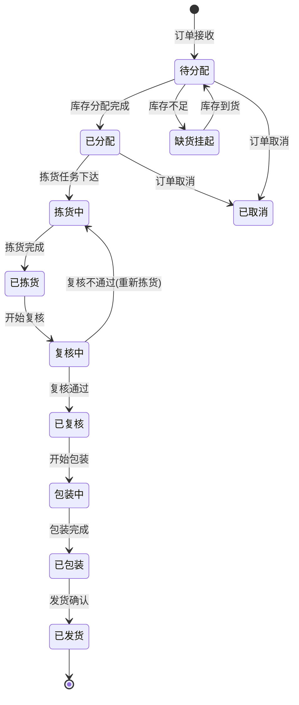
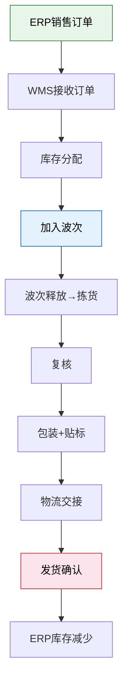
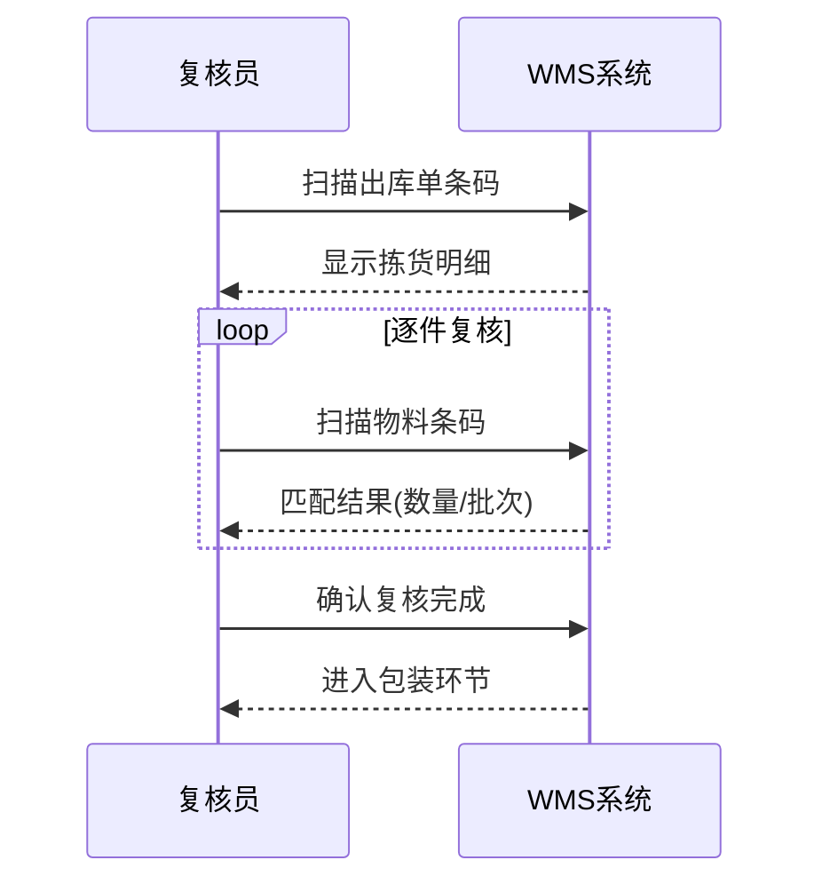

# 出库流程全解析

## 1. 完整出库流程

出库是将库存交付给需求方的全流程，包含六个核心环节：


### 1.1 订单接收

WMS 从上游系统接收出库需求：

| 来源 | 订单类型 | 说明 |
|------|---------|------|
| ERP 销售模块 | 销售订单 | 客户下单后触发 |
| MES | 领料单 | 生产工单释放后触发 |
| WMS 内部 | 调拨单 | 仓间调拨或库间移库 |

**订单接收处理**：

1. 校验订单有效性（物料编码是否存在、数量是否合理）
2. 检查库存可用量是否满足
3. 确定出库类型与优先级
4. 创建出库单，进入待分配状态

### 1.2 库存分配

库存分配是出库的核心决策环节——从哪个库位取货？

| 分配策略 | 说明 | 适用场景 |
|---------|------|---------|
| FIFO（先进先出） | 优先分配最早入库的批次 | 大多数常规物料 |
| FEFO（先到期先出） | 优先分配最早到期的批次 | 效期管控物料 |
| LIFO（后进先出） | 优先分配最后入库的批次 | 特殊场景（如堆垛无法从底部取） |
| 指定批次 | 按客户/订单指定批次 | 追溯要求高的物料 |

**分配逻辑**：

```
库存分配算法：

1. 筛选条件：
   - SKU 匹配
   - 库存类型 = 可用
   - 批次状态 = 正常（非冻结）

2. 排序规则（以 FIFO 为例）：
   - 按入库日期升序 → 先入先出
   - 同日期按库位距离升序 → 近的优先

3. 分配结果：
   - 分配行：SKU + 批次 + 库位 + 分配数量
   - 如果一个库位不够，从多个库位分配
   - 分配后锁定库存（变为"已分配"状态）
```

### 1.3 拣货

拣货是出库作业中耗时最长的环节，占出库总时间的 50%~60%。

| 拣货方式 | 说明 | 效率 | 适用场景 |
|---------|------|------|---------|
| 摘果式 | 按订单逐个拣货 | 低 | 订单少、行数多 |
| 播种式 | 批量拣货后分拣到各订单 | 高 | 订单多、行数少 |
| 分区拣选 | 不同区域并行拣货 | 最高 | 大仓库、多区域 |

**拣货任务生成**：

```
出库单 → 按波次分组 → 生成拣货任务
拣货任务包含：
  - 任务编号
  - 拣货员（可指定或系统分配）
  - 拣货路径（优化后的库位顺序）
  - 拣货行明细（库位 + SKU + 数量）
  - 容器/周转箱编号
```

### 1.4 复核

拣货完成后必须复核，防止拣错：

| 复核方式 | 操作 | 准确率 | 效率 |
|---------|------|--------|------|
| 人工核对 | 逐行比对拣货明细与订单 | 98% | 低 |
| 扫码复核 | 扫描物料条码与系统比对 | 99.5% | 中 |
| 称重复核 | 称总重量与系统计算重量比对 | 99% | 高 |
| 视觉复核 | 机器视觉识别物料 | 99.9% | 最高 |

**称重复核原理**：

```
系统计算重量 = Σ(各物料数量 × 单件重量)
允许误差 = 计算重量 × 容差比例（通常 ±0.5%）

if |实际重量 - 计算重量| <= 允许误差:
    复核通过
else:
    标记异常，人工复查
```

### 1.5 包装

| 包装类型 | 说明 | 标签内容 |
|---------|------|---------|
| 内包装 | 单件/小批量包装 | SKU 条码、品名、数量 |
| 外包装 | 纸箱/托盘 | 物流条码、收货人、订单号 |
| 特殊包装 | 防震/防潮/温控 | 特殊标识、温控标签 |

**包装操作**：

1. 根据物料属性选择包装材料
2. 填充防震材料（气泡膜/泡沫/纸板）
3. 封箱并贴物流标签
4. 称重记录（用于物流计费）

### 1.6 发货确认

发货确认是出库的最终环节，触发库存扣减和状态流转：

```
发货确认后触发：
  ✓ WMS 扣减库存（已分配 → 已出库）
  ✓ 更新出库单状态为"已发货"
  ✓ 生成发货记录（含物流单号）
  ✓ ERP 同步库存减少
  ✓ 通知客户/销售（可选）
```

## 2. 出库单据状态流转图



## 3. 销售出库 / 生产领料出库 / 调拨出库

| 维度 | 销售出库 | 生产领料出库 | 调拨出库 |
|------|---------|-------------|---------|
| 触发 | ERP 销售订单 | MES 工单领料 | 仓间调拨申请 |
| 目的 | 交付客户 | 供给产线 | 仓库间库存平衡 |
| 拣货方式 | 波次拣货 | 按工单拣货 | 整箱/整托 |
| 包装要求 | 按客户要求包装 | 周转箱配送 | 保持原包装 |
| 发货方式 | 物流/快递 | 配送到线边仓 | 内部运输 |
| 库存影响 | 减少 | 减少 | 调出仓减少/调入仓增加 |
| 批次策略 | FIFO/FEFO | FIFO | 指定批次/原批次 |

### 3.1 销售出库流程



### 3.2 生产领料出库流程

```
MES工单释放 → WMS接收领料需求 → 按BOM分解物料
→ 库存分配 → 生成拣货配送任务
→ 拣货→复核→配送至线边仓
→ MES确认收料 → WMS扣减库存
```

**生产领料的特殊性**：

- **BOM 驱动**：领料明细由 BOM（物料清单）展开，不是人工指定
- **齐套检查**：所有物料齐套才能发料，否则等料
- **JIT 配送**：按工单节拍配送，不多不少
- **线边交接**：配送到线边仓，与产线交接确认

### 3.3 调拨出库流程

```
需求方仓创建调拨申请 → 审批通过
→ 源仓生成调拨出库任务 → 拣货→发货
→ 在途跟踪
→ 目的仓收货→入库
```

## 4. 复核与称重复核

### 4.1 扫码复核流程



### 4.2 称重复核规则

| 判定 | 条件 | 后续操作 |
|------|------|---------|
| 通过 | 误差 ≤ 容差 | 自动确认 |
| 可疑 | 误差 > 容差但 < 2倍容差 | 人工抽检 |
| 不通过 | 误差 ≥ 2倍容差 | 全量复核 |

**容差设置示例**：

| 物料类别 | 单件重量 | 容差比例 |
|---------|---------|---------|
| 轻小件 | <100g | ±2% |
| 常规件 | 100g~5kg | ±0.5% |
| 重量件 | >5kg | ±0.2% |

## 5. 物流交接与运单生成

### 5.1 物流交接流程

```
1. 包装完成 → 生成物流标签（含运单号）
2. 按物流公司/线路分拣到对应月台
3. 物流车辆到站 → 核对发货清单
4. 逐件/逐托扫码交接
5. 司机签收 → WMS 更新为"已交接"
6. 运输在途 → TMS 跟踪
7. 客户签收 → 订单完成
```

### 5.2 运单信息

| 字段 | 说明 |
|------|------|
| 运单号 | 物流公司生成的跟踪号 |
| 寄件人 | 仓库地址与联系方式 |
| 收件人 | 客户地址与联系方式 |
| 包裹数 | 该运单下的包裹数量 |
| 重量 | 总重量 |
| 体积 | 总体积 |
| 服务类型 | 标准件/加急/冷链 |

## 6. 出库异常处理

### 6.1 缺货

| 场景 | 处理方式 |
|------|---------|
| 分配时缺货 | 标记为"缺货挂起"，等库存到货后自动分配 |
| 拣货时发现缺货 | 实际数量 < 分配数量，记录差异，从其他库位补分配 |
| 部分满足 | 先发有库存的行，缺货行生成补发单 |

**缺货预警机制**：

```
库存 < 安全库存 → 黄色预警（补货提醒）
库存 = 0        → 红色预警（立即采购）
已分配 + 在途 < 待分配需求 → 紫色预警（未来将缺货）
```

### 6.2 拣错

| 发现时机 | 处理方式 |
|---------|---------|
| 拣货时自检发现 | 放回原位，重新拣取 |
| 复核时发现 | 标记异常行，重新拣取该行 |
| 发货后发现 | 追回包裹，重新发货 |

**防错措施**：

- PDA 扫码校验（扫描库位码 + 物料码双校验）
- 电子标签拣货（亮灯引导，按灯确认）
- 称重复核（重量异常自动报警）
- 拣货正确率 KPI 考核

### 6.3 包装破损

| 场景 | 处理方式 |
|------|---------|
| 拣货时发现物料包装破损 | 更换包装或退回供应商 |
| 包装时发现物料损坏 | 标记为不良品，换货处理 |
| 发货后客户反馈破损 | 客服处理退换，分析原因改进包装 |

## 7. 小结

| 要点 | 核心内容 |
|------|---------|
| 出库六步 | 订单接收→库存分配→拣货→复核→包装→发货确认 |
| 三种出库 | 销售（交付客户）、领料（供给产线）、调拨（仓间平衡） |
| 库存分配 | FIFO/FEFO/LIFO/指定批次，分配后锁定库存 |
| 复核方式 | 人工/扫码/称重/视觉，称重复核效率最高 |
| 异常处理 | 缺货挂起、拣错重拣、破损换货 |
