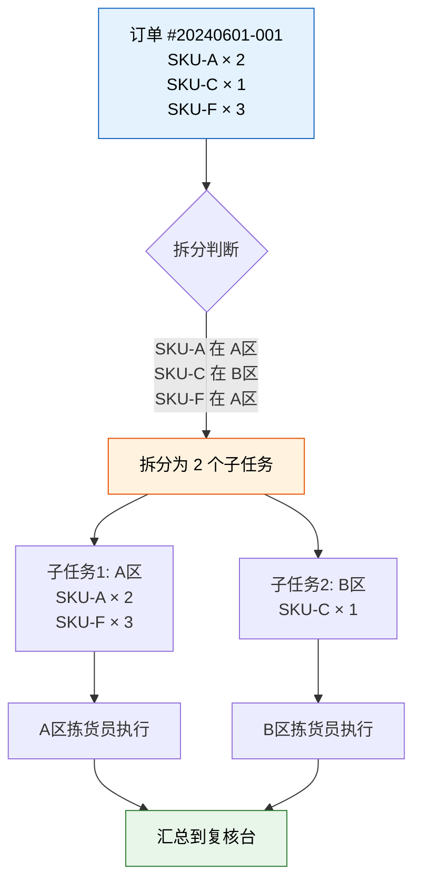
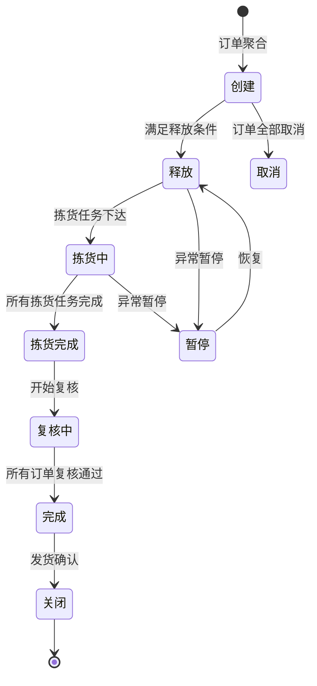

# 波次策略与订单分配

> 单个订单单独拣货，是仓库效率的天敌。波次策略的核心价值——把零散订单聚合成批次，让一次行走服务多个订单，效率翻倍。

## 1. 波次的定义与价值

**波次（Wave）** 是将多个出库订单按一定规则合并为一个批次，统一调度拣货作业。

### 1.1 为什么需要波次？

| 对比维度 | 无波次（逐单拣货） | 有波次（批量拣货） |
|---------|-------------------|-------------------|
| 拣货次数 | 每个订单跑一趟 | 一趟服务多个订单 |
| 行走距离 | 长，大量重复走动 | 短，路径复用 |
| 拣货效率 | 50~100 行/人/小时 | 150~300 行/人/小时 |
| 订单响应 | 单订单响应快 | 有等待聚合的时间 |
| 适用场景 | 紧急订单、大宗出库 | 电商、零售批量出库 |

### 1.2 波次的价值量化

```
示例：100 个订单，平均每单 3 行，分布在 20 个库区

逐单拣货：
  100 趟 × 平均行走 200m = 20000m
  耗时约 100 趟 × 15 分钟 = 1500 分钟

波次拣货（10 单/波，10 个波次）：
  10 趟 × 平均行走 500m = 5000m
  耗时约 10 趟 × 40 分钟 = 400 分钟

效率提升：73%
行走减少：75%
```

## 2. 波次释放策略

波次释放决定"哪些订单放在一起处理"：

### 2.1 按时间窗口

| 策略 | 说明 | 适用场景 |
|------|------|---------|
| 固定时间 | 每隔 N 分钟释放一个波次 | 电商仓，订单持续流入 |
| 截止时间 | 在截止时间前的所有订单组成一波 | 每日固定截单时间 |
| 滚动窗口 | 前一波完成前开始积累下一波 | 订单量大，需要连续作业 |

**时间窗口示例**：

```
08:00 - 09:00  累计订单 → 波次 1（09:00 释放）
09:00 - 10:00  累计订单 → 波次 2（10:00 释放）
10:00 - 11:00  累计订单 → 波次 3（11:00 释放）
...

紧急订单 → 插入当前波次或单独生成加急波次
```

### 2.2 按客户

| 策略 | 说明 | 适用场景 |
|------|------|---------|
| 单客户波次 | 同一客户的所有订单合并 | 大客户专属服务 |
| 客户等级 | VIP 客户优先释放 | 优先级管理 |
| 客户分组 | 同行业/同区域客户合并 | B2B 批发出库 |

### 2.3 按运输线路

| 策略 | 说明 | 适用场景 |
|------|------|---------|
| 同线路合并 | 同一物流线路的订单合并 | 配送路线固定 |
| 同区域合并 | 同一配送区域的订单合并 | 城市配送 |
| 同承运商 | 同一物流公司的订单合并 | 电商分拣中心 |

**运输线路聚合示例**：

```
华东线路订单 → 波次A（南京/苏州/上海方向）
华南线路订单 → 波次B（广州/深圳方向）
华北线路订单 → 波次C（北京/天津方向）

好处：发货时按线路分拣，直接装车，减少二次搬运
```

### 2.4 按优先级

| 优先级 | 定义 | 释放规则 |
|--------|------|---------|
| 紧急 | 当日必达/客户指定时间 | 立即释放，单独波次或插入当前波次 |
| 高 | 次日达 | 优先排入最近的波次 |
| 普通 | 3~5日达 | 正常排队 |
| 低 | 无时效要求 | 填充波次剩余容量 |

## 3. 订单拆分规则

当单个订单需要从多个库区拣货时，需要拆分：

### 3.1 一单多件 → 多库区拣货



### 3.2 拆分规则

| 规则 | 说明 | 优点 | 缺点 |
|------|------|------|------|
| 按库区拆 | 不同库区的行拆到不同子任务 | 并行拣货，速度快 | 汇总复核复杂 |
| 按容器拆 | 超出容器容量的行拆分 | 物理可行 | 增加容器管理 |
| 不拆分 | 整单由一人拣完 | 复核简单 | 串行效率低 |

**拆分决策**：

```
if 订单行数 <= 5 且在同一库区:
    不拆分，整单拣货
elif 订单行跨多个库区:
    按库区拆分为多个子任务，并行拣货
elif 单行数量超过容器容量:
    按容器容量拆分该行
```

## 4. 订单合并规则

将满足条件的多个订单合并处理：

| 合并条件 | 说明 | 示例 |
|---------|------|------|
| 同客户 | 同一客户的多笔订单合并 | 客户A上午下了3单 → 合并为1次发货 |
| 同地址 | 同一收货地址的订单合并 | 同一公司不同人下单 → 合并发货 |
| 同时间窗口 | 同一波次时间范围内的订单 | 9点前所有订单归入波次1 |
| 同运输线路 | 同一物流线路的订单合并 | 华东方向所有订单合并发货 |

**合并效益**：

```
场景：客户A同日下了3个订单
  订单1：SKU-A × 2    运费 ¥12
  订单2：SKU-B × 1    运费 ¥8
  订单3：SKU-C × 3    运费 ¥15

不合并：3次拣货 + 3次包装 + 3次发货 = 运费 ¥35
合  并：1次拣货 + 1次包装 + 1次发货 = 运费 ¥15

节省运费：57%
节省包装：67%
```

## 5. 波次状态机

波次从创建到关闭，经历完整的状态生命周期：



### 各状态说明

| 状态 | 说明 | 可执行操作 |
|------|------|-----------|
| 创建 | 订单已聚合，等待释放 | 添加/移除订单、修改优先级 |
| 释放 | 拣货任务已生成，等待执行 | 查看任务分配、手动调整 |
| 拣货中 | 拣货员正在执行 | 查看进度、处理异常 |
| 拣货完成 | 所有拣货任务完成 | 开始复核 |
| 复核中 | 复核员逐单确认 | 处理复核异常 |
| 完成 | 所有订单复核通过 | 执行发货 |
| 关闭 | 发货完成 | 归档 |

## 6. 波次策略配置示例

### 6.1 电商仓库典型配置

```yaml
wave_strategy:
  name: "电商标准波次"
  release_rules:
    - type: time_window
      interval: 30min          # 每30分钟释放一个波次
      start_time: "08:00"
      end_time: "22:00"
    - type: order_count
      max_orders: 200          # 单波次最多200个订单
    - type: urgent_override    # 紧急订单立即释放
      priority: urgent

  merge_rules:
    - same_customer: true      # 同客户订单合并
    - same_address: true       # 同地址订单合并
    - max_merge_wait: 60min    # 最多等待60分钟合并

  split_rules:
    - cross_zone: true         # 跨库区拆分
    - container_overflow: true # 超容器容量拆分

  priority_order:
    - urgent                   # 紧急
    - same_day                 # 当日达
    - next_day                 # 次日达
    - standard                 # 普通
```

### 6.2 制造仓库典型配置

```yaml
wave_strategy:
  name: "生产领料波次"
  release_rules:
    - type: work_order         # 按工单释放
      trigger: mes_release     # MES释放工单时触发
    - type: kit_check          # 齐套检查
      all_materials_ready: true

  merge_rules:
    - same_production_line: true  # 同产线工单合并
    - same_delivery_time: true    # 同配送时间合并

  split_rules:
    - by_material_type: true     # 按物料类型拆分（原材料/辅料/备件）
```

## 7. 波次效率监控

| 监控指标 | 定义 | 目标值 | 说明 |
|---------|------|--------|------|
| 波次完成率 | 规定时间内完成的波次比例 | ≥ 95% | 衡量波次调度效率 |
| 单波次拣货行数 | 单个波次的平均拣货行数 | 100~500 | 太少效率低，太多管理难 |
| 波次拣货时长 | 从释放到拣货完成的平均时间 | < 60 分钟 | 影响发货时效 |
| 拣货准确率 | 拣货无差错的行比例 | ≥ 99.5% | 质量底线 |
| 订单满足率 | 一次波次完整满足的订单比例 | ≥ 90% | 低则说明拆分过多 |

**效率优化方向**：

```
1. 动态波次大小：根据当前订单量自动调整波次容量
2. 智能聚合：基于物料库位分布优化订单组合，减少跨区拣货
3. 优先级插队：紧急订单动态插入当前波次
4. 预分配：波次释放前预锁定库存，避免拣货时库存冲突
5. 拣货路径优化：S型/Z型路径，减少回头路
```

## 8. 小结

| 要点 | 核心内容 |
|------|---------|
| 波次定义 | 将零散订单聚合为批次，统一调度拣货 |
| 释放策略 | 按时间窗口/客户/运输线路/优先级 |
| 订单拆分 | 一单多件跨库区时按库区拆分，并行拣货 |
| 订单合并 | 同客户/同地址/同线路合并，减少发货次数 |
| 状态机 | 创建→释放→拣货→完成→关闭，全流程管控 |
| 配置化 | 时间窗口、合并规则、拆分规则均可配置 |
