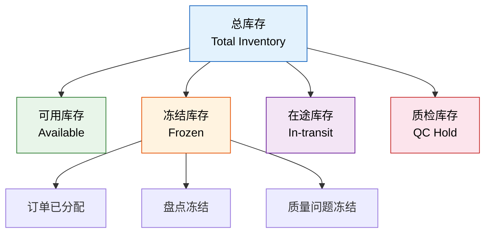
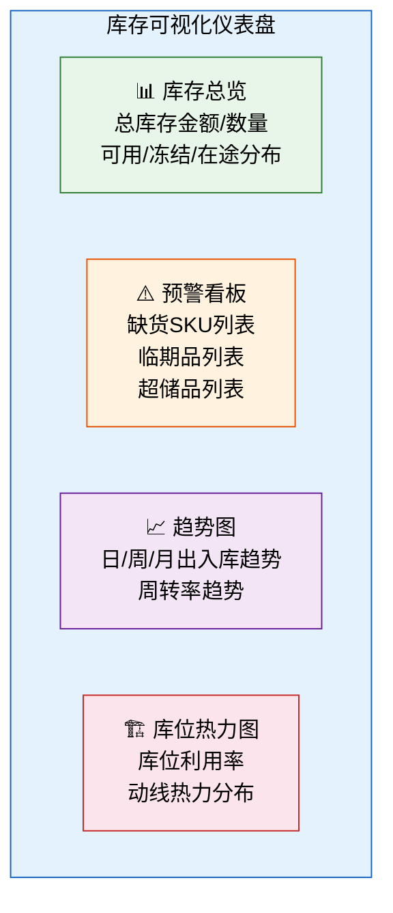

# 库存管理核心

## 1. 库存分类

WMS 中的库存不是简单的"有多少"，而是按状态精细分类：



### 各类型说明

| 库存类型 | 定义 | 是否可分配 | 状态转换 |
|---------|------|-----------|---------|
| 可用库存 | 可正常出库的库存 | 是 | 入库确认→可用；分配→冻结 |
| 冻结库存-已分配 | 已被出库订单锁定 | 否 | 可用→已分配；出库后→扣减 |
| 冻结库存-盘点冻结 | 盘点期间锁定 | 否 | 盘点开始→冻结；盘点结束→解冻 |
| 冻结库存-质量冻结 | 质量问题锁定 | 否 | 质量异常→冻结；处理完成→解冻/报废 |
| 在途库存 | 在运输途中的库存 | 否 | 发货确认→在途；对方收货→入库 |
| 质检库存 | 待质检的库存 | 否 | 收货→质检；质检通过→可用 |

**库存可用量计算**：

```
可用量 = 现有量 - 已分配量 - 冻结量

示例：
  SKU-001 在 A仓-03-02 库位
  现有量：500
  已分配量：200（3个出库订单已锁定）
  冻结量：50（盘点冻结）
  可用量 = 500 - 200 - 50 = 250
```

## 2. FIFO / LIFO / FEFO 策略

出库时从哪个批次先出？这取决于出库策略：

### 2.1 FIFO（先进先出）

**First In First Out**——先入库的批次先出库。

```
SKU-001 的三个批次：
  批次A：入库日期 2024-06-01，数量 200
  批次B：入库日期 2024-06-15，数量 300
  批次C：入库日期 2024-07-01，数量 150

出库 400 件：
  先出批次A：200件
  再出批次B：200件
  剩余：批次B 100件 + 批次C 150件
```

**适用场景**：大多数常规物料，避免库存积压老化。

### 2.2 LIFO（后进先出）

**Last In First Out**——最后入库的批次先出库。

**适用场景**：

- 堆垛存储（如沙石、煤炭），只能从顶部取
- 成本上升期，后入库的成本更高，先出可降低当期成本（会计策略）

### 2.3 FEFO（先到期先出）

**First Expired First Out**——效期最早的批次先出库。

```
SKU-002（药品）的三个批次：
  批次A：效期 2024-09-30，数量 100
  批次B：效期 2024-12-31，数量 200
  批次C：效期 2025-06-30，数量 150

出库 250 件：
  先出批次A：100件（最早到期）
  再出批次B：150件
  剩余：批次B 50件 + 批次C 150件
```

**适用场景**：医药、食品等有保质期要求的行业。

### 2.4 三种策略对比

| 维度 | FIFO | LIFO | FEFO |
|------|------|------|------|
| 出库顺序 | 先入先出 | 后入先出 | 先到期先出 |
| 核心目标 | 避免积压 | 适应堆垛 | 避免过期 |
| 适用行业 | 通用 | 矿业/建材 | 医药/食品 |
| 与效期关系 | 不关注 | 不关注 | 核心关注 |
| 合规要求 | 无 | 无 | GSP/GMP 强制 |

## 3. 安全库存与补货预警

### 3.1 安全库存

安全库存是为应对需求波动和供应延迟而设置的库存缓冲：

```
安全库存 = Z × σ_d × √LT

其中：
  Z     = 服务水平对应的安全系数（95%→1.65，99%→2.33）
  σ_d   = 日需求标准差
  LT    = 采购提前期（天）

示例：
  日需求均值：100件
  日需求标准差：20件
  采购提前期：7天
  目标服务水平：95%（Z=1.65）

  安全库存 = 1.65 × 20 × √7 ≈ 87件
```

### 3.2 补货预警

| 预警级别 | 触发条件 | 颜色 | 动作 |
|---------|---------|------|------|
| 正常 | 库存 > 订货点 | 绿色 | 无需操作 |
| 预警 | 库存 ≤ 订货点 | 黄色 | 建议补货 |
| 紧急 | 库存 ≤ 安全库存 | 红色 | 立即补货 |
| 缺货 | 可用库存 = 0 | 黑色 | 紧急采购/调拨 |

**订货点计算**：

```
订货点 = 日均需求 × 采购提前期 + 安全库存

示例：
  日均需求：100件
  采购提前期：7天
  安全库存：87件

  订货点 = 100 × 7 + 87 = 787件

  → 库存降到 787 件时触发补货
  → 补货量 = 经济订货批量（EOQ）
```

### 3.3 拣货位补货

拣货位（面销位）库存低于安全量时，从存储位补货：

| 触发方式 | 说明 | 优缺点 |
|---------|------|--------|
| 最小量触发 | 拣货位库存 < 最小量 | 简单，但可能频繁触发 |
| 订单驱动 | 分配时发现拣货位不足 | 紧急，影响出库时效 |
| 定时补货 | 每天固定时间补货 | 可规划，但可能错过最佳时机 |
| 智能补货 | 预测今日出库量，提前补齐 | 最优，需要算法支持 |

## 4. 库存周转率计算与优化

### 4.1 周转率计算

```
库存周转率 = 一定期间内的出库金额 / 平均库存金额

月周转率 = 月出库金额 / ((月初库存 + 月末库存) / 2)
年周转率 = 年出库金额 / ((年初库存 + 年末库存) / 2)

示例：
  年出库金额：¥12,000,000
  年初库存：¥2,000,000
  年末库存：¥1,500,000
  平均库存：¥1,750,000

  年周转率 = 12,000,000 / 1,750,000 = 6.86次

周转天数 = 365 / 周转率 = 365 / 6.86 ≈ 53天
```

### 4.2 周转率优化

| 优化方向 | 做法 | 效果 |
|---------|------|------|
| 减少慢动库存 | 识别 90天+ 无出库的 SKU，促销/报废清仓 | 释放资金与空间 |
| 小批量多频次采购 | A 类物料减少单次采购量，增加频次 | 降低平均库存 |
| VMI 供应商管理库存 | 供应商在仓库设点，按消耗结算 | 零库存成本 |
| 缩短采购提前期 | 开发本地供应商，备选供应商 | 降低安全库存 |
| 需求预测 | 基于历史数据的预测补货 | 减少过剩与缺货 |

## 5. 库存成本构成

| 成本类型 | 定义 | 占比 | 优化方向 |
|---------|------|------|---------|
| 持有成本 | 仓储租金、资金占用、保险、损耗 | 20%~30% | 提高周转率 |
| 缺货成本 | 停线损失、客户流失、加急运费 | 10%~25% | 合理安全库存 |
| 订货成本 | 采购行政、验收、入库 | 5%~15% | 集中采购、自动化 |
| 风险成本 | 过期、损坏、贬值 | 5%~10% | FEFO策略、效期预警 |

**成本权衡**：

```
持有成本 vs 缺货成本：

库存越高 → 持有成本越高，缺货成本越低
库存越低 → 持有成本越低，缺货成本越高

最优库存 = 持有成本与缺货成本的交叉点
```

## 6. 库存可视化仪表盘设计



**仪表盘核心指标**：

| 模块 | 指标 | 刷新频率 |
|------|------|---------|
| 库存总览 | 总库存金额、可用率、冻结率 | 实时 |
| 预警看板 | 缺货 SKU 数、临品数、超储 SKU 数 | 实时 |
| 趋势图 | 日出入库量、周转率、库存金额 | 每日 |
| 热力图 | 库位利用率、拣货热区 | 每周 |

## 7. 库存准确率目标与提升方法

### 7.1 库存准确率

```
库存准确率 = (1 - |系统库存 - 实际库存| / 系统库存) × 100%

示例：
  系统库存：500件
  盘点实存：497件
  差异：3件
  准确率 = (1 - 3/500) × 100% = 99.4%
```

### 7.2 行业标准

| 行业 | 目标准确率 | 说明 |
|------|-----------|------|
| 电商 | ≥ 99.5% | 高周转、高 SKU 数 |
| 制造 | ≥ 99.0% | 批次管控严格 |
| 医药 | ≥ 99.9% | 合规要求高 |
| 3PL | ≥ 99.5% | 合同承诺 |

### 7.3 提升方法

| 方法 | 做法 | 效果 |
|------|------|------|
| 循环盘点 | 每日盘点一部分 SKU，全年覆盖 | 不停业，持续纠偏 |
| 条码/RFID 强制扫描 | 每次操作必须扫码确认 | 减少人工录入错误 |
| 盲盘 | 盘点时不显示系统数量 | 避免凑数 |
| 差异分析 | 记录每次差异，分析根因 | 持续改进 |
| 作业规范 | 标准化操作流程与培训 | 减少操作失误 |
| 系统校验 | 入出库自动校验数量与批次 | 系统防错 |

**差异分析方法**：

```
盘点差异 → 分类统计
  ├─ 数量差异 → 原因：漏扫、多扫、串码
  ├─ 批次差异 → 原因：批次混放、标签错误
  ├─ 位置差异 → 原因：未按指定库位上架
  └─ 状态差异 → 原因：冻结/解冻未及时更新

根因改进：
  漏扫/多扫 → 增加扫码校验规则
  批次混放 → 上架时系统强制验证库位
  未按位上架 → PDA强制扫描目标库位码
```

## 8. 小结

| 要点 | 核心内容 |
|------|---------|
| 库存分类 | 可用/冻结/在途/质检，可用量=现有-已分配-冻结 |
| 出库策略 | FIFO（通用）、LIFO（堆垛）、FEFO（效期管控） |
| 安全库存 | Z × σ_d × √LT，平衡持有成本与缺货风险 |
| 周转率 | 出库金额/平均库存金额，越高越好 |
| 库存成本 | 持有+缺货+订货+风险，最优在交叉点 |
| 准确率 | 目标 99%+，通过循环盘点、条码校验、差异分析提升 |
