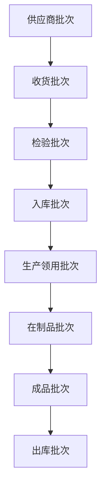
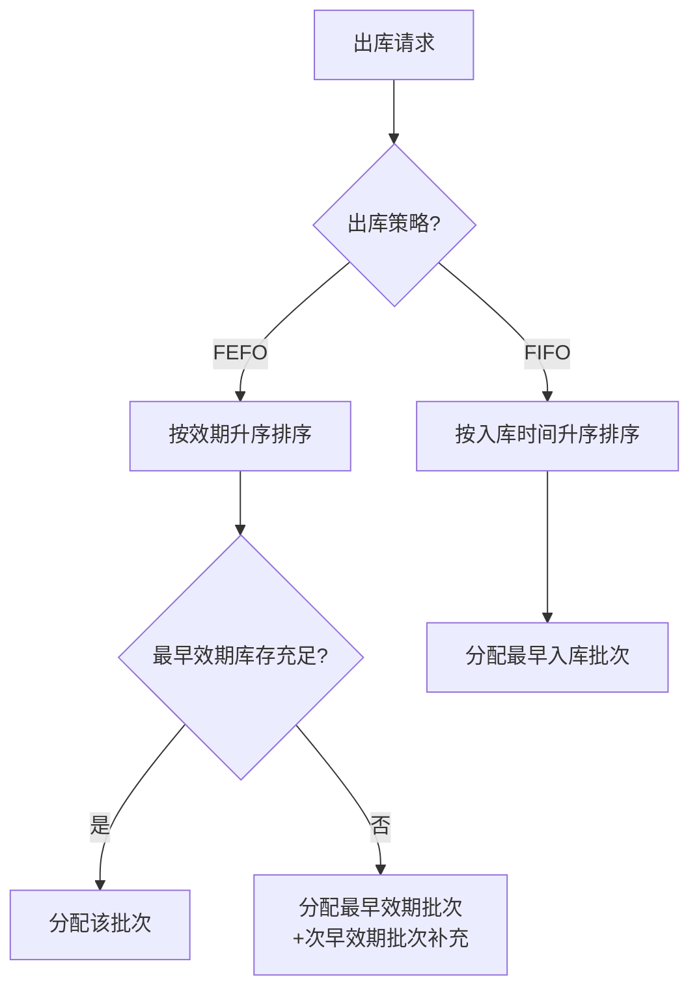
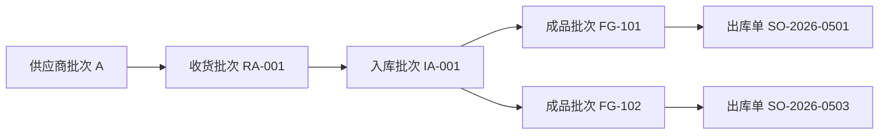
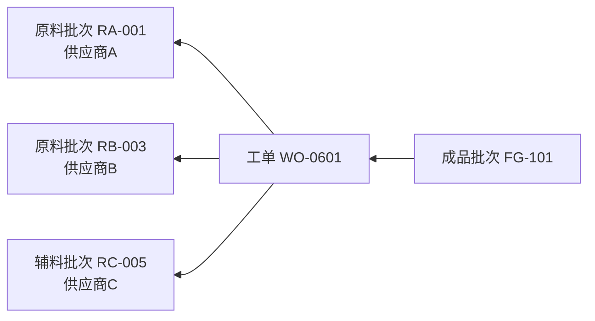
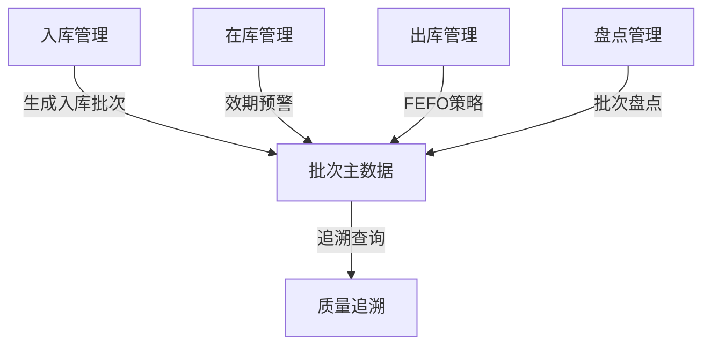

# 批次与效期管理

> 批次是物料的"身份证"，效期是物料的"保质期"——管好这两条线，才能避免"过期还当正品出、来料无法溯源追"的灾难。

## 一、为什么需要批次与效期管理

### 1.1 没有批次管理的痛点

| 场景 | 没有批次管理 | 有批次管理 |
|------|-------------|-----------|
| 客户投诉产品变质 | 不知道是哪批原料的问题 | 秒查批次号→定位供应商→召回同批产品 |
| 仓库发现过期物料 | 无法快速找出所有过期品 | 按效期筛选→一键冻结 |
| 先进先出执行 | 全靠人工判断 | 系统自动推荐先入库的批次 |

### 1.2 适用行业

- **食品饮料**：保质期严格，过期即废弃
- **医药行业**：GMP/GSP 强制要求批次追溯
- **化工行业**：批次间性能差异大，需精确追踪
- **电子元器件**：潮敏等级（MSL）有时效要求

## 二、批次管理核心模型

### 2.1 批次号生成规则

批次号通常由以下要素组合而成：

```
批次号 = 供应商代码(3位) + 物料编码(6位) + 生产日期(8位) + 序号(3位)
示例：SUP001-M00123-20260101-001
```

**生成时机**：

```mermaid
graph LR
    A[采购入库] -->|供应商批号| B[系统映射内部批号]
    C[生产完工] -->|工单+工序] D[自动生成成品批号]
    E[退货入库] -->|原批号关联] F[重新检验后入库]
```

### 2.2 批次层级关系



**核心原则**：每一层都有"父批次"关联，形成完整的追溯链。

### 2.3 批次属性

| 属性 | 说明 | 示例 |
|------|------|------|
| 批次号 | 唯一标识 | LOT-2026-0606-001 |
| 生产日期 | 制造日期 | 2026-01-15 |
| 有效日期 | 过期日 | 2027-01-15 |
| 供应商批号 | 供应商原始批号 | V-SUP-2233 |
| 检验状态 | 待检/合格/不合格 | 合格 |
| 库存状态 | 可用/冻结/待报废 | 可用 |
| 存储条件 | 常温/冷藏/冷冻 | 冷藏 2-8℃ |

## 三、效期控制策略

### 3.1 四大出库策略对比

| 策略 | 全称 | 逻辑 | 适用场景 |
|------|------|------|---------|
| **FIFO** | First In First Out | 先入库的先出 | 通用物料 |
| **FEFO** | First Expire First Out | 先到期的先出 | 食品/药品/化学品 |
| **LIFO** | Last In First Out | 后入库的先出 | 堆叠存储（如沙石） |
| **指定批次** | 手动指定 | 按客户要求指定批次 | 定制化订单 |

### 3.2 FEFO 实现逻辑



### 3.3 效期预警机制

| 预警级别 | 触发条件 | 系统动作 |
|---------|---------|---------|
| 🟢 正常 | 效期剩余 > 1/2 | 正常出库 |
| 🟡 临近 | 效期剩余 ≤ 1/2 | 优先推荐出库，界面黄色标记 |
| 🟠 紧急 | 效期剩余 ≤ 1/3 | 自动冻结出库至"临期专区"，需审批 |
| 🔴 过期 | 已过有效期 | 强制冻结，禁止出库，转入报废流程 |

**预警配置示例**：

```
保质期 365 天的物料：
  - 黄色预警：剩余 180 天（50%）
  - 橙色预警：剩余 90 天（25%）
  - 红色冻结：剩余 30 天或已过期
```

## 四、批次追溯实战

### 4.1 正向追溯（物料→产品）

场景：某供应商批次存在质量问题，需找出使用了该批次的全部成品。



### 4.2 反向追溯（产品→物料）

场景：客户投诉成品质量问题，需查出使用了哪些批次的原料。



### 4.3 追溯查询效率

| 指标 | 手工追溯 | WMS 批次追溯 |
|------|---------|-------------|
| 正向追溯耗时 | 2-4 小时 | < 5 分钟 |
| 反向追溯耗时 | 4-8 小时 | < 10 分钟 |
| 追溯准确率 | 70-80% | 99.9% |
| 影响范围评估 | 模糊 | 精确到批次+库位 |

## 五、批次与效期管理的实施要点

### 5.1 主数据准备

- **物料主数据**：必须维护保质期天数、批次管理标识、存储条件
- **供应商主数据**：关联供应商批号规则
- **客户主数据**：部分客户对批号有特殊要求（如汽车行业追溯码）

### 5.2 常见实施陷阱

| 陷阱 | 表现 | 正确做法 |
|------|------|---------|
| 批次号规则不统一 | 各仓库/工厂各自编码 | 集团统一编码规则 |
| 忽略退货物料批次 | 退货重新入库无批次 | 退货关联原批号，重新检验后入库 |
| 效期预警配置一刀切 | 所有物料同一预警天数 | 按物料类别分组配置 |
| 批次追溯链断裂 | 领料时未扫描批次条码 | 强制批次扫描，不允许"无批出库" |

### 5.3 与 WMS 其他模块的协同



## 六、关键配置清单

| 配置项 | 必填 | 说明 |
|--------|------|------|
| 物料批次管理标识 | ✅ | 标记该物料是否启用批次管理 |
| 物料保质期（天） | ✅ | 从生产日期起计算 |
| 效期预警规则 | ✅ | 黄/橙/红三级阈值 |
| 批次号编码规则 | ✅ | 供应商码+物料码+日期+序号 |
| 出库策略 | ✅ | FIFO/FEFO/LIFO/指定 |
| 退货批次关联规则 | ✅ | 关联原批号 or 新批号 |
| 批次冻结/解冻权限 | ✅ | 质量部门审批 |

> **一句话总结**：批次管理让每件物料都有"户口"，效期管理让每件物料都有"保质期"，两者结合才能实现"查得快、出得对、追得清"。
