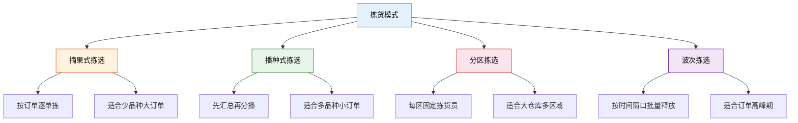
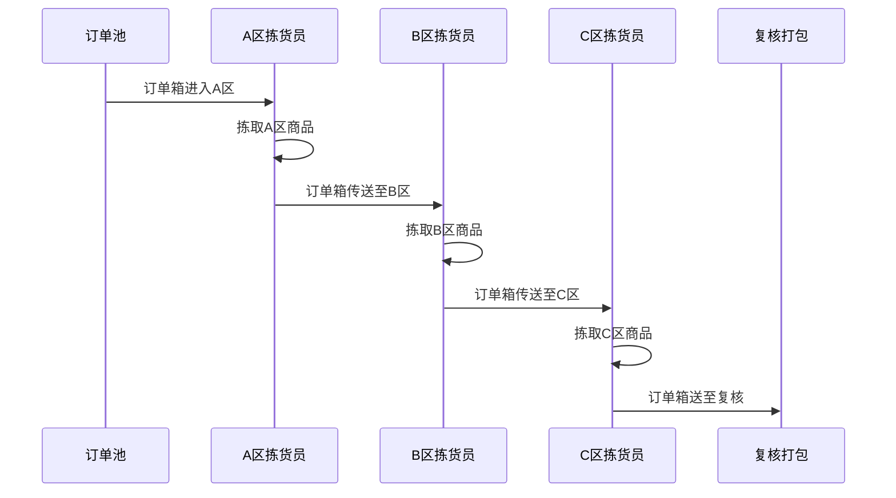
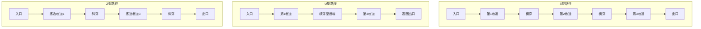
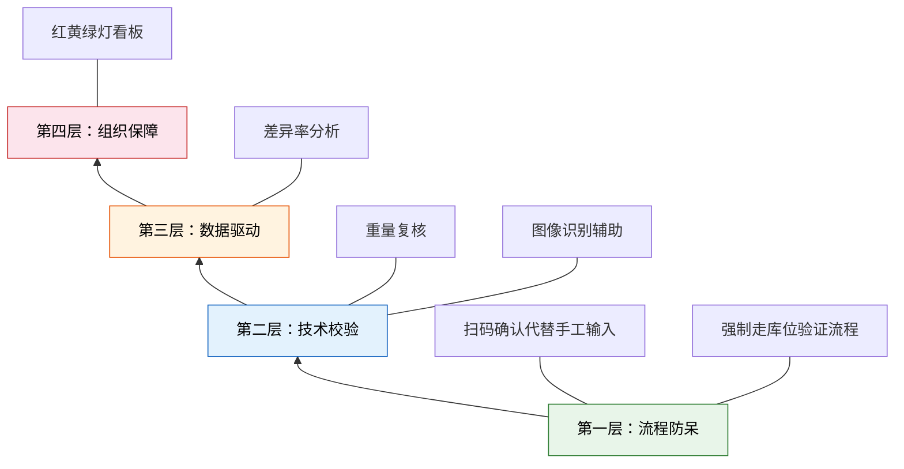

# 拣货模式详解

> 拣货模式的选择直接决定了仓库的作业效率和准确率。不同业务场景需要匹配不同的拣货策略——没有"最好"的模式，只有"最合适"的模式。

## 拣货模式概览



## 一、摘果式拣选

摘果式拣选（Discrete Picking）是最直观的拣货方式：拣货员拿着一张订单，沿着拣货路径，像"摘果子"一样逐一把商品从货架取下。

### 作业流程

1. 系统生成拣货任务，绑定单笔订单
2. 拣货员按系统推荐路径行走
3. 到达库位后扫描确认，拣取商品
4. 完成该订单所有行项后，送至复核打包区
5. 领取下一张订单，重复以上步骤

### 适用场景

| 维度 | 特征 |
|------|------|
| 订单特点 | 单笔订单行项多、数量大 |
| SKU 密度 | 品种少、重复率高 |
| 典型行业 | B2B 批发、工业品配送 |
| 仓库规模 | 中小型仓库 |

### 优缺点分析

**优势：**
- 流程简单，培训成本低
- 单订单完整处理，责任清晰
- 无需二次分拣，减少中间环节

**劣势：**
- 每张订单独立行走，路径重复率高
- 订单量大时，拣货员频繁往返
- 整体行走距离长，效率偏低

> **实战建议**：当单笔订单平均行项数 > 5 且品种集中时，摘果式拣选的效率最优。电商小包裹场景（平均 1-3 行项）应避免使用此模式。

## 二、播种式拣选

播种式拣选（Batch Picking）先将多笔订单的同类商品汇总，一次性拣出总量，再按订单逐一分配（"播种"到各订单容器中）。

### 作业流程


### 适用场景

| 维度 | 特征 |
|------|------|
| 订单特点 | 订单量大、单笔行项少 |
| SKU 密度 | 品种多、重叠率高 |
| 典型行业 | B2C 电商、美妆个护 |
| 仓库规模 | 中大型仓库 |

### 优缺点分析

**优势：**
- 大幅减少行走距离，同一 SKU 只走一次
- 拣货效率随订单重叠率提升而倍增
- 适合高并发小订单场景

**劣势：**
- 需要二次分播，增加分拣工位和人力
- 订单从拣到发有时间差，时效性略低
- 分播环节出错会波及多笔订单

### 播种分播的关键参数

| 参数 | 建议值 | 说明 |
|------|--------|------|
| 批次订单数 | 20-50 单 | 视分播墙容量而定 |
| 分播墙格数 | 40-80 格 | 每格对应一个订单容器 |
| 拣货批量 | 按拣货车容量 | 通常 4-6 轮拣完一批 |
| 分播确认方式 | 扫码+数量 | 防止分播错误 |

## 三、分区拣选

分区拣选（Zone Picking）将仓库划分为多个物理区域，每个区域配置固定的拣货员。订单在传送带或周转箱的承载下依次经过各区域，各区域拣货员只负责本区域的行项。

### 分区策略

| 策略 | 划分依据 | 适用场景 |
|------|---------|---------|
| 按品类分区 | 商品类别（食品/日化/3C） | 品类差异大的综合仓 |
| 按流速分区 | ABC 分类（A区热销/B区常规/C区慢动） | 电商仓库 |
| 按体积分区 | 大件区/小件区 | 家具+配件混合仓 |
| 按温区分区 | 常温/冷藏/冷冻 | 生鲜冷链仓 |

### 分区拣选流程



### 关键指标

- **区域平衡率**：各区域作业时间方差越小越好，差异 > 30% 即出现瓶颈区
- **传送带利用率**：目标 > 85%，低于 70% 说明区域间等待严重
- **拣货员利用率**：目标 > 80%，避免某区域空等

## 四、波次拣选

波次拣选（Wave Picking）不是一种独立的拣货方式，而是一种**订单释放策略**：将积压的订单按时间窗口、运输线路、客户优先级等维度分组，分批释放到拣货作业中。

### 波次与拣货模式的关系

| 组合方式 | 说明 |
|---------|------|
| 波次 + 摘果 | 每个波次内按订单逐单拣，适合 B2B |
| 波次 + 播种 | 每个波次内批量拣再分播，适合电商 |
| 波次 + 分区 | 每个波次内按分区并行拣，适合大仓 |

## 五、拣货路径优化

拣货路径决定了拣货员的行走距离，直接影响效率。以下是三种经典路径策略：

### 路径策略对比



| 路径类型 | 行走距离 | 实现难度 | 适用场景 |
|---------|---------|---------|---------|
| S 型（穿越式） | 最长 | 最简单 | 货架少、拣选密度高 |
| U 型（返回式） | 较短 | 中等 | 单侧拣选、窄巷道 |
| Z 型（组合式） | 最短 | 较复杂 | 大型仓库、智能推荐路径 |

### 路径优化算法

实际生产中，WMS 通常采用以下算法自动规划路径：

1. **S-shaped Heuristic**：最简单的启发式算法，S 型遍历所有包含拣选点的巷道
2. **Largest Gap Strategy**：在每个巷道选择最大间隙处折返，减少无效行走
3. **Composite Strategy**：综合 S 型和最大间隙策略，动态选择
4. **TSP 求解**：将拣货路径建模为旅行商问题，用精确算法或元启发式算法求解

> **实践提示**：对于 < 50 个拣选点的任务，TSP 精确解可行；超过 50 个点时，启发式算法的求解速度优势显著，且解质量差异 < 5%。

## 六、RF/PDA 拣货 vs 纸质拣货单

| 对比维度 | RF/PDA 拣货 | 纸质拣货单 |
|---------|------------|-----------|
| 准确率 | 99.8%+ | 95%-98% |
| 实时性 | 实时更新任务状态 | 延迟至批次结束 |
| 培训周期 | 1-2 天 | 0.5 天 |
| 设备成本 | PDA 单价 2000-5000 元 | 打印机+纸张，极低 |
| 灵活性 | 动态调整路径和任务 | 批次已固化 |
| 异常处理 | 即时上报、系统引导 | 需人工记录后再录入 |
| 适用场景 | 中大型仓库、高频作业 | 小型仓库、低频作业 |

### PDA 拣货操作流程

```
1. 登录 PDA → 选择拣货任务
2. 系统显示第一个拣选点：库位号 + SKU + 数量
3. 到达库位 → 扫描库位条码（验证位置）
4. 扫描商品条码（验证商品）
5. 输入/确认数量 → 系统自动跳转下一个拣选点
6. 全部拣完 → 系统标记任务完成
7. 将商品送至复核台或投入传送带
```

## 七、拣货准确率提升策略

拣货准确率是仓库运营的核心 KPI，行业标杆为 99.9%。以下是系统性的提升策略：

### 准确率提升四层模型



### 具体措施

| 层级 | 措施 | 效果 |
|------|------|------|
| 流程防呆 | 库位条码+商品条码双重扫描 | 拣错率降低 70% |
| 流程防呆 | 数量超拣自动拦截 | 超发事故降低 90% |
| 技术校验 | 重量复核（整单称重比对） | 误拣检出率 > 95% |
| 技术校验 | RF 信号强度提示（确认到达正确库位） | 串位率降低 60% |
| 数据驱动 | 日/周拣货差异率报表 | 异常趋势提前发现 |
| 数据驱动 | 拣货员准确率排名与激励 | 准确率持续提升 |
| 组织保障 | 新员工上岗前 3 天强制复核 | 新人差错率降低 50% |
| 组织保障 | 每日晨会通报 Top5 差异 SKU | 针对性整改 |

### 拣货效率对比表

| 拣货模式 | 人均效率（行/小时） | 准确率 | 适用订单量 | 行走占比 |
|---------|-------------------|--------|-----------|---------|
| 摘果式 | 80-120 | 99.5% | < 500 单/天 | 60% |
| 播种式 | 150-250 | 99.7% | 500-5000 单/天 | 30% |
| 分区+播种 | 200-350 | 99.8% | > 5000 单/天 | 25% |
| 机器人协同 | 300-500 | 99.9%+ | > 10000 单/天 | 15% |

> **核心原则**：拣货模式的选型不是非此即彼，同一仓库可以根据时段、品类、订单特征灵活组合。例如，白天用播种式处理电商小单，夜间用摘果式处理 B2B 大单——WMS 系统应支持按规则自动切换拣货模式。
