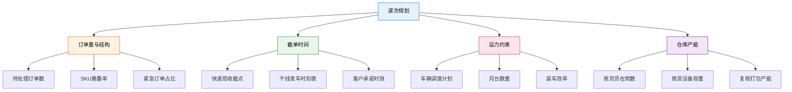
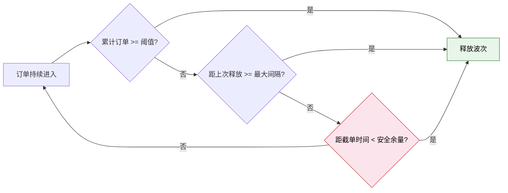
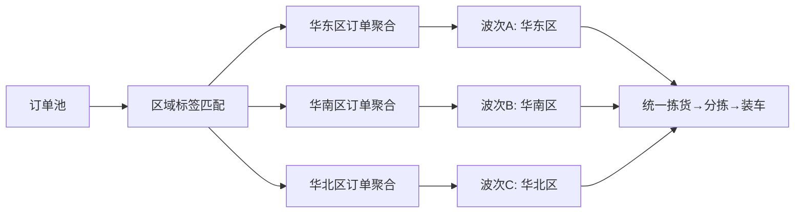
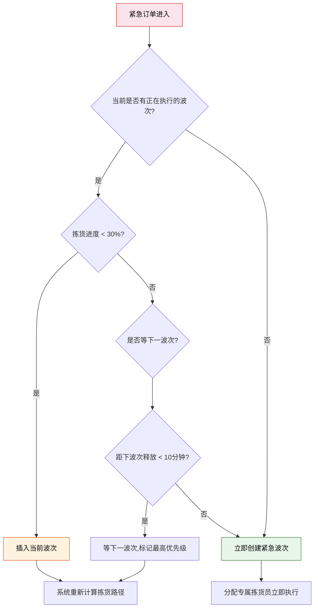
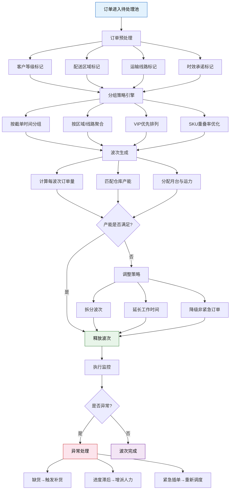

# 波次规划实战

> 波次规划是仓库"大脑"的核心——它决定了哪些订单在什么时候、以什么顺序进入拣货作业。一个好的波次策略，能让仓库产能利用率提升 30% 以上，同时确保运输截单时间不延误。

## 一、波次规划的输入因素

波次规划不是孤立决策，它受四大约束条件的共同驱动：



### 关键输入参数说明

| 参数 | 来源 | 更新频率 | 影响程度 |
|------|------|---------|---------|
| 待处理订单数 | OMS/电商后台 | 实时 | 高 |
| SKU 重叠率 | WMS 历史数据 | 按批次计算 | 高 |
| 快递揽收截点 | 物流商协议 | 每日 | 高 |
| 拣货员在岗数 | 排班系统 | 每班次 | 中 |
| 月台占用情况 | TMS | 实时 | 中 |
| 历史波次完成率 | WMS 报表 | 每日 | 中 |

## 二、时间窗口策略

### 固定窗口 vs 动态窗口

| 维度 | 固定窗口 | 动态窗口 |
|------|---------|---------|
| 定义 | 按预设时间点释放波次 | 按订单量/条件触发释放 |
| 典型配置 | 9:00 / 11:00 / 14:00 / 16:00 | 累计 200 单 或 每 30 分钟 |
| 优势 | 规律性强，便于人力排班 | 响应灵活，减少订单积压 |
| 劣势 | 低谷期波次内订单少，浪费产能 | 不可预测，排班困难 |
| 适用场景 | 订单量稳定、截单时间固定 | 订单波动大、促销期间 |

### 固定窗口示例

| 波次 | 释放时间 | 截单时间 | 目标发车时间 | 订单量预估 |
|------|---------|---------|------------|-----------|
| Wave 1 | 09:00 | 08:30 | 11:00 | 300 单 |
| Wave 2 | 11:00 | 10:30 | 14:00 | 500 单 |
| Wave 3 | 14:00 | 13:30 | 16:30 | 400 单 |
| Wave 4 | 16:00 | 15:30 | 19:00 | 600 单 |

### 动态窗口触发规则



**动态窗口三重触发条件：**

1. **数量触发**：累计未处理订单达到 N 单（如 200 单）
2. **时间触发**：距离上次波次释放超过最大间隔（如 30 分钟）
3. **截单触发**：距离某个截单时间不足安全余量（如 2 小时），强制释放包含该截单订单的波次

## 三、客户分组策略

### VIP 优先策略

高价值客户的订单应在波次中优先排列，确保其满足最严格的时效承诺：

| 客户等级 | 订单优先级 | 波次位置 | 时效承诺 |
|---------|-----------|---------|---------|
| SVIP | 最高 | 放入当前最早波次 | 次日达/当日达 |
| VIP | 高 | 优先排入波次 | 次日达 |
| 普通 | 标准 | 按规则排入 | 2-3日达 |
| 促销 | 低 | 填补波次空余 | 3-5日达 |

### 同区域聚合策略

将同一配送区域的订单聚合到同一波次，实现：

- **拣货路径优化**：同区域订单 SKU 重叠率高，播种效率提升
- **分拣效率提升**：同区域订单可批量送至同一分拣线
- **装车效率提升**：同区域包裹集中装车，减少装车等待



## 四、运输线路聚合

当仓库同时服务多条运输线路时，按线路聚合波次可以显著降低物流成本：

| 线路 | 发车时间 | 波次释放时间 | 月台分配 |
|------|---------|------------|---------|
| 线路A（江浙沪） | 13:00 | 10:00 | 月台1 |
| 线路B（珠三角） | 15:00 | 12:00 | 月台2 |
| 线路C（京津冀） | 17:00 | 14:00 | 月台3 |

**聚合规则：**
- 同一线路的订单尽量集中在同一波次
- 波次释放时间 = 发车时间 - 拣货耗时 - 复核打包耗时 - 装车耗时 - 安全余量
- 当某线路订单不足整车时，可与相邻线路合并波次

## 五、紧急订单插单处理

紧急订单（加急件、当日达）需要打破正常波次队列，优先处理：

### 插单流程



### 插单策略对比

| 策略 | 处理速度 | 对正常订单影响 | 实现复杂度 |
|------|---------|--------------|-----------|
| 插入当前波次 | 快 | 中（路径重算） | 中 |
| 独立紧急波次 | 最快 | 小（独立资源） | 低 |
| 等待下一波次 | 慢 | 无 | 低 |
| 人工干预处理 | 不确定 | 取决于操作员 | 高 |

> **实战建议**：紧急订单占比应控制在 5% 以内。超过 10% 时，应重新审视时效承诺策略——过高的插单率会严重干扰正常波次节奏，导致整体效率下降。

## 六、波次执行监控

波次释放后，需要实时监控执行状态，及时发现异常：

### 核心监控指标

| 指标 | 计算方式 | 预警阈值 | 说明 |
|------|---------|---------|------|
| 拣货完成率 | 已拣行项数 / 总行项数 | < 60% @半程 | 反映进度是否达标 |
| 缺货率 | 缺货行项数 / 总行项数 | > 3% | 触发补货或替代流程 |
| 人均拣货行效 | 拣货行项数 / 拣货人数 / 小时 | < 基准值 80% | 人员效率异常 |
| 复核打包完成率 | 已打包订单数 / 波次总订单数 | < 50% @截止前 1 小时 | 打包环节瓶颈 |
| 波次准时完成率 | 按时完成的波次 / 总波次数 | < 90% | 整体调度健康度 |

### 监控看板设计

```
┌──────────────────────────────────────────────────────┐
│                   波次执行看板                          │
├──────────┬──────────┬──────────┬──────────┬──────────┤
│  波次号   │  状态    │  拣货进度  │  缺货率   │  预计完成  │
├──────────┼──────────┼──────────┼──────────┼──────────┤
│ W-0901   │ 执行中   │ ████████░░ │  1.2%   │ 10:45   │
│ W-0902   │ 执行中   │ ████░░░░░░ │  2.8%   │ 11:30   │
│ W-1101   │ 待释放   │ ░░░░░░░░░░ │   -     │ 13:00   │
│ W-1102   │ 待释放   │ ░░░░░░░░░░ │   -     │ 14:30   │
├──────────┴──────────┴──────────┴──────────┴──────────┤
│  今日完成率: 92%  │  平均缺货率: 1.8%  │  延迟波次: 1  │
└──────────────────────────────────────────────────────┘
```

## 七、波次规划决策流程



## 八、实战案例：电商仓库波次配置

### 场景描述

某电商仓库日处理订单 3000 单，4 个快递揽收截点，SKU 约 8000，拣货员 15 人，复核打包 8 人。

### 波次配置方案

| 波次 | 释放时间 | 订单数 | 拣货模式 | 目标线路 | 拣货员分配 | 复核打包 |
|------|---------|-------|---------|---------|-----------|---------|
| W1 | 09:30 | 400 | 播种式 | 线路A（江浙沪） | 5 人 | 2 人 |
| W2 | 10:30 | 600 | 播种式 | 线路B（珠三角）+ 线路C（京津冀） | 6 人 | 3 人 |
| W3 | 13:00 | 800 | 播种式+分区 | 全线路 | 10 人 | 5 人 |
| W4 | 14:30 | 700 | 播种式 | 全线路 | 8 人 | 4 人 |
| W5 | 15:30 | 500 | 播种式 | 线路D（其他区域） | 5 人 | 3 人 |

### 配置要点

1. **W3 是全日高峰波次**：13:00 后是电商下单高峰，订单量最大，分配最多资源
2. **分时段调整人力**：W3 时段临时从入库组调拨 3 人支援拣货
3. **动态窗口兜底**：若 13:00-14:30 期间订单积压超过 300 单，自动触发额外波次
4. **紧急通道**：SVIP 订单不走批量波次，走专属快速通道，1 人专拣

### 效果对比

| 指标 | 优化前 | 优化后 | 提升 |
|------|-------|-------|------|
| 日完成率 | 88% | 98% | +10% |
| 平均出库时效 | 6.2 小时 | 4.1 小时 | -34% |
| 波次准时完成率 | 78% | 95% | +17% |
| 加急件满足率 | 72% | 96% | +24% |
| 拣货员利用率 | 72% | 88% | +16% |

> **总结**：波次规划的本质是在"订单时效"与"仓库产能"之间找到最优平衡。没有一成不变的最优配置，关键是建立监控—反馈—调整的闭环机制，根据业务变化持续优化波次参数。
