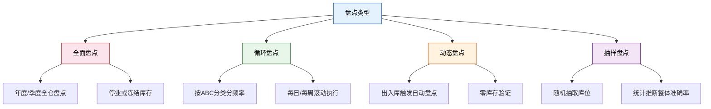
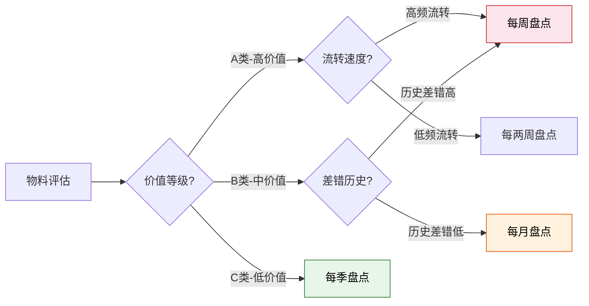
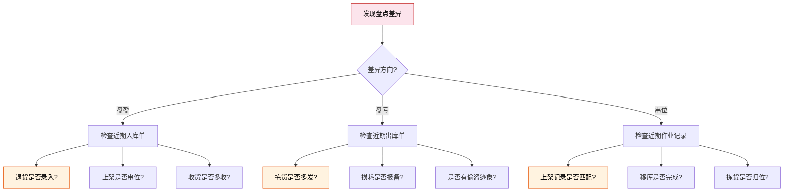
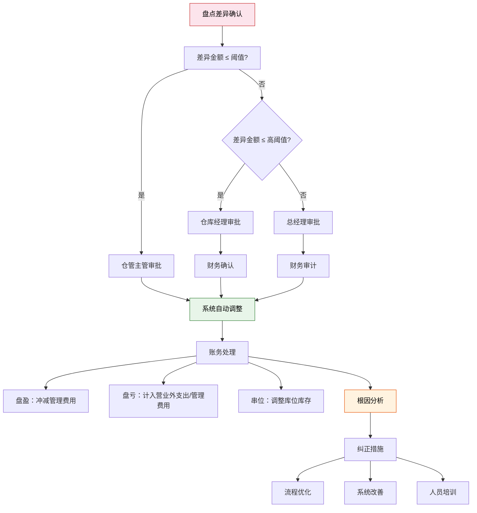
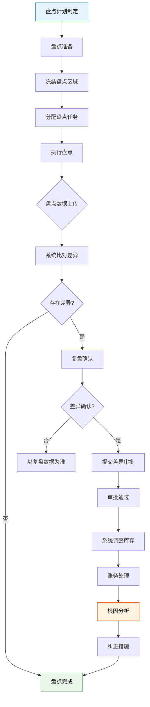

# 盘点策略与执行

> 盘点是仓库对库存准确性进行校验的核心手段。行业标杆的库存准确率为 99.5% 以上，而缺乏系统盘点策略的仓库，准确率往往在 95% 以下——这 4.5% 的差距，可能意味着每年数百万的隐性损失。

## 一、盘点类型



### 盘点类型对比

| 类型 | 频率 | 覆盖范围 | 对运营影响 | 准确度 | 适用场景 |
|------|------|---------|-----------|-------|---------|
| 全面盘点 | 年/季 | 100% | 需停业或冻结 | 最高 | 年终结账、审计要求 |
| 循环盘点 | 日/周 | 滚动全覆盖 | 几乎无影响 | 高 | 日常运营维护 |
| 动态盘点 | 实时 | 触发点相关 | 无影响 | 中高 | 高价值物料、零位校验 |
| 抽样盘点 | 月/季 | 统计样本 | 无影响 | 统计推断 | 大规模仓库快速评估 |

## 二、循环盘点 ABC 分类频率设计

循环盘点的核心思想是：重要物料多盘，次要物料少盘，用有限的盘点资源最大化库存准确率。

### ABC 分类与盘点频率

| 分类 | 价值占比 | SKU占比 | 盘点频率 | 年盘点次数 | 每日盘点SKU数 |
|------|---------|--------|---------|-----------|-------------|
| A 类 | 80% | 20% | 每周 | 52 次 | N × 20% / 5 |
| B 类 | 15% | 30% | 每月 | 12 次 | N × 30% / 22 |
| C 类 | 5% | 50% | 每季 | 4 次 | N × 50% / 66 |

> **计算示例**：假设仓库有 10000 个 SKU，A 类 2000 个，每日需盘 400 个；B 类 3000 个，每日约 136 个；C 类 5000 个，每日约 76 个。合计每日盘点约 612 个 SKU。

### 盘点频率决策矩阵



### 特殊盘点触发条件

除常规频率外，以下事件应触发即时盘点：

| 触发条件 | 盘点范围 | 优先级 |
|---------|---------|-------|
| 库存归零后首次出库 | 该库位全部 SKU | 高 |
| 盘点差异超过阈值 | 该 SKU 所在库位及周边 | 高 |
| 高价值物料出入库 | 该 SKU | 高 |
| 货位调整/移库后 | 涉及的源库位和目标库位 | 中 |
| 季节性商品换季 | 该品类全部 SKU | 中 |

## 三、盲盘 vs 明盘

| 维度 | 盲盘 | 明盘 |
|------|------|------|
| 定义 | 盘点人员不知道系统账面数量 | 盘点人员已知系统账面数量 |
| 准确度 | 更高（无心理暗示） | 较低（倾向于"凑数"） |
| 效率 | 较低（需完整清点） | 较高（有参考基准） |
| 差异发现率 | 高（真实反映偏差） | 低（可能掩盖小差异） |
| 适用场景 | 高价值物料、审计盘点 | 日常快速盘点、低价值物料 |
| 实施要求 | 需 PDA 隐藏数量字段 | 需防止"照抄"行为 |

> **实践建议**：A 类物料一律盲盘，B 类物料推荐盲盘，C 类物料可使用明盘。对于差异率持续偏高的库位，即使 C 类也应升级为盲盘。

## 四、盘点差异分析

### 差异类型

| 差异类型 | 定义 | 常见原因 | 典型占比 |
|---------|------|---------|---------|
| 盘盈 | 实物 > 账面 | 退货未录入、串位混入、入库多收 | 15% |
| 盘亏 | 实物 < 账面 | 出库多发、偷盗损耗、破损未报 | 65% |
| 串位 | 货物在错误库位 | 上架错误、移库遗漏、拣货后未归位 | 20% |

### 差异原因追溯



### 差异分析方法

1. **金额分析法**：按差异金额排序，Top 10 SKU 通常贡献 80% 的差异金额
2. **频次分析法**：按差异发生频次排序，识别"频错库位"
3. **时段分析法**：按差异发生时段分析，识别高风险作业时段
4. **人员分析法**：按作业人员分析，识别操作习惯问题

## 五、差异处理流程



### 差异审批权限矩阵

| 差异金额 | 审批层级 | 处理时限 |
|---------|---------|---------|
| ≤ 500 元 | 仓管主管 | 当日 |
| 500 - 5000 元 | 仓库经理 + 财务 | 3 个工作日 |
| > 5000 元 | 总经理 + 财务审计 | 5 个工作日 |
| 涉及偷盗嫌疑 | 安保 + 法务 | 立即 |

## 六、盘点准备清单

一次成功的盘点，70% 的工作在盘点前完成：

### 盘点前准备

| 序号 | 准备事项 | 负责人 | 完成标准 |
|------|---------|-------|---------|
| 1 | 确定盘点范围和日期 | 仓库经理 | 提前 3 天发布通知 |
| 2 | 清理在途单据 | 仓管主管 | 所有入库/出库单据完成系统过账 |
| 3 | 冻结盘点区域库存 | 系统管理员 | 盘点期间禁止出入库操作 |
| 4 | 打印盘点表或配置 PDA | 仓管主管 | 按区域分配盘点任务 |
| 5 | 通知相关部门 | 仓库经理 | 采购/销售/物流知悉盘点安排 |
| 6 | 盘点人员培训 | 仓管主管 | 确保理解盘点规则和操作流程 |
| 7 | 准备盘点工具 | 仓管员 | 盘点机/扫描枪/标签/笔/计算器 |

### 盘点中要求

- 两人一组，一人清点一人记录，交叉验证
- 不确定的库位必须全量清点，禁止估算
- 盘点过程中发现异常（破损、过期）同步记录
- 每个区域盘点完毕后立即进行复盘（抽盘 10%）

### 盘点后工作

- 差异汇总与分析
- 差异审批与账务调整
- 根因分析与纠正措施
- 盘点报告归档
- 更新 ABC 分类和盘点频率

## 七、盘点作业流程图



## 八、盘点准确率指标与持续改进

### 核心指标

| 指标 | 计算公式 | 目标值 | 行业标杆 |
|------|---------|-------|---------|
| 库存准确率 | 1 - \|差异项数\| / 总盘点项数 | ≥ 99% | 99.5%+ |
| 金额准确率 | 1 - \|差异金额\| / 总盘点金额 | ≥ 99.5% | 99.8%+ |
| 差异率 | 差异项数 / 总盘点项数 | ≤ 1% | < 0.5% |
| 盘点完成率 | 已盘点项数 / 计划盘点项数 | 100% | 100% |
| 复盘差异率 | 复盘差异项 / 复盘总项 | ≤ 0.1% | < 0.05% |

### 持续改进 PDCA 循环

| 阶段 | 动作 | 输出 |
|------|------|------|
| **Plan** | 分析历史差异数据，确定重点盘点区域和 SKU | 盘点计划 |
| **Do** | 执行盘点，记录差异 | 盘点结果 |
| **Check** | 分析差异原因，识别系统性问题 | 差异分析报告 |
| **Act** | 针对性地改善流程、系统或培训 | 纠正措施 |

## 九、PDA 盘点操作流程

### 操作步骤

```
1. 登录 PDA → 选择"盘点"模块
2. 选择/扫描盘点任务单号
3. 系统显示第一个待盘库位
4. 到达库位 → 扫描库位条码（PDA 验证位置正确性）
5. 扫描商品条码（盲盘模式下不显示账面数）
6. 清点实物数量 → 输入实际数量
7. 确认提交 → 系统自动比对
   - 一致：进入下一个库位
   - 不一致：提示差异，标记待复盘
8. 继续下一个库位
9. 全部完成 → 任务自动关闭
```

### PDA 盘点优势

| 功能 | 说明 |
|------|------|
| 库位导航 | PDA 显示最优盘点路径，减少走动 |
| 盲盘模式 | 隐藏系统数量，防止"凑数" |
| 即时比对 | 盘完即出差异，无需事后比对 |
| 异常标记 | 盘点中发现破损/过期直接拍照上报 |
| 离线盘点 | 无信号区域可离线作业，联网后自动同步 |
| 防重复盘 | 已盘库位自动标灰，防止遗漏或重复 |

> **总结**：盘点不是"为了盘点而盘点"，而是库存管理闭环中的校验环节。循环盘点 + 盲盘 + PDA 工具 + 差异根因分析，构成库存准确率持续提升的完整体系。目标是让盘点从"运动式突击"变为"常态化体检"。
