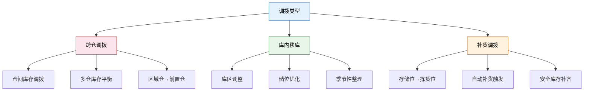
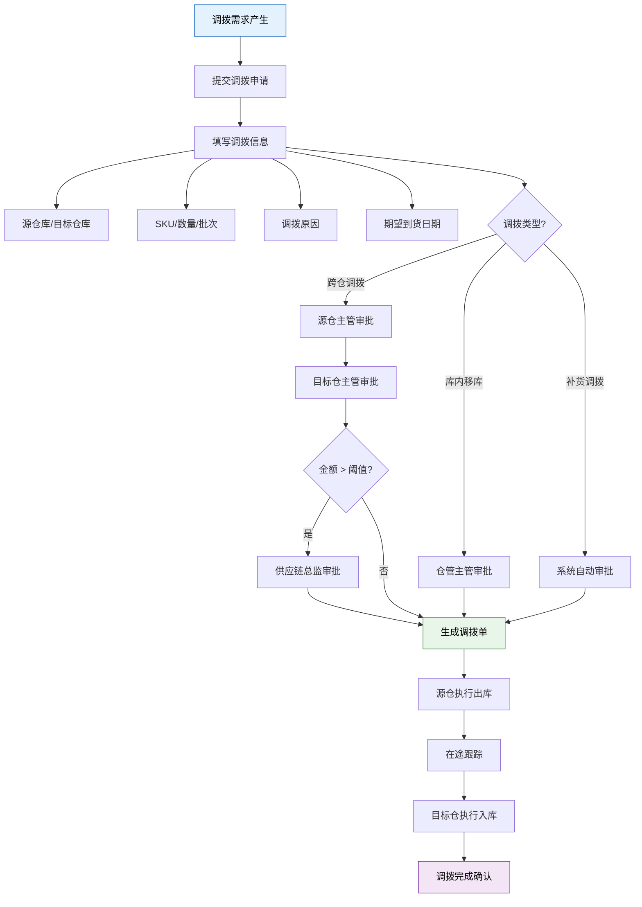
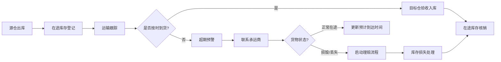
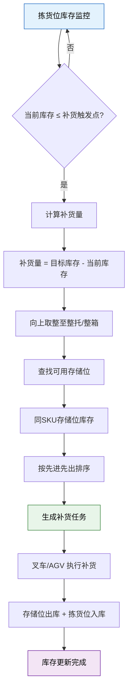
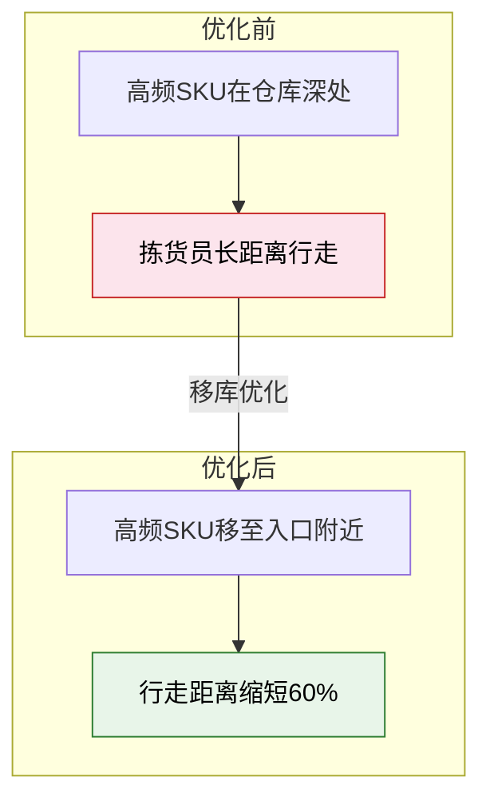
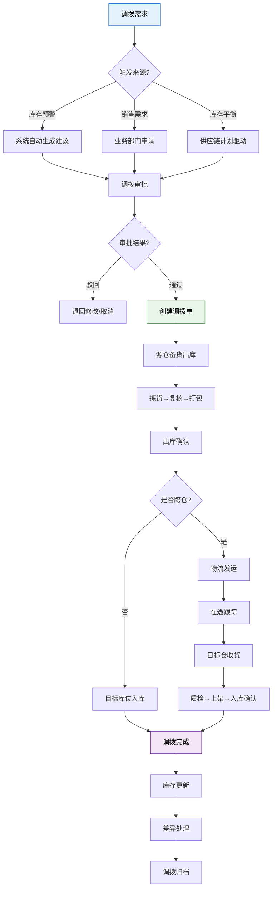
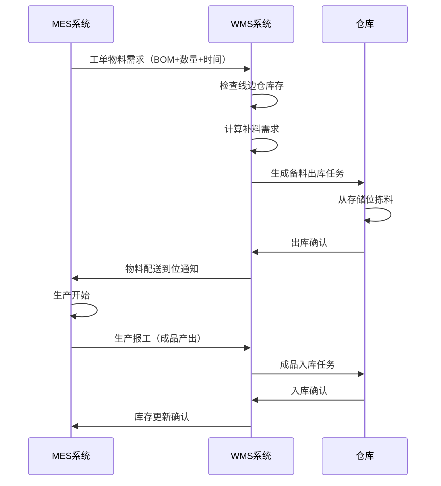

# 调拨与移库

> 调拨和移库是库存在不同空间维度上的重新配置——调拨解决"跨仓库"的供需平衡，移库解决"仓库内"的空间优化。两者共同保障货物在正确的时间出现在正确的位置。

## 一、调拨类型



### 调拨类型对比

| 类型 | 触发方式 | 涉及系统 | 典型周期 | 运输成本 |
|------|---------|---------|---------|---------|
| 跨仓调拨 | 人工申请/系统建议 | WMS + ERP + TMS | 1-5 天 | 高 |
| 库内移库 | 人工申请/策略触发 | WMS | 当日 | 低 |
| 补货调拨 | 系统自动触发 | WMS | 分钟级 | 极低 |

## 二、调拨审批流程

调拨涉及库存所有权和物理位置的变更，必须经过严格的审批流程：



### 审批权限矩阵

| 调拨类型 | 金额/数量 | 审批层级 | 时限要求 |
|---------|----------|---------|---------|
| 补货调拨 | 任意 | 系统自动 | 即时 |
| 库内移库 | 任意 | 仓管主管 | 4 小时 |
| 跨仓调拨 | ≤ 5 万元 | 双方仓管主管 | 1 个工作日 |
| 跨仓调拨 | > 5 万元 | 仓管主管 + 供应链总监 | 2 个工作日 |
| 紧急调拨 | 任意 | 供应链总监（加急） | 4 小时 |

## 三、跨仓调拨在途库存处理

跨仓调拨的核心难点在于**在途库存**：货物已从源仓出库，但尚未到达目标仓入库，这段时间内库存"悬空"。

### 在途库存的三种处理方式

| 方式 | 会计处理 | 优势 | 劣势 |
|------|---------|------|------|
| 源仓保留 | 库存仍在源仓，直到目标仓确认入库 | 简单，无虚增 | 源仓库存虚高，目标仓不可见 |
| 在途专户 | 从源仓转出，记入"在途库存"科目 | 双方库存清晰 | 需额外科目和 reconciliation |
| 目标仓预入 | 目标仓提前记入库存 | 目标仓可预分配 | 风险：在途损毁/差异需冲回 |

### 在途库存管理要点



### 在途库存关键指标

| 指标 | 计算方式 | 目标值 |
|------|---------|-------|
| 在途库存占比 | 在途金额 / 总库存金额 | < 5% |
| 在途周期 | 平均出库到入库天数 | ≤ 3 天 |
| 在途差异率 | 在途差异数 / 在途总笔数 | < 0.5% |
| 在途超期率 | 超期未到笔数 / 在途总笔数 | < 2% |

## 四、补货触发规则

补货调拨是最频繁的调拨类型，其核心是**拣货位库存低于阈值时自动触发从存储位补货**。

### 补货触发机制



### 补货参数设计

| 参数 | 定义 | 设置建议 |
|------|------|---------|
| 补货触发点 | 触发补货的库存水位 | 日均拣货量 × 1.5 天 |
| 目标库存量 | 补货后的目标水位 | 日均拣货量 × 3 天 |
| 补货批量 | 单次补货的量 | 整托/整箱的倍数 |
| 补货时间窗口 | 允许执行补货的时段 | 避开拣货高峰（如早 6-8 点） |
| 最大补货任务数 | 并发补货任务上限 | 取决于叉车/人员数量 |

### 补货策略对比

| 策略 | 触发方式 | 优势 | 劣势 |
|------|---------|------|------|
| 最低水位触发 | 库存 ≤ 触发点时补 | 简单直观 | 可能集中在高峰期补货 |
| 定时批量补 | 每日固定时段集中补 | 不干扰正常作业 | 可能出现临时缺货 |
| 预测性补货 | 根据订单预测提前补 | 最优，避免缺货 | 实现复杂，依赖预测精度 |
| 拣货联动 | 拣货时同步触发补货 | 实时性好 | 增加拣货等待 |

> **实战建议**：大多数仓库采用"最低水位触发 + 定时批量补"的组合策略——正常时段用触发式，高峰前用定时批量预补。

## 五、移库策略

库内移库的核心目标是通过空间优化提升作业效率：

### 季节性调整

| 季节 | 移库动作 | 原因 |
|------|---------|------|
| 春→夏 | 夏装移至拣货区黄金位置 | 夏装需求激增 |
| 夏→秋 | 空调配件从拣货区退至存储区 | 季节性淡出 |
| 秋→冬 | 取暖设备前移至快速拣选区 | 冬季需求高峰 |
| 促销前 | 促销品移至打包区附近 | 应对瞬时订单爆发 |

### 动线优化



### 移库触发条件

| 触发条件 | 移库类型 | 执行频率 |
|---------|---------|---------|
| ABC 分类变化 | A 类商品移至黄金拣选区 | 每月 |
| 库位利用率 < 60% | 合并低效库位，释放空间 | 每周 |
| 拣货路径热力图异常 | 高频行走区域货物前移 | 每两周 |
| 新品上架 | 新品分配至适当流速区域 | 随时 |
| 仓库布局调整 | 按新规划批量迁移 | 季度/年度 |

## 六、调拨成本核算

跨仓调拨不是"免费"的，完整的成本核算应包括：

### 成本构成

| 成本项 | 计算方式 | 占比范围 |
|-------|---------|---------|
| 运输费 | 里程 × 单价 或 整车报价 | 40-60% |
| 装卸费 | 件数/托数 × 单价 | 10-15% |
| 包装费 | 消耗材料 + 人工 | 5-10% |
| 保险费 | 货值 × 费率 | 1-3% |
| 在途资金占用 | 货值 × 日利率 × 在途天数 | 5-10% |
| 管理成本 | 审批/跟踪/差异处理人工 | 10-15% |
| 损耗风险 | 历史损耗率 × 货值 | 2-5% |

### 成本决策模型

当调拨成本超过"在当地采购"成本时，应考虑就地采购而非调拨：

```
调拨总成本 = 运输费 + 装卸费 + 包装费 + 保险费 + 资金占用 + 管理成本 + 损耗
当地采购成本 = 采购价 × 数量 + 紧急采购溢价

决策规则：
  调拨总成本 < 当地采购成本 → 执行调拨
  调拨总成本 ≥ 当地采购成本 → 就地采购
```

## 七、调拨流程图



## 八、与 ERP/MES 的协同场景

### WMS-ERP 协同

| 协同场景 | ERP 侧 | WMS 侧 | 数据流向 |
|---------|---------|--------|---------|
| 跨仓调拨申请 | 创建调拨订单 | 接收调拨任务 | ERP → WMS |
| 调拨出库 | 更新源仓库存 | 执行出库作业 | WMS → ERP |
| 在途跟踪 | 查询在途状态 | 上报运输状态 | WMS → ERP |
| 调拨入库 | 更新目标仓库存 | 执行入库作业 | WMS → ERP |
| 差异处理 | 审批库存调整 | 上报差异 | WMS → ERP → WMS |

### WMS-MES 协同

| 协同场景 | MES 侧 | WMS 侧 | 说明 |
|---------|--------|--------|------|
| 线边仓补料 | 生产工单物料需求 | 自动触发线边仓补货 | JIT 供料 |
| 副产品入库 | 报工产出 | 副产品/废品入库 | 生产闭环 |
| 工装夹具调拨 | 工序需求 | 工装从库房调至产线 | 辅料管理 |
| 质量隔离 | 不良品判定 | 不良品移至隔离区 | 质量管控 |

### 典型协同流程：生产补料



> **总结**：调拨与移库是库存空间配置的核心手段。跨仓调拨需严格管控在途库存和审批流程，库内移库应与 ABC 分类和动线优化联动，补货调拨应尽量自动化以减少缺货风险。三者协同 ERP 和 MES，才能实现端到端的库存可视化与高效流转。
