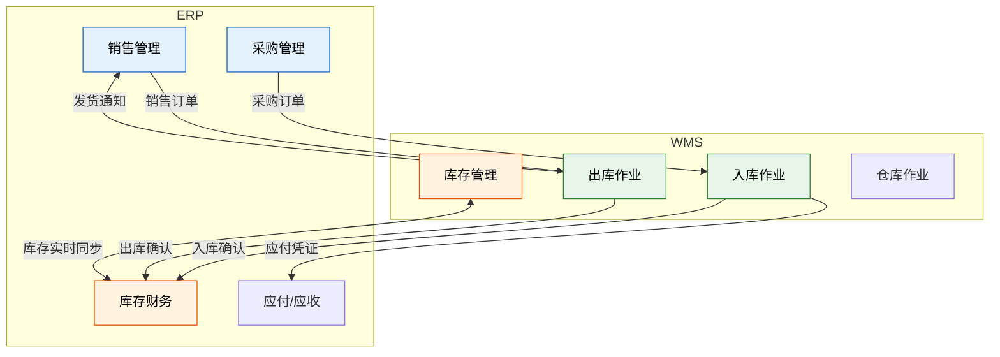
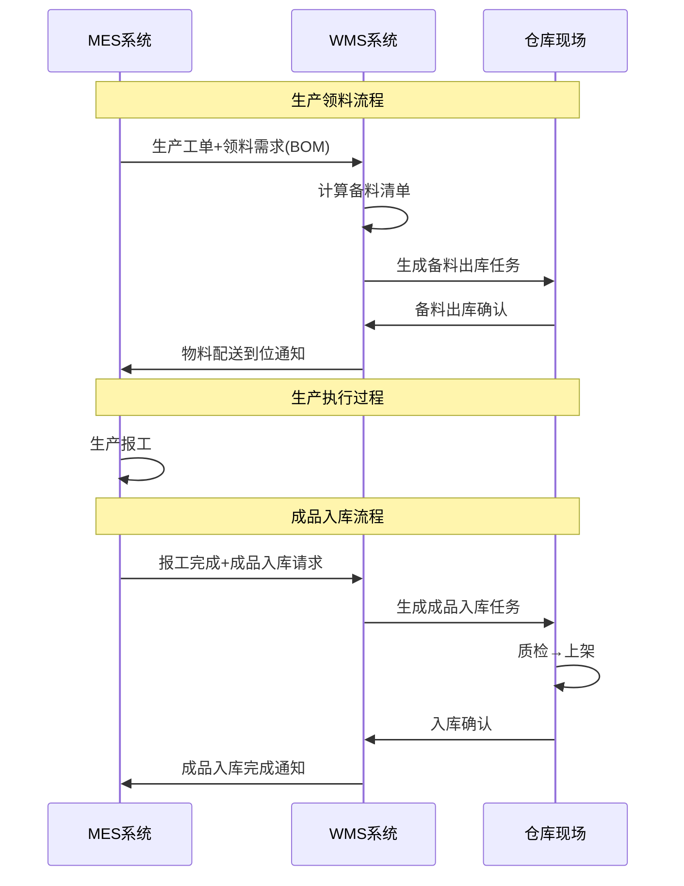
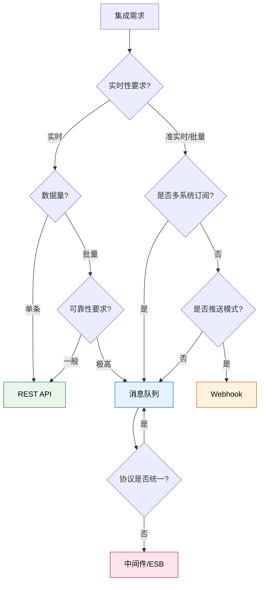
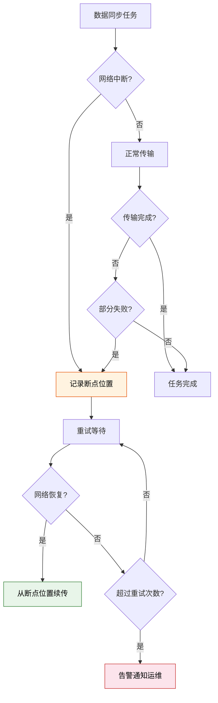
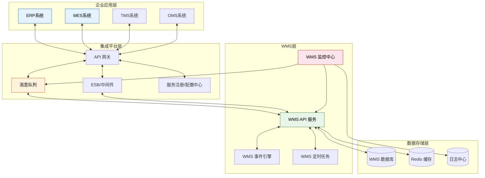

# WMS与ERP/MES集成

> WMS 的价值不在于"自己能做什么"，而在于"和上下游系统协同能做什么"。一次成功的集成，能让采购订单自动变为入库任务、生产工单自动触发备料出库、库存变动实时回写财务账——数据在系统间无缝流动，才叫"数字化"。

## 一、WMS 与 ERP 集成

### 核心集成场景



### 1. 采购入库同步

| 步骤 | ERP 侧 | WMS 侧 | 数据内容 |
|------|---------|--------|---------|
| 1 | 创建采购订单 | - | 供应商、物料、数量、交期 |
| 2 | 下发到 WMS | 接收为预期收货通知（ASN） | 订单号、行项明细 |
| 3 | - | 收货→质检→上架 | 实收数量、质检结果、库位 |
| 4 | - | 回写入库确认 | 入库单号、实收数量、批次 |
| 5 | 更新库存台账 | - | 库存增加、应付确认 |

**关键字段映射：**

| ERP 字段 | WMS 字段 | 说明 |
|---------|---------|------|
| PO_NUMBER | ASN_NO | 采购订单号 → 预到货通知号 |
| PO_LINE | ASN_LINE | 订单行号 |
| MATERIAL_CODE | SKU_CODE | 物料编码 |
| ORDER_QTY | EXPECTED_QTY | 订单数量 → 预期数量 |
| VENDOR_CODE | SUPPLIER_CODE | 供应商编码 |

### 2. 销售出库同步

| 步骤 | ERP 侧 | WMS 侧 | 数据内容 |
|------|---------|--------|---------|
| 1 | 创建销售订单 | - | 客户、物料、数量、交期 |
| 2 | 下发到 WMS | 接收为出库订单 | 订单号、行项明细、优先级 |
| 3 | - | 波次分配→拣货→复核→发货 | 实发数量、承运商、运单号 |
| 4 | - | 回写出库确认 | 出库单号、实发数量 |
| 5 | 更新库存台账，生成应收 | - | 库存减少、应收确认 |

### 3. 库存实时回写

库存回写是最关键的集成点，决定了 ERP 库存台账与仓库实物的一致性：

| 回写事件 | 触发时机 | 回写内容 | 频率 |
|---------|---------|---------|------|
| 入库回写 | 上架确认后 | 库位+SKU+批次+数量增加 | 实时 |
| 出库回写 | 发货确认后 | 库位+SKU+批次+数量减少 | 实时 |
| 盘点调整 | 差异审批后 | 库存增减调整 | 实时 |
| 调拨回写 | 出库/入库确认后 | 双方库存增减 | 实时 |
| 状态变更 | 冻结/解冻时 | 库存可用量变更 | 实时 |

## 二、WMS 与 MES 集成

WMS 与 MES 的集成是制造企业"计划→执行"闭环的关键：

### 核心集成流程



### WMS-MES 集成场景详解

| 场景 | MES 触发 | WMS 执行 | 回写 MES |
|------|---------|---------|---------|
| 生产领料 | 工单下达 | 备料→拣料→配送至产线 | 物料到位确认 |
| 线边退料 | 工单结束 | 退料接收→上架 | 退料数量确认 |
| 成品入库 | 报工完成 | 入库→质检→上架 | 入库确认 |
| 不良品处理 | 质检判废 | 移至隔离区→报废出库 | 报废确认 |
| 线边仓盘点 | 周期触发 | 线边仓盘点 | 差异确认 |
| 工装领用 | 工序需求 | 工装出库→配送 | 工装到位确认 |

### 领料模式对比

| 模式 | 描述 | 适用场景 |
|------|------|---------|
| 推式领料 | MES 推送工单，WMS 按单备料配送 | 离散制造，批量生产 |
| 拉式领料 | 产线消耗触发看板，WMS 按看板补料 | 精益生产，JIT |
| 限额领料 | 按工单 BOM 用量限额发放，超限需审批 | 严格成本控制 |
| 成套配送 | 按工单成套配齐，一次性送至产线 | 装配型生产 |

## 三、接口设计模式

### 四种接口模式对比

| 模式 | 原理 | 优势 | 劣势 | 适用场景 |
|------|------|------|------|---------|
| REST API | 同步 HTTP 请求/响应 | 简单直接，易于调试 | 耦合度高，超时风险 | 实时查询、单条操作 |
| 消息队列 | 异步发布/订阅 | 解耦，削峰填谷，可靠投递 | 实现复杂，消息顺序性 | 批量数据、事件通知 |
| Webhook | 事件回调通知 | 实时性好，推送模式 | 需要公网可达，重试复杂 | 状态变更通知 |
| 中间件 | ESB/API 网关统一转发 | 协议转换、流量管控 | 引入额外组件和延迟 | 多系统集成、遗留系统 |

### 接口模式选择决策



### REST API 接口设计规范

以采购入库同步为例：

**ERP → WMS（下发采购订单）：**

```
POST /api/v1/asn
Content-Type: application/json

{
  "asnNo": "PO-2024-001234",
  "supplierCode": "SUP001",
  "expectedDate": "2024-03-15",
  "lines": [
    {
      "lineNo": 1,
      "skuCode": "MAT-A001",
      "expectedQty": 1000,
      "uom": "EA"
    }
  ]
}
```

**WMS → ERP（回写入库确认）：**

```
POST /api/v1/inbound/confirm
Content-Type: application/json

{
  "asnNo": "PO-2024-001234",
  "confirmTime": "2024-03-15T14:30:00+08:00",
  "lines": [
    {
      "lineNo": 1,
      "skuCode": "MAT-A001",
      "receivedQty": 998,
      "batchNo": "B2024031501",
      "locationCode": "A-01-03"
    }
  ]
}
```

## 四、数据同步策略

### 实时同步 vs 定时同步

| 维度 | 实时同步 | 定时同步 |
|------|---------|---------|
| 时效性 | 秒级 | 分钟级~小时级 |
| 实现方式 | API 调用/消息推送 | ETL 任务/定时批处理 |
| 系统压力 | 与业务量成正比 | 集中在批处理时段 |
| 可靠性 | 依赖网络和接口稳定性 | 可重试，更可靠 |
| 典型场景 | 库存回写、出库确认 | 基础数据同步、报表数据 |

### 混合同步策略

| 数据类型 | 同步方式 | 频率 | 原因 |
|---------|---------|------|------|
| 物料主数据 | 定时 | 每小时 | 变更频率低，批量同步效率高 |
| 客户/供应商数据 | 定时 | 每小时 | 变更频率低 |
| 采购订单 | 实时 | 即时 | 入库作业依赖 |
| 销售订单 | 实时 | 即时 | 出库作业依赖 |
| 库存变动 | 实时 | 即时 | 财务账实时性要求 |
| 盘点调整 | 实时 | 即时 | 审批后即时生效 |
| 库存快照 | 定时 | 每日 | 报表分析用 |

## 五、异常恢复机制

集成不可能 100% 顺利，必须设计健壮的异常恢复机制：

### 断点续传



### 幂等性设计

幂等性确保同一请求被重复调用时不会产生副作用：

| 策略 | 实现方式 | 适用场景 |
|------|---------|---------|
| 唯一业务键 | 以单据号+行号作为唯一标识，重复请求直接返回成功 | 入库确认、出库确认 |
| 版本号 | 每次更新携带版本号，服务端校验版本号递增 | 库存更新 |
| 状态机 | 只允许特定状态的转换，重复请求落在非法状态直接拒绝 | 订单状态变更 |
| 去重表 | 记录已处理的请求 ID，新请求先查去重表 | 通用场景 |

**幂等性设计示例（入库确认）：**

```
1. 接收到入库确认请求（asnNo + lineNo）
2. 查询去重表：该 asnNo + lineNo 是否已处理？
   - 已处理：直接返回成功（不重复处理）
   - 未处理：执行入库逻辑，写入去重表，返回成功
3. 即使网络超时导致客户端重试，也不会导致库存重复增加
```

### 异常分级处理

| 异常级别 | 定义 | 处理方式 | 响应时间 |
|---------|------|---------|---------|
| L1-致命 | 核心业务流程中断 | 立即告警，人工介入 | < 15 分钟 |
| L2-严重 | 单一接口不可用 | 自动重试 + 告警 | < 1 小时 |
| L3-一般 | 数据延迟/不一致 | 自动修复 + 日志记录 | < 4 小时 |
| L4-轻微 | 非关键功能异常 | 记录日志，定期处理 | 下一工作日 |

## 六、接口监控与告警

### 监控指标

| 指标 | 采集方式 | 预警阈值 | 说明 |
|------|---------|---------|------|
| 接口可用率 | 心跳/健康检查 | < 99.9% | 接口是否可访问 |
| 平均响应时间 | APM 采集 | > 3s | 处理耗时 |
| 错误率 | HTTP 状态码统计 | > 1% | 4xx/5xx 占比 |
| 消息积压量 | 队列深度监控 | > 1000 条 | MQ 未消费消息数 |
| 同步延迟 | 时间戳差值 | > 5 分钟 | 数据时差 |
| 日调用量 | 日志统计 | 异常波动 > 50% | 异常流量检测 |

### 告警通知渠道

| 渠道 | 适用级别 | 响应速度 |
|------|---------|---------|
| 电话 | L1 致命 | 即时 |
| 短信 | L2 严重 | < 5 分钟 |
| 企业微信/钉钉 | L3 一般 | < 30 分钟 |
| 邮件 | L4 轻微 | 下一工作日 |

## 七、集成架构图



> **总结**：WMS 集成的核心原则是"松耦合、高内聚"——系统间通过标准接口通信，各自独立部署和升级；同时保证关键数据路径的实时性和可靠性。断点续传和幂等性不是可选项，而是生产级集成的必备能力。

> **📖 延伸阅读**：关于业务与系统断层的深入分析，参见 [业务与系统断层](../../企业数字化转型实践/02_业务与系统断层/) 章节，特别是 [跨系统业务闭环构建](../../企业数字化转型实践/02_业务与系统断层/03_跨系统业务闭环构建.md) 中对 Order-to-Cash、Procure-to-Pay 等端到端业务闭环的设计方案。
