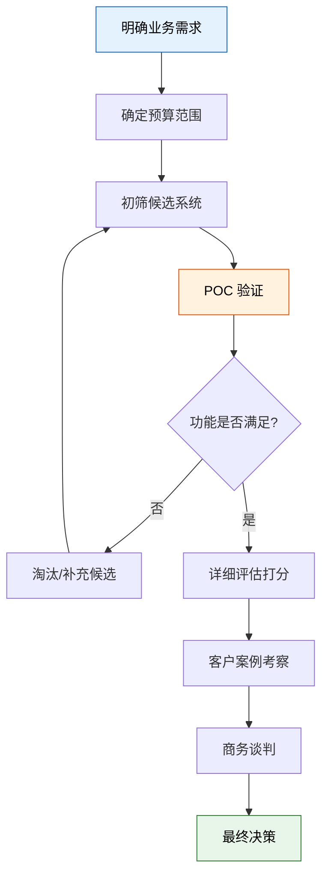
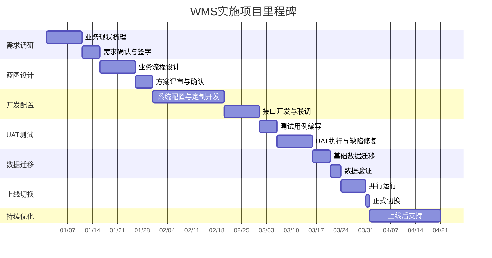
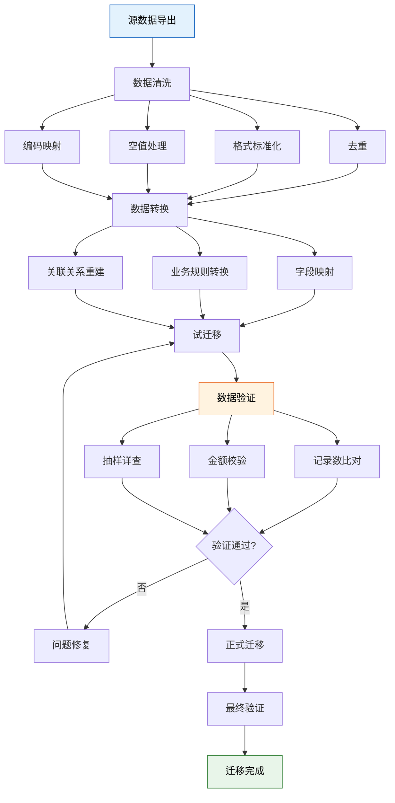
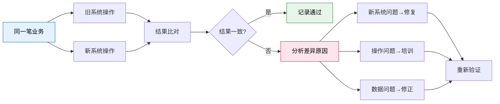
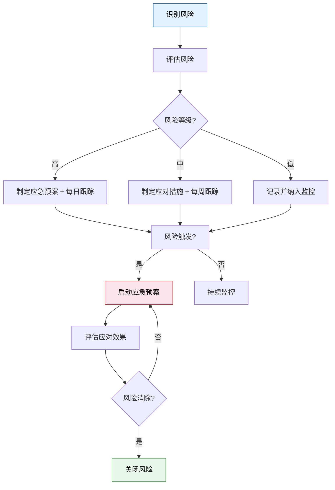
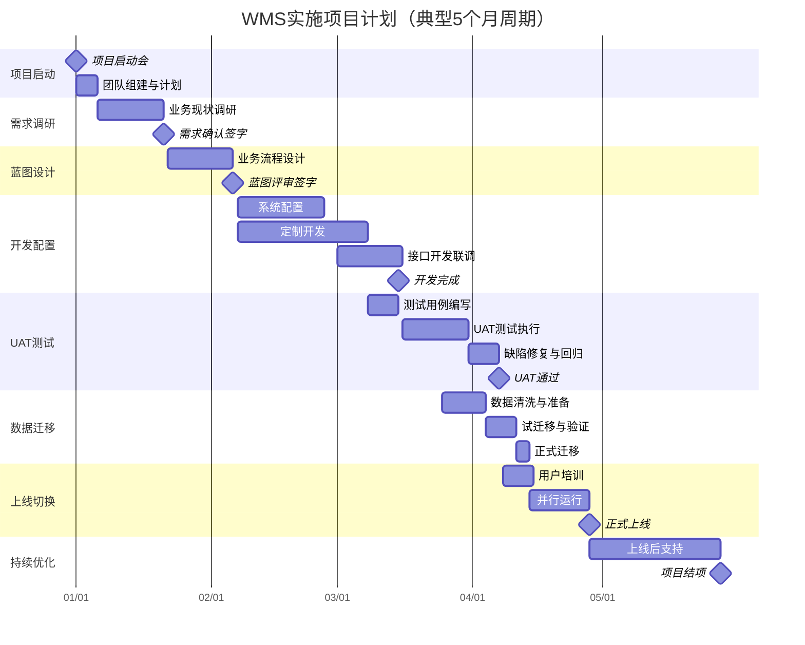

# 生产级落地指南

> 选对系统只是起点，落地成功才是终点。WMS 项目失败的原因很少是"功能不够"，更多是"实施不力"——需求没理清、数据没迁好、用户没培训、切换没准备。本文提供从选型到上线的全流程实战指南。

## 一、WMS 选型评估框架

### 评估维度与权重

| 维度 | 权重 | 评估要点 |
|------|------|---------|
| 功能匹配度 | 30% | 核心业务覆盖度、行业适配性、特殊需求支持 |
| 技术架构 | 25% | 部署模式、扩展性、集成能力、性能表现 |
| 实施与服务 | 20% | 实施团队经验、项目管理能力、培训体系 |
| 供应商实力 | 15% | 公司稳定性、客户案例、研发投入 |
| 总体拥有成本 | 10% | License/订阅费、实施费、运维费、升级费 |

### 评估打分表

| 评估项 | 指标 | 权重 | 系统A | 系统B | 系统C |
|-------|------|------|-------|-------|-------|
| 入库管理 | 收货/质检/上架/打印 | 8% | 9 | 8 | 7 |
| 出库管理 | 波次/拣货/复核/发货 | 8% | 8 | 9 | 8 |
| 库存管理 | 实时库存/批次/效期 | 7% | 9 | 8 | 8 |
| 拣货策略 | 多模式/路径优化 | 4% | 7 | 9 | 6 |
| 盘点管理 | 循环/动态/差异处理 | 3% | 8 | 7 | 8 |
| 集成能力 | API/MQ/Webhook | 10% | 9 | 7 | 8 |
| 部署灵活性 | 云/私有化/混合 | 8% | 8 | 6 | 9 |
| 性能扩展 | 并发/数据量/集群 | 7% | 8 | 7 | 8 |
| 实施经验 | 同行业案例数 | 10% | 9 | 8 | 6 |
| 服务响应 | SLA/现场支持 | 10% | 7 | 8 | 7 |
| 成本 | 5 年 TCO | 10% | 6 | 7 | 9 |
| 研发能力 | 版本迭代/社区活跃 | 5% | 8 | 6 | 8 |
| **加权总分** | | **100%** | **8.15** | **7.65** | **7.55** |

### 选型决策流程

### POC 验证清单

| 验证项 | 验证内容 | 通过标准 |
|-------|---------|---------|
| 核心流程 | 完整入库→在库→出库闭环 | 无阻断性 BUG |
| 性能基线 | 100 并发用户，平均响应 < 2s | P99 < 5s |
| 集成对接 | 与现有 ERP 对接验证 | 双向数据同步正确 |
| 批量导入 | 10 万条库存数据导入 | < 30 分钟完成 |
| 移动端 | PDA 扫码拣货全流程 | 操作流畅，无卡顿 |
| 报表 | 核心业务报表生成 | < 10s 出结果 |

## 二、实施方法论

### 七阶段实施模型

### 各阶段核心交付物

| 阶段 | 核心交付物 | 签字方 |
|------|-----------|-------|
| 需求调研 | 《需求规格说明书》 | 业务负责人 + 项目经理 |
| 蓝图设计 | 《业务蓝图文档》《接口规格书》 | 业务负责人 + IT 负责人 |
| 开发配置 | 《系统配置手册》《开发完成报告》 | 项目经理 + 技术负责人 |
| UAT 测试 | 《测试报告》《缺陷清单》 | 测试负责人 + 业务代表 |
| 数据迁移 | 《数据迁移方案》《迁移验证报告》 | 数据负责人 + 业务代表 |
| 上线切换 | 《上线方案》《回退预案》 | 项目经理 + 管理层 |
| 持续优化 | 《优化建议清单》《项目结项报告》 | 项目经理 |

## 三、数据迁移策略

数据迁移是上线成功的关键前置条件，"脏数据进，脏数据出"。

### 数据迁移范围

| 数据类别 | 具体内容 | 迁移方式 | 优先级 |
|---------|---------|---------|-------|
| 基础数据 | 物料主数据、客户、供应商、仓库/库位 | CSV/Excel 导入 | P0 |
| 基础数据 | 用户、角色、权限 | 系统配置 | P0 |
| 历史库存 | 当前库存余额（SKU+库位+批次+数量） | 接口/脚本导入 | P0 |
| 在途单据 | 未完成的采购入库单、销售出库单 | 逐笔录入或导入 | P1 |
| 历史交易 | 近 N 月出入库记录 | ETL 批量迁移 | P2 |
| 历史报表 | 盘点记录、差异记录 | 归档导入 | P3 |

### 数据迁移流程

### 数据验证检查清单

| 检查项 | 方法 | 通过标准 |
|-------|------|---------|
| 主数据完整性 | 源系统记录数 vs 目标系统记录数 | 100% 一致 |
| 库存金额校验 | 源系统库存总金额 vs 目标系统库存总金额 | 差异 < 0.01% |
| 编码一致性 | 随机抽取 100 条，逐一比对 | 100% 一致 |
| 批次效期 | 检查所有批次号和效期是否正确迁移 | 100% 一致 |
| 关联完整性 | 订单-行项-库存关联是否完整 | 无断链 |

## 四、并行运行与双轨切换

### 切换策略对比

| 策略 | 描述 | 风险 | 切换时长 |
|------|------|------|---------|
| 直接切换 | 旧系统停用，新系统直接上线 | 高 | 1 天 |
| 并行运行 | 新旧系统同时运行，比对结果 | 低 | 1-4 周 |
| 分阶段切换 | 按仓库/业务线逐步切换 | 中 | 1-3 月 |
| 试点先行 | 先在一个仓库/区域试点，再推广 | 低 | 1-2 月 |

### 并行运行操作要点

### 并行运行退出标准

| 指标 | 达标值 | 持续时间 |
|------|-------|---------|
| 业务操作一致率 | ≥ 99.5% | 连续 5 个工作日 |
| 库存数据一致率 | 100% | 连续 3 个工作日 |
| 新系统可用率 | ≥ 99.9% | 连续 7 个工作日 |
| 用户满意度 | ≥ 80% | 问卷调查 |
| 未解决缺陷数 | 0 个 P0/P1 | 缺陷清单 |

## 五、用户培训计划

### 分角色培训方案

| 角色 | 培训内容 | 培训方式 | 时长 | 考核方式 |
|------|---------|---------|------|---------|
| 仓库经理 | 系统概览、报表分析、异常处理 | 课堂+实操 | 2 天 | 场景测试 |
| 仓管主管 | 入库/出库/盘点全流程、参数配置 | 课堂+实操 | 3 天 | 实操考核 |
| 拣货员 | PDA 拣货操作、异常上报 | 现场+视频 | 1 天 | 上机操作 |
| 收货员 | 收货质检、上架操作 | 现场+视频 | 1 天 | 上机操作 |
| 系统管理员 | 系统配置、权限管理、接口监控 | 课堂+实验 | 2 天 | 配置实操 |
| IT 运维 | 部署架构、备份恢复、性能调优 | 课堂+实验 | 2 天 | 故障演练 |

### 场景化培训设计

以"收货员"为例，培训场景应覆盖实际工作中的所有典型情况：

| 场景 | 操作流程 | 异常处理 |
|------|---------|---------|
| 正常收货 | 扫ASN→清点→质检→上架 | - |
| 数量短缺 | 扫ASN→部分收货→标注差异 | 差异自动通知采购 |
| 质检不合格 | 扫ASN→质检标记→移至隔离区 | 生成退货/换货通知 |
| 无ASN到货 | 手动创建收货单→后续流程 | 通知采购补发ASN |
| 紧急入库 | 走快速通道→后补质检 | 标记待质检状态 |

## 六、上线后关键指标监控

### 第一周每日监控

| 指标 | 监控频率 | 预警阈值 | 负责人 |
|------|---------|---------|-------|
| 系统可用率 | 每 5 分钟 | < 99.5% | IT 运维 |
| 接口成功率 | 每 5 分钟 | < 99% | IT 运维 |
| 入库单据积压 | 每小时 | > 50 单 | 仓管主管 |
| 出库单据积压 | 每小时 | > 100 单 | 仓管主管 |
| PDA 操作成功率 | 每小时 | < 95% | 仓管主管 |
| 用户问题单 | 每日 | > 20 个/天 | 项目经理 |

### 上线后 30 天健康度评估

| 维度 | 评估指标 | 达标值 |
|------|---------|-------|
| 系统稳定性 | 可用率 | > 99.9% |
| 业务效率 | 出库时效（下单→发货） | ≤ 蓝图目标值 |
| 数据质量 | 库存准确率 | > 99% |
| 用户满意度 | 问卷评分 | > 4.0/5.0 |
| 运维健康 | P0/P1 缺陷数 | 0 |

## 七、常见实施风险与应对措施

### 风险矩阵

| 风险 | 概率 | 影响 | 应对措施 |
|------|------|------|---------|
| 需求范围蔓延 | 高 | 高 | 严格变更控制流程，冻结需求基线 |
| 历史数据质量差 | 高 | 中 | 提前 2 个月启动数据清洗 |
| 关键用户参与不足 | 中 | 高 | 管理层背书，将参与度纳入绩效考核 |
| 接口对接困难 | 中 | 高 | 尽早启动接口 POC，预留联调缓冲期 |
| 用户抵触情绪 | 中 | 中 | 场景化培训，设置过渡期激励 |
| 上线时机不当 | 低 | 高 | 避开业务高峰期，选择淡季切换 |
| 供应商交付延迟 | 中 | 中 | 合同约束交付里程碑，设置违约条款 |

### 风险应对策略

## 八、项目里程碑甘特图

> **总结**：WMS 落地是一项系统工程，不是"买个软件装上就完事"。选型看匹配度而非功能数量，实施看过程管控而非里程碑速度，上线看平稳过渡而非一刀切切换。记住：**宁可晚上线一个月，不可带病运行一整年**。

> **📖 延伸阅读**：本文所述实施方法论已整合至 [统一实施方法论](../../企业数字化转型实践/05_统一实施方法论/) 章节，该章节提供了跨系统的通用实施框架，涵盖七阶段实施模型、选型评估框架、数据迁移与并行切换、风险管理与ROI评估。
