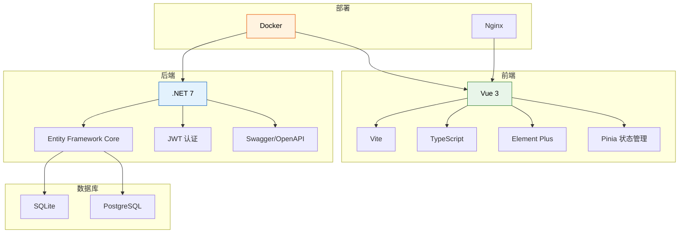
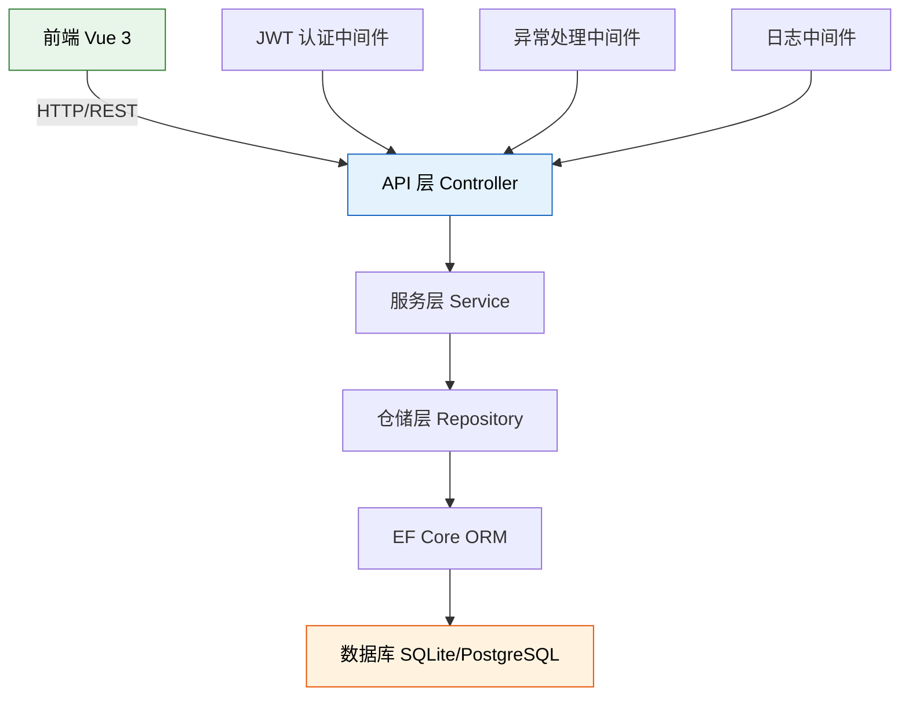
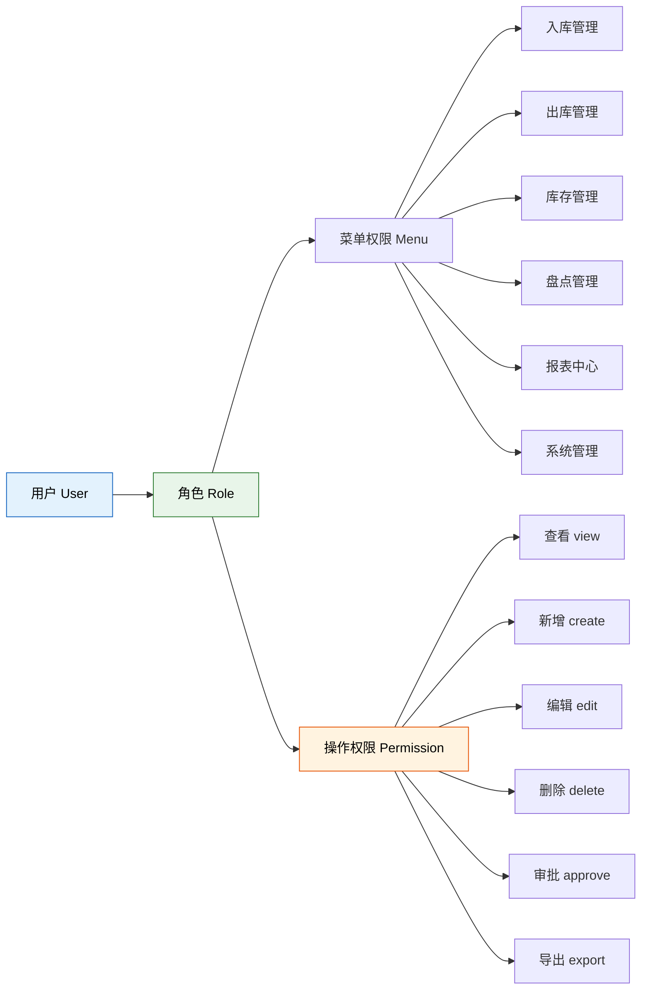
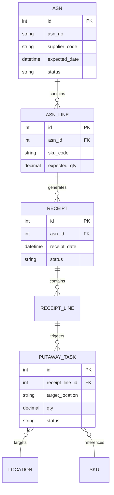

# ModernWMS 深度解析

> ModernWMS 脱胎于多年 ERP 实施经验，将仓储管理功能从 ERP 中剥离出来独立开源。它以"开箱即用"为目标，用 .NET 7 + Vue 3 构建了一套跨平台、功能完整的 WMS 系统，是中小制造企业和电商仓库的低成本入门选择。

## 一、项目介绍

### 项目背景

ModernWMS 诞生于一个真实的业务痛点：很多中小型制造企业在 ERP 实施过程中，发现仓储管理模块要么功能不足（满足不了精细化管控需求），要么过于笨重（与 ERP 强耦合，升级困难）。项目团队在服务了数十家制造企业后，决定将沉淀的 WMS 能力独立出来，以开源形式发布。

### 项目数据

| 指标 | 数据 |
|------|------|
| GitHub 地址 | https://github.com/fjykTec/ModernWMS |
| Stars | 1.5k+ |
| 开源协议 | MIT（商用友好） |
| 首次发布 | 2022 年 |
| 主要语言 | C# / TypeScript |
| 维护状态 | 活跃（持续更新） |

### 核心设计理念

| 理念 | 体现 |
|------|------|
| 开箱即用 | Docker 一键部署，默认配置即可运行 |
| 跨平台 | .NET 7 原生支持 Windows/Linux/macOS |
| 轻量级 | SQLite 可用，无需强制部署大型数据库 |
| 可扩展 | 模块化设计，支持自定义插件 |
| 国际化 | 内置多语言支持 |

## 二、技术栈详解

### 前后端技术架构



### 技术选型理由

| 技术 | 选型理由 |
|------|---------|
| .NET 7 | 跨平台、高性能、强类型、生态成熟 |
| Vue 3 + Vite | 组合式 API、开发体验好、构建速度快 |
| EF Core | .NET 生态最成熟的 ORM，支持多数据库切换 |
| SQLite | 零配置、文件级数据库、适合小规模部署和开发测试 |
| PostgreSQL | 企业级关系数据库、JSON 支持、扩展性强 |
| JWT | 无状态认证、适合前后端分离架构 |
| Docker | 标准化部署、环境一致、运维简单 |

## 三、项目结构分析

### 后端项目结构

```
ModernWMS/
├── src/
│   ├── ModernWMS.Core/          # 核心类库
│   │   ├── Controllers/         # 基础控制器
│   │   ├── Services/            # 基础服务
│   │   ├── Repositories/        # 仓储层
│   │   └── Models/              # 基础模型
│   │
│   ├── ModernWMS.WMS/           # WMS业务模块
│   │   ├── Controllers/         # 业务控制器
│   │   │   ├── InboundController.cs
│   │   │   ├── OutboundController.cs
│   │   │   ├── InventoryController.cs
│   │   │   ├── StocktakeController.cs
│   │   │   └── ReportController.cs
│   │   ├── Services/            # 业务服务
│   │   ├── Entities/            # 数据实体
│   │   ├── DTOs/                # 数据传输对象
│   │   └── Mappings/            # 对象映射
│   │
│   └── ModernWMS.Host/          # 启动项目
│       ├── Program.cs
│       ├── appsettings.json
│       └── Dockerfile
│
├── tests/                        # 单元测试
└── docs/                         # 文档
```

### 前端项目结构

```
modernwms-frontend/
├── src/
│   ├── api/                     # API 请求封装
│   ├── views/                   # 页面组件
│   │   ├── inbound/             # 入库管理
│   │   ├── outbound/            # 出库管理
│   │   ├── inventory/           # 库存管理
│   │   ├── stocktake/           # 盘点管理
│   │   ├── report/              # 报表中心
│   │   └── system/              # 系统管理
│   ├── components/              # 通用组件
│   ├── router/                  # 路由配置
│   ├── store/                   # 状态管理
│   ├── utils/                   # 工具函数
│   └── i18n/                    # 国际化
├── public/
└── package.json
```

### 分层架构



## 四、权限体系设计

ModernWMS 采用经典的 RBAC（基于角色的访问控制）模型，实现了三级权限控制：

### 角色→菜单→操作三级权限



### 预置角色

| 角色 | 菜单范围 | 操作范围 |
|------|---------|---------|
| 超级管理员 | 全部菜单 | 全部操作 |
| 仓库经理 | 全部业务菜单 | 查看/新增/编辑/审批/导出 |
| 仓管员 | 入库/出库/库存/盘点 | 查看/新增/编辑 |
| 拣货员 | 出库（拣货页面） | 查看/编辑 |
| 查看者 | 全部菜单（只读） | 查看/导出 |

### 权限校验流程

```
1. 用户登录 → JWT Token 签发（含角色信息）
2. 前端路由守卫 → 根据 token 中的角色渲染可见菜单
3. API 请求 → 携带 token 到后端
4. 后端中间件 → 解析 token，获取角色
5. 权限过滤器 → 校验角色是否有该 API 的操作权限
6. 有权限 → 放行；无权限 → 返回 403
```

## 五、核心功能模块

### 功能全景

| 模块 | 子功能 | 完成度 |
|------|-------|-------|
| **入库管理** | ASN 收货通知、收货、质检、上架 | 完整 |
| **出库管理** | 出库订单、波次分配、拣货、复核、发货 | 完整 |
| **库存管理** | 实时库存、库存冻结、库存转移 | 完整 |
| **盘点管理** | 盘点计划、盘点执行、差异处理 | 完整 |
| **报表中心** | 出入库报表、库存报表、作业效率报表 | 基础 |
| **系统管理** | 用户、角色、权限、字典、日志 | 完整 |

### 入库流程数据模型



## 六、API 设计分析

### RESTful API 规范

ModernWMS 的 API 遵循 RESTful 设计规范：

| 操作 | HTTP 方法 | URL 示例 | 说明 |
|------|----------|---------|------|
| 查询列表 | GET | `/api/v1/inbound/asn` | 支持分页、筛选 |
| 查询详情 | GET | `/api/v1/inbound/asn/{id}` | 返回单条记录 |
| 创建 | POST | `/api/v1/inbound/asn` | 创建新记录 |
| 更新 | PUT | `/api/v1/inbound/asn/{id}` | 全量更新 |
| 删除 | DELETE | `/api/v1/inbound/asn/{id}` | 逻辑删除 |
| 审批 | POST | `/api/v1/inbound/asn/{id}/approve` | 业务动作 |
| 导出 | GET | `/api/v1/inbound/asn/export` | 下载 Excel |

### 统一响应格式

```json
{
  "code": 200,
  "message": "success",
  "data": {
    "items": [...],
    "totalCount": 100,
    "pageIndex": 1,
    "pageSize": 20
  }
}
```

### 异常响应格式

```json
{
  "code": 400,
  "message": "Validation failed",
  "errors": [
    {
      "field": "expected_qty",
      "message": "Expected quantity must be greater than 0"
    }
  ]
}
```

## 七、Docker 部署实践

### docker-compose.yml

```yaml
version: '3.8'
services:
  wms-api:
    image: modernwms/api:latest
    ports:
      - "8080:8080"
    environment:
      - ASPNETCORE_ENVIRONMENT=Production
      - ConnectionStrings__Default=Host=postgres;Database=wms;Username=wms;Password=wms123
      - Jwt__Secret=your-secret-key-at-least-32-characters
      - Jwt__Issuer=ModernWMS
      - Jwt__Audience=ModernWMS
    depends_on:
      - postgres
    restart: always

  wms-web:
    image: modernwms/web:latest
    ports:
      - "80:80"
    depends_on:
      - wms-api
    restart: always

  postgres:
    image: postgres:15
    environment:
      - POSTGRES_DB=wms
      - POSTGRES_USER=wms
      - POSTGRES_PASSWORD=wms123
    volumes:
      - pgdata:/var/lib/postgresql/data
    restart: always

volumes:
  pgdata:
```

### 部署步骤

```
1. 克隆项目
   git clone https://github.com/fjykTec/ModernWMS.git

2. 进入部署目录
   cd ModernWMS/deploy

3. 修改配置
   编辑 docker-compose.yml 中的数据库密码和 JWT 密钥

4. 一键启动
   docker-compose up -d

5. 验证服务
   访问 http://localhost 进入前端
   访问 http://localhost:8080/swagger 查看 API 文档

6. 初始化数据
   使用默认管理员账号登录（admin/admin123）
   首次登录后立即修改密码
```

## 八、适用场景分析

### 适合 ModernWMS 的场景

| 场景 | 匹配度 | 原因 |
|------|-------|------|
| 中小型制造企业 | 高 | 功能完整、部署简单、成本低 |
| 电商仓库（< 5000 单/天） | 高 | 入库/出库/库存管理齐全 |
| 3PL 第三方物流（小型） | 中 | 缺少多货主支持，需二次开发 |
| 冷链仓库 | 中 | 缺少温控模块，需扩展 |
| 大型自动化仓库 | 低 | 无 AGV/WCS 集成，无复杂路径优化 |

### 不适合的场景

| 场景 | 原因 | 替代方案 |
|------|------|---------|
| 日订单 > 50000 | 性能瓶颈 | GreaterWMS / 商业 WMS |
| 多仓多货主 | 架构不支持 | GreaterWMS |
| 高度自动化仓库 | 无设备集成 | 商业 WMS + WCS |
| 严格 GMP 合规 | 缺少验证功能 | 行业专用 WMS |

## 九、二次开发指南

### 开发环境搭建

| 工具 | 版本 | 用途 |
|------|------|------|
| .NET SDK | 7.0+ | 后端开发 |
| Node.js | 18+ | 前端开发 |
| VS Code / Rider | 最新 | IDE |
| Docker Desktop | 最新 | 本地数据库 |

### 新增业务模块步骤

```
1. 后端：在 ModernWMS.WMS 中新增
   - Entities/NewEntity.cs       → 数据实体
   - DTOs/NewDto.cs              → 数据传输对象
   - Mappings/NewMapping.cs      → 对象映射配置
   - Repositories/NewRepo.cs     → 数据访问层
   - Services/NewService.cs      → 业务逻辑层
   - Controllers/NewController.cs → API 控制器

2. 前端：在 src/ 中新增
   - api/new-module.ts           → API 请求封装
   - views/new-module/           → 页面组件
   - router/modules/new-module.ts → 路由注册

3. 数据库迁移
   dotnet ef migrations add AddNewModule
   dotnet ef database update

4. 权限配置
   在系统管理中添加新菜单和操作权限
```

### 二次开发注意事项

| 事项 | 建议 |
|------|------|
| 不要修改核心层代码 | 继承或扩展，而非修改 |
| 保持 API 版本兼容 | 新增 v2 端点，不破坏 v1 |
| 数据库变更走迁移 | 使用 EF Core Migration |
| 遵循代码规范 | 与现有代码风格保持一致 |
| 编写单元测试 | 新增 Service 必须有对应测试 |
| 贡献回社区 | 通用功能可提交 PR |

> **总结**：ModernWMS 的核心价值在于"轻量级但功能完整"——它不是功能最丰富的开源 WMS，但在中小型场景中提供了最佳的投入产出比。MIT 协议允许商业使用和修改，使其成为学习和定制的优秀起点。
