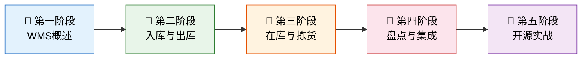

# WMS 仓储管理系统

> 如果说 ERP 是企业的"大脑"，WMS 就是仓库的"神经末梢"——它精准感知每一件货物的位置、状态与流向，让库存从"一笔糊涂账"变成"一张透明网"。

## 课程概述

WMS（Warehouse Management System，仓储管理系统）是制造与物流企业供应链中的关键执行系统。它向下连接条码/RFID 等数据采集设备，向上对接 ERP 的采购/销售订单，横向与 MES 协同物料流转，实现从收货到发货的全流程精细化管控。

本课程从 WMS 的核心概念出发，逐模块拆解入库、出库、在库、拣货、盘点等关键业务，最后落地到开源项目实战与生产级部署指南。

## 参考项目

| 项目 | 技术栈 | Stars | 特点 |
|------|--------|-------|------|
| [ModernWMS](https://github.com/fjykTec/ModernWMS) | .NET 7 + Vue 3 | 1.5k | 脱胎于 ERP 实施，跨平台，功能完整 |
| [GreaterWMS](https://github.com/GreaterWMS/GreaterWMS) | Django + Vue 3 | 4.3k | 源自福特亚太售后物流，企业级 |
| [kopSoftWMS](https://github.com/kopSoft/kopSoftWMS) | .NET 6 + Vue 2 | 800+ | 轻量级，适合中小仓库 |

## 学习路线

## 章节目录

### [WMS系统概述](01_WMS系统概述/README.md)

| 文章 | 核心内容 |
|------|---------|
| [WMS是什么](01_WMS系统概述/01_WMS是什么.md) | 定义、发展历程、与ERP/MES的关系 |
| [核心概念与数据模型](01_WMS系统概述/02_核心概念与数据模型.md) | 仓库/库区/库位、物料主数据、批次与序列号 |
| [WMS整体架构](01_WMS系统概述/03_WMS整体架构.md) | 技术架构、部署模式、集成拓扑 |

### [入库管理](02_入库管理/README.md)

| 文章 | 核心内容 |
|------|---------|
| [入库流程全解析](02_入库管理/01_入库流程全解析.md) | 收货、质检、上架全流程与异常处理 |
| [智能上架策略](02_入库管理/02_智能上架策略.md) | 储位推荐算法、ABC分类、动线优化 |

### [出库管理](03_出库管理/README.md)

| 文章 | 核心内容 |
|------|---------|
| [出库流程全解析](03_出库管理/01_出库流程全解析.md) | 订单接收、分配、拣货、复核、发货 |
| [波次策略与订单分配](03_出库管理/02_波次策略与订单分配.md) | 波次规则、订单拆合、优先级调度 |

### [在库管理](04_在库管理/README.md)

| 文章 | 核心内容 |
|------|---------|
| [库存管理核心](04_在库管理/01_库存管理核心.md) | 实时库存、FIFO/LIFO、安全库存、预警机制 |
| [批次与效期管理](04_在库管理/02_批次与效期管理.md) | 批次追溯、效期控制、先到期先出（FEFO） |

### [波次与拣货策略](05_波次与拣货策略/README.md)

| 文章 | 核心内容 |
|------|---------|
| [拣货模式详解](05_波次与拣货策略/01_拣货模式详解.md) | 摘果式、播种式、分区拣选、路径优化 |
| [波次规划实战](05_波次与拣货策略/02_波次规划实战.md) | 时间窗口、客户分组、运输线路聚合 |

### [盘点与调拨](06_盘点与调拨/README.md)

| 文章 | 核心内容 |
|------|---------|
| [盘点策略与执行](06_盘点与调拨/01_盘点策略与执行.md) | 循环盘点、盲盘、差异分析与处理 |
| [调拨与移库](06_盘点与调拨/02_调拨与移库.md) | 跨仓调拨、内部移库、审批流程 |

### [系统集成与落地](07_系统集成与落地/README.md)

| 文章 | 核心内容 |
|------|---------|
| [WMS与ERP/MES集成](07_系统集成与落地/01_WMS与ERP-MES集成.md) | 接口设计、数据同步策略、异常恢复 |
| [生产级落地指南](07_系统集成与落地/02_生产级落地指南.md) | 选型评估、实施步骤、数据迁移、培训推广 |

### [开源项目解析](08_开源项目解析/README.md)

| 文章 | 核心内容 |
|------|---------|
| [ModernWMS深度解析](08_开源项目解析/01_ModernWMS深度解析.md) | 架构设计、权限体系、功能模块、部署实践 |
| [GreaterWMS深度解析](08_开源项目解析/02_GreaterWMS深度解析.md) | Django架构、API设计、与福特物流的渊源 |
