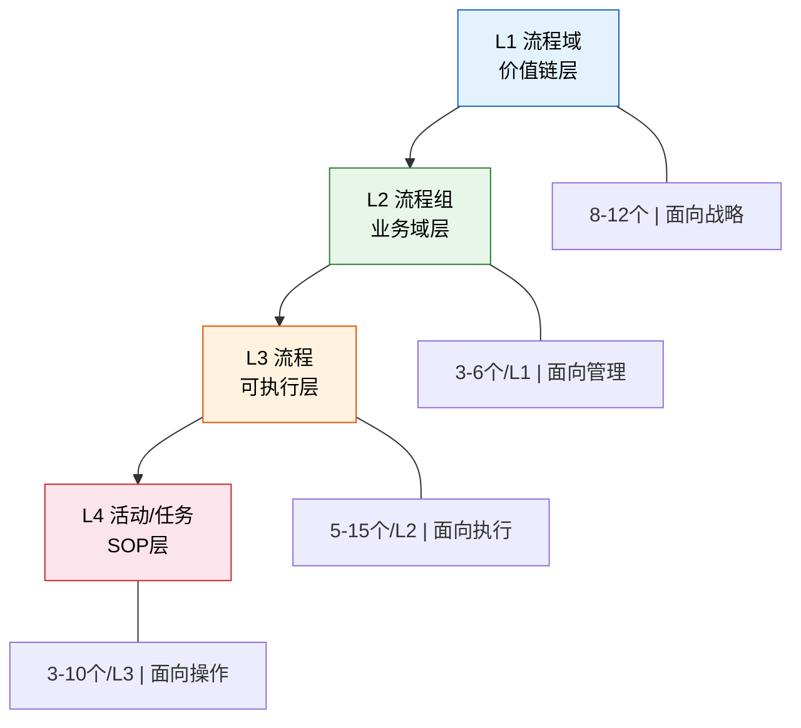
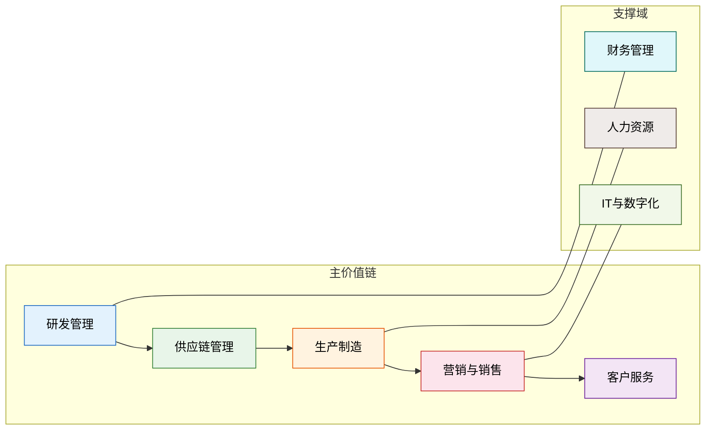
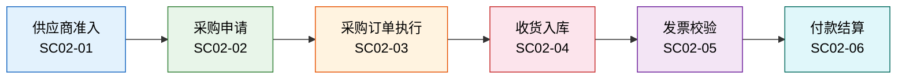
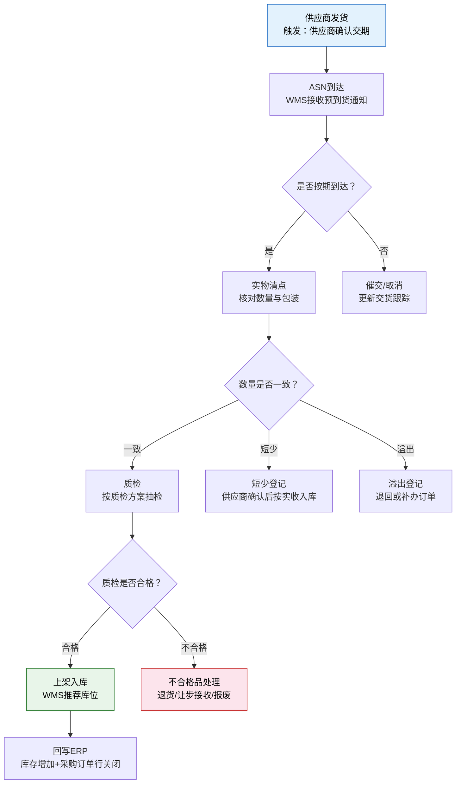
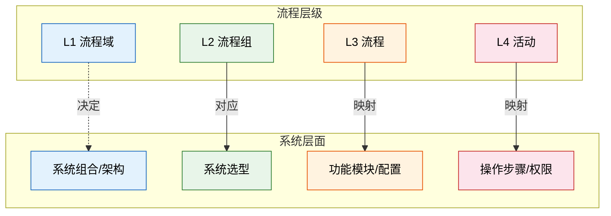

# L1-L4 流程体系

> 没有分层的流程管理就是"一锅粥"——领导问"采购流程怎么走的"，5 个人给出 5 个版本，因为每个人说的都不是同一层。

## 一、为什么需要流程分层

### 1.1 没有分层的典型混乱

先看一个真实场景：

> 某制造企业总经理在经营会上问："采购流程怎么走的？"
>
> - 供应链总监说："采购执行、供应商管理、付款结算"（L2 层面）
> - 采购经理说："先提申请，再比价，再下订单"（L3 层面）
> - 采购员说："我在系统里填个申请单，领导批了就下单"（L4 层面）
> - 财务经理说："采购要经过五级审批"（制度层面，和实际操作无关）
> - IT 经理说："我们 SRM 系统覆盖了从寻源到付款的全流程"（系统层面，但覆盖率和实际执行率是两回事）

五个人，五个层面，鸡同鸭讲。

### 1.2 分层的核心价值

| 价值 | 说明 |
|------|------|
| **统一语言** | L1-L4 让所有人知道自己在哪一层说话 |
| **分级管控** | 领导管 L1-L2，部门管 L3，执行层管 L4 |
| **系统对应** | L1-L4 可以映射到系统架构的边界与模块 |
| **差距定位** | 分层之后，才知道"断层"出在哪一层 |

流程分层的本质是**把一个混沌的"流程"概念拆解成不同粒度的管理对象**，让每一层都有明确的定义、责任人和产出物。

## 二、L1-L4 四级体系详解

### 2.1 四级体系总览

### 2.2 各层级详解

| 层级 | 定义 | 粒度 | 典型责任人 | 示例 | 文档载体 |
|------|------|------|-----------|------|---------|
| **L1 流程域** | 企业价值链的一级划分，对应战略能力域 | 8-12 个 | VP/总监 | 供应链、营销、财务、研发 | 价值链地图 |
| **L2 流程组** | L1 下的业务域分组，对应管理职能 | 每个 L1 下 3-6 个 | 部门经理 | 采购执行、订单履约、产品开发 | 流程清单 |
| **L3 流程** | 可执行的业务流程，有明确的触发条件、输入输出 | 每个 L2 下 5-15 个 | 流程所有者 | 供应商准入、采购申请审批、收货入库 | 流程图+说明 |
| **L4 活动/任务** | 流程中的原子操作步骤，SOP 级别 | 每个 L3 下 3-10 个 | 岗位员工 | 填写申请单、上传报价单、确认收货 | SOP 文档 |

### 2.3 L1 流程域：价值链层

L1 来源于 APQC（American Productivity & Quality Center）的流程分类框架，将企业活动按价值链维度分为 8-12 个一级域。

典型制造企业的 8 大 L1 流程域：

**L1 的关键特征**：

- 面向战略，不做执行
- 数量有限（8-12 个），稳定度高，很少变化
- 不对应单个系统，而是跨系统的能力域
- 典型误区：把 L1 做成部门映射（L1 应该是能力域，不是组织架构）

### 2.4 L2 流程组：业务域层

L2 是 L1 的细分，对应可管理的业务域。每个 L1 下通常拆分 3-6 个 L2。

以"供应链管理"（L1）为例：

| L2 编号 | L2 名称 | 核心职责 | 对应系统 |
|---------|---------|---------|---------|
| SC-01 | 需求与供应计划 | 预测、S&OP、主计划 | ERP/MRP |
| SC-02 | 采购执行 | 寻源、下单、收货、付款 | SRM/ERP |
| SC-03 | 仓储与物流 | 入库、出库、盘点、运输 | WMS/TMS |
| SC-04 | 供应商管理 | 准入、评估、协同 | SRM |

L2 是**系统选型的重要边界**——一个 L2 通常对应一个或一组系统。比如"采购执行"对应 SRM，"仓储与物流"对应 WMS。

### 2.5 L3 流程：可执行层

L3 是流程管理的核心层级，是"可执行"的业务流程。它有以下特征：

- 有明确的**触发条件**（如：采购需求产生、销售订单确认）
- 有明确的**输入和输出**（输入：采购申请单；输出：采购订单）
- 有明确的**角色和职责**（谁发起、谁审批、谁执行）
- 可以被**系统功能覆盖**（L3 通常对应系统中的某个功能模块）

L3 示例（以"采购执行"L2 为例）：

| L3 编号 | L3 名称 | 触发条件 | 输入 | 输出 |
|---------|---------|---------|------|------|
| SC02-01 | 供应商准入 | 新供应商引入需求 | 供应商基本信息 | 合格供应商名录更新 |
| SC02-02 | 采购申请 | 需求部门提出采购需求 | 采购需求单 | 已审批的采购申请 |
| SC02-03 | 采购订单执行 | 采购申请审批通过 | 已审批的采购申请 | 已确认的采购订单 |
| SC02-04 | 收货入库 | 供应商发货到达 | 采购订单/ASN | 入库单 |
| SC02-05 | 发票校验 | 收到供应商发票 | 入库单、采购订单、发票 | 校验通过/差异报告 |
| SC02-06 | 付款结算 | 发票校验通过 | 校验通过的发票 | 付款凭证 |

### 2.6 L4 活动/任务：SOP 层

L4 是流程的最细粒度，对应具体的操作步骤，也就是 SOP（Standard Operating Procedure）级别。

以 L3"采购申请审批"为例，拆解为 L4：

| L4 编号 | 活动名称 | 执行角色 | 系统操作 | 产出 |
|---------|---------|---------|---------|------|
| SC02-02-01 | 填写采购申请单 | 需求岗 | ERP：创建采购申请 | 采购申请草稿 |
| SC02-02-02 | 上传比价资料 | 采购岗 | SRM：录入报价 | 比价记录 |
| SC02-02-03 | 部门经理审批 | 部门经理 | ERP：审批操作 | 审批意见 |
| SC02-02-04 | 采购部门审核 | 采购经理 | ERP：审批操作 | 审批意见 |
| SC02-02-05 | 财务预算校验 | 财务岗 | ERP：预算检查 | 预算校验结果 |

L4 的关键特征：

- 每个活动有**明确的系统操作**（点击哪个按钮、填写哪个字段）
- 是**培训手册**的编写单元
- 是**系统权限配置**的依据
- 变化频率最高，需要持续迭代

## 三、典型 L2-L4 分解示例：采购到付款（P2P）

Procure-to-Pay（P2P）是制造企业最核心的端到端流程之一，从采购需求产生到最终付款完成。

### 3.1 P2P 流程全景

### 3.2 逐级分解

| L2 | L3 | L4 关键活动 | 核心系统 |
|----|-----|------------|---------|
| **采购执行** | 供应商准入 | 资质收集→现场评审→纳入合格名录→年度复评 | SRM |
| | 采购申请 | 需求提报→比价/询价→审批→生成申请 | ERP |
| | 采购订单执行 | 申请转订单→供应商确认→交货跟踪→变更管理 | ERP/SRM |
| | 收货入库 | ASN接收→实物清点→质检→上架→回写ERP | WMS/ERP |
| | 发票校验 | 三单匹配（订单+入库单+发票）→差异处理→过账 | ERP |
| | 付款结算 | 付款计划→审批→银行支付→凭证生成 | ERP/资金系统 |

### 3.3 L3"L3-收货入库"的详细流程

以"收货入库"这个 L3 为例，展开详细流程：

这个流程图体现了 L3 的典型特征：有触发条件、有正常路径、有异常分支、有明确输出。

## 四、国内企业现状：L1-L2 有定义，L3-L4 靠人补

### 4.1 现实对照表

| 层级 | 应该做到 | 实际现状 | 典型问题 |
|------|---------|---------|---------|
| L1 流程域 | 8-12 个价值链域，覆盖全业务 | 大部分企业有，但定义模糊 | 把"采购"和"供应链"混为一谈 |
| L2 流程组 | 每个 L1 下 3-6 个，边界清晰 | 通常有，但命名不规范 | "采购管理"和"采购执行"傻傻分不清 |
| L3 流程 | 端到端流程图 + 输入输出 + 角色职责 | 部分有，但过时、不全、没人看 | 流程图是 3 年前画的，实际操作早就变了 |
| L4 活动 | 每个岗位的 SOP | 基本没有，靠师傅带徒弟 | 老员工离职，新人两眼一抹黑 |

### 4.2 "流程在纸上"的三重现象

| 现象 | 描述 | 典型案例 |
|------|------|---------|
| **制度写的是 A** | ISO 文件、管理制度、内控手册里定义的流程 | 采购审批五级，每一级有明确的审批条件 |
| **实际走的是 B** | 员工的日常操作方式 | 先微信问领导"批一下"，执行完再补走系统 |
| **系统里是 C** | 系统实际支持的业务逻辑 | 系统里只有三级审批，因为上线时"简化"了 |

这三套之间的偏差，就是下一章《纸面流程与系统流程的断层》要讨论的核心问题。

### 4.3 L3-L4 为什么总是缺失

| 原因 | 说明 |
|------|------|
| **领导不关注** | L1-L2 是"战略"，L3-L4 是"细节"，领导不签字就不做 |
| **没人愿意写** | L3-L4 需要深入业务，写的人要懂操作，但懂操作的人没时间写 |
| **写了也没人用** | 流程文件放进 SharePoint/钉盘，从此无人问津 |
| **业务变化快** | 等 SOP 写完，业务又变了，索性不写 |
| **缺乏工具** | 用 Word/Visio 画流程图，更新成本高，版本管理混乱 |

## 五、流程分层与系统建设的对应关系

### 5.1 L1-L4 到系统层的映射

| 流程层级 | 系统对应 | 说明 | 示例 |
|---------|---------|------|------|
| L1 流程域 | 无直接系统对应 | 战略层，决定系统组合 | "供应链管理"= ERP + WMS + SRM + TMS |
| L2 流程组 | 系统选型边界 | 一个 L2 通常对应一个系统 | "仓储与物流"→ WMS |
| L3 流程 | 系统功能模块 | L3 对应系统中的可配置流程 | "收货入库"→ WMS 入库模块 |
| L4 活动 | 系统操作步骤 | L4 对应按钮级操作 | "确认收货"→ WMS 点击收货确认 |

### 5.2 映射关系图

### 5.3 为什么这个映射很重要

| 场景 | 不做分层映射的后果 | 做了分层映射的好处 |
|------|-------------------|-------------------|
| **系统选型** | "我们要上一套 ERP"——太笼统，选型无法对齐业务 | L2 清晰后，每个 L2 对应一个系统，选型有依据 |
| **需求分析** | "采购模块要支持所有流程"——范围无限膨胀 | L3 明确后，需求边界清晰，不会漏也不会溢 |
| **系统配置** | "审批流就按制度来"——制度和系统对不上 | L3-L4 映射后，系统配置有据可依 |
| **用户培训** | 培训材料按功能模块组织，和用户的工作场景脱节 | L4 对应操作步骤，培训就是"你做这件事，点这里" |

## 六、从哪里开始：务实建议

### 6.1 不要试图一步到位

| 错误做法 | 正确做法 |
|---------|---------|
| 成立一个"流程梳理项目组"，花 6 个月梳理所有 L1-L4 | 先梳理 2-3 条核心端到端流程，快速验证方法 |
| 追求"全公司统一模板"再开始 | 选一个部门试点，模板在迭代中成熟 |
| 请咨询公司做一套完整的流程手册 | 咨询可以辅助，但流程必须由业务部门自己梳理 |

### 6.2 从核心业务链开始

选择梳理优先级的依据是**业务影响度**和**系统建设紧迫性**的交集：

| 端到端流程 | 业务影响度 | 系统紧迫性 | 建议优先级 |
|-----------|-----------|-----------|-----------|
| **订单到收款（O2C）** | 高——直接影响营收 | 高——销售/财务系统对接 | ⭐⭐⭐ 第一批 |
| **采购到付款（P2P）** | 高——直接影响成本 | 高——SRM/ERP 采购模块 | ⭐⭐⭐ 第一批 |
| **计划到生产（P2M）** | 高——直接影响交付 | 中——MES/APS | ⭐⭐ 第二批 |
| **概念到上市（C2M）** | 中——影响创新效率 | 中——PLM | ⭐ 第二批 |
| **问题到解决（I2R）** | 中——影响质量 | 低——QMS | ⭐ 第三批 |

### 6.3 用流程挖掘发现真实流程

不要问员工"你的流程是什么"——员工描述的是"应该怎么做"，不是"实际怎么做"。流程挖掘（Process Mining）工具可以从系统日志中还原真实的流程路径：

| 工具 | 特点 | 适用场景 |
|------|------|---------|
| Celonis | 市场领导者，功能最强 | SAP 环境，大型企业 |
| Apromore | 开源，学术背景 | 预算有限，研究探索 |
| Fluxicon Disco | 桌面端，轻量 | 小规模分析，快速上手 |

**流程挖掘的价值**：你以为是线性的审批流，实际数据告诉你，60% 的申请被退回过、平均审批耗时是制度规定的 3 倍、有 15% 的订单跳过了某个审批节点——这些信息靠访谈是问不出来的。

### 6.4 80/20 法则

| 原则 | 说明 |
|------|------|
| **先标准化 80% 的主路径** | 每条 L3 流程，先定义"正常情况"怎么走 |
| **异常分支后续补充** | 每条正常路径对应 3-5 条异常分支，先记录，后标准化 |
| **不要追求 100% 覆盖** | 最后 20% 的长尾场景，投入产出比极低，用"例外管理"兜底 |
| **持续迭代** | 流程管理不是一次性项目，是持续运营 |

### 6.5 实操清单

梳理一条 L3 流程时，确保以下信息完整：

| 要素 | 说明 | 示例 |
|------|------|------|
| 流程名称 | 简洁、动词开头 | 采购申请审批 |
| 触发条件 | 什么情况下启动 | 需求部门提出采购需求 |
| 输入 | 需要什么信息/单据 | 采购需求单（含物料、数量、需求日期） |
| 输出 | 产出什么 | 已审批的采购申请 |
| 角色 | 谁参与，各做什么 | 需求岗→采购岗→部门经理→采购经理 |
| 正常路径 | 主流程步骤 | 提出→比价→审批→生效 |
| 异常分支 | 常见例外 | 审批驳回、预算不足、供应商变更 |
| 系统支撑 | 哪个系统支持哪个步骤 | ERP 审批流、SRM 比价 |
| 性能指标 | 怎么衡量这个流程好不好 | 审批平均耗时、驳回率 |

## 小结

| 概念 | 一句话理解 |
|------|-----------|
| L1 流程域 | 企业价值链的一级划分，8-12 个，稳定少变 |
| L2 流程组 | L1 的细分，3-6 个/L1，系统选型的边界 |
| L3 流程 | 可执行的端到端流程，有明确输入输出，系统功能模块的对应 |
| L4 活动 | SOP 级别的操作步骤，按钮级操作，培训手册的单元 |
| 现实差距 | L1-L2 有定义，L3-L4 靠人补，三套流程各说各话 |
| 系统映射 | L2→系统边界，L3→功能模块，L4→操作步骤 |
| 务实路径 | 从 O2C/P2P 核心链开始，80% 主路径先行，流程挖掘验证 |
