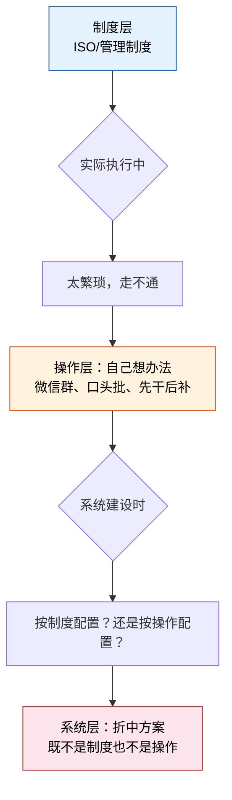
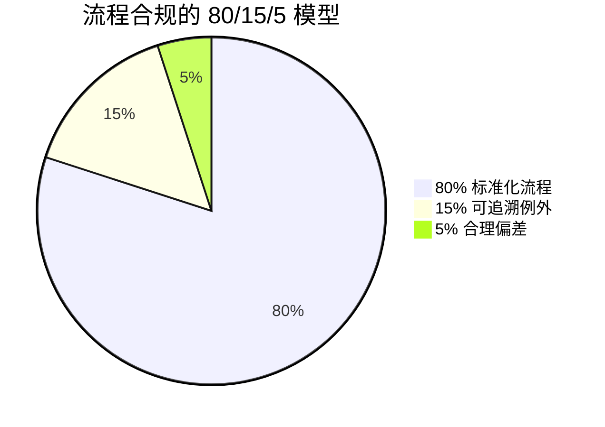

# 纸面流程与系统流程的断层

> 制度写的是"应该怎么做"，操作走的是"实际怎么做"，系统跑的是"能怎么做"——三者之间的缝隙，就是企业数字化转型最痛的地方。

## 一、三层脱节现象

### 1.1 三个层面，三种逻辑

在大多数国内企业中，一个业务流程实际上存在三套描述：

| 层面 | 核心问题 | 典型载体 | 更新频率 | 与其他层的一致性 |
|------|---------|---------|---------|----------------|
| **制度层** | 应该怎么做？ | ISO 文件、管理制度、内控手册、审批权限表 | 1-3 年更新一次 | 与操作层差异大，与系统层差异更大 |
| **操作层** | 实际怎么做？ | 人的经验、微信群、口头沟通、Excel 表、纸质单据 | 随时在变（但没人记录变化） | 是真实的，但不可见、不可控 |
| **系统层** | 系统能怎么做？ | 系统配置的审批流、字段校验规则、功能模块 | 系统上线后很少调整 | 是三者中最固化的，也是离现实最远的 |

**核心矛盾**：制度追求"合规"，操作追求"效率"，系统追求"稳定"——三者的目标天然不一致。

### 1.2 断层是怎么产生的

这个循环的关键洞察是：**断层不是系统上线后才出现的，而是系统上线前就已经存在——系统只是把断层显性化了**。

### 1.3 三层不一致的代价

| 代价 | 说明 | 典型后果 |
|------|------|---------|
| **审计风险** | 制度和实际不一致，审计一查就出问题 | 外审开具管理建议书，甚至出具保留意见 |
| **效率损耗** | 为了"合规"而走系统，为了"效率"而走线下，两套并行 | 员工怨声载道，"走系统是走形式" |
| **数据失真** | 系统里的数据是事后补录的，不能反映真实业务 | 经营分析基于错误数据，决策偏航 |
| **知识流失** | 真正的流程在人的脑子里，不在系统里 | 关键员工离职，业务运转停摆 |
| **系统废弃** | 系统和实际操作对不上，用户绕过系统 | 系统上线后使用率持续下降，最终沦为"录入工具" |

## 二、典型案例分析

### 案例 1：采购审批的"三套流程"

#### 制度怎么写的

按照公司《采购管理制度》：

> 采购申请需经过五级审批：申请人 → 部门经理 → 采购部门 → 财务部 → 总经理

每一级有明确的审批条件和金额阈值。

#### 实际怎么走的

> 需求来了，先在微信群里问领导"这个能不能买"，领导回个"OK"，采购就去执行了。等货到了，再在系统里补走审批流程——而且通常只走三级（省去了部门经理和总经理），因为系统上线时"流程简化"了。

#### 系统怎么配的

> 系统里只有三级审批流。原因是上线时业务部门说"五级太慢了，我们日常走三级就行"。但制度没改，还是写的五级。

**三轨分叉图**：

```mermaid
flowchart TB
    subgraph 制度层["📄 制度定义"]
        A1["申请"] --> A2["部门经理审批"]
        A2 --> A3["采购部门审批"]
        A3 --> A4["财务审批"]
        A4 --> A5["总经理审批"]
        A5 --> A6["执行"]
    end

    subgraph 操作层["💬 实际操作"]
        B1["微信请示"] --> B2["口头批准"]
        B2 --> B3["先执行"]
        B3 --> B4["事后补单"]
    end

    subgraph 系统层["💻 系统配置"]
        C1["申请"] --> C2["采购审批"]
        C2 --> C3["财务审批"]
        C3 --> C4["执行"]
    end

    style 制度层 fill:#e3f2fd,stroke:#1565c0,color:#000
    style 操作层 fill:#fff3e0,stroke:#e65100,color:#000
    style 系统层 fill:#fce4ec,stroke:#c62828,color:#000
```

**后果**：

- 审计时发现：制度规定五级，系统记录三级，微信记录是零级——三套对不上
- 实际审批周期：制度规定 5 个工作日，实际 0.5 天（因为微信秒批），但补单走系统要 2 天
- 风险：先执行后审批，如果出了问题（比如供应商跑路），无人负责

---

### 案例 2：质量异常处理

#### 制度怎么写的

按照《不合格品控制程序》：

> 发现异常 → 隔离标识 → 8D 分析 → CAPA（纠正预防措施）→ 验证闭环

每一步有表单、有记录、有责任人。

#### 实际怎么走的

> 车间发现来料不良，车间主任看了一眼说"这个能用，挑一下就行"，然后工人挑着用了。不记录、不隔离、不分析——因为停产一天的损失比不良品的损失大得多。

#### 系统怎么配的

> QMS 系统里只有最终检验结果的录入，过程完全不在系统。也就是说，系统只能告诉你"这批货最终合格率是多少"，但无法告诉你中间发生了什么异常、怎么处理的、有没有复发。

**对比分析**：

| 维度 | 制度定义 | 实际操作 | 系统记录 |
|------|---------|---------|---------|
| 发现异常 | 停线、隔离、标识 | 继续生产，口头通知 | 无记录 |
| 异常分析 | 8D 报告 | 车间主任口头判断 | 无记录 |
| 处置决策 | MRB 评审 | 让步接收/返工 | 无记录 |
| 纠正预防 | CAPA 跟踪 | 做了但不记录 | 无记录 |
| 最终结果 | 闭环验证 | 下次还出同样的问题 | 只有终检合格率 |

**核心问题**：制度设计者假设"质量第一"，实际决策者考虑的是"交付第一"——目标冲突导致流程被绕过。

---

### 案例 3：工程变更

#### 制度怎么写的

按照《工程变更管理程序》：

> ECR（变更申请）→ 评审 → ECO（变更指令）→ 执行 → 验证

每个环节有评审会议、签字、通知单。

#### 实际怎么走的

> 设计师在 CAD 里直接改了图，然后口头通知车间"这个尺寸改了"，车间就按新图做了。ECR？ECO？那都是事后补的——等品质部要审厂了，才想起来补一堆变更记录。

#### 系统怎么配的

> PLM 系统里有变更流程，但版本管理和生产系统（ERP 的 BOM）没有实时同步。经常出现 PLM 里图纸已经是 V3，但 ERP 里的 BOM 还是 V1 的情况。

**变更流程的三条轨道**：

| 步骤 | 制度要求 | 实际做法 | 系统状态 |
|------|---------|---------|---------|
| 变更发起 | 填写 ECR，说明原因和影响 | 设计师直接改图 | PLM 有记录，但不是通过 ECR 流程 |
| 变更评审 | 跨部门评审（采购/生产/品质） | 设计师自己决定 | 无记录 |
| 变更执行 | 发布 ECO，更新 BOM/工艺/图纸 | 口头通知车间 | ERP BOM 未更新 |
| 变更验证 | 首件检验，确认变更效果 | 做了但不记录 | 无记录 |
| 变更追溯 | 完整的变更历史 | 变更记录是事后补的 | 记录存在但不可信 |

### 三个案例的共同规律

| 规律 | 说明 |
|------|------|
| **制度总是偏理想** | 制度面向合规，假设所有步骤都会被严格执行 |
| **操作总是偏效率** | 操作面向交付，走最快的路径完成工作 |
| **系统总是偏折中** | 系统建设时各方妥协，最终既不像制度也不像操作 |
| **三方永远对不上** | 没有人定期把三者拉齐，差距只会越来越大 |

## 三、断层诊断清单

以下清单用于快速评估企业的流程断层程度。每项按 1-5 分打分，1 分最差，5 分最好：

| 诊断项 | 问题表现 | 严重程度 | 改进建议 |
|--------|---------|---------|---------|
| **流程文档更新频率** | 上次更新是 2 年前，业务已经变了 3 轮 | ⭐⭐ | 建立季度审核机制，每次业务变更必须同步更新 |
| **系统操作覆盖率** | 核心业务只有 60% 在系统里走，40% 仍在线下 | ⭐⭐ | 识别线下操作场景，逐个纳入系统 |
| **线下操作比例** | 审批 50% 走微信、物料管理 30% 靠 Excel | ⭐⭐⭐ | 线下操作是断层的根源，必须显性化 |
| **审批补签率** | 70% 的审批是事后补签的 | ⭐⭐⭐⭐ | 补签=先执行后审批，风控形同虚设 |
| **异常流程记录率** | 质量异常、交期异常只有 20% 有记录 | ⭐⭐⭐⭐ | 异常才是最需要记录的，正常流程出不了大问题 |
| **制度-系统一致性** | 制度写五级审批，系统配了三级 | ⭐⭐⭐ | 系统是制度的落地载体，不一致就必须改一边 |
| **流程所有者到位率** | 80% 的 L3 流程没有明确的流程所有者 | ⭐⭐⭐⭐ | 没有所有者=没有人对流程负责 |
| **SOP 可执行性** | SOP 是给审计看的，新员工按 SOP 做不了事 | ⭐⭐⭐⭐ | SOP 必须由操作者编写，不是由管理者编写 |

**评分解读**：

| 总分（8 项满分 40） | 断层程度 | 建议行动 |
|---------------------|---------|---------|
| 32-40 | 轻度 | 维持并持续优化 |
| 24-31 | 中度 | 需要专项治理，优先解决高风险项 |
| 16-23 | 重度 | 数字化转型的基础不牢，先治标再治本 |
| 8-15 | 极重度 | 系统建设先暂停，先理清流程 |

## 四、如何弥合断层

### 4.1 五步法

### Step 1：承认断层的存在

不要自欺欺人。很多企业的问题是**不愿意承认制度和实际之间的差距**——因为承认了就意味着要整改，整改就要花钱花时间。

| 常见回避方式 | 真实含义 |
|-------------|---------|
| "我们制度执行得很好" | 审计没查出问题≠没有问题 |
| "那些是特殊情况" | 特殊情况占比 30%，还叫特殊？ |
| "业务部门有自己的做法" | 制度没人遵守，但没人敢说 |
| "系统上线就好了" | 系统不会自动解决流程问题，只会放大问题 |

**关键原则**：先接受 As-Is（现状），再规划 To-Be（目标）。连现状都不敢正视，目标就是空中楼阁。

### Step 2：流程梳理从"现状"开始而非"应该"（As-Is before To-Be）

| 错误做法 | 正确做法 |
|---------|---------|
| 按制度文件梳理流程，发现和实际不一样就改实际 | 先记录实际怎么做的，再分析哪些需要改 |
| 请咨询公司按"最佳实践"画一套流程 | 最佳实践是目标，不是起点 |
| "我们先定义标准流程，再让业务遵守" | 业务不会遵守你定义的流程，只会遵守自己需要的流程 |

**As-Is 梳理方法**：

| 方法 | 适用场景 | 产出 |
|------|---------|------|
| 跟岗观察 | 一线操作流程 | 实际操作步骤、耗时、工具 |
| 系统日志分析 | 已上线的系统流程 | 真实审批路径、停留时间、跳过率 |
| 表单收集 | 跨部门协作流程 | 各部门实际使用的表单（经常和制度规定的不一样） |
| 流程挖掘 | 已有系统数据 | 自动还原真实流程，发现隐藏的变异 |

### Step 3：系统流程必须覆盖 80% 的 As-Is 场景

系统上线时最常见的错误是：**按制度配置系统，然后要求业务按系统操作**。正确做法是：**按 As-Is 配置系统，覆盖 80% 的真实场景，然后逐步引导业务向 To-Be 演进**。

| 场景比例 | 处理策略 |
|---------|---------|
| 80% 正常路径 | 系统必须覆盖，标准功能支持 |
| 15% 异常路径 | 系统支持但需配置（如：特殊审批流、例外处理） |
| 5% 极端例外 | 线下处理，但必须记录（如：紧急采购、灾备恢复） |

**为什么是 80% 而不是 100%**：追求 100% 会导致系统过度复杂，开发周期无限延长。剩下的 20% 用"例外管理"机制兜底——允许线下操作，但必须事后在系统中补录，确保可追溯。

### Step 4：异常流程显性化

每条正常流程对应 3-5 条异常分支。异常不是"错误"，是"变化"——业务永远在变，系统必须能够处理变化。

| 异常类型 | 示例 | 系统对策 |
|---------|------|---------|
| 数量异常 | 订单 100 件，实际到货 95 件 | 支持短交/超交容差配置 |
| 时间异常 | 紧急采购，来不及走完审批 | 紧急通道+事后补审 |
| 质量异常 | 来料不合格，需退货或让步接收 | 不合格品流程+让步审批 |
| 价格异常 | 市场价格波动，超出审批阈值 | 价格变更流程+加审机制 |
| 人员异常 | 审批人出差/请假 | 代审机制+代理规则 |

**关键原则**：异常流程必须**显性化**——在系统中有明确的路径，而不是绕过系统在线下处理。

### Step 5：用系统约束行为而非靠人遵守制度

这是弥合断层的核心原则。对比两种模式：

| 维度 | 制度约束模式 | 系统约束模式 |
|------|-------------|-------------|
| 约束力 | 靠人的自觉和处罚 | 靠系统的强制和引导 |
| 可绕过性 | 容易绕过（微信、口头） | 很难绕过（系统是唯一通道） |
| 可追溯性 | 差（口头沟通无记录） | 好（每个操作都有日志） |
| 培训成本 | 高（要教制度、教操作、还要教"什么时候可以不遵守"） | 低（系统告诉你该做什么，做不了不该做的） |
| 推广难度 | 靠管理推动 | 靠系统"拉"动 |

**系统约束的典型手段**：

| 手段 | 说明 | 示例 |
|------|------|------|
| **必填校验** | 关键字段不允许为空 | 采购申请必须填写预算科目 |
| **流程锁定** | 上一步未完成，下一步无法执行 | 未收货不能开发票 |
| **权限控制** | 只有特定角色才能执行特定操作 | 只有质检员才能放行 |
| **异常预警** | 超出正常范围时自动提醒 | 审批超时、库存低于安全线 |
| **操作留痕** | 每个操作记录操作人、时间、内容 | 变更审计日志 |

**注意**：系统约束不等于"管死"。好的系统约束是**引导**而不是**限制**——让正确的事容易做，错误的事做不了。

## 五、"流程合规"的正确理解

### 5.1 合规≠100% 按制度执行

很多企业对"合规"有误解，认为合规就是"100% 按制度执行"。但在现实中，这是不可能也不必要的。

| 错误理解 | 正确理解 |
|---------|---------|
| 合规 = 所有人、所有流程、100% 按制度走 | 合规 = 核心风险受控 + 异常有记录 + 偏差可追溯 |
| 制度越严越好，覆盖所有场景 | 制度管住 80% 的正常场景，异常用规则+判断处理 |
| 审批层级越多越合规 | 审批层级匹配风险等级，低风险快审，高风险严审 |
| 合规是内控部门的事 | 合规是所有人的事，内控部门是赋能者 |

### 5.2 合格的合规体系 vs 不合格的合规体系

| 维度 | 合格的合规体系 | 不合格的合规体系 |
|------|---------------|----------------|
| **制度覆盖** | 80% 标准化 + 15% 可追溯例外 + 5% 合理偏差 | 100% 制度覆盖，但执行率 30% |
| **异常处理** | 异常有明确通道，线上可追溯 | 异常走线下，无法追溯 |
| **审计结果** | 偶有小问题，能快速整改 | 每次审计一大堆问题，整改后下次还出 |
| **员工感受** | "系统帮我走流程，不容易出错" | "系统是负担，走系统是走形式" |
| **数据质量** | 系统数据反映真实业务 | 系统数据是补录的，不可信 |

### 5.3 合规的"80/15/5"模型

| 类别 | 占比 | 特征 | 管理方式 |
|------|------|------|---------|
| **标准化流程** | 80% | 有制度、有系统、有人管 | 系统强制执行，定期优化 |
| **可追溯例外** | 15% | 有制度但不完全适用，需灵活处理 | 系统支持例外通道，记录原因和处理方式 |
| **合理偏差** | 5% | 制度未覆盖的新场景 | 线下处理但必须补录，作为制度更新的输入 |

**关键洞察**：如果一个企业声称"100% 按制度执行"，要么制度写得足够宽泛（等于没有制度），要么在撒谎。真正健康的合规体系是承认例外的存在、管理例外的风险、从例外中学习改进制度。

### 5.4 从"合规"到"适合"

最终的追求不是"合规"，而是"适合"——流程既满足风控要求，又不拖累业务效率：

| 阶段 | 目标 | 特征 |
|------|------|------|
| **1.0 无序** | 先有流程 | 从无到有，先跑起来 |
| **2.0 合规** | 满足内控 | 制度完善，但执行靠人 |
| **3.0 系统化** | 系统约束 | 制度落地到系统，靠系统管人 |
| **4.0 适合** | 业务驱动 | 流程为业务服务，不是为审计服务 |

大部分国内企业卡在 2.0 和 3.0 之间——制度有了，但系统还没跟上，断层就在这里。

## 小结

| 概念 | 一句话理解 |
|------|-----------|
| 三层脱节 | 制度写 A、操作走 B、系统是 C，三者永远对不上 |
| 断层根源 | 制度追求合规、操作追求效率、系统追求稳定，目标天然不一致 |
| 弥合路径 | 承认断层→从 As-Is 开始→系统覆盖 80%→异常显性化→系统约束行为 |
| 合规本质 | 不是 100% 按制度走，而是 80% 标准 + 15% 可追溯例外 + 5% 合理偏差 |
| 最终目标 | 流程"适合"业务，而不是业务"适应"流程 |
