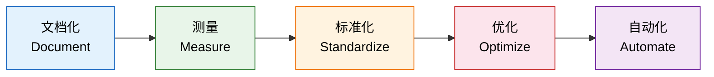
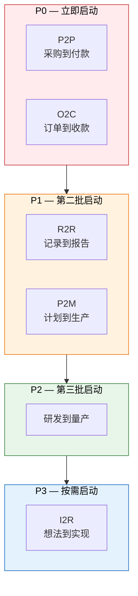
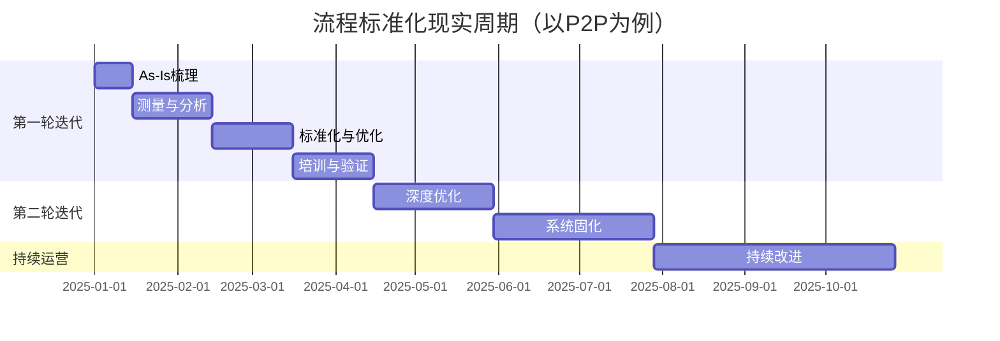

# 流程标准化落地路径

> 标准化不是写一堆文档，而是让流程从"靠人"变成"靠体系"。这个过程没法跳级，但可以加速。

## 一、标准化不是一蹴而就的

很多企业对流程标准化有一个致命的误解：**找咨询公司写一堆流程文档，就认为"标准化了"。**

这种做法的典型路径是：

1. 花几十万请咨询公司
2. 咨询公司花3个月写出厚厚的流程手册
3. 开一场发布会，领导讲"我们要严格执行标准流程"
4. 文档锁进柜子，一切照旧
5. 半年后复盘，"标准化失败了"

为什么？因为文档≠标准化。流程标准化不是一个"写文档"的动作，而是一个**持续演进的过程**。它需要从"现在怎么做的"出发，经过测量、统一、优化，最终固化到系统里。跳过任何一个阶段，都会导致"有标准没执行"。

真正的标准化，是让不同的人做同一件事，产出的结果一致。这不是一份文档能做到的，而是一套体系——包括流程定义、数据测量、最佳实践提炼、持续优化和系统固化——才能实现的。

## 二、五阶段落地模型

流程标准化的落地，遵循一个清晰的演进路径：**文档化 → 测量 → 标准化 → 优化 → 自动化**。每个阶段有明确的目标和产出，不能跳级。

### 阶段一：文档化（Document）

**目标：**把现有流程写下来，原原本本地记录"As-Is"状态。

这是最基础也最容易被做错的一步。文档化的核心原则是：**记录"现在怎么做的"，不是"希望怎么做的"**。

关键动作：
- 跟踪3-5个完整业务周期，观察实际操作
- 访谈一线执行者，记录真实操作步骤
- 识别流程中的"潜规则"和"变通做法"
- 用流程图+文字描述记录，不要只写文字

产出：
- As-Is流程图（每个L2流程一张）
- 流程说明文档（包含角色、输入、输出、异常处理）
- 流程差异清单（同一流程不同人做的差异点）

典型周期：2-4周

失败标志：文档写出来，一线员工说"我们不是这么做的"

### 阶段二：测量（Measure）

**目标：**量化流程执行情况，建立改进基准。

没有数据支撑的流程改进就是"拍脑袋"。测量阶段要回答的核心问题是：**现在流程跑得怎么样？**

关键动作：
- 定义流程KPI：周期时间、一次通过率、返工率、异常率
- 采集至少1个月的运行数据
- 建立数据采集机制（系统自动采集优先，手工记录补充）
- 输出流程运行基线

产出：
- 流程运行数据看板
- 基线数据（每个KPI的当前值）
- 数据质量评估报告

典型周期：4-8周

失败标志：数据采集靠人填表，准确率低于80%

### 阶段三：标准化（Standardize）

**目标：**统一最佳实践，消除个体差异。

标准化的本质不是"统一流程"，而是**统一最佳实践**。如果每个人都用自己的方式做同一件事，标准化要做的就是找出最好的那种方式，让所有人都按这个方式做。

关键动作：
- 分析流程差异，识别最佳实践
- 制定标准操作流程（SOP）
- 培训所有参与者
- 建立流程合规检查机制

产出：
- 标准操作流程（SOP）
- 流程培训材料
- 合规检查清单

典型周期：4-8周

失败标志：SOP发布3个月后，执行率低于70%

### 阶段四：优化（Optimize）

**目标：**消除浪费，缩短周期，提升质量。

标准化不是终点。统一了做法之后，还要持续优化。优化关注的核心指标：**周期时间缩短、返工率降低、异常率下降**。

关键动作：
- 识别流程中的非增值环节（等待、返工、审批冗余）
- 应用精益方法消除浪费
- 优化流程节点之间的衔接
- 建立持续改进机制（Kaizen）

产出：
- 优化后的流程版本
- 优化效果量化报告
- 持续改进计划

典型周期：持续进行，每季度一个优化周期

失败标志：优化3个月后，核心KPI没有10%以上的改善

### 阶段五：自动化（Automate）

**目标：**系统固化标准流程，减少人工干预。

自动化是标准化的终极形态：让系统来保证流程的执行一致性，而不是靠人的自觉性。

关键动作：
- 评估自动化可行性（不是所有流程都适合自动化）
- 系统配置/开发
- 人机协作界面设计
- 自动化测试与上线

产出：
- 系统上线
- 自动化覆盖率报告
- 运维手册

典型周期：8-16周

失败标志：自动化上线后，业务人员还在用Excel辅助

### 五阶段总览

| 阶段 | 目标 | 关键动作 | 产出 | 典型周期 | 失败标志 |
|------|------|---------|------|---------|---------|
| 文档化 | 记录现状 | 跟踪+访谈，记录As-Is | As-Is流程图、差异清单 | 2-4周 | 一线说"不是这么做的" |
| 测量 | 量化现状 | 定义KPI+采集数据 | 数据看板、基线数据 | 4-8周 | 数据靠填表，准确率<80% |
| 标准化 | 统一做法 | 提炼最佳实践+SOP | SOP、培训材料 | 4-8周 | SOP执行率<70% |
| 优化 | 消除浪费 | 精益改进+持续优化 | 优化后流程、效果报告 | 持续 | 核心KPI无10%改善 |
| 自动化 | 系统固化 | 系统开发+上线 | 系统、运维手册 | 8-16周 | 还在用Excel辅助 |

## 三、各阶段常见坑

### Stage 1 坑：To-Be代替As-Is

**这是文档化阶段最常见、最致命的错误。**

写出来的不是"现在怎么做的"，而是"希望怎么做的"。很多企业在这个阶段就忍不住"设计"理想流程，结果文档与实际永远对不上。

典型表现：
- 流程文档写得特别漂亮，但一线员工完全不认同
- 咨询公司按"行业最佳实践"画的流程图，跟企业实际操作差距巨大
- 文档评审会上大家频频点头，会后一切照旧

**正确做法：**忍住"优化"的冲动，先忠实地记录现状。哪怕现状很难看，也要先记录下来。只有知道"现在在哪里"，才能规划"要去哪里"。

### Stage 2 坑：没有数据支撑

**"我觉得大概3天" vs 实际平均7天。**

没有测量的改进就是盲人摸象。常见的情况是：领导凭感觉说"这个流程太慢了"，然后就开始优化，结果优化了半天发现瓶颈根本不在你以为的地方。

典型表现：
- KPI凭经验估计，没有实际数据
- 数据采集方式是让员工手工填表，但没人认真填
- 只采集了一周数据就开始做决策

**正确做法：**系统自动采集数据优先。如果必须手工采集，至少采集1个月的数据，而且要交叉验证。

### Stage 3 坑：把混乱标准化

**如果现有流程本身就有问题，标准化只是把错误固化。**

这是最容易被忽视的坑。有些企业跳过优化阶段，直接从测量到标准化，结果就是把低效的做法变成"标准"的低效做法。

一个真实的例子：某制造企业的采购流程，标准化的结果是——所有采购都必须走8个审批节点。为什么？因为之前的做法就是8个审批，标准化只是把这个做法"正名"了。但实际分析发现，其中4个审批节点是冗余的。

**正确做法：**标准化之前必须先评估现有流程是否合理。如果发现流程本身有问题，应该先优化再标准化。否则就是"高效地犯错"。

### Stage 4 坑：过度优化

**追求完美导致流程僵化。**

过度优化的典型表现：试图为每一种场景都制定标准流程，结果流程手册比砖头还厚，没人看得完也没人执行得了。

关键原则：**80/20法则——80%的场景走标准流程，20%的例外场景需要弹性处理。**

具体做法：
- 标准流程只覆盖高频场景（月发生量>10次）
- 低频场景制定"例外处理规则"而非"例外流程"
- 每季度review一次例外场景，如果频次上升则纳入标准流程

### Stage 5 坑：自动化陷阱

**自动化烂流程 = 烂流程跑得更快。**

这是最危险的一个坑。很多企业在流程还没稳定的时候就急着上系统，结果系统上线后发现问题不断，改流程要改系统，改系统要改流程，陷入死循环。

自动化之前必须确认：
1. 流程是否已经标准化（执行率>80%）
2. 流程是否已经优化（核心KPI稳定3个月以上）
3. 例外场景是否有明确的处理规则
4. 一线人员是否认同当前流程

如果以上任何一条不满足，先解决问题，再考虑自动化。

## 四、核心业务链路的标准化优先级

不是所有流程都值得同时做标准化。资源有限的情况下，必须排优先级。

| 业务链路 | 影响范围 | 标准化难度 | 优先级 | 理由 |
|---------|---------|-----------|-------|------|
| P2P（采购到付款） | 全公司 | 中 | **P0** | 涉及资金流，合规风险高，跨部门协同多 |
| O2C（订单到收款） | 全公司 | 中 | **P0** | 直接影响营收和客户体验 |
| R2R（记录到报告） | 财务 | 低 | **P1** | 财务合规基础，标准化难度相对低 |
| P2M（计划到生产） | 生产+供应链 | 高 | **P1** | 影响交付，但跨系统复杂度高 |
| 研发到量产 | 研发+生产 | 高 | **P2** | 影响产品上市周期，但频次相对低 |
| I2R（想法到实现） | 研发 | 高 | **P3** | 创新流程标准化难度大，弹性要求高 |

**为什么P2P和O2C是P0？**

P2P涉及资金流，任何不一致都可能导致重复付款、漏付款等严重后果。O2C直接影响客户体验和营收确认。这两条链路的标准化，投入产出比最高，也最容易量化效果。

## 五、流程标准化的组织保障

流程标准化不是IT项目，是管理变革。没有组织保障，再好的方法论也会沦为纸上谈兵。

### 流程Owner制度

**每个L2流程必须有明确的Owner。**

流程Owner不是"负责画流程图的人"，而是对流程的运行结果负责的人。具体职责：
- 制定和维护SOP
- 监控流程KPI
- 推动流程优化
- 处理流程升级和例外

流程Owner的选人标准：
- 有业务话语权（能推动改变）
- 跨部门协调能力强
- 对流程全链路有理解

### 流程治理委员会

跨部门流程的争议，不能靠"吵架"解决，需要有一个治理机制。

流程治理委员会的职责：
- 审批L2级以上流程的变更
- 仲裁跨部门流程争议
- 审批流程标准化的优先级和资源分配
- 季度review流程运行报告

人员构成：
- 委员会主任：COO或VP级
- 成员：各业务部门负责人
- 秘书处：流程管理团队

### 流程KPI体系

流程标准化必须有可量化的衡量标准。核心KPI：

| KPI | 定义 | 目标 | 数据来源 |
|-----|------|------|---------|
| 周期时间 | 从流程起点到终点的实际耗时 | 每季度缩短10% | 系统时间戳 |
| 一次通过率 | 无返工、无退回完成流程的比例 | >85% | 系统统计 |
| 异常率 | 需要例外处理的流程实例比例 | <10% | 系统统计 |
| SOP执行率 | 按标准流程执行的操作比例 | >90% | 审计抽查 |
| 流程成本 | 执行一次流程的平均人力和系统成本 | 每季度降低5% | 财务数据 |

### 持续改进机制

标准化不是一劳永逸的。需要建立持续改进的节奏：

- **月度：**流程Owner检查KPI，识别异常
- **季度：**流程治理委员会review运行报告，审批优化方案
- **年度：**全面评估流程体系，调整标准化优先级

## 六、从哪里起步：给企业的实操建议

方法论讲完了，最后给一个"照着做"的起步方案。

### Step 1：选一条核心链路

建议从P2P或O2C中选择一条。选择标准：
- 发生频次高（每天>10单）
- 跨部门协同多（至少涉及3个部门）
- 当前痛点明显（有明确的数据不一致、周期过长等问题）
- 领导关注（有高层推动力）

### Step 2：花2周时间做As-Is梳理

**千万不要超过2周。** As-Is梳理不是为了写完美的文档，而是为了建立对现状的共识。2周足够跟完3-5个完整业务周期，画出现状流程图。

关键产出：
- 现状流程图（1张）
- 差异清单（不同人做同一流程的差异点）
- 粗略的周期时间数据

### Step 3：识别Top 5痛点

不是所有痛点，只抓最痛的5个。判断"痛不痛"的标准：
- 是否影响资金或营收
- 是否导致跨部门对账困难
- 是否导致客户投诉
- 是否每天在浪费人力

把5个痛点按影响排序，聚焦解决前3个。

### Step 4：3个月内完成标准化和优化

3个月的时间分配：
- 第1个月：测量+分析（采集数据、识别根因）
- 第2个月：标准化+优化（制定SOP、消除浪费）
- 第3个月：培训+验证（全员培训、验证执行效果）

### Step 5：系统固化

在流程稳定运行3个月后，启动系统固化。系统固化的范围：
- 流程节点自动流转
- 审批规则系统配置
- 数据自动校验
- KPI自动统计

### 现实周期表

不要被理想化的方法论吓到。现实中，一条核心链路的标准化，完整走完五个阶段，大约需要6-9个月。但不需要等6个月才看到效果——3个月就能看到明显改善。

**核心原则：小步快跑，3个月一个迭代。** 不要追求一步到位，先打通一条链路，证明方法论有效，再复制到其他链路。

第一个迭代的价值不在于"流程跑得多完美"，而在于**建立信心和方法**——让团队看到标准化是有效的，方法是可复制的。有了这个基础，后续的标准化推进就会顺畅得多。
