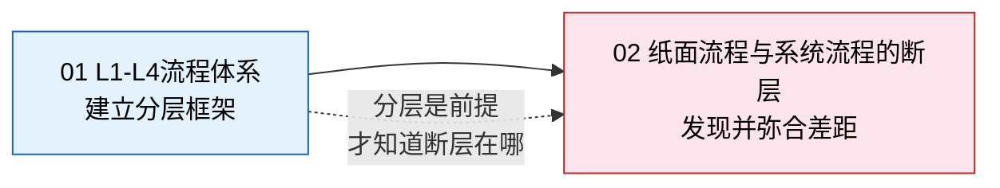

# 业务流程标准化

> 流程标准化是数字化转型的地基——没有标准化的流程，系统就是建在沙滩上的房子，上线即烂尾。

## 本章导读

本章回答两个核心问题：

1. **流程怎么分层管理？** 从 L1 价值链到 L4 操作步骤，每一层管什么、谁来管、怎么管
2. **为什么流程文档写了一套，系统里跑的是另一套？** 纸面流程与系统流程的断层是怎么产生的，怎么弥合

| 维度 | 核心问题 | 对应文章 |
|------|---------|---------|
| **分层** | 流程从战略到操作怎么拆？L1-L4 每层做什么？ | [L1-L4流程体系](01_L1-L4流程体系.md) |
| **断层** | 制度写的是 A、实际走 B、系统是 C，怎么办？ | [纸面流程与系统流程的断层](02_纸面流程与系统流程的断层.md) |

## 文章关系

先理解流程分层的框架（知道流程"应该怎么管"），再诊断实际中的断层（发现"为什么没管住"），这是本章的学习路径。
