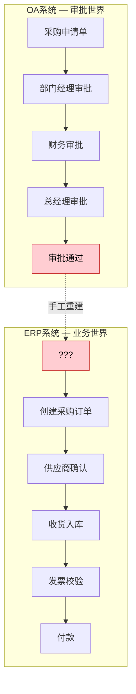
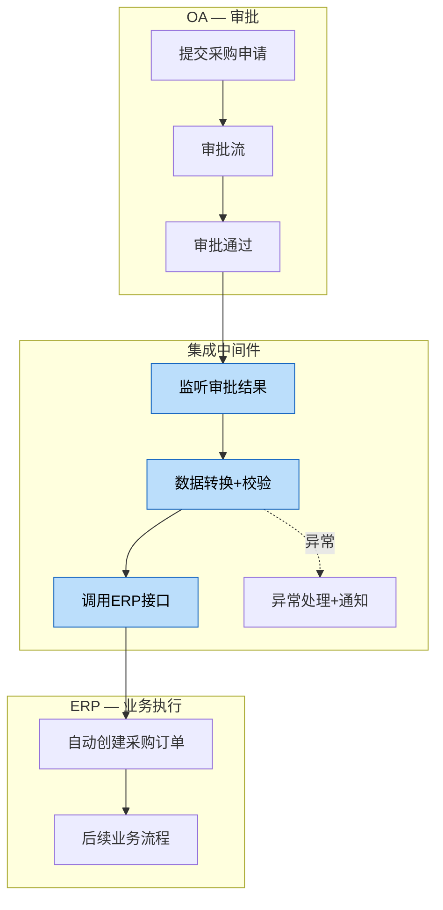
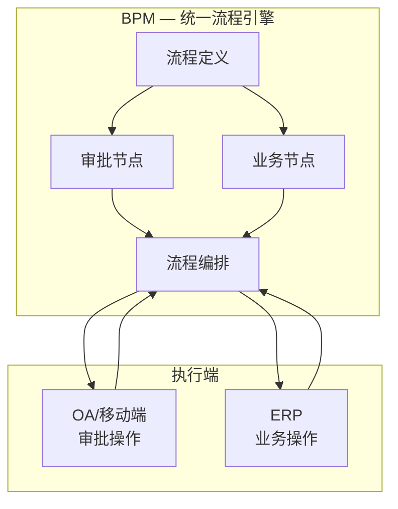

# 审批流与业务流的割裂

> 审批流管的是"谁有权决定"，业务流管的是"事情怎么做"。把这两个混为一谈，是国内企业数字化最常见也最昂贵的误区。

## 一、审批流≠业务流：国内企业最常见的误区

先厘清两个概念：

**审批流（Approval Flow）：**谁批准、谁审核、谁知情。本质是**权限控制**——确保每一笔业务都经过适当的授权。审批流关注的是"合规性"，回答的是"这件事有没有人负责"。

**业务流（Business Flow）：**业务数据如何流转、如何处理、如何闭环。本质是**业务逻辑**——确保每一笔业务被正确地执行。业务流关注的是"正确性"，回答的是"这件事有没有做对"。

两者的区别：

| 维度 | 审批流 | 业务流 |
|------|--------|--------|
| 关注点 | 权限与合规 | 业务逻辑与效率 |
| 核心问题 | 谁有权决定 | 怎么做是对的 |
| 数据载体 | 审批单（表单） | 业务单据（订单/工单/凭证） |
| 变化频率 | 组织架构变了才变 | 业务规则经常变 |
| 典型系统 | OA、BPM | ERP、MES、WMS |
| 衡量指标 | 审批时效、合规率 | 周期时间、一次通过率 |

**国内企业最常见的误区：把"流程数字化"等同于"审批线上化"。**

很多企业"上系统"的第一步就是把纸质审批单搬到OA里，然后宣称"流程数字化了"。但实际上，审批只是流程的一个环节，业务数据的创建、流转、处理、闭环才是流程的主体。只做了审批线上化，就像只修了高速公路的收费站，路还是土路。

## 二、OA与ERP的割裂：最常见的场景

在国内企业中，OA负责审批、ERP负责业务是极其普遍的架构。问题在于，这两个系统之间往往是断裂的。



**典型场景：**

1. 采购员在OA提交采购申请
2. OA里走审批流：部门经理→财务→总经理
3. 审批通过后，采购员**手工在ERP创建采购订单**
4. 后续的供应商确认、收货、发票校验、付款都在ERP完成

**断裂点：**OA审批通过到ERP创建订单之间，需要人工"翻译"——把OA审批单的信息手工录入ERP。这个"翻译"过程就是割裂的根源。

### 后果一览

| 后果 | 具体表现 |
|------|---------|
| 数据不一致 | OA里的金额/数量与ERP不一致，月底对账对不上 |
| 重复录入 | 同一笔业务的信息录入两次，浪费人力且容易出错 |
| 时效性差 | 审批通过到订单创建有1-3天延迟 |
| 缺乏追溯 | 审批记录和业务记录分离，出了问题查不清 |
| 合规风险 | 审批的内容与实际执行的内容不匹配 |

## 三、五种典型的审批-业务割裂模式

| 模式 | 描述 | 典型场景 | 后果 | 严重度 |
|------|------|---------|------|--------|
| OA审批+ERP执行 | 审批在OA，业务在ERP，中间靠人工衔接 | 采购/费用/合同 | 数据不一致、重复录入 | ★★★★★ |
| 邮件审批+系统执行 | 审批通过邮件，执行在系统，审批记录散落在邮箱 | 外企常见，费用报销 | 审批记录无法追溯、合规风险 | ★★★★ |
| 纸质审批+系统录入 | 签完字再录入系统，录入内容可能与签字不一致 | 传统制造企业，领料/退货 | 数据准确性差、时效性极差 | ★★★★★ |
| 系统审批+线下执行 | 系统走了流程但实际操作是另一套 | 紧急采购、特殊发货 | 系统数据不反映实际、虚账实不符 | ★★★★ |
| 多系统审批+单系统执行 | 合同在法务系统审、预算在财务系统审、订单在ERP执行 | 大型企业，跨部门业务 | 审批逻辑分散、一致性难以保证 | ★★★★ |

### 模式1：OA审批+ERP执行（详细解析）

这是最常见也最典型的割裂模式，以采购场景为例：

```mermaid
sequenceDiagram
    participant 采购员
    participant OA
    participant ERP
    participant 供应商

    采购员->>OA: 提交采购申请（物料+数量+金额）
    OA->>OA: 部门经理审批
    OA->>OA: 财务审批（预算检查）
    OA->>OA: 总经理审批（超50万）
    OA-->>采购员: 审批通过通知

    Note over 采购员,ERP: ❌ 断裂点：人工"翻译"

    采购员->>ERP: 手工创建采购订单（重新录入信息）
    ERP->>供应商: 发送采购订单
    供应商->>ERP: 确认交期
    ERP->>ERP: 收货入库
    ERP->>ERP: 发票校验
    ERP->>ERP: 付款

    Note over OA,ERP: OA审批单号 ≠ ERP采购订单号
审批金额 ≠ 订单金额
审批物料 ≠ 订单物料
```

**关键问题：**
- OA审批的是"申请"，ERP执行的是"订单"，两者是不同的业务对象
- 审批通过后，采购员可能在ERP创建的订单与审批内容不一致（数量调整、拆单等）
- 没有任何机制保证"审批的内容"与"执行的内容"一致

### 模式2：邮件审批+系统执行（详细解析）

外企中常见的模式，审批通过邮件完成：

```mermaid
sequenceDiagram
    participant 申请人
    participant 邮箱
    participant ERP
    participant 审批人

    申请人->>邮箱: 发邮件申请（附Excel表格）
    邮箱->>审批人: 收到审批请求
    审批人->>邮箱: 回复"Approved"
    邮箱->>申请人: 收到审批结果

    Note over 申请人,ERP: ❌ 断裂点：审批记录散落在邮箱

    申请人->>ERP: 创建业务单据
    ERP->>ERP: 执行业务流程

    Note over 邮箱,ERP: 审批证据在邮箱里
业务数据在系统里
审计时需要手动关联
```

**关键问题：**
- 审批记录散落在不同人的邮箱里，无法集中管理
- 邮件中的审批内容可能模糊（"大致同意""可执行"），无法精确匹配
- 合规审计时，需要人工从邮件中提取审批记录，效率极低
- 人员离职后，邮件审批记录可能丢失

## 四、割裂带来的真实成本

审批流与业务流的割裂不是"不舒服"的问题，而是有实实在在的成本。

### 数据不一致率

**跨系统对账差异：15%-30%**

这是什么概念？一个月处理500笔采购，有75-150笔需要人工对账差异。每笔对账平均耗时30分钟，每月浪费37.5-75小时。

数据不一致的根因：
- 人工录入错误（输错数字、选错物料）
- 审批内容与实际执行不一致（审批100个，实际采购了120个）
- 时间差导致的数据变更（审批时的价格，执行时已变动）

### 重复录入人力成本

**1个FTE/100单**

以采购为例，每笔采购需要在OA和ERP各录入一次信息。平均每单录入耗时15分钟，100单/月需要25小时，大约0.15个FTE。但这只是直接录入时间，加上对账、纠错的时间，实际人力消耗远大于此。

如果考虑费用报销、合同审批、领料申请等多个场景，一个中型企业每年因重复录入浪费的人力成本在50-100万元。

### 时效性损失

**审批到执行延迟：1-3天**

审批通过后，到ERP中创建业务单据，平均延迟1-3天。这意味着：
- 采购延迟：供应商备货时间被压缩，可能导致交期延误
- 费用支付延迟：影响供应商关系
- 合同签署延迟：错失商机

### 合规风险

**审批记录与执行记录不匹配**

这是审计中最常见的问题。审计师要求"审批的金额=实际执行的金额"，但在OA+ERP割裂的架构下，这个等式几乎不成立。

典型审计发现：
- OA审批金额50万，ERP实际执行53万（"审批后又加了点"）
- OA审批物料A，ERP实际采购物料B（"缺货换了替代料"）
- OA审批供应商X，ERP实际下单供应商Y（"采购说X交期太长"）

### 决策延迟

**领导看到的是审批时间点的数据，不是当前数据**

OA审批时，领导看到的金额、数量、供应商信息是"提交时"的状态。但从审批提交到审批通过可能经过3-5天，这期间业务数据可能已发生变化（价格波动、库存变化、供应商状态变更）。领导基于过时数据做出的决策，质量可想而知。

## 五、三种集成解决方案

### 方案1：审批嵌入业务系统（推荐）

**核心思路：**把审批功能做到ERP/MES内部，业务数据和审批数据在同一系统中流转。


**优势：**
- 数据一致性天然保证（审批单号=业务单据号，审批内容=执行内容）
- 无重复录入，审批通过后自动生成下游单据
- 全流程追溯，任何环节可查

**劣势：**
- 业务系统的审批配置灵活性不如OA（OA的表单设计器更灵活）
- 组织架构变更时，需要同时调整业务系统的审批规则
- 审批移动端体验可能不如专门的OA App

**适用场景：**新系统建设，可以一步到位

### 方案2：OA审批+自动触发业务系统

**核心思路：**保留OA做审批，但审批通过后通过接口自动在ERP创建单据。



**优势：**
- 保留OA的审批灵活性（表单设计、移动审批体验）
- 消除人工重复录入
- 实现审批与业务数据的自动关联

**劣势：**
- 集成开发工作量（OA和ERP的接口开发、数据映射、异常处理）
- 异常场景处理复杂（接口超时、数据校验失败、ERP停机等）
- 两个系统的数据模型映射可能有差异（OA的"物料"≠ERP的"物料"）

**适用场景：**已有OA+ERP的存量系统，无法一步替换

**集成关键点：**
- 审批单号必须作为业务单据的关联字段写入ERP
- OA表单字段与ERP字段需要建立映射关系（字段映射表）
- 必须设计异常处理机制：接口失败后的重试、人工兜底
- 数据回写：ERP创建订单后，将订单号回写OA审批单

### 方案3：统一流程平台

**核心思路：**引入BPM平台统一管理审批流和业务流，OA和ERP都作为执行端接入。



**优势：**
- 流程可视化，审批流和业务流统一编排
- 跨系统流程统一管理，无需多系统切换
- 流程变更只需调整BPM配置，不涉及多个系统

**劣势：**
- 引入新平台，实施成本高（BPM产品+实施+运维）
- 需要OA和ERP都提供接口接入BPM
- BPM平台本身的学习曲线和运维复杂度

**适用场景：**大型企业，流程复杂度高，系统多

### 三种方案对比

| 维度 | 方案1：审批内嵌 | 方案2：OA+API集成 | 方案3：统一流程平台 |
|------|---------------|------------------|-------------------|
| 数据一致性 | ★★★★★ | ★★★★ | ★★★★★ |
| 审批灵活性 | ★★★ | ★★★★★ | ★★★★ |
| 实施成本 | ★★★★ | ★★★ | ★★ |
| 实施难度 | ★★★ | ★★★★ | ★★ |
| 运维复杂度 | ★★★★★ | ★★★ | ★★ |
| 推荐场景 | 新系统建设 | 存量系统集成 | 大型企业多系统 |

> 注：★越多表示该维度越优（一致性和灵活性）或成本/难度越低

## 六、实操建议

### 按企业阶段选择方案

**新建系统：**首选方案1（审批内嵌）。从设计之初就把审批和业务放在同一个系统中，避免未来再解决集成问题。现代ERP系统（如SAP、Oracle、用友NCC）都内置了工作流引擎，完全可以替代OA的审批功能。

**存量系统：**从方案2（OA+API集成）起步。不要一上来就想替换OA或上BPM，先打通最高频的3-5个审批场景，看到效果后再扩展。

### 集成实施的注意事项

**1. 不要追求一步到位**

先打通最高频的3-5个审批场景。根据经验，以下场景优先级最高：
- 采购申请→采购订单
- 费用报销→付款
- 销售报价→销售订单
- 领料申请→领料出库
- 合同审批→合同归档

这5个场景覆盖了80%的审批-业务交互量，先打通这些就能解决大部分问题。

**2. 审批数据必须与业务数据关联**

核心原则：**审批单号=业务单据号的关联字段。**

具体做法：
- OA审批通过后，审批单号写入ERP业务单据的"来源单号"字段
- ERP业务单据创建后，订单号回写OA审批单的"关联单据"字段
- 任何查询、对账、审计都可以通过关联字段双向追溯

**3. 建立审批时效监控**

审批是流程的瓶颈，必须有监控机制：
- 审批停留时间>24小时，自动提醒审批人
- 审批停留时间>48小时，自动升级到上级
- 审批停留时间>72小时，自动标记为异常
- 每月统计审批时效，Top 10慢审批公开通报

**4. 异常处理机制**

集成不是万能的，总有异常情况：
- 接口调用失败：自动重试3次，仍失败则通知人工处理
- 数据校验不通过：在OA中标记"待人工确认"，不走自动创建
- ERP停机：审批结果入队，ERP恢复后自动补单
- 紧急业务：保留人工创建ERP单据的通道，但必须关联OA审批单号

**5. 数据质量保障**

集成的效果取决于数据质量：
- OA表单字段必须标准化（物料编码用ERP的编码，不用自定义编码）
- 金额字段统一精度（2位小数，不用整数）
- 必填字段在OA和ERP中保持一致
- 定期做数据一致性检查，差异率>5%需排查根因

### 总结

审批流与业务流的割裂，根源在于把"权限控制"和"业务逻辑"分到了两个系统中。解决的思路只有一个：**让审批数据和业务数据在同一体系中流转。** 无论是审批内嵌、API集成还是统一流程平台，本质上都是实现这个目标。选择哪种方案，取决于企业的系统现状和资源约束，但目标必须清晰——审批是业务的一部分，不是独立于业务之外的"流程"。
