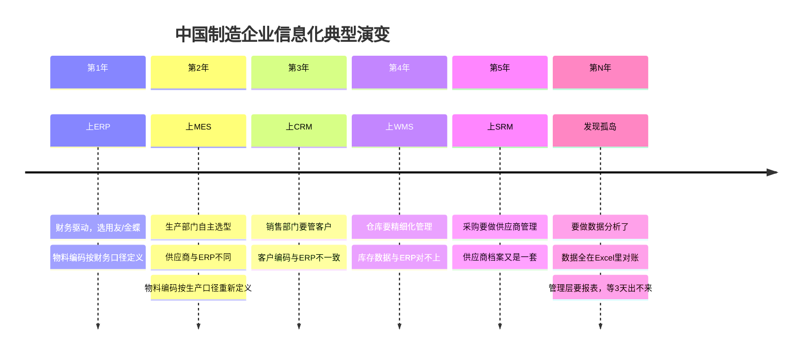
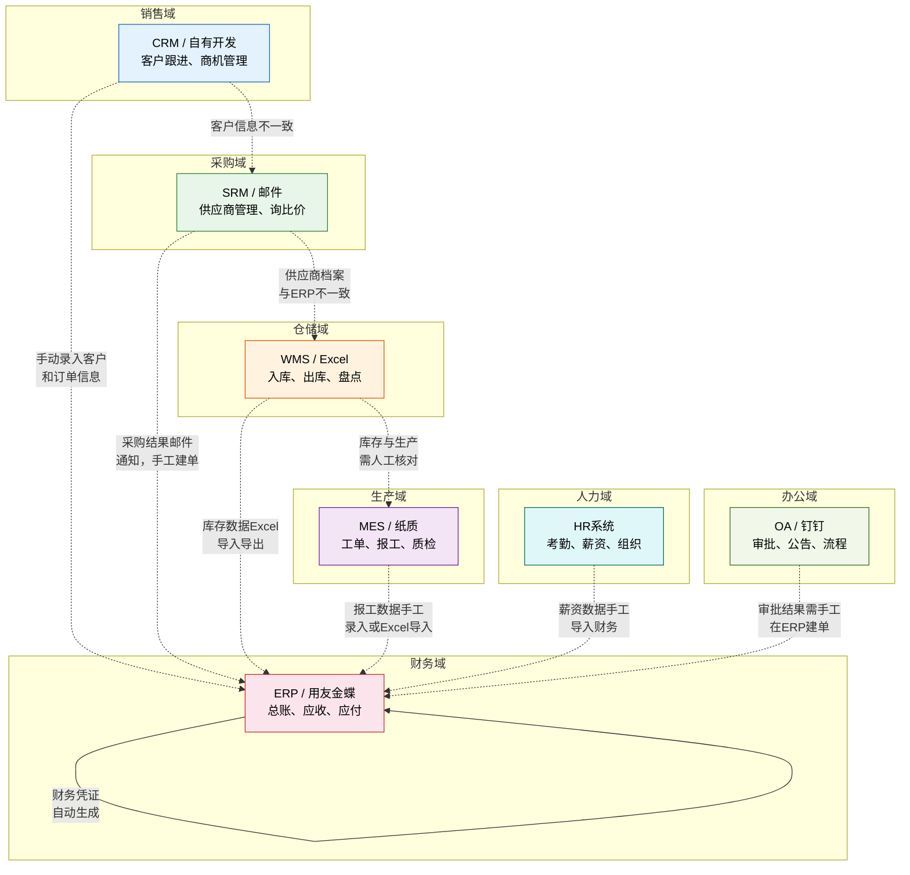
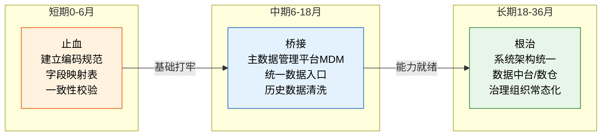

# 系统孤岛与数据孤岛

> 孤岛不是一天形成的，它是"先建后治"的必然产物。每个部门都在做正确的事——采购选了最适合自己的系统，生产上了最好用的 MES，财务用了最合规的软件——但没人问过一个问题：这些系统之间，数据怎么流通？

## 一、孤岛是怎么形成的

系统孤岛从来不是某个人或某个部门的"失误"，而是一种**组织行为模式**的必然结果。理解形成过程，才能对症下药。

### 典型演变时间线

### 形成孤岛的三个根因

| 根因 | 表现 | 本质 |
|------|------|------|
| **部门各自采购** | 每个部门选自己"最好用"的系统，不关心和其他系统如何对接 | 缺乏企业级IT规划，IT预算分散在各部门 |
| **系统间无统一规划** | 上新系统时只考虑本部门需求，接口、数据标准都是事后补的 | "先解决眼前问题"的实用主义思维 |
| **数据标准不一致** | 同一物料在不同系统有不同编码、不同字段定义 | 没有人对跨系统数据标准负责 |

> 一个判断标准：如果你企业的IT预算分散在各部门手里，而不是由CIO统一管控，那孤岛几乎是注定的。

## 二、系统孤岛地图

下面是一张典型的中国制造企业系统全景图。实线表示有系统对接，虚线表示需要人工搬运数据。

### 孤岛地图解读

| 连接关系 | 现状 | 应该是什么样 |
|---------|------|-------------|
| CRM → ERP | 销售录完客户，财务再录一遍 | 客户主数据一次录入，双向同步 |
| SRM → ERP | 采购结果邮件发，财务手工建采购单 | 供应商协同结果自动生成采购订单 |
| WMS → ERP | 库存Excel导入导出，经常对不上 | 入出库实时回写库存台账 |
| MES → ERP | 报工手工录入或Excel，滞后1-2天 | 报工实时回写工单进度和库存 |
| HR → ERP | 薪资数据手动导入财务系统 | 组织人事变动自动同步财务 |
| OA → ERP | 审批完再手工到ERP建单 | 审批结果自动触发ERP单据 |

## 三、数据孤岛的五种表现

### 1. 一物多码：同一物料，三个身份

这是制造企业最典型的数据孤岛表现。同一个物理物料，在不同系统中有不同的编码和描述。

| 系统 | 物料编码 | 物料描述 | 编码规则 |
|------|---------|---------|---------|
| ERP | A001 | 铝合金型材6063-T5 | 财务分类编码 |
| WMS | MAT-A001 | 铝型材6063 | 仓库SKU编码 |
| MES | 原料-01 | 6063铝材 | 生产简称编码 |

**根因**：各系统独立建设时，没有统一编码标准。ERP按财务分类编码，WMS按仓库管理需要编码，MES按生产习惯编码。

**后果**：

- 采购下了A001的订单，仓库不知道MAT-A001就是A001
- 生产领料时用"原料-01"提需求，仓库无法匹配
- 每次跨系统操作都需要人工对照翻译

### 2. 客户数据分裂：三套客户主数据

客户信息在CRM、ERP、财务三个系统中各有各的记录，格式和内容不一致。

| 系统 | 客户名称 | 关键字段 | 记录数量 |
|------|---------|---------|---------|
| CRM | 华创科技（简称） | 联系人、商机阶段 | 500+ |
| ERP | 深圳华创科技有限公司 | 税号、信用额度 | 400+ |
| 财务 | 华创科技 | 银行账号、开票信息 | 380+ |

**典型场景**：月底对账时，CRM说这个月华创下了8单，ERP说只有6单，财务说开票7张——三个数字对不上，最后还是Excel拉出来人工核对。

**根因**：没有统一的客户主数据管理，各系统各自维护客户信息，更新不及时。

### 3. BOM数据不一致：研发BOM ≠ 生产BOM ≠ 成本BOM

这是技术密集型制造企业最痛的问题。BOM版本不同步，直接导致生产用错料。

| 系统 | BOM版本 | 更新频率 | 管理者 |
|------|--------|---------|--------|
| PLM/设计 | V3.2（最新） | 设计变更即更新 | 研发部门 |
| ERP | V3.1（可能滞后1版本） | 工程变更单审批后更新 | 工艺部门 |
| MES | V3.0（可能是旧版本） | 手工同步，经常遗漏 | 车间 |

**真实案例**：某汽车零部件企业，研发改了一个零件的规格，PLM里BOM已经更新，但ERP的BOM变更单卡在审批流程里，MES还在用旧版BOM生产。结果一批零件全部报废，损失30万。

**根因**：没有建立BOM版本的全链路同步机制，工程变更单（ECO）在跨系统传递时存在断点。

### 4. 库存数据不准：三个数字，你信哪个？

库存数据不一致是企业运营最直接的痛点——它直接影响采购决策、生产排程和财务报表。

| 数据来源 | 某物料库存数量 | 更新时机 |
|---------|--------------|---------|
| ERP库存台账 | 100 | 采购入库/销售出库时更新 |
| WMS实际库存 | 85 | 入出库作业完成时更新 |
| 财务账面库存 | 120 | 月结时确认 |

**差距来源**：

- **时间差**：WMS已完成出库，ERP还没收到回写（接口延迟或断开）
- **未及时回写**：MES领料后没有及时回写ERP
- **盘点差异**：实物盘点结果没有同步更新所有系统
- **在途未入账**：已到货但未完成质检入库的物料

**后果**：采购看到ERP有100个，决定不采购；实际仓库只有85个，到生产领料时不够，紧急采购，交期延误。

### 5. 供应商数据碎片：三套供应商档案

| 系统 | 供应商编码 | 信息完整度 | 维护人 |
|------|----------|-----------|--------|
| SRM | SUP-001 | 基本信息+资质+评价 | 采购部门 |
| ERP | 20001 | 基本信息+付款条款 | 财务部门 |
| 财务 | 20001 | 银行账号+开票信息 | 出纳 |

**典型问题**：SRM里供应商已经更名了，ERP里还是旧名称；财务按旧名称付款，银行退票。

## 四、数据孤岛的量化成本

孤岛不只是"不方便"，它有真金白银的成本。

| 成本项 | 典型数据 | 说明 |
|--------|---------|------|
| 重复录入人力 | 2-3 FTE/年 | 同一数据在多个系统重复录入，以中型制造企业（8-10个系统）估算 |
| 对账成本 | 每月2-5人天 | 月底对账时，需要多人核对各系统数据差异 |
| 决策延迟 | 1-3天等待数据对齐 | 管理层要报表，数据团队需要1-3天从各系统拉数据、清洗、对齐 |
| 错误成本 | 因数据不一致导致的生产/采购错误 | 如上文BOM版本不同步导致的生产报废 |
| 维护成本 | 各系统维护各自数据 | 同一客户/物料/供应商，每个系统各有一人维护 |
| 机会成本 | 无法做实时数据分析 | 想做经营分析，但数据散落在各系统，只能做T+1甚至T+7的报表 |

> 粗略估算：一个年营收5亿的中型制造企业，因数据孤岛导致的直接和间接成本，每年在200-500万之间。

## 五、孤岛治理策略

治理孤岛不能一刀切，需要分阶段、有节奏地推进。

### 短期（0-6月）：止血

目标：防止孤岛继续恶化，确保新增数据不再制造新问题。

| 措施 | 具体做法 | 预期效果 |
|------|---------|---------|
| 建立主数据编码规范 | 制定物料、客户、供应商的统一编码规则，**不改历史数据，只管新增** | 新增数据不再制造新的不一致 |
| 关键字段跨系统映射表 | 用Excel或数据库维护各系统编码的映射关系 | 至少能"翻译"，减少人工对照时间 |
| 每日数据一致性校验 | 编写脚本每日检查关键数据在各系统间的一致性 | 及时发现差异，防止积累 |

> 短期措施的核心思路是"不欠新债"——历史问题先标记，先保证增量数据是干净的。

### 中期（6-18月）：桥接

目标：建立跨系统的数据通道，减少人工搬运。

| 措施 | 具体做法 | 预期效果 |
|------|---------|---------|
| 引入主数据管理平台（MDM） | 选择或自建MDM，统一管理物料、客户、供应商等主数据 | 主数据有唯一真相源 |
| 统一数据入口 | 主数据只在MDM录入，自动分发到各系统 | 消除重复录入，源头唯一 |
| 历史数据清洗 | 制定清洗规则，逐批清洗历史不一致数据 | 逐步消除存量问题 |

> 中期措施的核心思路是"建桥"——不是拆掉孤岛重建，而是在孤岛之间搭桥，让数据流通。

### 长期（18-36月）：根治

目标：从架构层面消除孤岛产生的土壤。

| 措施 | 具体做法 | 预期效果 |
|------|---------|---------|
| 系统架构统一规划 | 制定企业级IT架构蓝图，新系统选型必须符合架构规范 | 从源头杜绝新孤岛 |
| 数据中台/数据仓库 | 建立统一的数据层，各业务系统数据汇聚到中台 | 数据分析不再需要跨系统拉取 |
| 数据治理组织常态化 | 设立数据治理委员会，明确数据Owner和治理流程 | 持续维护数据质量 |

> 长期措施的核心思路是"治本"——从组织和架构上建立长效机制，让孤岛没有再产生的条件。

## 六、实用清单：你的企业孤岛严重程度评估

用以下清单快速评估你的企业孤岛严重程度。每项1-5分（1=几乎不存在，5=非常严重）。

| 序号 | 评估问题 | 评分（1-5） |
|------|---------|------------|
| 1 | 同一物料在不同系统中有不同编码，需要人工对照翻译 | |
| 2 | 客户/供应商信息在多个系统中维护，更新不同步 | |
| 3 | 月底对账需要多人花2天以上核对各系统数据 | |
| 4 | 跨部门数据需求需要等待1天以上才能拿到 | |
| 5 | 库存数据在不同系统中经常对不上 | |
| 6 | BOM/工艺数据在PLM、ERP、MES中版本不一致 | |
| 7 | 新上系统时，数据迁移需要大量人工清洗 | |
| 8 | 领导要报表，数据团队需要1天以上准备 | |
| 9 | 每月因数据不一致导致的业务错误不少于3次 | |
| 10 | 没有专门的数据治理组织或数据Owner | |

### 评分解读

| 总分 | 严重程度 | 建议行动 |
|------|---------|---------|
| < 15 | 轻微 | 当前问题可控，关注新增数据规范即可 |
| 15-25 | 中等 | 建议启动短期"止血"措施，制定编码规范和映射表 |
| 25-35 | 严重 | 需要系统化治理，短期+中期措施并行推进 |
| > 35 | 极严重 | 数据孤岛已严重影响运营效率，需要高层牵头，三阶段全面推进 |

> 评估不是目的，行动才是。建议每季度重新评估一次，追踪改善趋势。如果两个季度评分没有下降，说明治理措施没有真正落地——通常是因为没有明确的数据Owner和KPI。
