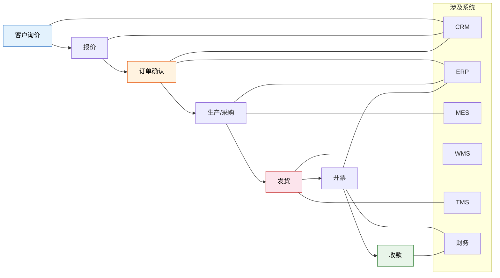
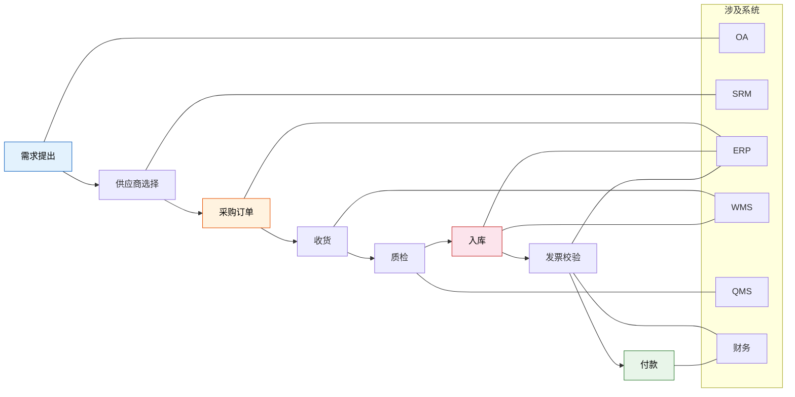
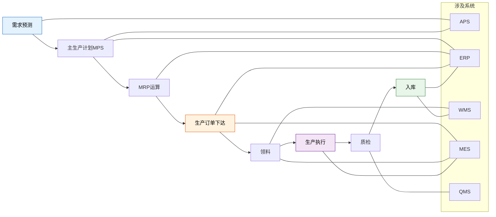
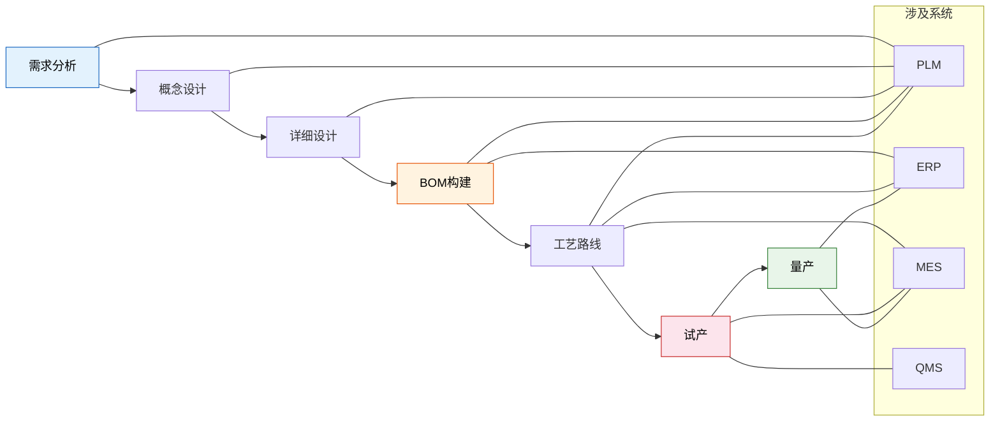
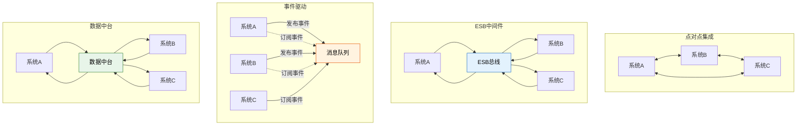
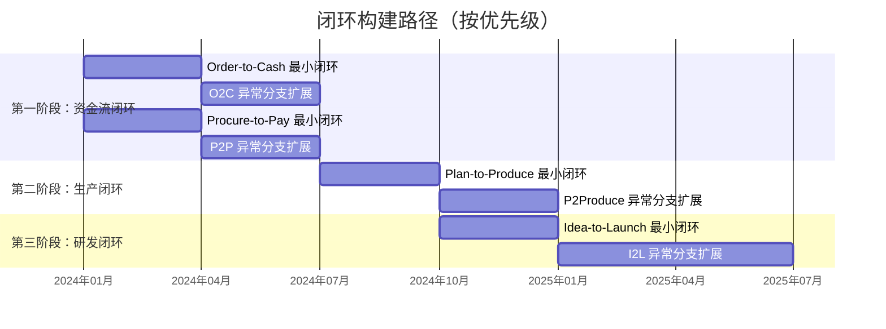

# 跨系统业务闭环构建

> 闭环的本质不是"系统A对接系统B"，而是一个业务从发起到完成，数据不落地、不断裂，全程可追踪。做不到这一点，所谓的"集成"只是在系统之间修了断头路——通了，但跑不通。

## 一、什么是业务闭环

### 定义

**业务闭环** = 一个完整业务从发起到终结的全链路，数据在系统间自动流转，无需人工搬运、Excel桥接或口头确认。

### 闭环 vs 断链

| 维度 | 闭环 | 断链 |
|------|------|------|
| 数据流转 | 系统自动传递，不落地 | 需要人工从一个系统抄到另一个系统 |
| 状态追踪 | 端到端可视，一个单号查全链 | 每个系统查一遍，拼凑全貌 |
| 异常处理 | 系统内闭环，自动升级 | 靠人发现、靠人通知、靠人处理 |
| 对账方式 | 系统自动对账，差异自动预警 | 月末多人对账，Excel核对 |

### 判断标准

一个简单的问题就能判断你的业务是否闭环：

> **"这个业务流程中，有没有人做'非决策性'的数据搬运工作？"**

如果有——有人在把数据从系统A抄到系统B、在Excel里做中间表、在微信群里传递关键数据——那就是断链，不是闭环。

## 二、四大核心业务闭环

### 1. Order-to-Cash（订单到收款）

O2C是直接涉及企业现金流入的核心闭环。从客户询价到最终收款入账，涉及销售、仓储、物流、财务四大部门。

**关键断点与修复：**

| 断点位置 | 断裂表现 | 根因 | 修复方案 |
|---------|---------|------|---------|
| 报价→订单（CRM→ERP） | CRM确认报价后，需手工在ERP建销售订单 | 两套客户/产品编码 | 建立客户/产品主数据映射，报价确认自动推送ERP创建订单 |
| 订单→发货（ERP→WMS） | ERP有销售订单，WMS没有出库任务 | 接口未打通或延迟 | 销售订单审核后自动下发WMS生成出库任务 |
| 发货→开票（WMS→ERP→财务） | 发货后需手工通知财务开票 | 发货确认未触发财务流程 | 发货确认自动触发应收确认和开票申请 |
| 开票→收款（财务→银行） | 开票后收款跟踪靠Excel | 无收款自动核销机制 | 银行流水自动匹配应收单据核销 |

### 2. Procure-to-Pay（采购到付款）

P2P直接涉及企业现金流出，控制好这个闭环等于管住了"钱袋子"。

**关键断点与修复：**

| 断点位置 | 断裂表现 | 根因 | 修复方案 |
|---------|---------|------|---------|
| 申请→订单（OA→ERP） | OA审批完采购申请，手工在ERP建采购订单 | OA和ERP流程未串联 | 审批通过后自动生成ERP采购申请/订单 |
| 收货→入库（WMS→ERP） | 仓库收货了，ERP库存没更新 | WMS入库确认未回写ERP | WMS入库确认实时回写ERP库存和暂估凭证 |
| 发票→付款（财务→银行） | 发票到了但付款靠人催、靠人记 | 无三单匹配自动校验 | 采购订单+收货单+发票三单自动匹配，匹配通过自动进入付款排程 |

### 3. Plan-to-Produce（计划到生产）

P2Produce是制造企业的生产核心闭环，直接决定交付能力和产能利用率。

**关键断点与修复：**

| 断点位置 | 断裂表现 | 根因 | 修复方案 |
|---------|---------|------|---------|
| MRP→工单下达（ERP→MES） | MRP算出计划，手工在MES创建工单 | 计划与执行系统未对接 | MRP计划订单自动转生产订单，审批后自动下发MES |
| 领料→生产（WMS→MES） | 仓库已备料，车间不知道 | 配送确认未通知MES | WMS备料出库确认自动通知MES物料到位 |
| 报工→库存（MES→ERP） | 报工完成，ERP库存和工单进度没更新 | MES报工未回写ERP | 报工确认实时回写ERP工单进度和库存变动 |

### 4. Idea-to-Launch（创意到量产）

I2L是研发型企业的核心闭环，周期长、变更多，是最容易断裂的闭环。

**关键断点与修复：**

| 断点位置 | 断裂表现 | 根因 | 修复方案 |
|---------|---------|------|---------|
| 设计BOM→生产BOM（PLM→ERP） | 研发BOM需手工重新录入ERP | PLM和ERP的BOM数据结构不同 | 建立BOM数据映射规则，设计发布自动推送ERP |
| 工程变更同步 | ECO在PLM已发布，ERP和MES没更新 | 变更通知未自动化 | ECO发布后自动触发ERP变更流程，MES同步更新 |

## 三、闭环完整性检查清单

对每个业务闭环，用以下清单逐项检查。任何一项为"否"，就是一个需要修复的断点。

### Order-to-Cash 检查清单

| 检查项 | 断裂标志 | 修复方案 |
|--------|---------|---------|
| 报价→订单是否自动流转？ | 需要手工在ERP重新录入 | CRM报价确认自动推送ERP创建订单 |
| 订单→发货是否自动触发？ | 需要手工在WMS建出库任务 | 订单审核自动下发WMS |
| 发货→开票是否自动触发？ | 需要手工通知财务 | 发货确认自动触发开票申请 |
| 订单状态是否端到端可追踪？ | 需要分别查CRM、ERP、WMS | 统一订单号贯穿全链路 |
| 收款是否自动核销？ | 需要手工匹配银行流水和应收 | 银行流水自动匹配核销 |
| 对账是否需要人工干预？ | 月底需要多人对账2天以上 | 系统自动对账，只处理差异 |

### Procure-to-Pay 检查清单

| 检查项 | 断裂标志 | 修复方案 |
|--------|---------|---------|
| 采购申请→订单是否自动？ | OA审批完需手工在ERP建单 | 审批通过自动创建采购订单 |
| 收货→入库→库存是否实时？ | 收货后ERP库存延迟更新 | WMS入库确认实时回写ERP |
| 三单匹配是否自动？ | 需要人工核对订单/收货/发票 | 系统自动三单匹配校验 |
| 付款是否自动排程？ | 付款靠人记、靠人催 | 匹配通过自动进入付款排程 |
| 供应商对账是否自动？ | 每月对账需2天以上 | SRM+ERP自动生成对账单 |

### Plan-to-Produce 检查清单

| 检查项 | 断裂标志 | 修复方案 |
|--------|---------|---------|
| 计划→工单是否自动下达？ | MRP结果需手工创建工单 | 计划订单自动转生产订单并下发 |
| 领料→生产是否自动衔接？ | 车间不知道物料是否到位 | WMS配送确认自动通知MES |
| 报工→库存是否实时更新？ | 报工后ERP库存滞后 | 报工实时回写ERP |
| 质检异常是否闭环处理？ | 不良品靠人跟进处理 | QMS判定结果自动触发返工/报废流程 |
| 生产进度是否端到端可视？ | 需要到车间现场问 | MES报工数据实时可视化 |

### Idea-to-Launch 检查清单

| 检查项 | 断裂标志 | 修复方案 |
|--------|---------|---------|
| 设计BOM→ERP BOM是否自动？ | 需要手工重新录入 | PLM发布自动推送ERP |
| 工程变更是否同步到所有系统？ | ECO发布后ERP/MES未更新 | ECO自动触发变更流程 |
| 试产→量产是否数据贯通？ | 试产数据散落在各文档 | 试产数据统一归集PLM |
| 产品生命周期状态是否全系统一致？ | PLM已停产，ERP还能下单 | 状态变更广播到所有系统 |

## 四、集成架构模式对比

构建闭环需要选择合适的集成架构。不同规模、不同阶段的企业适合不同的模式。

| 模式 | 原理 | 优势 | 劣势 | 适用规模 |
|------|------|------|------|---------|
| 点对点集成 | 系统间直接API调用 | 简单直接，开发快 | N*(N-1)/2个接口，难维护 | <3个系统 |
| ESB/中间件 | 统一消息总线，系统对接总线 | 协议转换、解耦 | 单点故障、性能瓶颈 | 中大型企业 |
| 事件驱动 | 基于消息队列的发布订阅 | 高可用、松耦合 | 事件顺序性、最终一致性 | 大型企业 |
| 数据中台 | 统一数据层，各系统读写中台 | 数据一致性好 | 建设成本高、周期长 | 大型企业 |

### 架构模式示意

### 模式选择建议

| 企业阶段 | 系统数量 | 推荐模式 | 理由 |
|---------|---------|---------|------|
| 信息化初期 | 2-3个 | 点对点集成 | 简单快速，够用 |
| 成长期 | 4-7个 | ESB/中间件 | 接口数量爆炸，需要统一管理 |
| 成熟期 | 8+个 | 事件驱动 | 系统多、数据量大，需要高可用 |
| 数据驱动期 | 任意 | 数据中台 | 数据分析、AI场景需要统一数据层 |

> 实际上，大多数企业是混合模式：核心业务链路用事件驱动，周边系统用ESB，临时对接用点对点。不要教条，够用就好。

## 五、闭环构建的优先级与路径

不是所有闭环都值得同时推进。按业务价值和实施难度排序，有策略地逐步构建。

### 为什么是这个顺序？

| 优先级 | 闭环 | 理由 |
|--------|------|------|
| 第一 | O2C + P2P | 直接涉及资金流入流出，闭环后财务数据准确性立竿见影 |
| 第二 | P2Produce | 生产核心，影响交付能力和成本，但系统复杂度更高 |
| 第三 | I2L | 研发周期长、ROI见效慢，但长线价值高 |

### 每个闭环的实施节奏

| 阶段 | 时间 | 目标 | 范围 |
|------|------|------|------|
| 最小闭环 | 3个月 | 覆盖happy path（正常流程） | 只管80%的标准场景 |
| 异常扩展 | 3个月 | 覆盖异常分支 | 退货、换货、折扣、变更等 |
| 优化固化 | 持续 | 提升自动化率和数据质量 | 监控异常率、持续优化 |

## 六、给企业的实操建议

### 1. 不要一次铺开所有闭环

一次搞四个闭环，结果就是四个都搞不好。每个闭环涉及3-6个系统、5-8个断点，同时推进会让IT和业务都消化不了。

**正确做法**：选一个闭环，做透，再做下一个。O2C和P2P可以并行（因为涉及的系统重叠度低），但P2Produce和I2L必须等前面稳了再上。

### 2. 每个闭环用3个月完成"最小闭环"

最小闭环 = 只覆盖happy path，只管80%的标准场景。

- 不做异常分支（退货、换货、折扣）
- 不做历史数据迁移
- 不做完美UI

3个月内必须让一个端到端流程跑通，哪怕很粗糙。跑通了才有信心继续，否则半年后大家会觉得"又是一个烂尾项目"。

### 3. 用6个月扩展异常分支

最小闭环跑通后，逐步覆盖：

- 退货/退款流程
- 折扣/促销场景
- 部分发货/分批收货
- 紧急插单/变更
- 质量问题处理

### 4. 持续优化数据质量

闭环跑通不等于数据质量好。前3个月的数据一定有各种问题：

- 映射关系遗漏
- 必填字段为空
- 编码规则不统一

建立每日数据质量检查机制，持续修复。数据质量是闭环的燃料，燃料不干净，跑不快。

### 5. 闭环必须有Owner和KPI

没有Owner的闭环一定会退化。指定专人负责，并设定可量化的KPI：

| KPI指标 | 定义 | 目标值 | 衡量方式 |
|---------|------|--------|---------|
| 周期时间 | 业务从发起到完成的平均耗时 | 比现状缩短30% | 系统时间戳计算 |
| 异常率 | 需要人工干预的比例 | <5% | 异常工单数/总工单数 |
| 自动化率 | 无需人工搬运数据的环节占比 | >90% | 自动流转环节数/总环节数 |
| 数据一致性 | 各系统关键数据一致的比例 | >99% | 每日校验脚本 |

> 最后提醒：闭环构建不是IT项目，是业务变革。IT搭路，业务跑路。如果业务部门不配合定义流程、不配合测试验收、不配合日常使用，再好的技术方案也是摆设。
