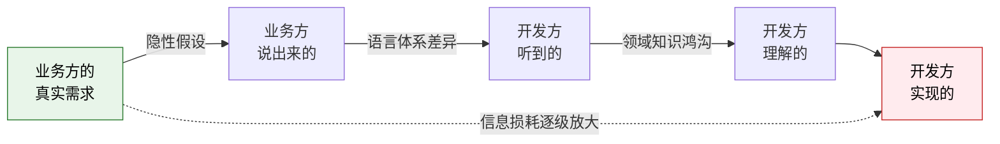
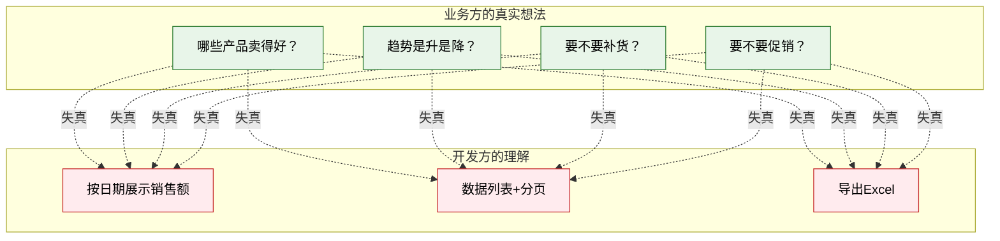
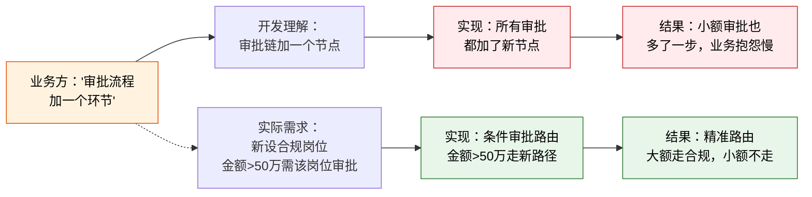
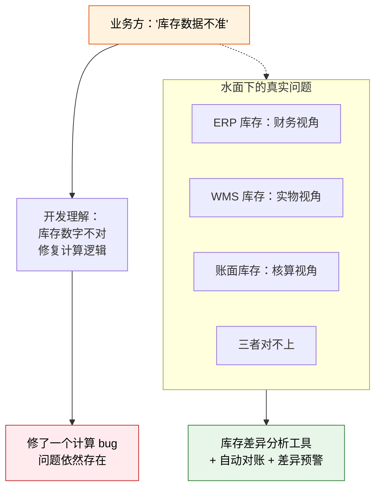

# 需求翻译的鸿沟

## 一、需求翻译失真的根本原因

数字化转型项目中，最常见的抱怨是：

- 业务方："开发做出来的不是我要的"
- 开发方："业务说的就是这些，我们按需求文档做的"

这不是"业务说不清"，也不是"开发不理解"——**两边都在认真做事，但信息在传递过程中失真了**。

需求翻译失真的三个根因：

| 根因 | 说明 | 类比 |
|------|------|------|
| **隐性假设** | 双方都有大量"不需要说也应该知道"的假设，但这些假设并不相同 | 你说"带点水果来"，你以为对方知道你爱吃草莓，对方带了苹果 |
| **领域知识鸿沟** | 业务懂业务但不懂数据结构，开发懂技术但不懂业务规则 | 医生说"做个血常规"，病人理解成"抽点血" |
| **语言体系差异** | 业务用业务语言，开发用技术语言，同一个词在不同语境下含义不同 | 业务说"订单"，想的是客户签的合同；开发说"订单"，想的是数据库里的一条记录 |

三者叠加，就像一场"传话游戏"——第一个人说的和最后一个人听到的，已经不是同一件事了。



## 二、三方语言体系

在数字化转型项目中，需求至少经过三次"翻译"：业务方 → 产品经理 → 开发。三方各有各的语言体系：

| 角色 | 说话方式 | 关注点 | 典型表述 |
|------|---------|--------|---------|
| **业务方** | 业务语言 | 业务目标、效率提升、成本降低 | "我要一个报表"、"审批流程改一下" |
| **产品经理** | 用户故事 | 用户体验、功能完整性、交互流程 | "作为采购员，我希望在审批页面看到历史记录" |
| **开发** | 技术语言 | 技术可行性、实现方案、数据结构 | "需要新增 3 张表、2 个接口、改审批引擎" |

同一个需求，三方说的话完全不在一个频道上：

| 业务方原话 | 产品经理转述 | 开发理解 |
|-----------|------------|---------|
| "我要一个报表" | "用户需要一个可筛选、可导出的数据查询页面" | "写个 SQL 查询，套个表格组件" |
| "审批要改" | "审批流程新增一个合规审核节点" | "改工作流引擎，加一个审批节点" |
| "库存不准" | "需要库存对账功能，支持多系统数据比对" | "写个对账脚本，跑差异" |

**问题在于**：每一层翻译都在"简化"——业务省略了背景，产品省略了约束，开发省略了场景。简化到最后，原始需求的灵魂已经丢了。

## 三、典型需求失真案例

### 案例 1："我要一个报表"

这是最常见的需求失真类型——业务说"报表"，开发做"表格"，但业务要的其实不是表格。



| 维度 | 业务方说的 | 开发理解的 | 实际需求 |
|------|-----------|-----------|---------|
| 需求描述 | "我要一个能看到每天销售情况的报表" | 做一个数据列表，按日期展示销售额 | **决策依据**——哪些产品卖得好、趋势是升是降、是否需要补货 |
| 正确交付 | — | — | 带趋势图的销售仪表板 + 异常预警 + 补货建议 |
| 差距原因 | 业务认为"报表=决策依据"是不言自明的 | 开发按字面意思理解"报表=数据展示" | 业务没说"我要决策依据"，开发没问"看了报表要做什么决策" |

### 案例 2："审批流程要改一下"

审批流程变更看似简单，实际上涉及组织架构、权限体系和业务规则的深层调整。



| 维度 | 业务方说的 | 开发理解的 | 实际需求 |
|------|-----------|-----------|---------|
| 需求描述 | "审批流程加一个环节" | 在审批链中加一个审批节点 | 新设了一个合规岗位，所有超过 50 万的单子需要这个岗位审批 |
| 正确交付 | — | — | 条件审批路由（金额 > 50 万走新路径，≤ 50 万走原路径） |
| 差距原因 | 业务认为"加环节"的触发条件是常识 | 开发按字面意思理解为"所有审批都加一个节点" | 业务没说触发条件，开发没问"什么时候需要新环节" |

### 案例 3："库存不准"

"库存不准"是一个典型的"冰山需求"——表面上是一个数据问题，水面下是整个数据链路的系统性问题。



| 维度 | 业务方说的 | 开发理解的 | 实际需求 |
|------|-----------|-----------|---------|
| 需求描述 | "库存数据不准" | 库存数字不对，修复计算逻辑 | ERP / WMS / 账面三套库存对不上，需要找到根因并建立对账机制 |
| 正确交付 | — | — | 库存差异分析工具 + 自动对账 + 差异预警 + 对账规则 |
| 差距原因 | 业务认为"不准"的根因是显而易见的 | 开发只看到了"数字不对"的表层 | 业务没说三套系统的库存对不上，开发没问"不准是和什么比不准" |

## 四、需求翻译的五个层级

同样的业务需求，不同的翻译水平，交付结果天差地别：

| 层级 | 翻译方式 | 典型提问/行为 | 交付结果 |
|------|---------|-------------|---------|
| **Level 1：照字面翻译** | 业务说什么就做什么 | "好的，做个报表" | 能用但没用，业务看完不满意 |
| **Level 2：追问细节** | 补充字段、格式、筛选条件 | "这个报表要哪些字段？要不要筛选？导出什么格式？" | 功能齐全但不是业务想要的，缺灵魂 |
| **Level 3：理解场景** | 了解谁用、什么场景用、用了做什么 | "这个报表谁看？什么场景下看？看了之后要做什么决策？" | 基本满足需求，但可能有更优解 |
| **Level 4：洞察意图** | 理解业务要解决的根本问题 | "你想解决什么问题？有没有比报表更好的方式？" | 超出预期，可能用仪表板替代报表 |
| **Level 5：预判需求** | 基于当前需求，推导出后续需求 | "基于这个需求，你可能还需要 XX 功能来配合" | 持续惊喜，业务觉得"你懂我" |

**以"我要一个报表"为例**：

| 层级 | 翻译结果 |
|------|---------|
| Level 1 | 做了一个销售数据表格，按日期排列 |
| Level 2 | 做了一个可筛选、可排序、可导出的销售数据列表 |
| Level 3 | 做了一个销售仪表板，带趋势图和同比环比，因为知道业务要用来做决策 |
| Level 4 | 做了一个销售+库存联动的决策看板，因为发现业务看完报表还要去查库存才能决定是否补货 |
| Level 5 | 做了一个销售决策看板 + 自动补货建议 + 异常预警，因为知道业务的终极目标是降低缺货率 |

大部分团队停留在 Level 1-2，少数做到 Level 3，Level 4-5 需要深厚的领域知识和主动思考。但 Level 3 是性价比最高的——只要多问三个问题（谁用、什么场景、用了做什么），效果就能从"能用"跳到"好用"。

## 五、实操方法：如何做需求翻译

### 方法 1：领域故事讲述（Domain Storytelling）

让业务用画图的方式讲述工作流程，而不是用文字描述。

**怎么做**：

1. 准备白板/纸笔，用简单图标表示角色（人、系统、文档）
2. 让业务讲述"一个典型的工作日"，边说边画
3. 开发只提问，不评判，不提方案
4. 记录每一个步骤的触发条件、输入输出、异常情况

**为什么有效**：

- 业务方画图时会被迫理清自己的逻辑（"等等，这里好像不对"）
- 开发能看到完整的业务场景，而不是碎片化的功能描述
- 不用 UML，降低参与门槛——业务不需要学画图语法

**示例**：

```
采购员 --创建--> 采购订单
采购订单 --提交--> 采购主管审批
采购主管 --审批通过--> 采购订单[已审批]
采购订单[已审批] --同步--> WMS[预到货通知]
供应商 --送货--> WMS[收货]
WMS --收货确认--> ERP[库存增加]
```

### 方法 2：实例化需求（Specification by Example）

用具体的数据例子描述需求，而不是抽象的文字描述。

**原则**：

- 不要写"用户可以查询订单"，要写"用户输入订单号 SO-20240601，可以看到订单状态为'已发货'"
- 不要写"库存不足时提醒"，要写"当 SKU-001 可用库存 < 安全库存 100 件时，系统发送预警消息给采购员张三"
- 用 Given-When-Then 格式：

```
Given（前置条件）采购订单 PO-001 已创建，审批已通过
When（操作）在 WMS 中查询预到货通知
Then（期望结果）应显示对应的预到货通知，供应商为 XX，预期到货日期为 2024-06-15
```

**为什么有效**：

- 抽象描述天然有歧义，具体例子没有
- 具体例子直接可以转化为测试用例
- 业务方看得懂 Given-When-Then，不需要翻译

### 方法 3：业务走查（Walkthrough）

开发到业务现场观察实际操作，而不是坐在会议室里听人说。

**怎么做**：

1. 提前和业务约好时间，到工位/仓库/车间观察 1-2 小时
2. 看，不要只听——观察实际操作流程、使用的工具、遇到的卡点
3. 记录"业务嘴上说的"和"业务实际做的"之间的差异
4. 特别关注：线下绕过系统的操作、Excel 辅助计算、口头沟通确认的环节

**为什么有效**：

- 业务说的流程和实际做的流程往往不一样（很多操作是"习惯性做法"，业务自己都不觉得需要说）
- 你能看到真实的痛点——鼠标点 10 次才能完成的操作，业务嘴上只是说"有点慢"
- 发现系统外的工作：业务用 Excel 做的数据校验、用微信群做的审批确认

**真实案例**：一个仓库管理项目，开发到现场走查后发现——业务每天花 30 分钟手工将 WMS 数据导出到 Excel 做库存校对，因为 WMS 和 ERP 的库存口径不一致。这个需求从来没有被提出来过，因为业务觉得"这不是系统的事，是我工作的一部分"。

### 方法 4：原型验证

用低保真原型快速验证理解是否正确，而不是花几周写需求文档。

**原则**：

- 3 天出原型比 3 周写需求文档有效
- 原型不是要好看，是要验证"我理解得对不对"
- 让业务在原型上"走一遍"操作流程
- 业务看到原型才会意识到"这不是我想要的"——抽象的文字无法触发这种反馈

**为什么有效**：

- 人对"看得到的东西"才有真实反馈，对"想象中的东西"只会说"差不多"
- 原型暴露隐藏需求——业务看到页面才会想起"对了，这里还需要一个筛选条件"
- 原型是沟通的"共同语言"——业务和开发对着同一个东西讨论，而不是各自脑补

## 六、需求翻译的质量检查清单

在需求分析完成后、开发启动前，用这个清单做一次自检：

| 序号 | 检查项 | 通过标准 | 常见问题 |
|------|--------|---------|---------|
| 1 | 是否理解了业务目标 | 能用一句话说清"这个需求要解决什么业务问题" | 只有功能描述，没有业务目标 |
| 2 | 是否有具体的业务场景 | 至少有 2-3 个具体场景，含角色、触发条件、期望结果 | 只有抽象描述，"用户可以查询" |
| 3 | 是否和业务确认了边界条件 | 明确什么情况做、什么情况不做、什么情况下期做 | 边界模糊，开发中才发现遗漏 |
| 4 | 是否有异常场景覆盖 | 异常场景至少占总场景的 30% | 只有 happy path，异常全靠猜 |
| 5 | 业务方是否看到了原型/Wireframe | 业务方确认"这就是我想要的" | 业务方只看了文字需求文档 |
| 6 | 是否有实例化的验收标准 | 每个功能点有 Given-When-Then 的验收条件 | 验收标准是"功能正常"这种模糊描述 |
| 7 | 是否识别了隐性假设 | 列出了"不需要说也应该知道"的业务规则 | 开发中才发现业务规则和假设不一致 |
| 8 | 是否了解了现状痛点 | 知道当前业务是怎么做的、哪里慢、哪里容易出错 | 只知道"要做什么"，不知道"为什么要做" |

**最后一道防线**：把需求翻译的结果用自己的话复述给业务方，问一句"我理解得对吗？如果不对，哪里不对？"——这一句话能挡住 50% 的需求失真。
