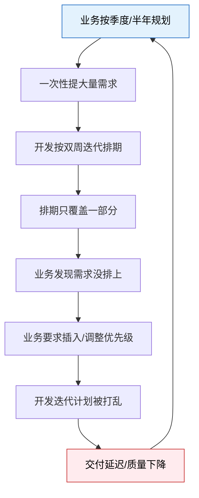
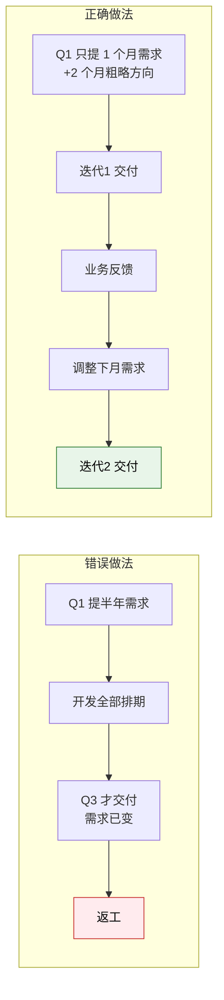
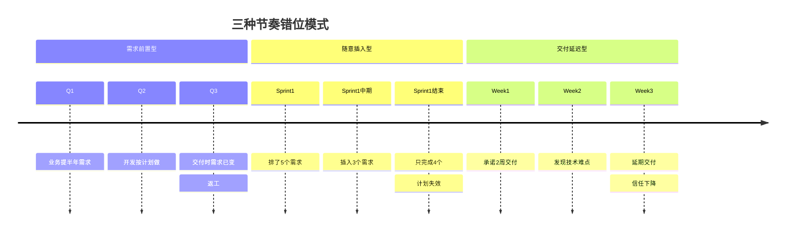

# 迭代节奏错位

## 一、节奏错位的典型表现

数字化转型项目中，业务和开发的"时钟"是不一样的：

| 维度 | 业务的节奏 | 开发的节奏 |
|------|-----------|-----------|
| 规划周期 | 按季度/半年提需求 | 按双周/月迭代交付 |
| 期望响应 | "这个需求能不能下周上线？" | "排期在下一个迭代，3 周后交付" |
| 变更态度 | 需求随时调整是正常的 | 迭代内变更影响交付承诺 |
| 完成定义 | 能解决我的问题 | 功能开发完毕，测试通过 |

两边的节奏对不上，后果是：

- **业务觉得太慢**："提了需求两个月了还没上线"
- **开发觉得需求不稳**："需求改了 3 次，每次都说'就改一点点'"
- **项目陷入恶性循环**：业务催 → 开发赶工 → 质量下降 → 返工 → 更慢 → 业务更急

## 二、国内"假敏捷"现状

很多企业名义上搞敏捷，实际上只是把瀑布模型拆小了——"小瀑布"。

### "假敏捷"的典型表现

| 仪式 | 名义上 | 实际上 |
|------|--------|--------|
| 站会 | 同步进度、暴露阻塞 | 汇报昨天干了什么，跟写日报没区别 |
| Sprint | 有明确的迭代目标和交付承诺 | 迭代内容随时变，Sprint 结束拿不出可运行的东西 |
| 回顾 | 总结改进，持续优化 | 走过场，提出的问题下次还在 |
| 需求梳理 | 产品和开发共同拆分需求 | 产品写完需求扔给开发，开发没有参与感 |
| 交付演示 | 每个 Sprint 给业务演示可运行的功能 | 做完几个 Sprint 业务才第一次看到，然后大改 |

### 名义敏捷 vs 实际做法 vs 正确做法

| 维度 | 名义敏捷 | 实际做法（小瀑布） | 正确做法 |
|------|---------|------------------|---------|
| 迭代周期 | 2 周 | 2 周，但需求在第 1 周还在改 | 2 周，迭代开始后需求锁定 |
| 交付物 | 可运行的软件 | 代码写完了但没测试 | 可部署、可演示的功能 |
| 需求变更 | 迭代间可调整 | 迭代内随时插需求 | 迭代内不接受非紧急变更 |
| 业务参与 | 每次演示参与 | 最后才看 | 每个迭代演示并反馈 |
| 回顾效果 | 持续改进 | 提了不改 | 每次回顾至少落实 1 项改进 |

**根本问题**：敏捷不是"快"，是"可预期"。很多企业只学了敏捷的形式（站会、Sprint），没学到核心——**小步交付、快速反馈、持续调整**。

## 三、三种节奏错位模式

### 模式 1：需求前置型

**表现**：业务一次性提半年甚至一年的需求，要求开发全部分析、排期、承诺交付时间。

**问题**：

- 3 个月后业务需求已经变了，但开发还在按原始需求做
- 业务变更要走"变更流程"，流程走完开发已经做完了一半
- 大量需求分析了但没做，分析成本浪费

**解决**：需求分批提，每批只提下一个迭代的需求，最多提前 2 个迭代做粗略规划。

### 模式 2：随意插入型

**表现**：业务随时提需求，开发随时改，没有需求池和优先级排序。

**问题**：

- 迭代计划形同虚设，开发永远在"救火"
- 高优先级需求和低优先级需求抢资源
- 开发疲于奔命，代码质量下降

**解决**：建立需求池 + 优先级排序，非紧急需求进下个迭代。

| 场景 | 处理方式 |
|------|---------|
| 生产 Bug | 立即修复，不受迭代约束 |
| 业务紧急需求（影响上线/合规） | 当前迭代插入，但必须替换等量工作 |
| 普通业务需求 | 进入需求池，按优先级排入下个迭代 |
| 优化类需求 | 进入需求池，优先级最低 |

### 模式 3：交付延迟型

**表现**：开发承诺 2 周交付，实际 3 周；承诺月度上线，实际延期 2 周。

**问题**：

- 业务失去信任，开始催进度、加需求缓冲
- 开发为了赶进度牺牲质量，埋下技术债
- 项目计划越来越不可信

**解决**：降低承诺，提高交付确定性——宁可承诺少一点，也要说到做到。

| 策略 | 说明 |
|------|------|
| **承诺 80% 的能力** | 团队能做 10 个点，只承诺 8 个点，留 2 个点的缓冲 |
| **拆小交付** | 把大需求拆成 2-3 个迭代交付，每个迭代都有可运行的东西 |
| **提前预警** | 迭代中期发现交付有风险，立即通知业务，不要到最后一天才说 |
| **不承诺不确定的事** | 涉及第三方集成、性能优化等不确定因素时，只承诺"完成调研"而不是"完成功能" |

### 三种模式的时间线对比

## 四、产品经理作为"节奏缓冲层"

在业务和开发之间，产品经理不是"传话筒"，而是"缓冲器"和"翻译器"。

### 产品经理的核心价值

| 价值 | 说明 |
|------|------|
| **翻译** | 把业务的季度规划翻译为开发可执行的迭代计划 |
| **缓冲** | 把业务的"全部都要"缓冲为"分批交付" |
| **取舍** | 在业务和开发之间做优先级取舍 |
| **对齐** | 让业务理解开发的技术约束，让开发理解业务的时效要求 |

### 有无产品经理的节奏对比

| 场景 | 没有产品经理 | 有产品经理 |
|------|------------|-----------|
| 业务提需求 | 业务直接找开发，开发被动接受 | 产品经理先过滤、拆分、排优先级 |
| 需求变更 | 业务直接找开发改，开发计划被打乱 | 产品经理评估影响，决定当期改还是下期改 |
| 交付反馈 | 开发做完给业务看，业务不满意大改 | 产品经理每个迭代验收，及时纠偏 |
| 进度沟通 | 业务问开发"什么时候做完"，开发说"快了" | 产品经理给业务明确的迭代计划和交付预期 |
| 需求冲突 | 两个部门都要求优先做，开发不知道听谁的 | 产品经理按业务价值和紧急度排优先级 |

**关键认知**：产品经理不是"需求的搬运工"，而是"需求的管理者"。一个好的产品经理，能让业务的节奏和开发的节奏逐步趋同。

### 产品经理的节奏管理方法

1. **把季度规划拆解为月度 MVP**：业务说"Q3 上线新采购系统"，产品经理拆为"7 月上供应商管理 + 8 月上采购订单 + 9 月上审批和对账"
2. **把技术约束翻译为业务语言**：不说"这个要改表结构，需要 2 周"，而是说"这个调整会影响现有数据，需要预留迁移时间，建议放下一期"
3. **给业务"确定性"**：不说"可能可以做完"，而是说"迭代 1 交付 A 功能，迭代 2 交付 B 功能，C 功能需要额外评估"

## 五、务实建议

不要追求 Scrum 的完整仪式，从最核心的实践开始，逐步优化。

### 从 2 个实践开始

| 实践 | 怎么做 | 为什么 |
|------|--------|--------|
| **迭代规划** | 每个迭代开始前，业务/产品/开发一起确认这个迭代做什么、交付什么 | 让所有人目标一致，开发知道做什么，业务知道预期什么 |
| **交付演示** | 每个迭代结束，给业务演示可运行的功能 | 让业务看到进度、提供反馈，而不是等项目做完才发现不对 |

### 关键原则

| 原则 | 说明 |
|------|------|
| **每个迭代必须给业务看可运行的东西** | 哪怕只是一个页面、一个流程，有东西看才有真实反馈 |
| **需求变更率 > 30% 说明前期理解不足** | 应该改进需求分析质量，而不是加强变更控制流程 |
| **用 MVP 思维** | 最小可用版本先上线，快速迭代。不要等 100% 完美才上线——完美永远不会来 |
| **交付确定性 > 交付速度** | 宁可承诺慢一点、稳定交付，也不要承诺快、经常延期 |
| **迭代长度不要超过 2 周** | 超过 2 周，反馈周期太长，风险积累太多 |

### 常见误区

| 误区 | 真相 |
|------|------|
| "敏捷就是快" | 敏捷是"可预期"，不是"快"。可预期比快更重要 |
| "敏捷就是不要文档" | 敏捷是不写没人看的文档，不是不要文档。实例化的验收标准必须写 |
| "敏捷就是随时可以改需求" | 敏捷是"迭代间可以调整"，不是"迭代内随便改" |
| "站会就是敏捷" | 站会只是仪式，没有迭代规划和交付演示，站会就是走过场 |
| "业务没时间参与迭代规划" | 业务不参与，做出来的东西就不是业务要的——这个时间必须花 |

### 给不同角色的建议

| 角色 | 建议 |
|------|------|
| **业务方** | 不要一次性提半年需求，分批提、分批验证。每个迭代花 30 分钟看演示，比最后一周验收有效 10 倍 |
| **产品经理** | 你的核心价值不是写 PRD，是管理节奏。确保每个迭代有明确目标、有可演示的交付、有业务反馈 |
| **开发团队** | 交付承诺要保守，宁可少承诺、多交付。每个迭代必须拿出可运行的东西，哪怕是部分功能 |
| **项目经理** | 关注交付确定性而非速度。延期一次的信任损失，需要 3 次准时交付才能修复 |
