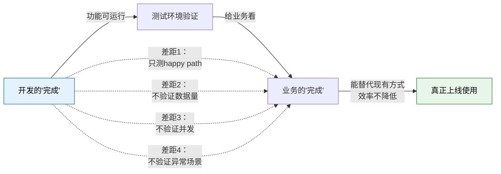

# 验收标准与交付物对齐

## 一、"能跑就行" ≠ "能用起来"

开发眼中的"完成"和业务眼中的"完成"是两回事：

| 维度 | 开发的"完成" | 业务的"完成" |
|------|------------|------------|
| 定义 | 功能开发完毕，代码合并，测试通过 | 能替代现有工作方式，效率不降低 |
| 标准 | 功能可运行，无 Bug | 日常操作流畅，数据准确，异常能处理 |
| 关注点 | 代码质量、功能完整性 | 操作体验、业务连续性、数据可靠性 |
| 验证方式 | 功能测试（按功能点） | 场景测试（按业务流程） |

**两者之间的鸿沟**：

- 开发觉得"报表功能做完了"——但业务需要的是每天早上自动推送到邮箱的报表，不是要登录系统手动查询
- 开发觉得"审批流程通了"——但业务需要的是移动端也能审批，不是只能坐在电脑前审批
- 开发觉得"数据导入功能有了"——但业务需要的是导入 10000 条数据不出错，不是导入 10 条测试数据能跑通



## 二、验收标准模糊的五种表现

| 表现 | 典型话术 | 问题 | 后果 |
|------|---------|------|------|
| **1. "和现在一样就行"** | "新系统和老系统功能一样就行" | 老系统 100 个功能，哪些在用？哪些没人用？没人说清 | 做了一堆没人用的功能，该做的没做 |
| **2. "到时候看"** | "先做，做出来看看" | 没有标准就没有判断依据 | 做出来业务不满意，无限返工 |
| **3. "参考 XX 系统"** | "你看看 SAP/金蝶/用友怎么做" | XX 系统 100 个功能，你要哪些？ | 开发照着抄了一个大的，业务只用 5 个 |
| **4. "领导说的"** | "老板要求做这个功能" | 领导到底说了什么？什么场景？什么条件？ | 理解偏差，做出来领导说"这不是我说的" |
| **5. "差不多就行"** | "功能差不多就可以上线了" | 开发的"差不多"和业务的"差不多"差很多 | 上线后问题不断，业务说"这叫差不多？" |

**根本原因**：验收标准模糊不是因为懒，是因为业务方往往在上新系统之前，自己也没想清楚"新系统到底要什么"。他们有的是痛点，但没有把痛点转化为可验证的标准。

## 三、验收标准制定方法

### 方法 1：Given-When-Then

用结构化的格式描述验收条件，消除模糊空间。

**格式**：

```
Given（前置条件）+ When（操作）+ Then（期望结果）
```

**示例**：

| 功能 | Given | When | Then |
|------|-------|------|------|
| 采购订单同步 | 采购订单已创建且审批已通过 | 在 WMS 中查询预到货通知 | 应显示对应的预到货通知，含供应商、预期到货日期 |
| 库存预警 | SKU-001 可用库存 < 安全库存 100 件 | 系统自动检查 | 向采购员张三发送预警消息，消息含 SKU 编码、当前库存、安全库存 |
| 审批路由 | 采购订单金额 > 50 万 | 提交审批 | 审批流程自动走合规岗位审批路径 |
| 退货入库 | 退货单已审批 | WMS 执行退货入库 | ERP 库存增加，库存状态为"待检"，非"可用" |

**为什么有效**：

- 每个验收条件都有明确的输入和输出，没有歧义
- Given-When-Then 直接可以转化为自动化测试用例
- 业务方看得懂，可以确认"对，这就是我期望的"

### 方法 2：业务场景验收

不按功能点验收，按业务场景验收——功能点是拆开的，业务场景是完整的。

**功能点验收 vs 业务场景验收**：

| 验收方式 | 验收内容 | 问题 |
|---------|---------|------|
| 功能点验收 | 采购订单创建 ✓、审批 ✓、WMS 收货 ✓、ERP 入库 ✓ | 每个功能单独看都没问题，但串起来可能走不通 |
| 业务场景验收 | "采购入库场景"：从采购订单创建 → 审批 → WMS 收货 → ERP 库存增加，全链路验证 | 确保端到端流程畅通 |

**典型业务场景清单**：

| 场景 | 起点 | 终点 | 覆盖系统 |
|------|------|------|---------|
| 采购入库 | ERP 创建采购订单 | ERP 库存增加 | ERP → WMS → ERP |
| 销售出库 | ERP 创建销售订单 | ERP 库存减少、WMS 发货完成 | ERP → WMS → ERP |
| 生产领料 | MES 创建工单 | WMS 线边仓库存减少 | MES → WMS |
| 生产入库 | MES 工单完工 | ERP 库存增加 | MES → WMS → ERP |
| 退货处理 | 客户发起退货 | 退货入库、库存状态变更 | ERP → WMS → ERP |

**原则**：验收时至少覆盖 3 类场景——正常场景、边界场景、异常场景，比例大约 6:2:2。

### 方法 3：数据验收

准备验收数据集，含正常数据 + 边界数据 + 异常数据，验收时跑一遍数据集，看结果是否符合预期。

**数据集设计**：

| 数据类型 | 占比 | 示例 |
|---------|------|------|
| 正常数据 | 60% | 常规采购订单、正常库存数量、标准审批流程 |
| 边界数据 | 20% | 金额刚好 = 50 万的订单、库存 = 安全库存、审批人为空 |
| 异常数据 | 20% | 金额为负数、重复提交、网络超时、关联数据被删除 |

**验收执行**：

1. 将数据集导入验收环境
2. 按业务场景逐个执行操作
3. 对比实际结果与期望结果
4. 记录所有差异，分类为 Bug / 需求变更 / 数据问题

## 四、UAT（用户验收测试）实操指南

UAT 不是"让业务随便点两下"，而是有组织、有标准、有结论的正式验收活动。

### Phase 1：准备阶段（1-2 周）

| 活动 | 内容 | 产出物 |
|------|------|--------|
| 编写验收用例 | 以业务场景驱动，不是功能点驱动 | 每个场景有 Given-When-Then 的验收条件 |
| 准备验收数据 | 正常 + 边界 + 异常数据集 | 可导入验收环境的数据脚本 |
| 确定验收标准 | 量化通过条件 | 验收通过标准文档 |
| 分配验收人员 | 业务关键用户 + 日常操作人员 | 验收人员清单和时间安排 |
| 环境准备 | 验收环境配置、数据初始化 | 可用的验收环境 |

**验收通过标准示例**：

| 场景类型 | 通过标准 | 说明 |
|---------|---------|------|
| 关键场景 | 100% 通过 | 采购入库、销售出库等核心流程，一个不过就不上线 |
| 次要场景 | 90% 通过 | 报表查询、数据导出等，少量问题可带病上线 |
| 非关键场景 | 80% 通过 | 个性化配置、辅助功能，可后续迭代 |

### Phase 2：执行阶段（1-2 周）

| 活动 | 内容 | 注意事项 |
|------|------|---------|
| 业务人员亲自操作 | 不是看演示，是亲手操作 | 开发人员在场解答问题，但不代操作 |
| 记录所有问题 | Bug、易用性问题、效率问题 | 不只记 Bug，"不顺手"也要记 |
| 每日回顾 | 每天下班前回顾当天验收进度和问题 | 确保问题及时响应，不积累 |
| 问题分类 | Bug / 需求变更 / 操作培训 | 不同类型不同处理流程 |

**问题记录模板**：

| 字段 | 内容 |
|------|------|
| 问题编号 | UAT-001 |
| 场景 | 采购入库 - 供应商送货 |
| 操作步骤 | 在 WMS 中扫描收货 → 确认数量 |
| 期望结果 | 扫描 3 箱，确认 3 箱，ERP 库存增加 3 箱 |
| 实际结果 | 扫描 3 箱，确认页面显示 3 箱，但 ERP 库存增加了 4 箱 |
| 问题类型 | Bug |
| 严重程度 | P0 - 数据错误 |
| 处理方案 | 修复后重新验收该场景 |

### Phase 3：评估阶段

**验收结论不是"没问题"或"有问题"，必须有量化结果**：

| 指标 | 标准 | 实际结果 | 是否通过 |
|------|------|---------|---------|
| 关键场景通过率 | 100% | 98% | 否（2 个关键场景未通过） |
| 次要场景通过率 | ≥ 90% | 92% | 是 |
| P0 Bug 数量 | 0 | 2 | 否 |
| P1 Bug 数量 | ≤ 3 | 1 | 是 |
| 整体通过率 | ≥ 95% | 94% | 否 |

**遗留问题分级**：

| 级别 | 定义 | 处理方式 |
|------|------|---------|
| **P0** | 数据错误、核心流程不通 | **必须修复**，上线前必须解决 |
| **P1** | 功能缺陷、业务规则错误 | **上线前修复**，否则该功能不上线 |
| **P2** | 体验问题、非关键功能缺陷 | **上线后修复**，列入第一个迭代 |
| **P3** | 优化建议、个性化需求 | **后续版本**，纳入需求池 |

### UAT Checklist

| 序号 | 检查项 | 是否完成 | 备注 |
|------|--------|---------|------|
| 1 | 验收用例已编写并通过业务审核 | ☐ | 以业务场景为单位 |
| 2 | 验收数据已准备（正常+边界+异常） | ☐ | 数据量与生产量级接近 |
| 3 | 验收标准已量化并经双方确认 | ☐ | 不能用"没问题"作为结论 |
| 4 | 验收环境已就绪，与生产环境差异可接受 | ☐ | 特别注意数据量、配置差异 |
| 5 | 验收人员已确认，时间已安排 | ☐ | 业务关键用户必须参与 |
| 6 | 业务人员已接受系统操作培训 | ☐ | 不能边学边验 |
| 7 | 关键业务场景已全部覆盖 | ☐ | 端到端流程，不是单个功能 |
| 8 | 异常场景至少占 30% | ☐ | 不能只测 happy path |
| 9 | 问题记录机制已建立 | ☐ | Bug + 易用性 + 效率 |
| 10 | 问题分级标准已确认 | ☐ | P0-P3 分级 |
| 11 | 每日回顾机制已建立 | ☐ | 问题不过夜 |
| 12 | 数据迁移已验证 | ☐ | 迁移后数据完整性和准确性 |
| 13 | 性能指标已验证 | ☐ | 响应时间、并发数 |
| 14 | 集成接口已验证 | ☐ | 跨系统数据一致性 |
| 15 | 运维交接已完成 | ☐ | 上线后支持方案已确认 |

## 五、交付物对齐：业务和开发必须就 5 件事达成一致

| 序号 | 对齐事项 | 说明 | 模糊的后果 |
|------|---------|------|-----------|
| **1** | **交付范围** | 哪些做、哪些不做、哪些下期做 | 上线时业务说"这个功能呢？"，开发说"这个没排进来" |
| **2** | **验收标准** | 每个功能/场景的通过条件 | 业务觉得"不行"，开发觉得"我做好了"，各执一词 |
| **3** | **数据标准** | 数据迁移的完整性和准确性要求 | 上线后数据丢失或错误，业务无法正常工作 |
| **4** | **性能标准** | 响应时间、并发数、数据量 | 上线后系统卡顿，业务回到线下操作 |
| **5** | **运维交接** | 上线后谁负责、响应时间、升级流程 | 上线出问题找不到人，业务被迫停摆 |

### 每个事项的量化示例

**交付范围**：

| 功能模块 | 本期交付 | 下期交付 | 不做 |
|---------|---------|---------|------|
| 采购订单管理 | 创建、审批、查询、变更 | 供应商协同 | 比价功能 |
| WMS 收货 | ASN 接收、质检、上架 | 跨仓调拨 | AGV 集成 |
| 库存查询 | 实时库存、库存预警 | 库存分析 | 库存优化 |

**数据标准**：

| 指标 | 标准 |
|------|------|
| 数据完整性 | 迁移后数据条数与源系统一致，差异率 < 0.01% |
| 数据准确性 | 随机抽检 500 条记录，准确率 > 99.9% |
| 历史数据 | 近 3 年数据全量迁移，3 年以前数据归档可查 |

**性能标准**：

| 场景 | 指标 | 标准 |
|------|------|------|
| 页面加载 | 首屏加载时间 | < 2 秒 |
| 列表查询 | 1000 条数据查询响应 | < 3 秒 |
| 批量操作 | 导入 10000 条数据 | < 30 秒 |
| 并发能力 | 同时在线用户数 | ≥ 200 |
| 报表生成 | 月度汇总报表 | < 10 秒 |

**运维交接**：

| 事项 | 标准 |
|------|------|
| 上线后支持期 | 上线后 2-4 周驻场支持 |
| 响应时间 | P0 问题 30 分钟内响应，2 小时内解决 |
| 升级流程 | 变更申请 → 测试验证 → 变更窗口 → 上线 → 验证 |
| 知识交接 | 操作手册、运维手册、常见问题处理指南 |

## 六、避坑指南

| 坑 | 说明 | 怎么避 |
|----|------|--------|
| **"没问题"作为验收结论** | "没问题"是最危险的结论——要么是没认真测，要么是问题还没暴露 | 验收结论必须有量化数据：场景通过率、Bug 数量、遗留问题清单 |
| **UAT 只测 happy path** | 正常流程谁都会做，出问题的是异常场景 | 异常场景至少占 30%：数据异常、权限异常、网络异常、操作异常 |
| **业务只看演示不操作** | 看演示觉得"挺好"，自己操作才发现各种不顺手 | 业务必须亲手操作，不能只看演示 |
| **验收环境和生产环境不一致** | 验收环境数据量小、没并发、配置简化，上线后问题全暴露 | 验收环境数据量/配置尽量接近生产，差异项必须列出并评估风险 |
| **上线 = 项目结束** | 上线后 2-4 周是"稳定期"，问题集中爆发，必须有驻场支持 | 预留上线后的稳定期支持资源，这不是"运维"是"交付的延伸" |
| **数据迁移不验证** | 上线后发现历史数据丢了、错了，业务无法开展 | 数据迁移后必须做完整性校验和准确性抽检 |
| **验收标准后置** | 做完了才开始讨论"什么叫完成" | 验收标准在开发启动前就定义好，不是做完了再补 |
| **一个人验收** | 一个业务代表验收不等于整个业务部门验收 | 关键用户 + 日常操作人员都参与验收，覆盖不同角色的使用场景 |

### 上线后的"稳定期"怎么管

上线 ≠ 项目结束。上线后 2-4 周是问题集中爆发的"稳定期"，管理方式：

| 时间段 | 重点 | 人员配置 |
|--------|------|---------|
| 上线后第 1 周 | 保驾护航，现场支持 | 开发 2-3 人驻场，即时响应 |
| 上线后第 2 周 | 问题收敛，重点修复 | 开发 1-2 人驻场，问题分级处理 |
| 上线后第 3-4 周 | 稳定运行，转入运维 | 开发 1 人值守，问题走工单 |

**稳定期结束的标准**：

- P0/P1 问题全部清零
- 业务日均问题数 < 3 个
- 业务操作人员可独立完成日常操作
- 运维团队已接管日常支持
