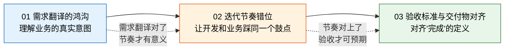

# 开发与业务协作

> 数字化项目失败，技术原因只占 20%，剩下 80% 都是协作问题——需求翻译失真、节奏对不上、验收标准模糊。这些问题不解决，技术再好也是白搭。

## 本章导读

很多企业的数字化转型卡在一个尴尬的境地：系统开发完了，业务不用；或者业务说"不是我要的"，开发说"你当时就是这么说的"。这不是谁对谁错，而是开发与业务之间横亘着三道鸿沟——需求翻译、迭代节奏、验收标准。

本章不讲"沟通技巧"这种虚的东西，而是拆解三个具体问题，每个问题给出可操作的方法：

| 问题 | 核心矛盾 | 对应文章 |
|------|---------|---------|
| **需求翻译** | 业务说的 ≠ 开发听的 ≠ 实际需要的 | [需求翻译的鸿沟](01_需求翻译的鸿沟.md) |
| **节奏错位** | 业务按季度想，开发按周交付，两边对不上 | [迭代节奏错位](02_迭代节奏错位.md) |
| **验收标准** | 开发觉得"能跑"，业务觉得"不能用" | [验收标准与交付物对齐](03_验收标准与交付物对齐.md) |

## 文章关系

先解决"听懂对方说什么"的问题（需求翻译），再解决"怎么配合着做"的问题（迭代节奏），最后解决"做到什么程度算完"的问题（验收对齐）。这是从理解到执行到闭环的完整路径。
