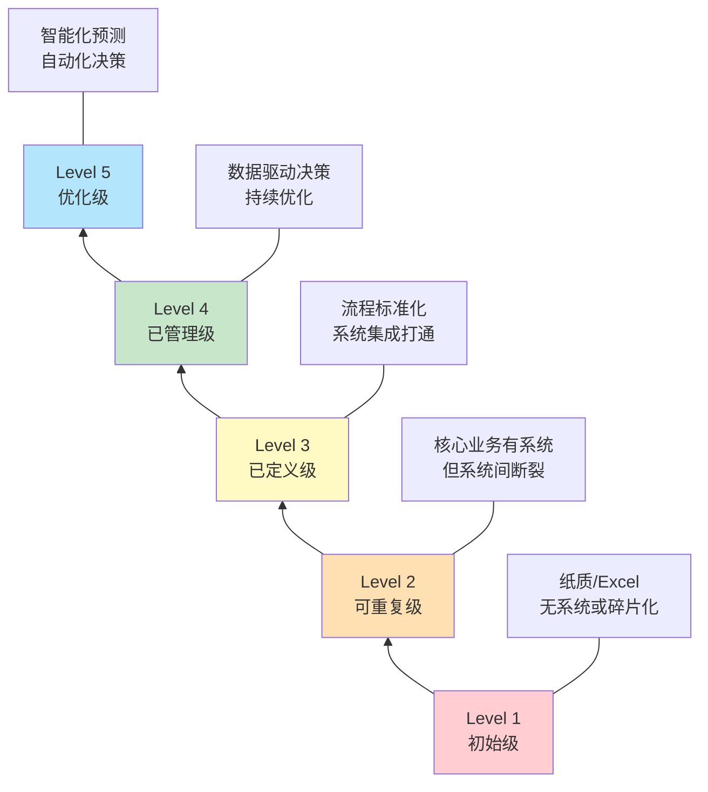
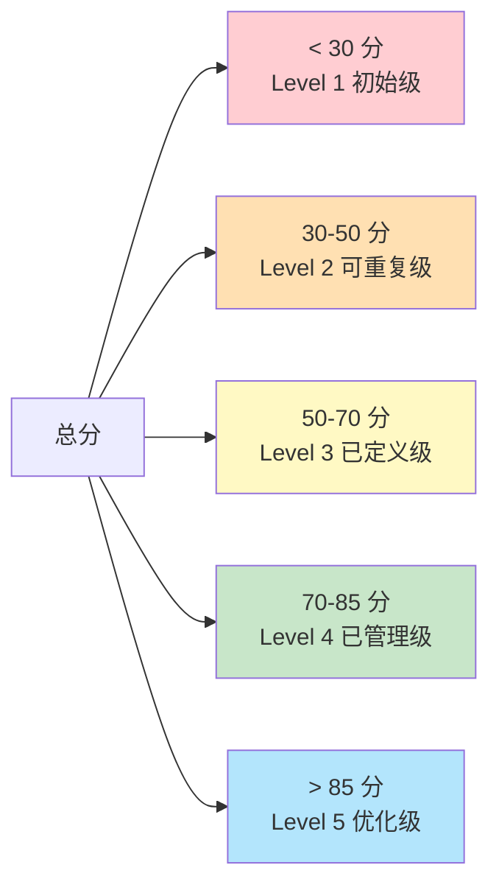
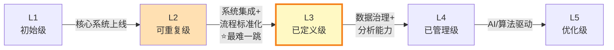

# 企业成熟度模型

> 不评估就不知道差距，不知道差距就无法规划路径。很多企业连数据基础都没有，就想着上 AI——这跟地基没打就要盖顶楼一样。

## 一、为什么要做成熟度评估

### 1.1 不评估的代价

先看一个典型场景：

> 某中型制造企业，年营收 8 亿，董事长从行业峰会回来后拍板："我们要上智能工厂！"
>
> - IT 部门连夜写方案，规划了 MES + WMS + APS + 数据中台 + AI 质检
> - 预算 2000 万，分两期实施
> - 一期上线 MES 后发现：BOM 不准、工艺路线缺失、基础数据混乱
> - MES 上线 6 个月，车间还在用 Excel 排产
> - 董事长怒斥 IT 部门无能，IT 部门委屈——数据不是他们造的

这个案例的根因不是 IT 能力不行，而是**企业连 L2 都没到就直奔 L4**。没有成熟度评估，就不知道自己站在哪一级台阶上。

### 1.2 成熟度评估的核心价值

| 价值 | 说明 |
|------|------|
| **定位现状** | 知道自己在哪一级，避免跳级建设 |
| **量化差距** | 把"数字化程度低"这种模糊判断变成具体分数 |
| **规划路径** | 不同级别之间有明确的跃迁条件和关键动作 |
| **统一认知** | 让管理层、业务部门、IT 部门对"我们在哪"达成共识 |
| **规避风险** | 跳级建设的失败率远高于逐级提升 |

## 二、五级成熟度模型

### 2.1 模型总览

### 2.2 Level 1 — 初始级

**定义：**企业核心业务依赖纸质单据或 Excel 管理，信息系统碎片化或完全缺失。

**系统建设特征：**
- 可能只有财务软件（用友 T3、金蝶 KIS）
- 仓库用 Excel 管库存，车间用纸质工单
- 采购、销售、生产各环节无系统支撑
- 即使有零散系统，也是各买各的、互不相通

**数据特征：**
- 数据散落在各部门的 Excel 表中
- 同一个物料，采购叫 A、仓库叫 B、财务叫 C
- 没有主数据管理，数据标准不存在
- 历史数据无法追溯

**流程特征：**
- 流程在人的脑子里，老员工走了流程就断了
- 审批靠纸质签字或微信
- 异常处理全靠"找领导"

**人员特征：**
- 关键岗位依赖个别"老师傅"
- 没有专门的 IT 团队或只有 1-2 人运维
- 管理层对数字化的认知停留在"上个软件"

**典型企业画像：**
> 年营收 1-3 亿的传统制造企业，老板靠经验管理，财务用友 T3 记账，仓库 Excel 管库存，生产车间纸质排产。信息化投入累计不超过 30 万。

### 2.3 Level 2 — 可重复级

**定义：**核心业务已有系统支撑，但系统之间断裂，存在信息孤岛，流程未标准化。

**系统建设特征：**
- ERP 已上线（用友 U8、金蝶云星空），覆盖财务+进销存
- 可能上了 WMS 或 MES 中的一个，但与 ERP 未打通
- 采购有 SRM 或在 ERP 内做，但数据不自动流转
- 各系统各自为政，需要人工搬运数据

**数据特征：**
- 各系统内部数据基本规范，但跨系统数据不一致
- 同一客户在 ERP 和 CRM 里编码不同
- 月底对账靠人工核对多个系统
- 有数据但不可信

**流程特征：**
- 核心流程有系统支撑但执行不严格
- 系统外仍有大量线下操作
- 部门间流程衔接靠人工传递
- 流程变更时系统跟不上

**人员特征：**
- 有 3-5 人的 IT 团队
- 业务部门有"关键用户"但能力参差不齐
- IT 和业务存在"鸡同鸭讲"的问题
- 管理层开始重视数据但不会用

**典型企业画像：**
> 年营收 3-10 亿，ERP 上线 2-3 年，财务和进销存基本跑通。但车间还在用 Excel 排产，仓库有 WMS 但和 ERP 库存经常对不上，每月末仓库和财务要对账 3 天。

### 2.4 Level 3 — 已定义级

**定义：**核心流程标准化并文档化，主要系统之间实现集成，数据可跨系统流转。

**系统建设特征：**
- ERP + MES + WMS 核心铁三角已上线且打通
- 主数据统一管理（物料、客户、供应商编码统一）
- 系统间通过接口自动同步数据
- 可能已上线 PLM 或 SRM

**数据特征：**
- 主数据统一，跨系统编码一致
- 业务数据可跨系统追溯（从订单到工单到入库到发货）
- 数据质量有基本的治理机制
- 有数据但分析能力有限，主要靠报表

**流程特征：**
- 核心流程标准化、文档化
- 流程执行由系统驱动而非人驱动
- 跨部门流程有系统衔接
- 有流程变更管理机制

**人员特征：**
- IT 团队 5-15 人，有专职的系统和运维岗
- 业务部门有成熟的关键用户体系
- 有数据分析师或 BI 岗位（但可能只有 1-2 人）
- 管理层能看到报表但决策仍主要靠经验

**典型企业画像：**
> 年营收 10-50 亿，行业腰部企业。ERP+MES+WMS 已打通，从订单到交付全流程可追溯。但数据分析仍以固定报表为主，异常还是靠人发现，决策还是靠拍脑袋。

### 2.5 Level 4 — 已管理级

**定义：**数据驱动决策成为常态，核心业务指标可量化、可监控、持续优化。

**系统建设特征：**
- 核心业务系统全覆盖（ERP+MES+WMS+PLM+QMS+SRM）
- BI/数据平台已上线，管理层看驾驶舱做决策
- 系统间深度集成，数据实时同步
- 有数据治理团队和治理平台

**数据特征：**
- 数据质量有度量、有考核
- 经营分析从报表升级到自助分析
- 有数据仓库/数据湖，数据资产可管理
- 数据驱动日常运营决策

**流程特征：**
- 流程执行有 KPI 监控
- 流程瓶颈可通过数据发现和定位
- 有持续优化机制（PDCA）
- 流程变更可快速落地到系统

**人员特征：**
- IT 团队 15-50 人，有架构师、数据工程师
- 业务部门有自己的数据分析师
- 管理层习惯看数据做决策
- 有专职的数据治理团队

**典型企业画像：**
> 年营收 50 亿以上，行业头部企业。全系统覆盖+深度集成，BI 驾驶舱日日更新。但预测能力有限，优化仍靠人判断，AI 应用停留在质检等单点场景。

### 2.6 Level 5 — 优化级

**定义：**智能化预测与自动化决策，系统自主优化，人机协同成为常态。

**系统建设特征：**
- AI/ML 嵌入核心业务流程
- APS 实现智能排产，预测性维护替代定期维护
- 数字孪生用于产线优化和仿真
- 系统自主决策比例 > 30%

**数据特征：**
- 实时数据流驱动实时决策
- 预测模型持续自学习优化
- 数据资产化，数据可直接变现
- 异常由系统自动识别并触发响应

**流程特征：**
- 自适应流程——系统根据实时数据调整流程
- 流程优化由算法驱动而非人工判断
- 跨企业流程协同（与供应商、客户的系统直连）
- 无人值守场景比例高

**人员特征：**
- IT 团队 50+ 人，有 AI/ML 工程师
- 业务人员具备数据思维
- 管理层关注模型效果而非数据本身
- 人机协同是工作常态

**典型企业画像：**
> 全球头部制造企业（如西门子安贝格、海尔沈阳冰箱），智能工厂标杆。APS 自动排产，AI 质检替代人工，预测性维护减少停机 40%+，产线换型由系统自动调度。

## 三、各系统成熟度评估维度

| 系统 | L1 特征 | L2 特征 | L3 特征 | L4 特征 | L5 特征 |
|------|---------|---------|---------|---------|---------|
| **ERP** | 无或仅财务模块 | 财务+进销存上线 | 全模块覆盖，主数据统一 | 与全系统集成，实时数据 | 智能预测补货，自动下单 |
| **WMS** | Excel 管库存 | 基础入库出库功能 | 库位管理+批次追溯+与 ERP 打通 | 动态库位优化+波次策略 | AI 预测需求+自动补货+无人仓 |
| **MES** | 纸质工单+排产表 | 基础报工+产量统计 | 工序级排产+物料追溯+质量记录 | 实时监控+SPC+与 APS 联动 | AI 质检+自适应排产+数字孪生 |
| **PLM** | 图纸纸质管理 | 文档管理+版本控制 | BOM 管理+变更流程+与 ERP 集成 | 协同设计+仿真验证 | 生成式设计+AI 优化产品参数 |
| **QMS** | 质检记录在纸质 | 检验记录线上化 | 不合格品流程+8D+CAPA | SPC 统计过程控制+预测质量 | AI 质检+零缺陷预测 |
| **SCM** | 采购靠电话+微信 | SRM 基础寻源+订单 | 供应商协同+VMI+交付跟踪 | 需求预测+库存优化+网络规划 | 供应链控制塔+AI 预测+自主调度 |
| **数据治理** | 无 | 各系统数据各自为政 | 主数据统一+数据标准 | 数据质量度量+数据资产化 | 数据自服务+AI 元数据管理 |

## 四、自我评估工具

### 4.1 评分表

| 评估项 | 权重 | 1 分 | 2 分 | 3 分 | 4 分 | 5 分 |
|--------|------|------|------|------|------|------|
| 流程标准化程度 | 10% | 流程全在人脑中 | 部分流程有文档 | 核心流程标准化 | 全流程标准化+考核 | 流程持续优化 |
| 数据一致性 | 10% | 同一数据多处不同 | 主要数据基本一致 | 主数据统一管理 | 跨系统数据实时一致 | 数据自校验+自修正 |
| 系统集成度 | 10% | 系统完全独立 | 少量手工导入导出 | 核心系统接口打通 | 全系统实时集成 | 集成平台+事件驱动 |
| 数据驱动决策能力 | 10% | 决策全靠经验 | 有固定报表参考 | BI 自助分析 | 管理驾驶舱+预警 | AI 辅助决策 |
| 异常处理能力 | 8% | 异常靠人发现 | 异常靠人上报 | 系统自动提醒 | 系统自动响应 | 系统预测+自动处理 |
| 主数据管理水平 | 8% | 无主数据概念 | 部分主数据有规范 | 主数据平台统一管理 | 主数据质量有考核 | 主数据自治理 |
| IT 团队能力 | 7% | 无专职 IT | 1-3 人运维 | 5-10 人有分工 | 15+ 人有架构能力 | 50+ 人含 AI 团队 |
| 系统覆盖率 | 7% | 仅财务有系统 | 核心 1-2 个系统 | ERP+MES+WMS | 全业务系统覆盖 | 系统+AI 全覆盖 |
| 用户使用深度 | 7% | 系统形同虚设 | 仅录入不分析 | 日常操作在系统 | 分析决策在系统 | 系统是工作唯一入口 |
| 变更管理能力 | 5% | 变更无管控 | 变更靠邮件通知 | 有变更流程 | 变更流程系统化 | 变更影响自动评估 |
| 安全与合规 | 5% | 无安全措施 | 基础权限管理 | 数据备份+权限+审计 | 等保合规+数据脱敏 | 安全运营中心 |
| 供应商管理 | 3% | 采购无系统 | SRM 基础功能 | 供应商协同+评估 | 供应商风险预警 | 供应链自主优化 |
| 培训与知识管理 | 3% | 无培训体系 | 入职培训 | 定期培训+知识库 | 学习型组织 | 知识自动沉淀+推送 |
| 业务与 IT 协作 | 3% | 互相推诿 | IT 被动响应需求 | 业务提需求 IT 实现 | 业务 IT 联合设计 | 业务自服务+IT 赋能 |
| 数据分析人才 | 4% | 无 | IT 兼做报表 | 有专职 BI 人员 | 业务有数据分析师 | AI 工程师+数据科学家 |

### 4.2 分数解读

**各等级的核心关注点：**

| 分数区间 | 成熟度等级 | 核心关注 |
|----------|-----------|---------|
| < 30 | L1 初始级 | 先把 ERP 上了，把核心业务搬到系统里 |
| 30-50 | L2 可重复级 | 打通核心系统间的数据流，统一主数据 |
| 50-70 | L3 已定义级 | 流程标准化落地，数据质量治理，BI 建设 |
| 70-85 | L4 已管理级 | 数据驱动决策，预测能力，持续优化机制 |
| > 85 | L5 优化级 | AI 嵌入业务流程，自动化决策，数字孪生 |

## 五、国内制造企业成熟度分布现状

### 5.1 整体分布

| 成熟度等级 | 占比 | 典型特征 |
|-----------|------|---------|
| Level 1 初始级 | ~40% | 中小制造企业为主，信息化投入 < 50 万 |
| Level 2 可重复级 | ~35% | 中型制造企业，ERP 已上线但未全面打通 |
| Level 3 已定义级 | ~18% | 行业腰部以上，核心系统已集成 |
| Level 4 已管理级 | ~5% | 行业头部企业，数据驱动决策 |
| Level 5 优化级 | ~2% | 全球标杆工厂，智能工厂示范 |

### 5.2 按行业分布

| 行业 | L1 占比 | L2 占比 | L3 占比 | L4 占比 | L5 占比 | 说明 |
|------|---------|---------|---------|---------|---------|------|
| 汽车整车 | 5% | 20% | 40% | 25% | 10% | 数字化程度最高的制造行业 |
| 汽车零部件 | 15% | 35% | 30% | 15% | 5% | 受整车厂拉动，Tier1 水平较高 |
| 3C 电子 | 10% | 30% | 35% | 18% | 7% | 产品迭代快，对 MES/APS 需求强 |
| 机械装备 | 30% | 35% | 25% | 8% | 2% | 多品种小批量，信息化基础参差 |
| 食品饮料 | 35% | 35% | 20% | 8% | 2% | 流程行业特征，对追溯合规要求高 |
| 医药 | 20% | 30% | 30% | 15% | 5% | GMP 合规驱动，信息化投入有保障 |
| 化工 | 25% | 35% | 25% | 12% | 3% | 安全环保压力大，DCS 普及但 MES 欠缺 |
| 传统制造 | 55% | 30% | 12% | 2% | 1% | 铸造、锻造、建材等，数字化最薄弱 |

**关键洞察：**行业间的差距远比想象中大。汽车行业 L3+ 占比超过 75%，而传统制造行业 L3+ 不到 15%。选型时一定要参考同行业同规模企业的实践，不要跨行业对标。

## 六、成熟度跃迁的关键门槛

### 6.1 各级跃迁概览

### 6.2 L1 → L2：核心系统上线

**跃迁条件：**ERP + 至少 1 个核心执行系统（WMS 或 MES）上线并稳定运行。

| 维度 | 内容 |
|------|------|
| 典型时间 | 6-18 个月 |
| 投资规模 | 50-200 万（含软件+实施+硬件） |
| 关键动作 | 选型实施 ERP → 主数据梳理 → 用户培训 → 上线运维 |
| 常见失败点 | ① 主数据不清理就上线 ② 业务部门参与度低 ③ 上线后运维跟不上 |
| 成功标志 | 核心业务数据在系统中流转，不再依赖 Excel 做核心业务 |

**最核心的一句话：**L1 到 L2 不需要做到完美，只需要做到"核心业务有系统管"。

### 6.3 L2 → L3：系统集成 + 流程标准化

**跃迁条件：**核心系统间数据打通，主数据统一，核心流程标准化并可执行。

| 维度 | 内容 |
|------|------|
| 典型时间 | 12-24 个月 |
| 投资规模 | 200-800 万 |
| 关键动作 | 主数据治理 → 系统接口开发 → 流程标准化落地 → 集成测试 |
| 常见失败点 | ① 低估数据治理难度 ② 接口开发一拖再拖 ③ 流程标准化遇到部门阻力 ④ 各系统供应商互相推诿 |
| 成功标志 | 从订单到交付全链路数据可追溯，不靠人工搬运数据 |

**为什么这是最难的一跳：**

> L1 到 L2 是"从 0 到 1"，老板拍板就行。L2 到 L3 是"从 1 到 N"，需要跨部门协同、数据标准统一、流程重构——每一个都涉及权力和利益的重新分配。技术上不难，组织上极难。

### 6.4 L3 → L4：数据治理 + 分析能力

**跃迁条件：**数据质量可度量、可考核，管理层基于数据做决策成为常态。

| 维度 | 内容 |
|------|------|
| 典型时间 | 12-18 个月 |
| 投资规模 | 300-1000 万 |
| 关键动作 | 数据治理体系建设 → BI/数据平台建设 → 分析场景落地 → 数据文化培养 |
| 常见失败点 | ① 数据治理没有业务驱动力 ② BI 做了一堆报表没人看 ③ 数据分析师和业务脱节 ④ 数据质量问题反复反弹 |
| 成功标志 | 管理层晨会看驾驶舱而非问人，异常由系统预警而非人发现 |

### 6.5 L4 → L5：AI/算法驱动的预测和优化

**跃迁条件：**AI/ML 嵌入核心业务流程，系统具备自主优化能力。

| 维度 | 内容 |
|------|------|
| 典型时间 | 18-36 个月 |
| 投资规模 | 500-2000 万+ |
| 关键动作 | AI 场景识别 → 数据准备 → 模型开发 → 模型部署 → 持续优化 |
| 常见失败点 | ① AI 场景选择不当（为 AI 而 AI） ② 数据质量不支撑模型训练 ③ 模型上线后无人维护 ④ 算法工程师不懂业务 |
| 成功标志 | 至少 3 个核心业务场景由 AI 驱动决策，效果可量化（降本/增效/提质） |

**重要提醒：**不要从 L3 直接跳到 L5。数据治理和数据分析能力是 AI 的地基，没有 L4 的数据基础，AI 只能做玩具项目。
