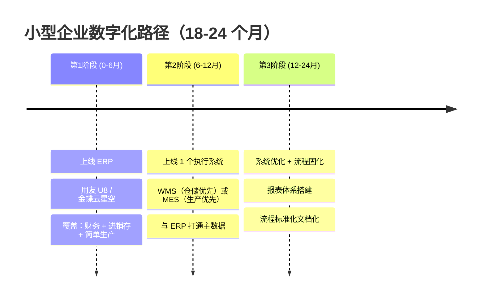
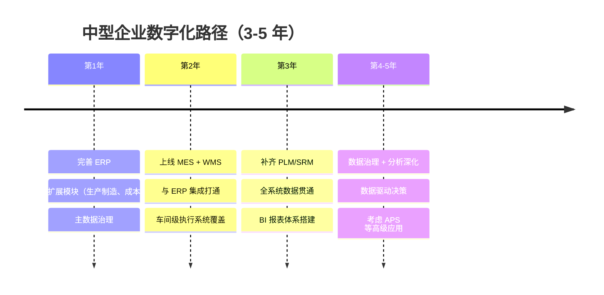
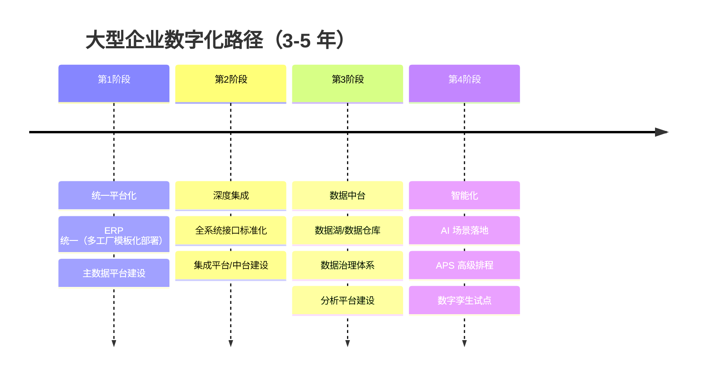
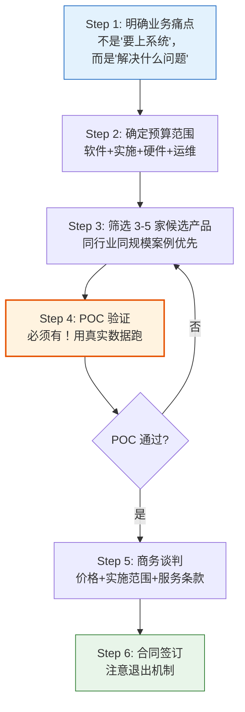

# 按规模与行业的选型路径

> 选型不是选最好的，是选最合适的。中小企业上 SAP 就像穿西装搬砖——不是不行，是没必要。

## 一、三档企业选型路径

### 1.1 Track 1：小型企业（营收 < 5 亿，人数 < 500）

**现状：**可能只有财务软件（用友 T3/T6、金蝶 KIS），核心业务靠 Excel。

**推荐路径：**

**预算参考：**

| 项目 | 范围 | 预算（万元） | 说明 |
|------|------|-------------|------|
| ERP | 用友 U8 / 金蝶云星空 | 20-50 | 含软件+实施，10-20 并发 |
| WMS | 巨沃 / 富勒 / FLUX | 30-80 | 含硬件（PDA/条码打印机） |
| MES | 黑湖智造 / 简单云 MES | 30-80 | 轻量级 SaaS 优先 |
| 硬件/网络 | 服务器 + 网络 | 10-30 | 云部署可降低初始投入 |

**关键原则：**
- **一次只上一个系统**，不要贪多
- **SaaS 优先**，降低初始投入和运维负担
- **先解决最痛的点**：库存不准就先上 WMS，排产混乱就先上 MES
- **不要上 SAP/Oracle**——不是买不起，是养不起

### 1.2 Track 2：中型企业（营收 5-50 亿，人数 500-5000）

**现状：**已有 ERP（用友 U8/NC、金蝶云星空/苍穹），可能部分有 WMS/MES 但未打通。

**推荐路径：**

**预算参考：**

| 项目 | 范围 | 预算（万元） | 说明 |
|------|------|-------------|------|
| ERP 升级 | U8→NC / 云星空→苍穹 | 50-200 | 含数据迁移 |
| MES | 中控 / 百合 / 黑湖 | 100-300 | 含车间硬件 |
| WMS | 富勒 / 巨沃 / FLUX | 80-200 | 含自动化设备接口 |
| PLM | 华天 / 开目 | 50-150 | 研发型制造企业 |
| SRM | 用友 / 金蝶 SRM 模块 | 30-100 | 供应商管理 |
| 集成平台 | ESB / API 网关 | 30-80 | 系统间接口管理 |
| BI | FineBI / Power BI | 20-50 | 数据分析平台 |

**关键原则：**
- **每年上一个核心系统**，不要同时启动多个大项目
- **先打通再深挖**，集成比功能更重要
- **主数据治理必须先行**，否则集成就是"垃圾数据高速流通"
- **内部 IT 团队建设跟上**，5-10 人是基本配置

### 1.3 Track 3：大型企业（营收 > 50 亿，人数 > 5000）

**现状：**已有 SAP/Oracle ERP，可能多系统并存、多工厂布局。

**推荐路径：**

**预算参考：**

| 项目 | 预算范围（万元） | 说明 |
|------|-----------------|------|
| 单核心系统 | 300-1000+ | SAP/Oracle 量级 |
| 集成平台 | 100-500 | 多系统整合 |
| 数据中台 | 200-800 | 含数据治理 |
| AI/智能化 | 300-2000 | 场景差异大 |
| 年运维费用 | 总投入的 15-20% | 不含人力 |

**关键原则：**
- **2-5 年整体规划，分步实施**，不要一年想干完所有事
- **统一架构比统一产品更重要**，允许各工厂有差异化配置
- **数据中台是必选项不是可选项**，多系统多工厂的数据只有通过中台才能统一
- **建立 PMO**，大型项目必须有专业的项目管理

### 1.4 三档对比总览

| 维度 | 小型企业 | 中型企业 | 大型企业 |
|------|---------|---------|---------|
| 营收 | < 5 亿 | 5-50 亿 | > 50 亿 |
| 人数 | < 500 | 500-5000 | > 5000 |
| IT 团队 | 1-3 人 | 5-15 人 | 15-50+ 人 |
| 现有系统 | 仅财务软件 | ERP + 部分 MES/WMS | SAP/Oracle + 多系统 |
| 首要任务 | 上 ERP | 打通集成 | 统一平台+数据中台 |
| ERP 选择 | 用友 U8/金蝶云星空 | 用友 NC/金蝶苍穹/鼎捷 | SAP/Oracle/用友 NCC |
| MES 选择 | 黑湖/简单云 | 中控/百合/黑湖 | 西门子/罗克韦尔/中控 |
| 年 IT 预算 | 50-150 万 | 200-800 万 | 1000 万+ |
| 实施策略 | 一步一个系统 | 每年一个核心系统 | 整体规划分步实施 |
| 最大风险 | 选错产品 | 系统集成失败 | 组织阻力+项目失控 |

## 二、国产产品 vs 国际产品对比

### 2.1 ERP

| 维度 | 国际产品 | 国产产品 |
|------|---------|---------|
| 代表 | SAP S/4HANA、Oracle EBS | 用友 NCC/NC、金蝶苍穹/云星空、鼎捷 T100 |
| 适用规模 | 大型/超大型企业 | 小中大全覆盖 |
| 优势 | 功能深度、全球最佳实践、多语言多币种 | 本地化好、实施快、成本可控、服务响应快 |
| 劣势 | 价格高、实施周期长、二次开发难、运维成本高 | 深度制造功能弱、大规模场景性能存疑、生态不如 SAP |
| 价格区间 | 500-5000 万+ | 30-500 万 |
| 实施周期 | 12-36 个月 | 3-12 个月 |

### 2.2 MES

| 维度 | 国际产品 | 国产产品 |
|------|---------|---------|
| 代表 | Siemens Opcenter、Rockwell FactoryTalk | 中控 SupPlant、百合 MES、黑湖智造 |
| 适用规模 | 大型/外资企业 | 中型为主，黑湖覆盖小型 |
| 优势 | ISA-95 标准、行业模板丰富、与自动化设备集成深 | 价格可控、行业定制灵活、响应快 |
| 劣势 | 价格昂贵、本地化弱、实施周期长 | 标准化程度低、大规模项目经验少 |
| 价格区间 | 300-2000 万 | 50-500 万 |

### 2.3 WMS

| 维度 | 国际产品 | 国产产品 |
|------|---------|---------|
| 代表 | Manhattan、Blue Yonder | 富勒 WMS、巨沃 WMS、FLUX |
| 适用规模 | 超大型/电商物流 | 中型制造+电商仓储 |
| 优势 | 算法领先、自动化设备集成深、大规模场景验证 | 性价比高、国内仓储场景适配好、支持定制 |
| 劣势 | 价格极高、国内支持弱 | 复杂自动化场景经验不足 |
| 价格区间 | 500-3000 万 | 50-300 万 |

### 2.4 PLM

| 维度 | 国际产品 | 国产产品 |
|------|---------|---------|
| 代表 | Teamcenter（西门子）、Windchill（PTC） | 华天 PLM、开目 PLM |
| 适用规模 | 大型/研发密集型 | 中型/机械装备 |
| 优势 | 功能全面、CAD 集成深、全球研发协同 | 价格可控、国产 CAD 集成好 |
| 劣势 | 价格昂贵、实施难度大 | 复杂产品开发场景弱 |
| 价格区间 | 300-2000 万 | 30-200 万 |

### 2.5 SCM

| 维度 | 国际产品 | 国产产品 |
|------|---------|---------|
| 代表 | SAP IBP、Blue Yonder | 杉数科技、悠桦林 |
| 适用规模 | 全球化供应链企业 | 国内中大型企业 |
| 优势 | 全球供应链网络规划、成熟的 S&OP 流程 | 算法团队强、国内场景理解深、灵活定制 |
| 劣势 | 价格极高、国内供应链场景适配弱 | 产品化程度低、案例少 |
| 价格区间 | 500-3000 万 | 100-800 万 |

### 2.6 选型核心判断

| 判断条件 | 选国际产品 | 选国产产品 |
|----------|-----------|-----------|
| 营收规模 | > 50 亿 | < 50 亿 |
| 是否有海外业务 | 是 | 否 |
| IT 年预算 | > 1000 万 | < 1000 万 |
| 实施周期容忍度 | 1 年以上 | 6 个月内 |
| 是否需要全球最佳实践 | 是 | 否，本地实践够用 |
| 内部 IT 团队规模 | > 20 人 | < 20 人 |

## 三、行业差异化选型

### 3.1 离散制造 vs 流程行业

| 维度 | 离散制造 | 流程行业 |
|------|---------|---------|
| 典型行业 | 汽车、3C、机械装备、家电 | 化工、食品、制药、建材 |
| 生产特征 | 拆卸组装、BOM 明确 | 配方混合、反应/加工、BOM 动态 |
| MES 核心关注 | 排产+物料追溯+质量 | 配方管理+批次追溯+合规 |
| WMS 核心关注 | 物料防错+JIT 配送 | 批次管理+效期管控+ FIFO |
| ERP 重点 | BOM 管理+MRP+成本核算 | 配方管理+联副产品+成本分摊 |
| 质量管理 | 抽检+SPC+返工 | 全检+放行+稳定性测试 |
| 典型 MES | 黑湖/中控/百合 | 中控/和利时/石化盈科 |
| 合规要求 | ISO9001/IATF16949 | GMP/HACCP/ISO22000 |

### 3.2 行业特化需求

#### 汽车行业

- **必选系统：**ERP + MES + WMS + SRM + QMS
- **核心关注：**TS16949 体系合规、JIT/JIS 准时配送、供应链深度协同、零部件追溯
- **特殊合规：**IATF 16949、VDA 6.3、MMOG/LE
- **选型注意：**MES 必须支持追溯链（VIN→工单→工序→物料→供应商批次），SRM 需支持 ASN 和 JIS 排序交货

#### 3C 电子行业

- **必选系统：**ERP + MES + WMS + PLM
- **核心关注：**快速换线（换线时间 < 30 分钟）、SMT 追溯（PCBA 一物一码）、RoHS/REACH 合规
- **特殊合规：**RoHS、REACH、3C 认证
- **选型注意：**MES 必须支持 SMT 产线级追溯，PLM 需与 MES 的 EBOM/MBOM 转换打通

#### 食品行业

- **必选系统：**ERP + MES + WMS + QMS
- **核心关注：**保质期管理（FIFO/FEFO）、批次正反向追溯、HACCP 体系落地、配方保密
- **特殊合规：**HACCP、ISO 22000、SC 许可
- **选型注意：**WMS 必须支持效期管控和 FEFO 策略，MES 需支持配方版本管理和投料防错

#### 医药行业

- **必选系统：**ERP + MES + WMS + QMS + LIMS
- **核心关注：**GMP 合规、电子签名（21 CFR Part 11）、批次放行、全链追溯
- **特殊合规：**GMP、GSP、21 CFR Part 11、数据完整性（ALCOA+）
- **选型注意：**MES 必须支持电子签名和审计追踪，WMS 需支持冷链管理和温湿度记录，QMS 需支持 CAPA 和偏差管理

#### 化工行业

- **必选系统：**ERP + MES + DCS + EAM
- **核心关注：**配方保密与版本管理、安全环保（HAZOP）、连续生产优化、能耗管理
- **特殊合规：**安全生产许可证、环保排污许可、REACH（出口）
- **选型注意：**MES 需与 DCS 深度集成实现实时数据采集，ERP 需支持联副产品和多计量单位

### 3.3 行业选型速查表

| 行业 | 必选系统 | 核心关注 | 特殊合规要求 |
|------|---------|---------|-------------|
| 汽车 | ERP+MES+WMS+SRM+QMS | JIT/JIS、供应链协同、追溯 | IATF 16949、VDA 6.3 |
| 3C 电子 | ERP+MES+WMS+PLM | 快速换线、SMT 追踪、RoHS | RoHS、REACH、3C 认证 |
| 食品 | ERP+MES+WMS+QMS | 保质期、批次追溯、配方 | HACCP、ISO 22000、SC |
| 医药 | ERP+MES+WMS+QMS+LIMS | GMP、电子签名、批次放行 | GMP、21 CFR Part 11 |
| 化工 | ERP+MES+DCS+EAM | 配方保密、安全环保、能耗 | 安全许可、环保许可 |
| 机械装备 | ERP+MES+PLM+EAM | 项目制造、BOM 管理、售后 | ISO 9001、CE |

## 四、选型决策流程

### 4.1 决策流程图

### 4.2 各步骤详解

**Step 1：明确业务痛点**

> "要上系统"不是痛点，"库存准确率只有 60%"才是痛点。

痛点必须量化：
- 库存准确率 < 80% → WMS
- 排产达成率 < 70% → MES/APS
- 采购周期不可控 → SRM
- 产品追溯做不到 → MES + WMS
- 财务月结要 10 天 → ERP 升级

**Step 2：确定预算范围**

预算不是"软件多少钱"，而是全生命周期成本：

| 成本项 | 占比 | 说明 |
|--------|------|------|
| 软件许可 | 30-40% | 买断或订阅 |
| 实施服务 | 25-35% | 咨询+配置+开发+培训 |
| 硬件/云 | 10-15% | 服务器、网络、终端设备 |
| 二次开发 | 10-20% | 几乎不可避免 |
| 年运维 | 15-20% | 许可续费+运维服务 |

**Step 3：筛选候选产品**

筛选标准：
1. **同行业同规模案例 ≥ 3 个**——没做过你这个行业的，说得再好听也别信
2. **实施团队驻场经验**——产品和实施团队是两码事，要面试实施顾问
3. **产品功能覆盖 ≥ 80% 核心需求**——剩余 20% 评估二次开发成本
4. **开放性**——API 是否开放、数据是否可导出

**Step 4：POC 验证**

POC 是选型中最关键的一步，绝对不能省：

| POC 要素 | 说明 |
|----------|------|
| 时长 | 2-4 周 |
| 范围 | 3-5 个核心场景（不是看 Demo） |
| 数据 | 用企业真实数据（脱敏后） |
| 人员 | 供应商实施顾问 + 企业关键用户 |
| 产出 | POC 报告（功能符合度 + 性能 + 易用性评分） |
| 费用 | 通常 5-20 万，可抵扣合同款 |

**Step 5：商务谈判**

谈判要点：
- 软件许可：按并发用户还是命名用户？后续增加用户的价格？
- 实施费：按人天还是固定价？需求变更怎么计费？
- 运维费：包含哪些服务？响应时间承诺？
- 培训：多少人多少次？是否含后续新员工培训？

**Step 6：合同签订——重点保护条款**

| 条款 | 说明 | 重要性 |
|------|------|--------|
| 源码归属 | 二次开发代码归谁？ | ★★★★★ |
| 二次开发权 | 是否允许第三方开发？ | ★★★★★ |
| 数据导出权 | 数据必须能导出为标准格式 | ★★★★★ |
| 退出机制 | 合同期满后的过渡安排 | ★★★★ |
| 交付标准 | 验收标准必须量化 | ★★★★ |
| 违约责任 | 延期交付、质量不达标的赔偿 | ★★★ |
| 知识产权 | 实施中产生的模板、方案归谁 | ★★★ |

## 五、避坑指南

### 5.1 六大典型坑

**坑 1：不要被"全行业解决方案"忽悠**

> 没有任何产品能覆盖所有行业。说"我们什么行业都能做"的，大概率什么行业都做不深。

验证方法：要求看同行业同规模的 3 个以上成功案例，并要求实地参观 1 个。

**坑 2：不要只看 Demo，一定要 POC**

> Demo 是精心排练的演出，POC 是真实战场。Demo 里一切顺利，POC 里问题百出——这才是真实情况。

一个客户看完 Demo 后感慨"太好了"，POC 时发现 3 个核心场景有 2 个跑不通，最终换了产品。

**坑 3：不要忽视实施团队比产品更重要**

> 同一个 SAP，好的实施团队做出来是 90 分，差的实施团队做出来是 30 分。产品决定上限，实施决定下限。

面试实施顾问的问题：
- 做过几个同行业项目？担任什么角色？
- 最难的一个项目遇到什么问题？怎么解决的？
- 如果核心场景实现不了，你有什么 Plan B？

**坑 4：不要一次选太多系统**

> 一年上一个核心系统是合理节奏。同时上 3 个系统的企业，90% 会出问题——资源分散、业务团队疲于应付、项目互相依赖导致互相拖延。

**坑 5：合同必须约定退出机制**

> 最怕的情况：上线后系统不好用，想换但换不了——数据拿不出来、定制化太深、业务不能停。合同里没写退出条款，供应商就拿着你的数据绑架你。

**坑 6：不要选最便宜的**

> 最低价中标是数字化项目最大的坑之一。价格低往往意味着：实施团队用新人、项目周期压缩、后期运维缩水。省下的钱会以十倍的代价还回来。

选型评分建议：技术评分占 60%，商务评分占 40%。不要让价格成为决定性因素。
