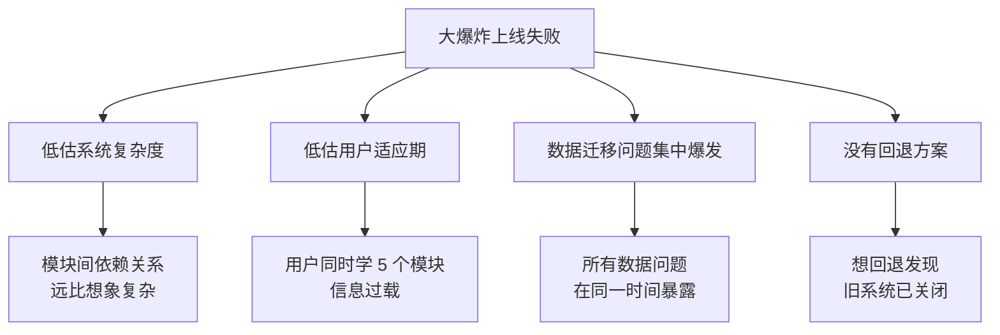
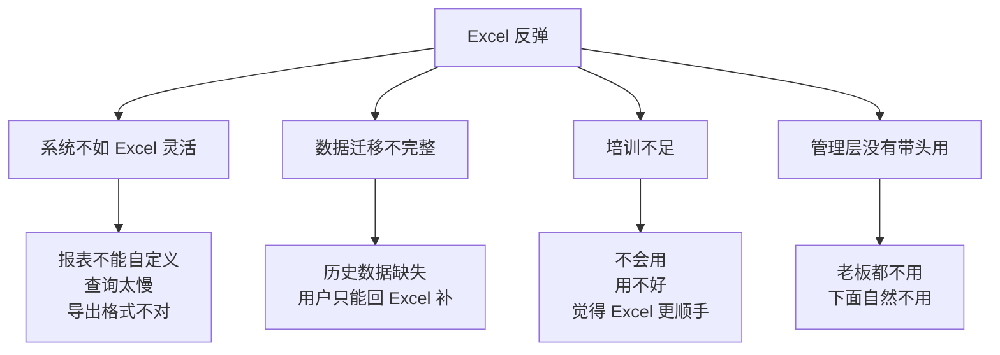
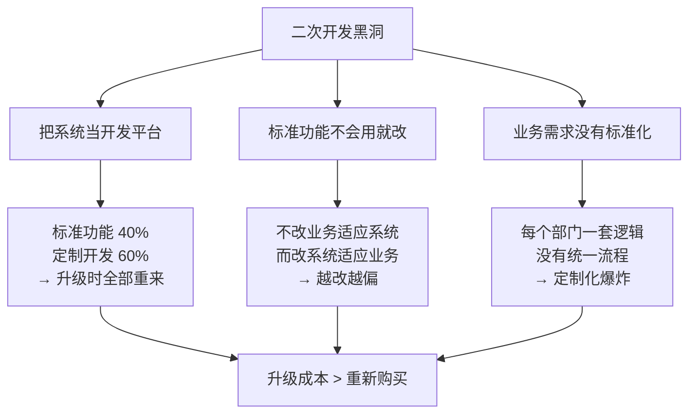
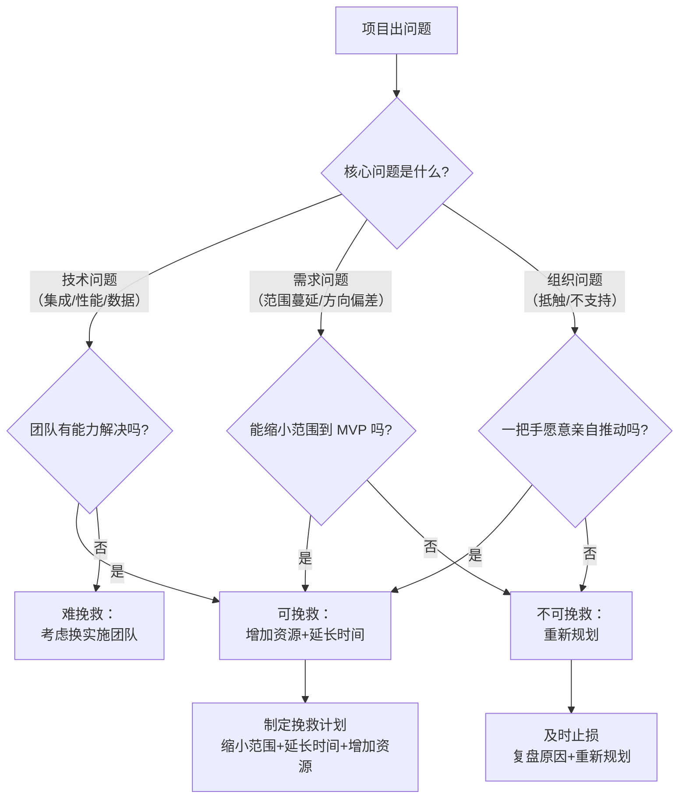

# 典型转型失败模式与规避

> 约 70% 的数字化转型项目未达预期。但失败不是随机的——它们有规律、有模式、有先兆。认识失败模式，才有可能规避。

## 一、数字化转型的失败率

### 1.1 行业数据

| 数据来源 | 结论 | 说明 |
|----------|------|------|
| McKinsey | 约 70% 的数字化转型未达预期 | 全球范围，所有行业 |
| Bain & Company | 仅 5% 的数字化转型实现了预期目标 | 更严格的"成功"定义 |
| 国内中小制造企业 MES 实施 | 成功率约 30-40% | "成功"定义为：上线后 1 年仍在使用 |
| 国内 ERP 实施 | 成功率约 50-60% | 比MES略高，因为ERP更成熟 |

**关键洞察：**"未达预期"不等于"完全失败"，但意味着投入产出比远低于预期。更严重的是，失败经历会让管理层对数字化失去信心，导致后续项目更难推进。

### 1.2 失败的代价

| 维度 | 代价 |
|------|------|
| 直接财务损失 | 软件+实施费打水漂，通常 100-1000 万 |
| 机会成本 | 1-2 年时间窗口错失，竞争对手拉开差距 |
| 信任损失 | 管理层对数字化失去信心，后续项目审批更严 |
| 人才流失 | IT 团队信心受挫，核心人员离职 |
| 组织创伤 | 业务部门对"新系统"产生抵触，变革阻力更大 |

## 二、八种典型失败模式

### 2.1 大爆炸上线（Big Bang）

**症状：**选一个"吉日"，全模块一次性切换，结果全线崩溃——数据不准、流程不通、用户不会操作，生产线停摆。

**根因分析：**

**规避方案：**

| 措施 | 说明 |
|------|------|
| 分阶段上线 | 先上 1-2 个模块，稳定后再上下一批 |
| 先试点再推广 | 选 1 个工厂/车间先行，验证后再全公司推广 |
| 并行运行期 | 新旧系统并行至少 1 个月，数据双录双校 |
| 回退方案 | 保留旧系统可用，定义明确的回退触发条件 |
| 蓝绿部署 | 分区域逐步切换，而不是一刀切 |

**真实案例（匿名化）：**

> 某中型制造企业，MES 全模块+全产线同时上线。上线第一天：工单下发失败、报工数据丢失、质检流程走不通。车间不得不恢复纸质工单，但旧流程已经断了。结果停产 2 天，紧急回退到半手工模式，花了 3 个月才恢复正常。

### 2.2 范围蔓延（Scope Creep）

**症状：**需求越来越多，上线日期一拖再拖。项目启动时说 6 个月，做了 18 个月还没上线。业务方不断加需求，IT 团队疲于奔命。

**根因分析：**

- 没有清晰的 MVP（最小可行产品）定义
- 业务方"趁系统在建，把想要的都加上"
- 需求评审没有决策机制，谁嗓门大谁的需求先做
- 项目经理不敢说"不"

**规避方案：**

| 措施 | 说明 |
|------|------|
| MVP 思维 | 第一期只做核心流程，能跑通就上线 |
| 需求冻结机制 | 上线前 2 个月冻结新需求，任何变更走变更控制流程 |
| 变更控制委员会 | 业务+IT+管理层三方审批需求变更 |
| 需求优先级排序 | MoSCoW 法则：Must have / Should have / Could have / Won't have |
| 时间盒管理 | 固定上线时间，需求做不完就砍功能而非延期 |

**真实案例：**

> 某企业 ERP 项目，初始需求 120 个功能点。实施过程中业务部门不断加需求，6 个月时需求膨胀到 280 个。项目经理没有拒绝，而是一直延期。最终做了 2 年才上线，上线时很多需求已经不是当前业务需要的了。

### 2.3 影子 IT（Shadow IT）

**症状：**业务部门自己搞了一套系统（通常是 Excel+VBA 或低代码平台搭建的），和"官方系统"并行运行。两套数据，两个版本，谁都不知道哪个是对的。

**根因分析：**

- 官方系统不好用——操作复杂、响应慢、不够灵活
- 官方系统不够用——需求提了但排期遥遥无期
- 业务部门觉得"自己搞更快"
- IT 部门对业务需求响应不及时

**规避方案：**

| 措施 | 说明 |
|------|------|
| 80/20 原则 | 官方系统必须满足 80% 需求，否则就是 IT 的失职 |
| 提供扩展能力 | 剩余 20% 通过低代码/报表工具/自定义表单满足 |
| 主动巡检 | IT 定期检查各部门是否有影子系统，主动提供替代方案 |
| 需求快速响应 | 建立需求快速通道，业务紧急需求 2 周内必须有方案 |
| 影子系统收编 | 已存在的影子系统不要一刀切取缔，评估后逐步替代 |

**真实案例：**

> 某企业上线了官方 WMS，但仓库员工觉得操作太繁琐，私下用 Excel 做了一套出入库记录。月末盘点发现官方系统和 Excel 数据对不上，追查后发现仓库 60% 的操作走的是 Excel。根因：官方 WMS 每次操作要点 8 下，Excel 只要填 3 个字段。

### 2.4 Excel 反弹（Excel Rebound）

**症状：**系统上线 3-6 个月后，大家又回到 Excel。系统成了"录入工具"——数据进了系统但没人用，分析和决策还是在 Excel 里做。

**根因分析：**

**规避方案：**

- **系统必须比 Excel 更高效才能替代 Excel**——如果用系统比用 Excel 还慢，用户一定会反弹
- **上线前做 UX 测试**——让一线员工试用，记录操作步骤数和耗时
- **数据迁移必须完整**——历史数据完整导入，用户无需在两个系统间切换
- **分阶段替代**——先让 Excel 和系统并行，逐步减少 Excel 使用
- **管理层带头**——所有管理会议只看系统数据，不接受 Excel 版本

**真实案例：**

> 某企业 MES 上线后，车间主任每天还要在 Excel 里做一份产量汇总，因为 MES 的报表出数太慢（每天要等 2 小时），而 Excel 只要 10 分钟。解决方案：优化 MES 报表性能到 5 分钟内出数，并在大屏实时展示，车间主任自然就不需要 Excel 了。

### 2.5 供应商锁定（Vendor Lock-in）

**症状：**想换系统但换不了——数据拿不出来、定制化太深、接口全是私有的、业务不能停。

**根因分析：**

- 合同没约定数据导出权
- 定制化接口非标准，只有原供应商能维护
- 数据库表结构不开放，数据导出依赖供应商
- 业务流程深度绑定，切换代价巨大

**规避方案：**

| 措施 | 说明 |
|------|------|
| 合同约定数据归属 | 数据是企业的，供应商必须提供标准格式导出 |
| 优先选开放架构产品 | RESTful API、标准数据库、开放数据模型 |
| 定制化走标准接口 | 不允许供应商用私有接口做定制化 |
| 定期数据备份 | 独立于供应商的备份数据，验证可恢复性 |
| 双供应商策略 | 核心系统至少评估 2 个供应商，保持切换可能性 |

**真实案例：**

> 某企业 WMS 用了 5 年想换，发现：①数据只能通过供应商的导出工具导出，导出一次收费 10 万；②定制化接口 30+ 个，只有原供应商能维护；③切换期间仓库不能停运，供应商报价 200 万做过渡支持。最终只能续约，每年多付 30% 维护费。

### 2.6 数据迁移灾难（Data Migration Disaster）

**症状：**上线后数据不准——库存对不上、客户信息缺失、历史订单查不到、财务账对不平。

**根因分析：**

- 数据清洗投入不足——普遍只占预算 5%，实际需要 15-20%
- 迁移规则不严谨——手工数据→系统数据的映射有遗漏
- 迁移后验证不充分——只验证了数量，没验证准确性
- 历史数据处理不当——全量迁移太大，按年截断又有业务断点

**规避方案：**

| 措施 | 说明 |
|------|------|
| 数据迁移预算 ≥ 总预算 20% | 数据迁移不是"顺便做"，是独立项目 |
| 至少 3 轮迁移验证 | 第 1 轮：全量迁移+基础校验；第 2 轮：增量+业务校验；第 3 轮：准生产环境全量验证 |
| 数据质量门禁 | 迁移数据必须通过质量检查：完整性、准确性、一致性 |
| 主数据先行 | 物料、客户、供应商等主数据先迁移并稳定，再迁业务数据 |
| 回退数据准备 | 迁移失败时能快速回退到旧数据 |

**真实案例：**

> 某企业 ERP 升级，数据迁移只给了 2 周时间。上线后发现：3 万条物料主数据中有 8000 条分类错误，5 年历史订单有 15% 缺失，期初库存和旧系统差了 200 万。结果财务月结做不了，花了 3 个月逐条核对修正。

### 2.7 二次开发黑洞（Customization Black Hole）

**症状：**定制化开发占项目工作量 50% 以上，每次系统升级定制化功能全部推翻重来。系统越改越慢，越改越没人敢动。

**根因分析：**

**规避方案：**

- **标准功能覆盖率 > 80% 才选**——如果一个产品标准功能只能覆盖 60%，说明它不适合你的行业
- **定制化控制在 20% 以内**——超出 20% 要重新评估是否选错了产品
- **改流程而非改系统**——先问"能不能改业务流程适应系统"，再问"能不能改系统适应业务"
- **定制化走扩展机制**——用 API/插件/配置化方式扩展，不要改核心代码
- **评估升级成本**——选型时就要问：每次大版本升级，定制化功能的迁移工作量是多少？

**真实案例：**

> 某企业 ERP 实施时定制化开发了 150 个功能点，占总工作量 55%。3 年后 ERP 大版本升级，供应商报价 300 万做定制化迁移，因为 150 个功能点需要全部适配新版本。企业选择不升级，又过了 2 年，供应商停止支持旧版本，被迫花 500 万重新选型实施。

### 2.8 组织免疫反应（Organizational Immune Response）

**症状：**一线抵触使用，中层阳奉阴违。系统在技术上完全没问题，但就是推不动。

**根因分析：**

| 角色 | 心理 | 行为 |
|------|------|------|
| 一线员工 | "新系统让我活更多了" | 消极应付，能不用就不用 |
| 中层管理 | "透明了，我的灰色空间没了" | 阳奉阴违，嘴上说支持实际不推 |
| 高层领导 | "我拍板了，你们为什么不用？" | 施压但不解决实际问题 |
| IT 部门 | "系统没问题，是你们不用" | 和业务对立 |

**规避方案：**

- **一线必须受益**——新系统必须减少一线工作量，而不是增加。如果增加了，说明系统设计有问题
- **中层的利益必须考虑**——中层最怕透明化，要给中层"用数据做管理"的能力而非"被监控"的感觉
- **变革管理是独立工作**——不要让 IT 部门兼做变革管理，需要专门的变革推动团队
- **种子用户策略**——先培养 20% 的积极用户，让他们影响 60% 的中间派
- **一把手工程不是口号**——一把手必须亲自用系统数据做决策，否则下面不会真用

**真实案例：**

> 某企业 MES 上线后，车间主任抵触强烈——因为原来排产他说了算，现在系统排产他觉得"被取代了"。解决方案：①MES 排产结果必须经车间主任确认才下发（给他决策权）；②系统自动排产+人工微调的模式（他比纯人工排产省了 2 小时/天）；③绩效考核从"排产准确率"改为"交付达成率"（让他关注结果而非过程）。3 个月后，车间主任成了 MES 的积极推广者。

## 三、失败模式的组合效应

单一失败模式很少单独出现，更多是多种模式**级联叠加**：

**典型级联路径：**

1. **范围蔓延 → 延期 → 赶工 → 大爆炸上线 → 数据迁移灾难 → Excel 反弹**
   — 最常见的"完美风暴"

2. **供应商锁定 → 二次开发黑洞 → 升级困难 → 影子 IT 出现 → Excel 反弹**
   — 系统越用越差的慢性死亡

3. **组织免疫 → 需求假大空 → 范围蔓延 → 延期 → 更强的组织免疫**
   — 信任崩塌的恶性循环

**关键洞察：**失败不是单一原因造成的，而是多个问题逐步累积、相互放大。越早识别和干预，挽回代价越小。一旦出现 2 个以上失败模式的苗头，就必须立即启动干预。

## 四、项目健康度检查清单

### 4.1 检查项

| # | 检查项 | 0 分 | 1 分 | 2 分 |
|---|--------|------|------|------|
| 1 | 项目是否有明确的、量化的成功指标 | 无 | 有但模糊 | 有且量化 |
| 2 | 一把手是否真正参与（不是口头支持） | 不参与 | 偶尔过问 | 每周看进度 |
| 3 | 业务部门是否主动提需求并参与测试 | 不参与 | 被动参与 | 主动参与 |
| 4 | 项目范围是否已冻结 | 仍在膨胀 | 有变化但在控 | 已冻结 |
| 5 | 关键用户是否已到位并通过培训 | 未确定 | 确定但未培训 | 已培训通过 |
| 6 | 数据迁移是否已完成至少 1 轮验证 | 未开始 | 进行中 | 已通过 |
| 7 | 是否有明确的上线计划和回退方案 | 无 | 有计划无回退 | 两者都有 |
| 8 | 供应商团队是否稳定（核心顾问未换人） | 已换核心人员 | 有变动但可控 | 稳定 |
| 9 | 集成测试是否通过 | 未开始 | 部分通过 | 全部通过 |
| 10 | 用户培训是否完成 | 未开始 | 部分完成 | 全部完成 |
| 11 | 变更控制流程是否在执行 | 无 | 有但执行不严 | 严格执行 |
| 12 | 项目周报是否如实反映问题 | 报喜不报忧 | 部分反映 | 如实反映 |
| 13 | 是否有独立的 QA/测试团队 | 无 | 兼职 | 专职 |
| 14 | 试点/POC 是否已成功 | 未做 | 做了但未通过 | 已通过 |
| 15 | 运维团队是否已准备好 | 未考虑 | 在准备 | 已就绪 |

### 4.2 分数解读

| 分数区间 | 状态 | 行动 |
|----------|------|------|
| < 20 分（满分 30） | 🔴 红色预警 | 项目处于高风险状态，需立即干预，考虑暂停重新评估 |
| 20-25 分 | 🟡 黄色警告 | 存在明显风险，需针对性整改，1 周内复评 |
| > 25 分 | 🟢 绿色 | 项目健康，按计划推进，持续监控 |

**使用建议：**每 2 周打一次分，绘制趋势图。如果连续 2 次分数下降，即使仍在绿色区间也必须分析原因。

## 五、如果项目已经出问题了：止损指南

### 5.1 第一步：承认问题

> 最危险的不是项目出问题，而是不承认出了问题。"再等等就好了"是最贵的等待。

**承认问题的信号：**

- 项目延期超过原计划的 50%
- 上线日期改了 3 次以上
- 关键用户频繁更换或离职
- 供应商开始换实施顾问
- 管理层不再过问项目进度（不是放心，是放弃了）

### 5.2 第二步：评估是否可以挽救

### 5.3 可挽救：三种纠偏策略

| 策略 | 适用场景 | 具体做法 | 风险 |
|------|---------|---------|------|
| 缩小范围 | 需求蔓延、功能做不完 | 砍掉非核心功能，只留 MVP | 已做的功能可能浪费 |
| 延长时间 | 技术难度超预期、数据迁移慢 | 重新排期，分阶段交付 | 延期增加成本，影响信心 |
| 增加资源 | 人手不足、关键岗位缺失 | 增加实施顾问、招聘关键人员 | 新人上手有学习成本 |

### 5.4 不可挽救：止损决策

**什么情况下应该止损：**

- 供应商明显无法交付核心功能（不是延期，是做不到）
- 业务方向已发生重大变化，原需求已不适用
- 项目投入已超过预算 2 倍且看不到终点
- 组织层面完全不支持（一把手换人、战略转向）

**止损不等于失败，不止损才是真正的失败。**

止损后的正确做法：

1. **复盘**——写详细的复盘报告：做错了什么、为什么、怎么避免
2. **保护数据**——确保已有数据的完整性和可导出性
3. **保护团队**——不要追责个人，而是改进机制
4. **重新规划**——带着复盘的经验重新启动，而不是换个供应商重复同样的错误

### 5.5 最忌讳：追加预算但不改变方法

> 加钱不改方法 = 用更多的钱犯同样的错误。

**常见错误：**

| 错误做法 | 为什么没用 |
|----------|-----------|
| 换项目经理但不变更管理机制 | 新项目经理面对同样的组织问题 |
| 增加开发人员但不清范围 | 人越多沟通越复杂，效率越低 |
| 换供应商但不改合同条款 | 新供应商照样锁定你 |
| 延长时间但不设里程碑 | 只是把痛苦拉长而已 |

**正确的做法：**先改方法，再追加投入。方法对了，追加的投入才有效；方法不对，追加多少都是打水漂。
