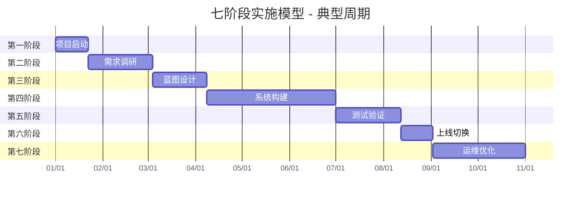
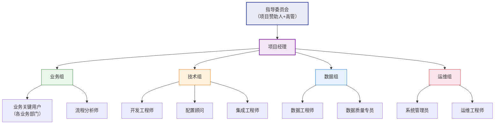

# 七阶段实施模型

> 实施不是"装个软件"——它是一场涉及组织、流程、数据、技术的系统性变革。没有阶段划分，项目就像没有路标的远征：出发时信心满满，中途迷路，到达时已经面目全非。

## 一、为什么需要统一实施模型

### 1.1 当前问题

过去 WMS、MES、PLM 各子系统文档分别描述实施方法论，造成三个突出问题：

| 问题 | 具体表现 |
|------|----------|
| **内容高度重复** | 三个系统的"项目启动"章节写了三遍，内容 80% 雷同 |
| **标准不一致** | 同是"需求调研"阶段，WMS 要求产出需求清单，MES 要求产出用例图，评审时缺少统一标准 |
| **学习成本翻倍** | 新成员要阅读三套方法论才能理解一套实施逻辑，效率极低 |

### 1.2 统一价值

| 价值维度 | 说明 |
|----------|------|
| **降低学习成本** | 一套方法论适用于所有业务系统实施，学一次即可复用 |
| **建立组织级能力** | 将实施经验从个人能力转化为组织资产，不因人员流动而流失 |
| **统一质量标准** | 各项目阶段交付物标准化，评审有据可依 |
| **促进跨系统协同** | 多系统并行实施时，使用统一方法论确保节奏一致 |

## 二、七阶段模型总览

| 阶段 | 名称 | 典型周期 | 核心目标 |
|------|------|----------|----------|
| 1 | 项目启动 | 2-4 周 | 明确范围、组建团队、建立治理 |
| 2 | 需求调研 | 4-8 周 | 摸清现状、收集需求、排定优先级 |
| 3 | 蓝图设计 | 4-6 周 | 设计未来流程、确定系统方案 |
| 4 | 系统构建 | 8-16 周 | 配置开发、接口对接、数据准备 |
| 5 | 测试验证 | 4-8 周 | 集成测试、用户验收、性能安全 |
| 6 | 上线切换 | 2-4 周 | 数据迁移、并行运行、正式切换 |
| 7 | 运维优化 | 持续 | 驻场支持、知识转移、持续迭代 |

> **关键原则**：阶段之间可以有重叠，但不能跳过。每个阶段必须有明确的退出标准和交付物签收。

## 三、各阶段详解

### 3.1 第一阶段：项目启动（2-4 周）

#### 目标

让项目从"想干"变成"真正开干"——范围明确、团队到位、规则建立。

#### 关键活动

| 活动 | 说明 | 产出 |
|------|------|------|
| 成立项目组 | 确定甲乙双方团队成员，明确角色职责 | 项目组织架构图 |
| 明确项目范围 | 划定业务边界，明确做什么、不做什么 | 项目范围说明书 |
| 制定项目计划 | 编排各阶段时间节点和里程碑 | 项目计划（WBS） |
| 确定治理架构 | 建立决策机制、汇报机制、变更机制 | 项目治理章程 |
| 召开启动会 | 向全员宣贯项目目标、范围、计划 | 启动会纪要 |

#### 交付物清单

- [ ] 项目章程（Project Charter）
- [ ] 项目计划（含里程碑和 WBS）
- [ ] 沟通计划（周报、月报、决策会节奏）
- [ ] 风险登记册（初始版）
- [ ] 变更管理流程

#### 参与角色

| 角色 | 职责 |
|------|------|
| 项目赞助人（高管） | 提供资源和决策支持，解决跨部门协调 |
| 项目经理 | 整体协调、进度管控、风险跟踪 |
| 业务负责人 | 确认业务范围和优先级 |
| 技术负责人 | 评估技术可行性，规划技术路线 |

#### 常见问题

| 问题 | 原因 | 解决方案 |
|------|------|----------|
| 启动会开完就没人管了 | 高层只出席不参与 | 建立定期高层汇报机制，至少双周一次 |
| 范围说不清 | 业务部门各说各话 | 用 L2 流程图划定边界，逐个确认签收 |
| 团队成员不到位 | 甲方业务人员兼职参与 | 在项目章程中明确投入时间要求（≥50%） |

#### 国内企业特别注意事项

::: warning 高层"口头支持"≠实际支持
很多项目启动会上，高层表态"全力支持"，但后续既不给预算签字，也不释放关键人员。**必须获得三样东西**：

1. **预算签字**：不是口头承诺，是签字的预算审批单
2. **资源承诺**：关键用户的投入时间写进其 KPI
3. **决策授权**：项目组在范围内有决策权，不需要事事上报
:::

---

### 3.2 第二阶段：需求调研（4-8 周）

#### 目标

摸清"现在是什么样"（As-Is），搞明白"要变成什么样"（需求），确定"先做什么"（优先级）。

#### 关键活动

| 活动 | 说明 | 方法 |
|------|------|------|
| 现状梳理 | 梳理现有业务流程、系统、数据 | 流程走读、系统盘点、数据抽样 |
| 痛点收集 | 收集各层级用户的真实痛点 | 访谈、问卷、现场观察 |
| 需求分析 | 将痛点转化为结构化需求 | 需求分类、去重、合并 |
| 优先级排序 | 对需求按业务价值和实现难度排序 | MoSCoW 法或价值-难度矩阵 |
| 需求确认 | 与业务方逐条确认需求 | 需求评审会、签字确认 |

#### 交付物清单

- [ ] 需求调研报告
- [ ] 业务流程图（As-Is）
- [ ] 需求清单及优先级（含 MoSCoW 分类）
- [ ] 痛点清单（按严重程度排序）
- [ ] 需求追踪矩阵（需求→方案→测试用例）

#### 参与角色

| 角色 | 职责 |
|------|------|
| 业务分析师 | 设计调研方案，执行访谈，整理需求 |
| 关键用户 | 提供业务场景和痛点，确认需求 |
| 流程所有者 | 确认流程现状和改进方向 |
| 技术顾问 | 评估需求的技术可行性 |

#### 常见问题

| 问题 | 原因 | 解决方案 |
|------|------|----------|
| 需求越调研越多 | 没有边界控制，"顺便加一个" | 用 MoSCoW 强制分类，Must-have 以外放后续迭代 |
| 管理层和一线需求矛盾 | 管理层要管控，一线要效率 | 分别记录，用流程优化来解决矛盾，不是用系统 |
| 需求描述模糊 | "要快一点""要好用" | 用 SMART 原则量化：快多少？好用的标准是什么？ |

#### 国内企业特别注意事项

::: warning 不要只问管理层，必须深入一线
很多项目需求调研只访谈了部门经理，上线后发现一线操作根本不是那么回事。

**必须做到**：
1. **每个关键岗位至少访谈 3 人**，不只听管理层"翻译"的需求
2. **现场观察**：坐在操作员旁边看半天，比访谈 10 次更有效
3. **需求调研不能走过场**：调研报告必须由业务方逐条签字，不接受"大概差不多"
:::

---

### 3.3 第三阶段：蓝图设计（4-6 周）

#### 目标

把需求翻译成"未来应该是什么样"（To-Be），包括流程、系统、接口、数据的完整方案。

#### 关键活动

| 活动 | 说明 | 产出 |
|------|------|------|
| To-Be 流程设计 | 基于 As-Is 和需求，设计优化后的业务流程 | To-Be 流程图 |
| 系统方案设计 | 确定系统配置方案、定制开发范围 | 系统配置方案 |
| 集成方案设计 | 设计系统间接口和数据流 | 接口设计方案 |
| 数据迁移方案 | 规划数据迁移范围、策略和时间表 | 数据迁移方案 |
| 蓝图评审 | 与业务和技术双方确认方案 | 蓝图评审纪要 |

#### 交付物清单

- [ ] 蓝图设计文档
- [ ] To-Be 流程图（跨系统流程用泳道图）
- [ ] 系统配置方案
- [ ] 接口设计方案（含接口清单、字段映射、调用方式）
- [ ] 数据迁移方案（初版）
- [ ] 蓝图评审纪要（含各方签字）

#### 参与角色

| 角色 | 职责 |
|------|------|
| 方案架构师 | 设计整体方案，确保各模块协同 |
| 业务关键用户 | 确认 To-Be 流程符合业务需求 |
| 技术负责人 | 评估技术方案可行性 |
| 集成工程师 | 设计接口方案，评估集成复杂度 |

#### 常见问题

| 问题 | 原因 | 解决方案 |
|------|------|----------|
| 蓝图照搬模板 | 顾问图省事，套用标准方案 | 每个流程必须走一遍"现状→差距→方案"三步 |
| 定制开发边界不清 | 需求没分清"标配"和"定制" | 在蓝图中明确标注每个需求的实现方式（配置/开发/第三方） |
| 跨系统流程断点 | 只画了单系统流程，没画跨系统 | 必须有端到端的泳道图，覆盖从触发到完成的完整链路 |

#### 国内企业特别注意事项

::: warning 蓝图不能照搬模板，必须基于实际业务场景
国内项目常见的坑：实施顾问拿一套"行业最佳实践"模板，改改公司名就当蓝图交付了。结果上线后发现和实际业务完全不匹配。

**检验标准**：
1. 蓝图中每个流程必须能回答："我们公司这个环节具体怎么做的？"
2. 如果某个流程只能用"行业通用做法"来解释，说明调研不深入
3. 关键业务场景必须有具体的业务数据示例，不能只有流程框图
:::

---

### 3.4 第四阶段：系统构建（8-16 周）

#### 目标

把蓝图变成可运行的系统——配置标准功能，开发定制需求，打通接口，准备数据。

#### 关键活动

| 活动 | 说明 | 产出 |
|------|------|------|
| 系统配置 | 按蓝图配置组织架构、权限、参数、流程 | 配置文档 |
| 定制开发 | 开发蓝图中标明的定制需求 | 开发代码、技术文档 |
| 接口开发 | 实现系统间数据交互 | 接口代码、接口文档 |
| 数据迁移脚本 | 开发数据抽取、转换、加载脚本 | ETL 脚本 |
| 报表开发 | 开发业务报表和看板 | 报表清单及样例 |

#### 交付物清单

- [ ] 系统配置文档（含配置清单和参数说明）
- [ ] 开发代码（含代码审查记录）
- [ ] 单元测试报告
- [ ] 接口开发文档及测试记录
- [ ] 数据迁移脚本（含转换规则）
- [ ] 报表开发清单

#### 参与角色

| 角色 | 职责 |
|------|------|
| 开发工程师 | 执行定制开发和接口开发 |
| 配置顾问 | 按蓝图配置系统 |
| 数据工程师 | 开发数据迁移脚本 |
| 业务关键用户 | 参与开发过程中的业务答疑 |

#### 常见问题

| 问题 | 原因 | 解决方案 |
|------|------|----------|
| 定制开发越来越多 | 需求蔓延，"顺便加一下" | 严格执行变更管理，新增开发必须走变更流程 |
| 接口联调困难 | 双方进度不同步，数据格式不一致 | 接口先行：先定义接口契约，再并行开发 |
| 开发质量差 | 没有代码审查和单元测试 | 每周代码审查，强制单元测试覆盖率 ≥80% |

#### 国内企业特别注意事项

::: warning 定制开发控制在 20% 以内，超出说明选型有问题
国内企业实施最常见的问题：标准功能不用，非要定制开发"符合我们习惯"的功能。结果：

1. **升级困难**：每次系统升级都要重新适配定制代码
2. **Bug 多**：定制代码没有经过大规模验证
3. **成本失控**：定制开发的维护成本是标准功能的 3-5 倍

**判断标准**：如果定制开发比例超过 20%，要么选错了产品，要么需求调研阶段没有充分挖掘标准功能。
:::

---

### 3.5 第五阶段：测试验证（4-8 周）

#### 目标

确保系统"能用、好用、可靠"——功能正确、性能达标、安全合规。

#### 关键活动

| 测试类型 | 目的 | 执行者 | 通过标准 |
|----------|------|--------|----------|
| SIT 集成测试 | 验证模块间交互和接口正确性 | 技术团队 | 全部 P1/P2 缺陷修复 |
| UAT 用户验收测试 | 验证业务流程可用性 | 业务用户 | 关键业务场景 100% 通过 |
| 性能测试 | 验证系统在负载下的响应和稳定性 | 测试团队 | 响应时间、并发量达标 |
| 安全测试 | 验证权限控制、数据安全、合规性 | 安全团队 | 无高危漏洞 |

#### 交付物清单

- [ ] 测试计划
- [ ] 测试用例（SIT + UAT）
- [ ] 测试报告（含缺陷统计和修复状态）
- [ ] 缺陷清单（含优先级和状态）
- [ ] UAT 签收单（业务方签字）
- [ ] 性能测试报告
- [ ] 安全测试报告

#### 参与角色

| 角色 | 职责 |
|------|------|
| 测试经理 | 编排测试计划，跟踪缺陷状态 |
| 业务关键用户 | 执行 UAT，验证业务场景 |
| 开发工程师 | 修复缺陷 |
| 测试工程师 | 执行 SIT 和性能测试 |

#### 常见问题

| 问题 | 原因 | 解决方案 |
|------|------|----------|
| UAT 走形式 | 业务用户没时间或不认真 | UAT 用例由业务方编写，测试结果由业务方签字 |
| 测试数据不真实 | 用测试数据而非真实业务数据 | UAT 必须使用脱敏后的真实业务数据 |
| 性能测试不充分 | 只测了单用户，没测并发 | 按峰值 2 倍并发量进行压测 |

#### 国内企业特别注意事项

::: warning UAT 不能走形式，业务必须亲自操作并签字
国内项目 UAT 的典型问题：业务用户草草点了几个界面就签字，上线后问题频发。

**必须做到**：
1. **UAT 用例由业务方编写**，不是实施方代写
2. **每个关键业务场景必须实际操作**，不能只看演示
3. **UAT 签收必须有业务部门负责人的签字**，不接受口头确认
4. **UAT 发现的 P1 缺陷必须全部修复后才能上线**
:::

---

### 3.6 第六阶段：上线切换（2-4 周）

#### 目标

平稳完成新旧系统切换，确保业务连续性。

#### 关键活动

| 活动 | 说明 | 产出 |
|------|------|------|
| 数据迁移 | 执行正式数据迁移和验证 | 数据迁移报告 |
| 并行运行 | 新旧系统同时运行，比对结果 | 并行比对报告 |
| 正式切换 | 停用旧系统，启用新系统 | 切换确认单 |
| 上线支持 | 驻场解决上线初期问题 | 问题跟踪表 |

#### 交付物清单

- [ ] 上线计划（含详细时间线）
- [ ] 切换检查清单（Go/No-Go Checklist）
- [ ] 回退方案（Rollback Plan）
- [ ] 数据迁移验证报告
- [ ] 上线支持日志

#### 参与角色

| 角色 | 职责 |
|------|------|
| 项目经理 | 统筹切换过程，决策 Go/No-Go |
| 数据工程师 | 执行数据迁移和验证 |
| 业务关键用户 | 参与并行运行比对，确认数据正确性 |
| 运维工程师 | 监控系统运行状态 |

#### 常见问题

| 问题 | 原因 | 解决方案 |
|------|------|----------|
| 上线时间选在月底 | 财务结账期数据量大 | 上线切换避开月末、季末，选择业务低峰期 |
| 并行时间过长 | 不敢切，越拖问题越多 | 设定明确的并行退出条件，到期强制切换 |
| 上线第一天系统崩溃 | 没有做性能压测或数据量预估不足 | 上线前做 2 倍峰值压测，准备弹性扩容方案 |

#### 国内企业特别注意事项

::: warning 必须准备回退方案，不要赌"一次性成功"
很多国内项目上线时没有回退方案，一旦出问题就硬扛，导致业务中断数天。

**回退方案必须包含**：
1. **回退触发条件**：什么情况下启动回退（如核心业务中断超过 2 小时）
2. **回退步骤**：详细的回退操作手册
3. **回退演练**：上线前必须做一次回退演练，确保方案可行
4. **数据保护**：旧系统数据在切换后至少保留 3 个月
:::

---

### 3.7 第七阶段：运维优化（持续）

#### 目标

从"能用"到"好用"，持续优化系统，建立长期运维能力。

#### 关键活动

| 阶段 | 时间 | 活动重点 |
|------|------|----------|
| 驻场支持 | 上线后 2-4 周 | 现场解决用户问题，快速响应 |
| 知识转移 | 上线后 1-3 月 | 培训内部运维团队，建立知识库 |
| 持续优化 | 上线后 3-6 月 | 收集优化建议，迭代改进 |
| 版本升级 | 每年 1-2 次 | 跟进产品更新，评估升级方案 |

#### 交付物清单

- [ ] 运维手册
- [ ] 培训材料（操作手册、视频教程）
- [ ] 优化建议报告
- [ ] 运维知识库
- [ ] 版本升级方案

#### 参与角色

| 角色 | 职责 |
|------|------|
| 运维团队 | 日常运维、问题处理 |
| 业务关键用户 | 收集优化建议，反馈使用问题 |
| 实施方支持 | 远程/现场技术支持 |
| 系统管理员 | 系统监控、权限管理、数据备份 |

#### 常见问题

| 问题 | 原因 | 解决方案 |
|------|------|----------|
| 上线后没人管了 | 实施方撤人太快 | 合同约定至少 2-4 周驻场支持期 |
| 知识没转移 | 培训走过场 | 建立知识库，定期内部培训 |
| 系统越用越慢 | 没有定期维护 | 制定运维巡检制度，每月至少一次 |

#### 国内企业特别注意事项

::: warning 上线后 2-4 周必须有驻场支持，否则问题会发酵
国内企业上线后的典型情况：上线当天一切正常，实施方撤人。第二周开始，用户遇到问题找不到人，只能回到旧系统或手工处理，新系统逐渐被废弃。

**必须做到**：
1. **驻场期不少于 2 周**，复杂项目建议 4 周
2. **建立问题响应机制**：P1 问题 2 小时内响应，P2 问题 8 小时内响应
3. **问题不能只记录不解决**：上线后 2 周内的问题解决率应 ≥90%
:::

## 四、不同系统类型的实施周期参考

| 系统类型 | 典型周期 | 关键差异点 | 最大风险 |
|----------|----------|-----------|----------|
| **ERP** | 6-18 月 | 主数据准备是最大挑战，涉及全公司业务 | 主数据不统一导致系统集成失败 |
| **MES** | 4-12 月 | 现场设备集成是变量，依赖设备厂商配合 | 设备联网率不足或协议不兼容 |
| **WMS** | 3-8 月 | 仓库流程标准化是前提，现场改造可能需要 | 仓库作业方式不标准导致系统无法落地 |
| **PLM** | 6-12 月 | 图纸数据迁移量最大，格式转换复杂 | 历史图纸数据质量差，迁移周期失控 |
| **QMS** | 3-6 月 | 合规要求驱动，法规变更影响大 | 合规要求理解偏差导致方案返工 |
| **SRM** | 3-6 月 | 供应商协同是关键，供应商配合度是变量 | 供应商使用意愿低导致系统空转 |

> **注意**：以上周期为中型企业（500-2000 人）的参考值。小型企业可压缩 30%-50%，大型集团可能需要 2-3 倍。

## 五、实施团队组织架构

### 关键角色说明

| 角色 | 人数 | 来源 | 核心职责 | 常见问题 |
|------|------|------|----------|----------|
| **项目赞助人** | 1 | 甲方高管 | 提供资源、扫清障碍、关键决策 | 只挂名不出力，需在章程中明确职责 |
| **项目经理** | 1-2 | 甲方或乙方 | 整体协调、进度管控、风险管理 | 权责不对等：有责无权 |
| **业务关键用户** | 3-8 | 甲方业务部门 | 提供业务输入、参与测试、推动上线 | 兼职参与时间不足 |
| **技术负责人** | 1 | 乙方 | 技术方案把控、开发质量管控 | 技术能力与项目需求不匹配 |

### 团队组建建议

1. **关键用户投入时间 ≥50%**：写进项目章程和其个人 KPI
2. **项目经理需有同类型项目经验**：没有 ERP 经验的项目经理做 ERP 实施，风险极高
3. **甲方必须有自己的技术接口人**：不能完全依赖乙方，否则知识无法沉淀
4. **指导委员会至少双周开一次**：不是挂名，必须解决跨部门协调问题
