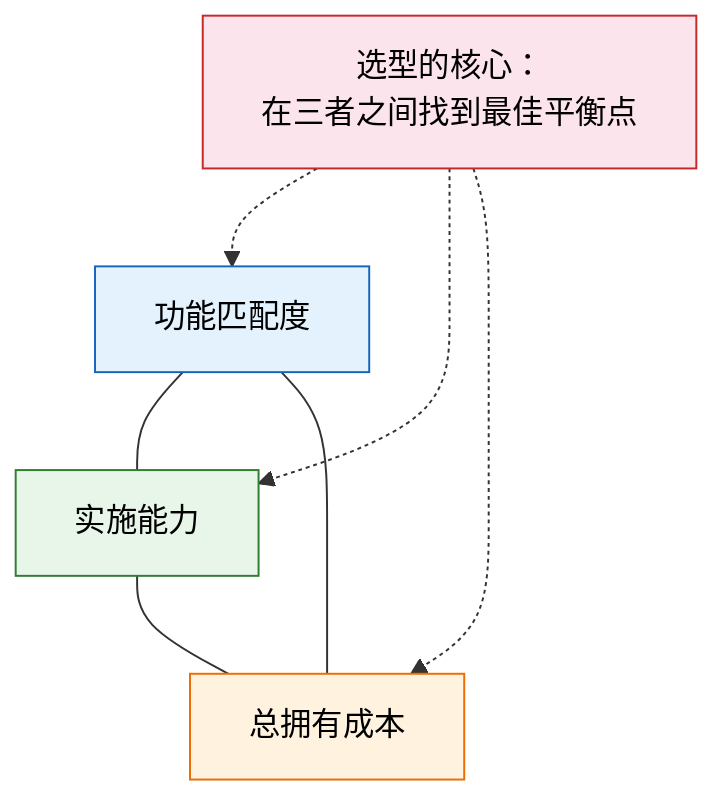
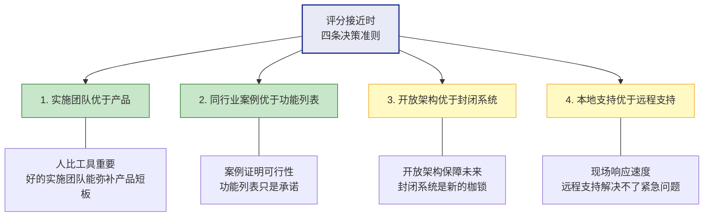

# 选型评估框架

> 选错产品，后面全是补救。选型是项目的第一道关，也是最容易"拍脑袋"的环节——看过演示就定、领导指定就上、谁便宜选谁，这些做法的失败率超过 60%。

## 一、选型是项目的第一道关

### 1.1 选错的代价

| 选错的表现 | 后果 | 修复成本 |
|-----------|------|----------|
| 功能不匹配 | 大量定制开发，系统越来越重 | 项目延期 30%-50% |
| 实施方能力不足 | 项目反复返工，上线遥遥无期 | 更换实施方，前期投入打水漂 |
| 架构封闭 | 无法集成其他系统，形成新的孤岛 | 二次选型或中间件方案 |
| 供应商倒闭 | 系统无升级、无支持 | 被迫更换系统，数据迁移风险巨大 |

### 1.2 选型的核心矛盾

选型不是选"最好的产品"，而是在三个维度之间找到平衡点：

- **功能匹配度**：产品能覆盖多少业务需求
- **实施能力**：实施团队有没有能力把产品落地
- **总拥有成本**：不只是软件费，还包括实施、维护、二次开发的全部费用

> **经验法则**：在功能匹配度达标的前提下，实施能力的权重应该高于产品本身——同样的产品，不同的实施团队，结果可能天差地别。

## 二、八维评估模型

### 2.1 评估维度总览

| 维度 | 权重参考 | 评估要点 | 评分方法 |
|------|----------|----------|----------|
| **功能匹配度** | 25% | 标准功能覆盖需求的比例；定制开发的复杂度 | 需求逐条比对，覆盖率计分 |
| **行业适配性** | 15% | 同行业案例数量和深度；行业特性支持 | 案例数量+案例深度打分 |
| **技术架构** | 10% | 开放性（API/SDK）、可扩展性、技术栈先进性 | 架构评审+技术打分 |
| **实施团队** | 20% | 项目经理能力、团队稳定性、同行业经验 | 团队简历审查+面试 |
| **集成能力** | 10% | 开放 API、标准接口（REST/SOAP）、集成案例 | 接口文档审查+POC 验证 |
| **服务支持** | 8% | 响应速度、本地化支持、培训体系 | SLA 条款+客户回访 |
| **总拥有成本** | 7% | 许可费+实施费+维护费+二次开发费 | 5 年 TCO 计算对比 |
| **供应商健康度** | 5% | 财务状况、客户口碑、发展前景 | 公开信息+客户调研 |

### 2.2 各维度评分细则

#### 功能匹配度（25%）

| 评分 | 标准 |
|------|------|
| 5 分 | 标准功能覆盖率 ≥90%，核心需求无需定制 |
| 4 分 | 标准功能覆盖率 80%-90%，少量定制（<10%） |
| 3 分 | 标准功能覆盖率 60%-80%，中等定制（10%-20%） |
| 2 分 | 标准功能覆盖率 40%-60%，大量定制（20%-40%） |
| 1 分 | 标准功能覆盖率 <40%，核心需求需大幅定制 |

#### 行业适配性（15%）

| 评分 | 标准 |
|------|------|
| 5 分 | 同行业 10+ 成功案例，可现场考察 |
| 4 分 | 同行业 5-10 个案例，有详细参考资料 |
| 3 分 | 同行业 2-5 个案例，参考资料有限 |
| 2 分 | 同行业 1-2 个案例，处于试水阶段 |
| 1 分 | 无同行业案例 |

#### 实施团队（20%）

| 评分 | 标准 |
|------|------|
| 5 分 | 项目经理 10+ 年经验、同行业 3+ 项目、团队稳定 |
| 4 分 | 项目经理 5-10 年经验、同行业 1-2 个项目 |
| 3 分 | 项目经理 3-5 年经验、有相关行业经验 |
| 2 分 | 项目经理经验不足 3 年或团队流动性大 |
| 1 分 | 无法确认项目经理或团队临时拼凑 |

### 2.3 权重自定义

不同类型的企业，评估侧重点不同：

| 企业类型 | 权重调整建议 | 原因 |
|----------|-------------|------|
| **数据驱动企业** | 功能匹配度+5%、集成能力+5%、服务支持-5%、供应商健康度-5% | 数据集成是核心诉求，供应商品牌不是重点 |
| **传统制造企业** | 实施团队+5%、服务支持+5%、技术架构-5%、供应商健康度-5% | 实施落地能力比技术先进性更重要 |
| **快速成长企业** | 技术架构+5%、集成能力+5%、总拥有成本-5%、行业适配性-5% | 扩展性是第一优先，当前行业案例可能已过时 |
| **合规要求高的企业** | 行业适配性+5%、服务支持+5%、技术架构-5%、供应商健康度-5% | 合规经验和本地支持至关重要 |

## 三、评分方法

### 3.1 评分规则

1. 每个维度 1-5 分，加权计算总分
2. **必须项（No-Go Criteria）**：任何一项得分 <2 分则直接淘汰，不进入综合评分
3. 综合评分公式：`总分 = Σ(维度得分 × 权重)`

### 3.2 示例评分表

以下是一个 MES 系统选型的评分示例：

| 维度 | 权重 | 厂商 A | 厂商 B | 厂商 C |
|------|------|--------|--------|--------|
| 功能匹配度 | 25% | 4 × 0.25 = 1.00 | 5 × 0.25 = 1.25 | 3 × 0.25 = 0.75 |
| 行业适配性 | 15% | 3 × 0.15 = 0.45 | 4 × 0.15 = 0.60 | 5 × 0.15 = 0.75 |
| 技术架构 | 10% | 4 × 0.10 = 0.40 | 3 × 0.10 = 0.30 | 3 × 0.10 = 0.30 |
| 实施团队 | 20% | 5 × 0.20 = 1.00 | 3 × 0.20 = 0.60 | 2 × 0.20 = 0.40 |
| 集成能力 | 10% | 4 × 0.10 = 0.40 | 4 × 0.10 = 0.40 | 3 × 0.10 = 0.30 |
| 服务支持 | 8% | 4 × 0.08 = 0.32 | 3 × 0.08 = 0.24 | 4 × 0.08 = 0.32 |
| 总拥有成本 | 7% | 3 × 0.07 = 0.21 | 4 × 0.07 = 0.28 | 5 × 0.07 = 0.35 |
| 供应商健康度 | 5% | 4 × 0.05 = 0.20 | 4 × 0.05 = 0.20 | 3 × 0.05 = 0.15 |
| **加权总分** | **100%** | **3.98** | **3.87** | **3.32** |

> 在本例中，厂商 A 因实施团队得分高而总分领先。但如果厂商 C 的实施团队得分 <2（No-Go），则直接淘汰。

## 四、POC 验证

### 4.1 POC 是必须的，不是可选的

| 不做 POC 的风险 | 说明 |
|-----------------|------|
| 演示 ≠ 真实 | 厂商演示的都是最顺滑的场景，真实场景往往更复杂 |
| 销售承诺 ≠ 交付能力 | 销售说的"都能做"，实际做起来可能要大量定制 |
| 集成兼容性不确定 | 厂商说"支持 REST API"，但接口设计可能极不合理 |

### 4.2 POC 规划

| 项目 | 建议 |
|------|------|
| POC 场景数量 | 3-5 个核心业务场景 |
| POC 周期 | 1-2 周 |
| POC 数据 | 使用脱敏后的真实业务数据 |
| POC 环境 | 供应商提供，甲方验证 |
| POC 人员 | 甲方业务用户+技术人员参与 |

### 4.3 POC 评估标准

POC 不只是看"能不能做"，更要看"做起来多复杂"：

| 评估项 | 说明 | 评分标准 |
|--------|------|----------|
| **功能实现度** | 核心场景是否完整实现 | 完整实现 5 分、部分实现 3 分、无法实现 1 分 |
| **操作复杂度** | 完成同一任务需要多少步 | 标准操作 3 步以内 5 分、3-5 步 3 分、5 步以上 1 分 |
| **配置 vs 开发** | 是配置实现还是写代码实现 | 纯配置 5 分、少量代码 3 分、大量代码 1 分 |
| **响应速度** | 界面操作和查询的响应时间 | <1 秒 5 分、1-3 秒 3 分、>3 秒 1 分 |
| **数据准确性** | 计算结果是否正确 | 100% 正确 5 分、有偏差可调 3 分、偏差大 1 分 |

### 4.4 POC Checklist

| 检查项 | 是否完成 | 备注 |
|--------|----------|------|
| POC 场景已与业务方确认 | ☐ | |
| POC 数据已准备并脱敏 | ☐ | |
| POC 环境已搭建并可用 | ☐ | |
| 甲方业务用户已参与操作 | ☐ | |
| 每个场景的操作录屏已完成 | ☐ | |
| POC 问题清单已记录 | ☐ | |
| POC 评估报告已出具 | ☐ | |

## 五、决策矩阵

当几个候选厂商的评分接近时，使用以下四条决策准则作为排序依据（优先级从高到低）：

### 5.1 四条决策准则

| 优先级 | 准则 | 原因 | 如何验证 |
|--------|------|------|----------|
| **1** | 实施团队优于产品 | 同样的产品，不同团队实施效果天差地别；好的团队能弥补产品 20% 的功能短板 | 面试项目经理、核实团队稳定性、走访已有客户 |
| **2** | 同行业案例优于功能列表 | 功能列表是"理论上能做"，案例是"实际做过" | 要求提供同行业 3 个以上可考察的客户 |
| **3** | 开放架构优于封闭系统 | 封闭系统意味着未来每次集成都是成本，开放架构是长期投资 | 审查 API 文档、SDK 可用性、集成案例 |
| **4** | 本地支持优于远程支持 | 系统出问题时，8 小时时差的远程支持=第二天才能响应 | 确认本地团队规模、响应 SLA、紧急问题处理流程 |

### 5.2 决策流程

1. 先用 No-Go Criteria 淘汰不达标厂商
2. 计算加权总分，排序
3. 如果前两名分差 <0.3，启动四条决策准则逐条比对
4. 如果仍无法区分，安排 POC 做最终验证

## 六、合同谈判要点

选型确定后，合同谈判是保护甲方利益的最后一道关。以下六点是必须谈清楚的：

### 6.1 核心条款

| 条款 | 为什么重要 | 谈判要点 |
|------|-----------|----------|
| **源码归属** | 定制开发的部分，甲方必须有权使用和修改 | 明确"定制开发部分的源码归属甲方"，不接受"仅限使用" |
| **数据导出权** | 防止被供应商锁定 | 合同中明确"甲方有权随时导出全部业务数据"，格式为开放标准（CSV/JSON/SQL） |
| **二次开发权** | 甲方或第三方可能需要二次开发 | 明确"甲方有权自行或委托第三方进行二次开发"，供应商不得以技术手段限制 |
| **SLA 条款** | 确保服务质量可量化、可追责 | P1 问题 2 小时响应、P2 问题 8 小时响应，违约有赔偿条款 |
| **知识产权** | 避免业务知识被供应商拿走 | 业务模型、流程设计等知识产权归属甲方 |
| **退出机制** | 供应链安全的底线 | 合同期满或提前终止时，数据迁移支持期不少于 3 个月，迁移费用由双方协商 |

### 6.2 容易忽略的隐性条款

| 隐性条款 | 风险 | 建议处理方式 |
|----------|------|-------------|
| **升级费用** | 系统升级可能另行收费 | 合同约定升级费用上限（如不超过许可费的 20%/年） |
| **用户数限制** | 并发用户数不足影响使用 | 按实际需要购买，预留 20% 余量，超量时计费方式提前约定 |
| **培训费用** | 培训可能按人天另外计费 | 合同中约定首次培训包含在实施费中，后续培训费用上限 |
| **接口费用** | 每个接口可能单独收费 | 接口数量和费用在合同中列明，新增接口费用上限约定 |
| **运维响应** | 远程支持和现场支持费率不同 | 明确远程/现场支持的触发条件和费率 |

### 6.3 合同谈判策略

1. **先谈框架再谈细节**：先确定商务模式（买断/订阅）、服务范围、价格区间，再细化条款
2. **引入竞争**：始终保持 2-3 家候选，谈判时善用竞争关系
3. **让供应商算总账**：不要只看软件许可费，要求供应商提供 5 年 TCO 明细
4. **参考同行合同**：同行业企业的合同条款是最有参考价值的谈判依据
5. **法务审核不可省**：IT 合同的知识产权、数据安全条款必须经法务审核
