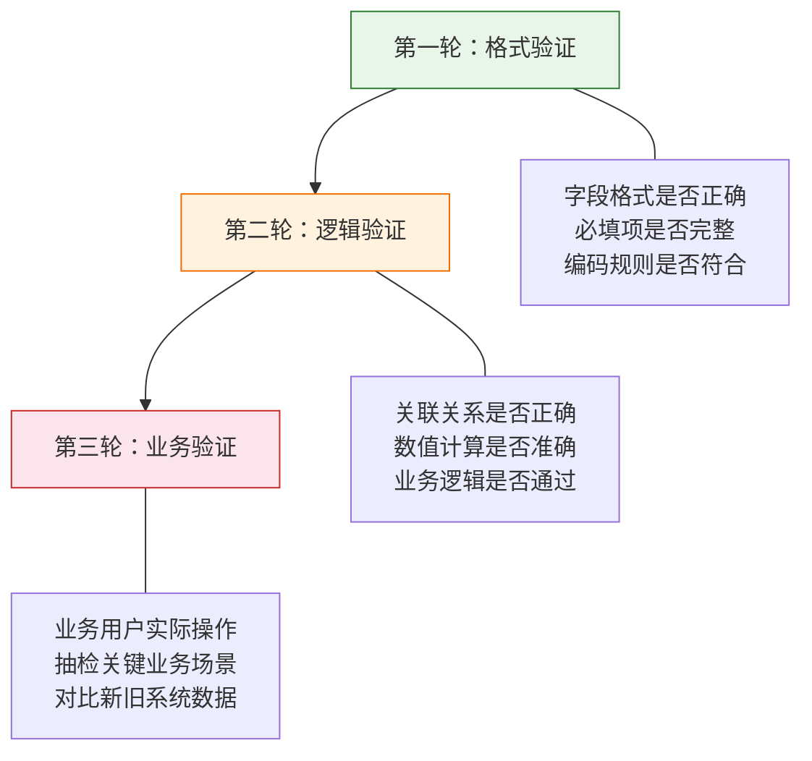
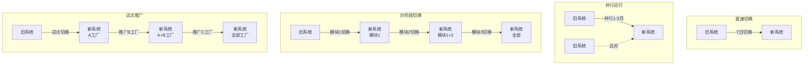

# 数据迁移与并行切换

> 数据迁移是项目中最容易被低估的环节——预算占比经常被压缩到 5%，实际工作量却占到 20%-30%。并行切换是最花钱的保险——双倍工作量，但能让你在出问题时有退路。

## 一、数据迁移：被严重低估的工作量

### 1.1 经验法则

| 指标 | 典型值 | 说明 |
|------|--------|------|
| 工作量占比 | 项目总工作量的 20%-30% | 不含业务人员参与数据清洗的时间 |
| 工期占比 | 项目总工期的 15%-25% | 与系统构建阶段并行，但验证阶段是串行的 |
| 数据问题率 | 历史数据 15%-40% 存在问题 | 去重、缺失、格式不统一、逻辑矛盾 |

### 1.2 常见错误

| 错误 | 后果 | 正确做法 |
|------|------|----------|
| 项目前期不重视数据 | 后期疯狂加班，迁移反复失败 | 项目启动阶段就启动数据盘点 |
| 只迁移了数据，没迁规则 | 新系统中数据无法正确使用 | 迁移数据的同时迁移业务规则和校验逻辑 |
| 低估数据质量问题 | 清洗工作量是预估的 3-5 倍 | 先做数据质量评估，再排计划 |
| 忽略历史数据归档 | 全量迁移导致系统臃肿 | 制定数据归档策略，只迁移活跃数据 |

## 二、数据迁移四步法


### Step 1：数据盘点（2-4 周）

#### 目标

搞清楚"有多少数据、在哪里、什么质量"，为后续清洗和迁移提供依据。

#### 关键活动

| 活动 | 说明 | 产出 |
|------|------|------|
| 数据源梳理 | 列出所有源系统及其数据范围 | 数据源清单 |
| 数据量评估 | 统计各表/文件的数据量 | 数据量统计表 |
| 数据质量评估 | 抽样检查数据的完整性、准确性、一致性 | 数据质量报告 |
| 迁移范围确定 | 确定哪些数据迁移、哪些归档、哪些废弃 | 迁移范围说明书 |

#### 数据源盘点清单模板

| 数据源 | 系统 | 表/文件 | 数据量 | 活跃度 | 迁移策略 | 负责人 |
|--------|------|---------|--------|--------|----------|--------|
| 客户主数据 | 旧 ERP | t_customer | 12 万条 | 高 | 全量迁移 | 张三 |
| 历史订单 | 旧 ERP | t_order | 580 万条 | 低 | 近 3 年迁移 | 李四 |
| 物料清单 | PDM | bom_list | 8 万条 | 高 | 全量迁移 | 王五 |
| 供应商数据 | SRM | t_supplier | 3000 条 | 高 | 全量迁移 | 赵六 |

#### 数据质量评估维度

| 维度 | 定义 | 评估方法 | 典型问题 |
|------|------|----------|----------|
| **完整性** | 必填字段是否都有值 | 空值率统计 | 30% 的客户缺少联系方式 |
| **准确性** | 数据值是否正确 | 抽样比对原始凭证 | 部分物料编码与实物不符 |
| **一致性** | 同一实体在不同系统中的数据是否一致 | 跨系统比对 | ERP 和 SRM 中同一供应商名称不同 |
| **时效性** | 数据是否是最新的 | 时间戳检查 | 5% 的库存数据超过 1 个月未更新 |
| **唯一性** | 是否存在重复记录 | 去重检查 | 客户数据中有 8% 重复 |

---

### Step 2：数据清洗（4-8 周）

#### 目标

把脏数据变干净，把不统一的数据变统一。

#### 关键活动

| 活动 | 说明 | 方法 |
|------|------|------|
| 去重 | 识别并合并重复记录 | 规则匹配+人工确认 |
| 补全 | 填充缺失的关键字段 | 从其他系统补充+人工补充 |
| 标准化 | 统一数据格式和编码规则 | 制定标准+批量转换 |
| 质量检查 | 验证清洗后的数据质量 | 自动校验+抽样人工检查 |

#### 数据清洗规则示例

| 数据类型 | 问题描述 | 清洗规则 | 示例 |
|----------|----------|----------|------|
| 客户名称 | 同一客户多种写法 | 统一使用工商注册全称 | "华为"/"华为技术" → "华为技术有限公司" |
| 物料编码 | 编码规则不统一 | 按新系统编码规则重新编码 | 旧编码 A-001 → 新编码 MAT-2024-0001 |
| 日期格式 | 多种日期格式混用 | 统一为 YYYY-MM-DD | 2024/1/5、20240105 → 2024-01-05 |
| 数值精度 | 小数位数不一致 | 按业务规则统一精度 | 3.14、3.1415 → 3.14（金额保留两位） |
| 地址信息 | 格式不规范 | 拆分为省/市/区/详细地址 | "北京朝阳区xx路" → 省:北京 市:北京 区:朝阳 |

#### 质量检查标准

| 数据类型 | 完整性要求 | 准确性要求 | 一致性要求 |
|----------|-----------|-----------|-----------|
| 主数据 | ≥98% | ≥99% | 跨系统 100% 一致 |
| 交易数据 | ≥95% | ≥98% | 关联关系 100% 正确 |
| 参考数据 | 100% | 100% | 编码体系统一 |

---

### Step 3：数据映射与转换（2-4 周）

#### 目标

定义源系统数据到目标系统的映射关系和转换规则。

#### 关键活动

| 活动 | 说明 | 产出 |
|------|------|------|
| 字段映射 | 源字段→目标字段的对应关系 | 字段映射表 |
| 转换规则 | 定义数据格式和值的转换逻辑 | 转换规则文档 |
| 默认值定义 | 源系统缺失字段在新系统中的默认值 | 默认值配置表 |
| 异常处理 | 映射失败或转换异常的处理方式 | 异常处理规则 |

#### 字段映射表示例

| 源系统 | 源表 | 源字段 | 目标系统 | 目标表 | 目标字段 | 转换规则 | 默认值 |
|--------|------|--------|----------|--------|----------|----------|--------|
| 旧 ERP | t_cust | cust_name | 新 ERP | customer | name | 直接映射 | - |
| 旧 ERP | t_cust | cust_type | 新 ERP | customer | category_id | 值映射：A→1,B→2,C→3 | 1 |
| 旧 ERP | t_cust | create_date | 新 ERP | customer | created_at | 格式转换：YYYYMMDD→YYYY-MM-DD | 1970-01-01 |
| 旧 ERP | t_cust | - | 新 ERP | customer | status | 新增字段 | active |
| 旧 ERP | t_cust | region | 新 ERP | customer | region_code | 查表转换：区域名→区域编码 | 00 |

---

### Step 4：数据验证与加载（2-4 周）

#### 目标

确保迁移后的数据正确、完整、可用。

#### 三轮验证



| 验证轮次 | 验证内容 | 执行者 | 通过标准 |
|----------|----------|--------|----------|
| 第一轮：格式验证 | 字段格式、必填项、编码规则 | 技术团队 | 格式错误率 <0.1% |
| 第二轮：逻辑验证 | 关联关系、数值计算、业务规则 | 技术团队+业务代表 | 逻辑错误率 <0.5% |
| 第三轮：业务验证 | 端到端业务场景、数据比对 | 业务用户 | 关键业务数据 100% 一致 |

#### 加载策略

| 策略 | 说明 | 适用场景 |
|------|------|----------|
| **全量加载** | 一次性加载全部数据 | 数据量小（<100 万条）、系统初次上线 |
| **增量加载** | 先全量加载基线，再增量同步变化 | 数据量大、切换窗口有限 |
| **分批加载** | 按业务模块分批加载 | 数据量极大、可分模块上线 |

#### 验证通过率标准

| 数据类型 | 记录完整性 | 字段准确性 | 关联正确性 |
|----------|-----------|-----------|-----------|
| 主数据 | 100% | ≥99.9% | 100% |
| 交易数据 | ≥99.9% | ≥99.5% | 100% |
| 参考数据 | 100% | 100% | 100% |

## 三、四种切换策略对比

### 3.1 策略总览



### 3.2 详细对比

| 维度 | 直接切换（Big Bang） | 并行运行 | 分阶段切换 | 试点推广 |
|------|---------------------|----------|-----------|----------|
| **描述** | 一次性全部切换 | 新旧系统同时运行一段时间 | 按模块/部门逐步切换 | 先在一个点验证，再全面推广 |
| **切换速度** | 最快（1 天） | 慢（1-3 月并行） | 中等（按阶段递进） | 慢（试点+推广） |
| **风险等级** | 最高 | 最低 | 中等 | 较低 |
| **资源消耗** | 最低 | 最高（双倍工作量） | 中等 | 中等 |
| **回退难度** | 最难 | 最易 | 较易 | 较易 |
| **适用场景** | 系统简单、数据量小、业务影响低 | 核心系统、数据准确性要求高 | 可模块化拆分的大型系统 | 多工厂/多区域的企业 |
| **典型例子** | OA 升级、报表系统更换 | ERP 更换、财务系统切换 | ERP 分模块上线（先 FI 再 CO 再 MM） | WMS 先在 A 仓试点再推广到全仓 |

### 3.3 策略选择决策树

```
系统是否可模块化拆分？
├── 是 → 多个独立站点（工厂/仓库）？
│        ├── 是 → 试点推广
│        └── 否 → 分阶段切换
└── 否 → 数据准确性要求极高？
         ├── 是 → 并行运行
         └── 否 → 系统简单且影响范围小？
                  ├── 是 → 直接切换
                  └── 否 → 并行运行（稳妥优先）
```

## 四、并行运行实操

### 4.1 并行运行流程

| 阶段 | 时间 | 主要工作 |
|------|------|----------|
| 并行准备 | 切换前 1-2 周 | 制定比对规则、准备比对工具、培训用户 |
| 双录入期 | 1-2 周 | 新旧系统同时录入数据，重点比对 |
| 单录入双比对 | 2-4 周 | 新系统录入，旧系统比对验证 |
| 退出并行 | 达标后 | 停用旧系统，新系统独立运行 |

### 4.2 退出并行条件

并行运行不是无限期的，必须设定明确的退出条件：

| 指标 | 达标标准 | 说明 |
|------|----------|------|
| 功能覆盖率 | >95% | 新系统功能覆盖业务需求的比例 |
| 数据一致性 | >99% | 新旧系统同一业务数据的一致性 |
| 用户操作熟练度 | >80% | 用户能独立完成日常操作的比例 |
| 关键业务零中断 | 0 次 | 并行期间关键业务流程无中断 |
| 缺陷修复率 | ≥90% | 并行期间发现的缺陷修复比例 |
| 用户满意度 | ≥4/5 | 用户对新系统的满意度评分 |

### 4.3 并行运行成本

| 成本项 | 说明 | 预估 |
|--------|------|------|
| 双倍人力 | 业务人员需要在两个系统操作 | 人力成本增加 50%-80% |
| 双倍系统 | 旧系统继续运行的费用 | 许可费+运维费 |
| 比对工具 | 开发或购买数据比对工具 | 一次性投入 |
| 管理成本 | 协调并行运行的额外沟通 | 项目管理成本增加 20%-30% |

> **并行运行是保险，不是浪费**。核心系统的并行成本，远低于系统故障造成的业务损失。

## 五、回退方案

### 5.1 为什么必须有回退方案

| 不做回退方案的后果 | 真实案例 |
|-------------------|----------|
| 系统故障无法恢复 | 某企业 ERP 上线失败，旧系统已停用，业务停摆 3 天 |
| 数据丢失无法找回 | 某企业迁移后发现数据错误，但旧系统数据已被覆盖 |
| 业务中断无法交代 | 某企业 WMS 上线崩溃，仓库发货中断，客户投诉激增 |

### 5.2 回退触发条件

| 触发条件 | 级别 | 说明 |
|----------|------|------|
| 核心业务流程中断超过 2 小时 | **必须回退** | 无法完成关键业务操作 |
| 数据一致性低于 95% | **必须回退** | 数据严重不一致 |
| 系统响应时间超过正常值 5 倍 | **建议回退** | 系统性能严重不达标 |
| 用户大面积无法操作 | **建议回退** | 超过 30% 用户无法正常使用 |
| 非核心功能缺陷 | **可继续** | 不影响核心业务，记录并后续修复 |

### 5.3 回退步骤

| 步骤 | 操作 | 责任人 | 时间要求 |
|------|------|--------|----------|
| 1. 决策回退 | 项目经理判定触发条件，通知全体 | 项目经理 | 30 分钟内 |
| 2. 停止新系统 | 停止新系统所有操作，冻结数据 | 系统管理员 | 15 分钟内 |
| 3. 恢复旧系统 | 启用旧系统，确认可用 | 运维团队 | 1-2 小时 |
| 4. 数据回退 | 恢复旧系统到切换前的数据状态 | 数据工程师 | 2-4 小时 |
| 5. 通知相关方 | 通知所有用户和外部合作伙伴 | 项目经理 | 30 分钟内 |
| 6. 问题分析 | 分析切换失败原因，制定改进计划 | 全体核心团队 | 1-2 天内 |

### 5.4 回退演练

::: warning 上线前必须做一次回退演练
回退方案写在纸上是没用的——必须实际演练一次，确保：

1. **回退步骤可执行**：不是"理论上能回退"，而是"实际操作过"
2. **回退时间可接受**：从决定回退到旧系统恢复运行，控制在 4 小时内
3. **数据可恢复**：旧系统数据在切换后完整保留，随时可恢复
4. **人员知道怎么做**：每个步骤的责任人清楚自己的操作

**演练时间**：正式切换前 1-2 周
**演练参与**：全体核心团队成员
**演练要求**：必须完整走一遍回退流程，包括数据恢复验证
:::
