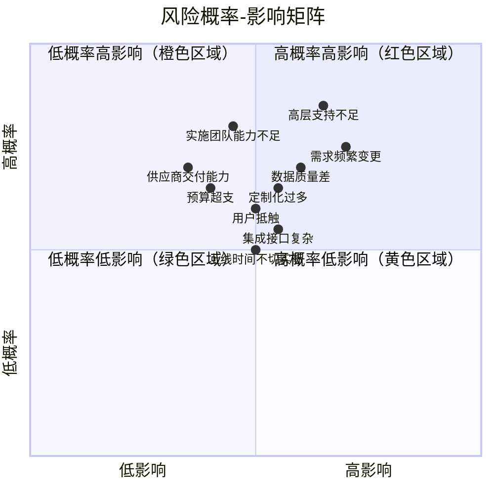
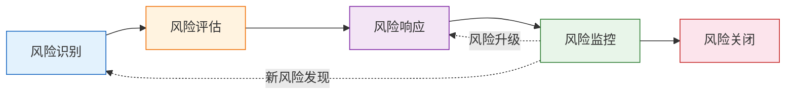
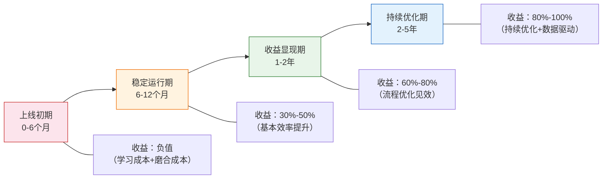

# 风险管理与 ROI 评估

> 项目风险管理不是"出问题了再救火"——它是在项目启动时就识别风险、制定预案、持续监控的系统性工作。ROI 评估不是"编数字说服领导"——它是对投资回报的客观分析，帮助决策者做出理性判断。

## 一、项目风险管理

### 1.1 风险矩阵



### 1.2 Top 10 项目风险

| 排名 | 风险 | 概率 | 影响 | 预防措施 | 应对措施 |
|------|------|------|------|----------|----------|
| 1 | **高层支持不足** | 高 | 高 | 项目章程中明确高层职责和投入时间；定期高层汇报机制 | 升级到更高层级赞助人；暂停项目重新获得承诺 |
| 2 | **需求频繁变更** | 高 | 高 | 需求冻结机制；变更控制流程；MoSCoW 优先级分类 | 评估变更影响，超出阈值走变更审批；低优先级需求放后续迭代 |
| 3 | **数据质量差** | 高 | 中 | 项目启动即启动数据盘点；制定数据质量标准和清洗规则 | 延长数据清洗周期；降低迁移数据范围，历史数据归档 |
| 4 | **实施团队能力不足** | 中 | 高 | 选型阶段面试项目经理和核心成员；合同约定团队稳定性 | 要求更换关键成员；引入第三方监理 |
| 5 | **用户抵触** | 中 | 中 | 上线前充分培训；关键用户深度参与；展示系统能带来的好处 | 一对一沟通了解抵触原因；调整操作方式降低切换成本 |
| 6 | **定制化过多** | 中 | 中 | 蓝图阶段严格区分标配和定制；定制比例控制 <20% | 重新评估定制需求，能用标准功能替代的强制替换 |
| 7 | **集成接口复杂** | 中 | 中 | 蓝图阶段完成接口方案设计；接口先行开发 | 增加集成测试周期；准备降级方案（手工替代） |
| 8 | **上线时间不切实际** | 中 | 中 | 项目计划留 15%-20% 缓冲；关键路径分析 | 调整上线时间或缩减范围；分阶段上线 |
| 9 | **预算超支** | 中 | 中 | 合同约定变更费用上限；每月预算偏差分析 | 冻结非必要变更；申请追加预算或缩减范围 |
| 10 | **供应商交付能力** | 中 | 中 | 选型阶段评估供应商财务和团队状况；合同约定交付标准 | 启动合同违约条款；准备备选供应商 |

### 1.3 风险等级分类

| 等级 | 概率×影响 | 响应要求 | 监控频率 |
|------|-----------|----------|----------|
| **红色（高危）** | 高概率×高影响 | 必须有预防措施和应急预案 | 每日 |
| **橙色（警示）** | 低概率×高影响 | 必须有应急预案 | 每周 |
| **黄色（关注）** | 高概率×低影响 | 需要预防措施 | 双周 |
| **绿色（可控）** | 低概率×低影响 | 记录并定期回顾 | 月度 |

## 二、风险响应流程

### 2.1 流程总览



### 2.2 各环节详解

| 环节 | 关键活动 | 产出 | 责任人 |
|------|----------|------|--------|
| **风险识别** | 风险登记、头脑风暴、经验借鉴、检查表 | 风险清单 | 全体团队成员 |
| **风险评估** | 概率评估、影响评估、优先级排序 | 风险评估矩阵 | 项目经理 |
| **风险响应** | 制定预防措施和应对措施、分配责任人 | 风险响应计划 | 风险责任人 |
| **风险监控** | 跟踪风险状态、识别新风险、评估措施有效性 | 风险状态报告 | 项目经理 |
| **风险关闭** | 确认风险已消除或不再相关 | 关闭记录 | 项目经理 |

### 2.3 四种响应策略

| 策略 | 定义 | 适用场景 | 示例 |
|------|------|----------|------|
| **规避** | 改变计划以消除风险 | 风险影响极大，值得调整方案 | 放弃某个复杂集成方案，改用手工替代 |
| **转移** | 将风险影响转移给第三方 | 风险可以外包或保险 | 将定制开发外包给专业团队，合同约定交付标准 |
| **减轻** | 降低风险概率或影响 | 风险无法完全消除但可降低 | 增加测试轮次以降低上线缺陷率 |
| **接受** | 不采取措施，准备应急方案 | 风险概率低或影响小 | 接受轻微的功能延迟，后续版本修复 |

### 2.4 风险登记册模板

| 编号 | 风险描述 | 类别 | 概率 | 影响 | 等级 | 预防措施 | 应对措施 | 责任人 | 状态 |
|------|----------|------|------|------|------|----------|----------|--------|------|
| R001 | 高层支持不足 | 管理 | 高 | 高 | 红色 | 项目章程明确职责 | 升级赞助人 | PM | 开放 |
| R002 | 数据质量差 | 技术 | 高 | 中 | 黄色 | 提前数据盘点 | 延长清洗周期 | 数据组长 | 开放 |
| R003 | 用户抵触 | 人员 | 中 | 中 | 黄色 | 关键用户深度参与 | 一对一沟通 | 业务组长 | 开放 |

## 三、ROI 评估框架

### 3.1 ROI 计算公式

$$
ROI = \frac{收益 - 投资}{投资} \times 100\%
$$

$$
回收期 = \frac{总投资}{年净收益}
$$

### 3.2 投资构成

| 投资项 | 说明 | 占比参考 | 注意事项 |
|--------|------|----------|----------|
| **软件许可费** | 永久许可或年度订阅 | 20%-35% | 订阅制注意 5 年累计成本 |
| **实施服务费** | 咨询、配置、开发、测试 | 25%-40% | 是最容易超支的部分 |
| **硬件基础设施** | 服务器、存储、网络 | 10%-20% | 云部署可降低初始投入 |
| **内部人力成本** | 甲方投入的人力成本 | 10%-15% | 经常被忽略，但实际很高 |
| **培训成本** | 用户培训、管理员培训 | 3%-5% | 首次+持续培训 |
| **持续维护费** | 年度维护、技术支持 | 5%-10%/年 | 按 5 年计算 |

> **隐性成本提醒**：内部人力成本是最容易被低估的。关键用户投入 50% 的时间参与项目，其工资成本应计入项目投资。

### 3.3 收益构成（量化）

| 收益项 | 量化方法 | 典型收益范围 |
|--------|----------|-------------|
| **人力效率提升** | 减少的人工操作时间 × 人力成本 | 减少 20%-40% 重复性工作 |
| **库存周转率提升** | 周转率提升 × 平均库存价值 × 资金成本 | 周转率提升 15%-30% |
| **准时交付率提升** | 交付率提升 × 延迟损失 | 准时交付率提升 10%-25% |
| **质量成本降低** | 返工、报废、客诉成本降低 | 质量成本降低 15%-30% |
| **决策效率提升** | 报表产出时间 × 决策者时间价值 | 报表周期从周级到日级 |
| **合规风险降低** | 合规违规概率 × 平均罚金 | 违规事件减少 50%-80% |

### 3.4 各系统类型典型 ROI

| 系统类型 | 典型 ROI 范围 | 回收期 | 核心收益来源 |
|----------|--------------|--------|-------------|
| **ERP** | 150%-300% | 2-4 年 | 流程标准化、数据统一、人力效率 |
| **MES** | 100%-250% | 2-3 年 | 产能提升、质量改善、在制品减少 |
| **WMS** | 120%-280% | 1.5-3 年 | 库存准确率提升、作业效率提升 |
| **PLM** | 80%-200% | 2-4 年 | 研发周期缩短、变更管理效率 |
| **QMS** | 100%-180% | 2-3 年 | 质量成本降低、合规风险降低 |
| **SRM** | 90%-200% | 2-3 年 | 采购成本降低、供应商管理效率 |

> **注意**：以上 ROI 范围基于成功实施的案例统计，不成功的项目 ROI 可能为负。

### 3.5 ROI 计算示例

以某中型制造企业 WMS 实施为例：

**投资（5 年）**

| 投资项 | 金额（万元） |
|--------|-------------|
| 软件许可费 | 80 |
| 实施服务费 | 120 |
| 硬件（云部署） | 30 |
| 内部人力 | 50 |
| 培训 | 10 |
| 5 年维护费 | 60 |
| **合计** | **350** |

**年化收益**

| 收益项 | 年收益（万元） | 计算依据 |
|--------|---------------|----------|
| 人力效率提升 | 80 | 减少 4 人 × 年均 20 万 |
| 库存准确率提升 | 60 | 差异率从 5% 降至 1%，减少盘点和调账成本 |
| 仓储面积节约 | 30 | 库位优化节约 15% 仓储面积 |
| 发货错误减少 | 40 | 错发率从 2% 降至 0.3%，减少退换货成本 |
| **年收益合计** | **210** | |

**ROI 计算**

```
5 年总收益 = 210 × 5 = 1050 万
5 年净收益 = 1050 - 350 = 700 万
ROI = 700 / 350 × 100% = 200%
回收期 = 350 / 210 ≈ 1.7 年
```

## 四、ROI 评估的注意事项

### 4.1 四个常见陷阱

| 陷阱 | 表现 | 正确做法 |
|------|------|----------|
| **高估收益** | 假设所有效率提升都能立即实现，忽略过渡期 | 收益按逐年递增计算：第一年 50%、第二年 80%、第三年 100% |
| **低估隐性成本** | 只算软件和实施费，忽略内部人力和持续运维 | 5 年 TCO 必须包含内部人力和持续维护费 |
| **忽略时间价值** | 把 5 年后的收益和今天的投入直接相减 | 用 NPV（净现值）计算，折现率取 8%-12% |
| **只看定量收益** | 忽略品牌形象、客户满意度等定性收益 | 定性收益也要记录，作为决策辅助信息 |

### 4.2 NPV 计算方法

$$
NPV = \sum_{t=1}^{n} \frac{净现金流_t}{(1+r)^t} - 初始投资
$$

- r = 折现率（建议 8%-12%）
- n = 评估年限（建议 5 年）
- NPV > 0 项目值得投资

### 4.3 收益实现的现实路径



### 4.4 ROI 评估清单

| 检查项 | 是否完成 |
|--------|----------|
| 投资范围包含 5 年 TCO | ☐ |
| 内部人力成本已计入投资 | ☐ |
| 收益按逐年递增计算（非一次性） | ☐ |
| 使用 NPV 而非简单 ROI | ☐ |
| 折现率取 8%-12% | ☐ |
| 定性收益已记录 | ☐ |
| 评估基准与同行业案例对标 | ☐ |
| 悲观/中性/乐观三种情景分析 | ☐ |

### 4.5 向管理层汇报 ROI 的建议

1. **准备三种情景**：悲观（收益打 6 折）、中性（预期值）、乐观（收益 1.3 倍），让管理层看到风险边界
2. **重点讲回收期**：管理层最关心"多久能回本"，3 年以内的回收期比较有说服力
3. **用对标案例佐证**：同行业企业的实际收益数据比理论计算更有说服力
4. **区分硬收益和软收益**：硬收益（降本增效）用数字说话，软收益（管理提升）用案例说话
5. **不要回避风险**：主动说明不确定性，比被问住再解释更可信
