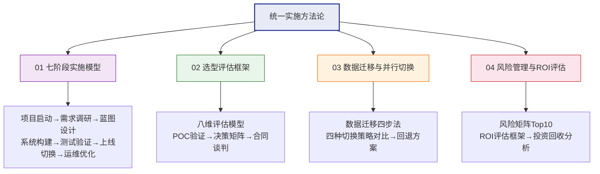

# 统一实施方法论

> 实施方法论不是"选型之后才考虑的事"——它是贯穿从选型到运维的全生命周期框架。过去 WMS、MES、PLM 各自写一套实施方法论，内容 80% 重复，反而让团队无所适从。本章节将各系统的实施方法论统一抽取，形成跨系统通用的实施能力框架。

## 为什么需要统一

以往各子系统文档中分别描述实施方法，导致三个问题：

| 问题 | 表现 |
|------|------|
| **内容重复** | WMS、MES、PLM 各自写的"项目启动""需求调研"章节内容高度雷同 |
| **标准不一致** | 同一阶段不同系统的交付物要求不同，评审时扯皮 |
| **学习成本高** | 新成员要看三套方法论才能掌握一套实施逻辑 |

统一实施方法论解决的核心问题：**一次学习、多系统复用**，让组织级实施能力可沉淀、可传承。

## 章节导航

## 章节目录

- **01 七阶段实施模型**：从项目启动到运维优化的全流程框架，覆盖各阶段目标、交付物、角色和常见问题
- **02 选型评估框架**：八维评估模型、POC 验证方法、决策矩阵和合同谈判要点
- **03 数据迁移与并行切换**：数据迁移四步法、四种切换策略对比、并行运行实操和回退方案
- **04 风险管理与ROI评估**：项目风险 Top10、风险响应流程、ROI 评估框架和投资回收分析
