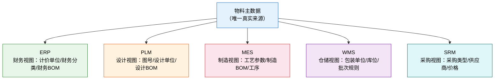
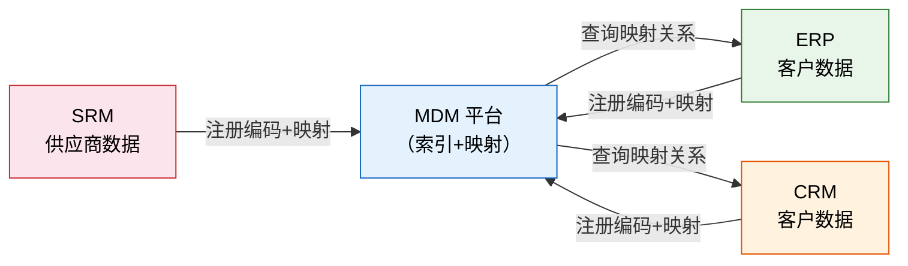
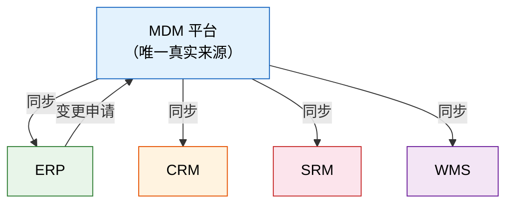
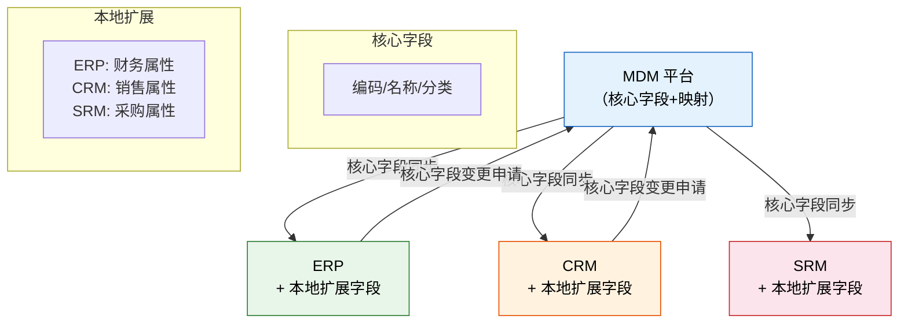
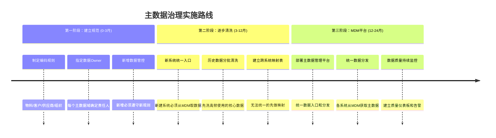

# 主数据管理 MDM

> 主数据是企业的"公共语言"——5 个系统 5 种客户编码，不是段子，是每天都在发生的现实。没有统一的主数据，所有系统集成都是在做翻译，而不是在传递信息。

## 一、什么是主数据

### 1.1 主数据的定义

主数据（Master Data）是描述企业核心业务实体的数据，被多个业务系统共享和引用。它是企业运营的"名词"，而交易数据是"动词"。

一句话区分：**主数据回答"谁、什么"，交易数据回答"做了什么"。**

- 主数据：客户、物料、供应商、组织——这些是企业的核心实体
- 交易数据：订单、发票、工单——这些是对实体的业务操作
- 参考数据：国家代码、行业分类——这些是标准化的枚举值

### 1.2 三类数据的区别

| 数据类型 | 定义 | 示例 | 特征 | 变更频率 |
|---------|------|------|------|---------|
| **主数据** | 核心业务实体，被多系统共享 | 客户、物料、供应商、组织 | 跨系统共享、生命周期长 | 低频变更 |
| **交易数据** | 业务活动产生的记录 | 订单、发票、工单、出入库单 | 单系统为主、量大 | 高频新增 |
| **参考数据** | 标准化编码和分类 | 国家代码、行业分类、计量单位 | 系统间映射、标准化 | 极低频变更 |

### 1.3 为什么主数据是"问题之源"

企业信息化中 80% 的数据问题，追溯到底都是主数据问题：

- 报表对不上 → 物料编码不一致
- 系统对接失败 → 客户编码不统一
- 采购无法下单 → 供应商在新系统里不存在
- 组织调整后审批卡死 → 部门编码不同步

## 二、四大主数据域

### 2.1 物料主数据

物料主数据是制造业最复杂、影响面最大的主数据，几乎覆盖所有核心业务系统。

**核心字段：**

| 字段 | 说明 | 重要性 |
|------|------|--------|
| 物料编码 | 唯一标识，跨系统共享 | 核心 |
| 物料名称 | 标准名称，不应含规格信息 | 核心 |
| 规格型号 | 详细技术参数 | 核心 |
| 物料分类 | 类目体系，支持按层级检索 | 核心 |
| 计量单位 | 基本单位及换算关系 | 核心 |
| ABC 分类 | 按价值/用量分类，影响库存策略 | 重要 |
| 采购类型 | 外购/自制/委外 | 重要 |
| 批次管理 | 是否需要批次追溯 | 重要 |

**多系统分布与差异：**

| 字段 | ERP（财务视图） | PLM（设计视图） | MES（制造视图） | WMS（仓储视图） |
|------|---------------|---------------|---------------|---------------|
| 编码 | 8 位数字 | 图号/件号 | 旧编码 | 字母+数字 |
| 名称 | 财务名称 | 设计名称 | 工艺名称 | 仓储名称 |
| 分类 | 财务分类 | 设计分类 | 车间分类 | 库位分类 |
| 单位 | 计价单位 | 设计单位 | 生产单位 | 包装单位 |
| BOM | 财务 BOM | 设计 BOM | 制造 BOM | 拣配 BOM |

**典型问题：**

- **一物多码**：同一个物料在 ERP 里是 `10002345`，WMS 里是 `WL-A023`，MES 里是 `TJ-2023-045`
- **BOM 不一致**：设计 BOM 有 120 个零件，制造 BOM 有 135 个，财务 BOM 有 118 个——哪个是对的？各有各的道理
- **单位不统一**：ERP 按公斤计价，WMS 按件入库，MES 按米领料

### 2.2 客户主数据

**核心字段：**

| 字段 | 说明 | 重要性 |
|------|------|--------|
| 客户编码 | 唯一标识 | 核心 |
| 客户全称 | 工商注册名，开票用 | 核心 |
| 客户简称 | 日常使用 | 核心 |
| 统一社会信用代码 | 18 位，唯一标识 | 核心 |
| 地址 | 开票地址、发货地址 | 重要 |
| 信用等级 | 影响账期和额度 | 重要 |

**多系统分布与差异：**

| 字段 | CRM（销售视图） | ERP（财务视图） | 财务系统（核算视图） |
|------|---------------|---------------|-------------------|
| 编码 | CRM 自动编号 | ERP 客户码 | 财务辅助核算码 |
| 名称 | 简称为主 | 全称 | 全称+分公司后缀 |
| 税号 | 经常缺失 | 必填 | 必填 |
| 地址 | 联系地址 | 开票地址 | 开票地址 |
| 信用 | CRM 信用评级 | ERP 信用额度 | 账期天数 |

**典型问题：**

- **CRM 简称 vs ERP 全称**：CRM 里叫"华为"，ERP 里叫"华为技术有限公司"，其实是同一个客户
- **三系统三种编码**：一个客户在 CRM 是 `C001234`，ERP 是 `2000456`，财务是 `F-0987`——月结对账时靠人工匹配
- **税号缺失**：CRM 里 60% 的客户没有税号，开票时才发现

### 2.3 供应商主数据

**核心字段：**

| 字段 | 说明 | 重要性 |
|------|------|--------|
| 供应商编码 | 唯一标识 | 核心 |
| 供应商全称 | 工商注册名 | 核心 |
| 统一社会信用代码 | 18 位 | 核心 |
| 银行信息 | 付款用 | 核心 |
| 供应品类 | 供应的物料分类 | 重要 |
| 资质有效期 | 影响合格供应商状态 | 重要 |

**多系统分布与差异：**

| 字段 | SRM（采购视图） | ERP（财务视图） | QMS（合格供应商） |
|------|---------------|---------------|-----------------|
| 编码 | SRM 供应商码 | ERP 供应商码 | 合格供应商编号 |
| 名称 | 简称 | 全称 | 全称 |
| 状态 | 准入/潜在/淘汰 | 正常/冻结 | 合格/有条件合格/不合格 |
| 银行 | 经常缺失 | 必填 | 不涉及 |
| 资质 | 上传附件 | 不涉及 | 资质到期日+附件 |

**典型问题：**

- **供应商准入在 SRM 但付款在 ERP**：新供应商在 SRM 完成准入，但 ERP 里还没有这个供应商，采购单无法生成
- **编码不统一**：SRM 新准入一个供应商给一个新编码，ERP 里已经有一条旧记录是另一个编码——同一个供应商两条数据
- **资质过期无人管**：QMS 里资质过期了，但 SRM 和 ERP 里状态还是"正常"，继续下单

### 2.4 组织主数据

**核心字段：**

| 字段 | 说明 | 重要性 |
|------|------|--------|
| 组织编码 | 唯一标识 | 核心 |
| 组织名称 | 标准名称 | 核心 |
| 层级关系 | 上级组织 | 核心 |
| 组织类型 | 部门/中心/事业部 | 重要 |
| 成本中心 | 对应财务核算 | 重要 |
| 负责人 | 组织负责人 | 重要 |

**多系统分布与差异：**

| 字段 | HR 系统 | ERP | OA | 财务系统 |
|------|--------|-----|-----|---------|
| 编码 | HR 部门码 | ERP 部门码 | OA 部门码 | 成本中心码 |
| 名称 | 人力资源部 | 人资部 | 人力部 | 成本中心-人力 |
| 层级 | 5 层 | 3 层 | 4 层 | 2 层 |
| 负责人 | 实时更新 | 月度同步 | 手动维护 | 不涉及 |

**典型问题：**

- **部门调整后各系统不同步**：组织架构调整后 HR 改了，ERP 和 OA 还没改，审批流程找不到正确的人
- **层级深度不一致**：HR 有 5 层部门，ERP 只认 3 层，财务只认成本中心——映射关系混乱
- **部门改名 vs 新建**：有的系统直接改名，有的系统新建一个部门、旧部门标记停用——对不上

## 三、MDM 架构模式

### 3.1 注册表模式（Registry）

数据留在各业务系统，MDM 只维护索引和跨系统映射关系。

- 优势：各系统改动小，实施速度快
- 劣势：数据仍分散在各系统，实时性差，查询需要跨系统拼接

### 3.2 合并模式（Consolidated）

MDM 作为唯一真实来源（Single Source of Truth），各系统从 MDM 同步数据。

- 优势：数据一致性最好，单一来源
- 劣势：实施工作量大，需改造各系统接口，历史数据清洗成本高

### 3.3 共存模式（Coexistence）

主数据核心字段在 MDM 统一管理，各系统保留本地扩展字段。

- 优势：兼顾一致性和灵活性，核心字段统一、扩展字段自治
- 劣势：架构最复杂，需要明确定义核心字段与扩展字段的边界

### 3.4 三种模式对比

| 维度 | 注册表模式 | 合并模式 | 共存模式 |
|------|-----------|---------|---------|
| **数据一致性** | 低 | 高 | 中高 |
| **实施难度** | 低 | 高 | 最高 |
| **改造成本** | 低 | 高 | 中高 |
| **实时性** | 差 | 好 | 好 |
| **系统改造量** | 小 | 大 | 中 |
| **适用场景** | 系统多、改造难、起步阶段 | 新建系统或大重构 | 成熟企业、渐进式治理 |

**选择建议：**

- 刚起步做主数据治理 → **注册表模式**，先把映射关系建起来
- 有条件做系统改造 → **共存模式**，核心字段统一、扩展字段自治
- 全面上新系统 → **合并模式**，一步到位但实施风险大

## 四、国内企业主数据现状

### 4.1 "5 个系统 5 种客户编码"不是段子，是现实

某制造企业的真实情况：

| 系统 | 物料编码规则 | 示例 | 客户编码规则 | 示例 |
|------|------------|------|------------|------|
| ERP | 8 位纯数字 | `10002345` | 6 位数字 | `200456` |
| WMS | 字母+数字 | `WL-A023` | 不管理 | — |
| MES | 旧图号 | `TJ-2023-045` | 不管理 | — |
| CRM | C+6 位数字 | `C001234` | C+6 位数字 | `C001234` |
| SRM | S+6 位数字 | `S000567` | S+6 位数字 | `S000567` |

同一个物料，5 种编码。每次做报表或系统对接，都要先做映射。映射表从 100 条增长到 10000 条，维护成本远超系统本身。

### 4.2 主数据治理成功率低的真正原因

主数据治理，技术不难，组织难：

| 障碍 | 说明 | 为什么难 |
|------|------|---------|
| **没有数据 Owner** | 没人对数据质量负最终责任 | IT 说"我们只管系统"，业务说"我们只管用"，数据没人管 |
| **部门利益壁垒** | "我的客户数据凭什么给你" | 数据是部门资产，共享意味着失去信息优势 |
| **历史数据清洗量大** | 10 万条物料数据，30% 有问题 | 清洗 3 万条数据，谁来确认？业务部门没人有空 |
| **短期看不到收益** | 数据治理的回报是"不出问题" | 领导问"投了 200 万，产出在哪？" |
| **规则制定容易执行难** | 编码规则写得很好，没人遵守 | 新物料申请时销售自己编一个，不走流程 |

## 五、主数据治理实施路径

### 5.1 三阶段路线

### 5.2 第一阶段：建立规范（0-3 月）

这是最关键的一步——不需要任何系统，只需要管理决心。

| 工作项 | 产出物 | 责任人 |
|--------|--------|--------|
| 制定物料编码规则 | 《物料编码规范》 | 研发+供应链 |
| 制定客户编码规则 | 《客户编码规范》 | 销售+财务 |
| 制定供应商编码规则 | 《供应商编码规范》 | 采购+财务 |
| 指定数据 Owner | 《数据Owner任命书》 | 高管层 |
| 新增数据审批流程 | 新增数据必须经过审批 | IT+业务 |

**核心原则：新增数据必须遵守新规则。** 这一条如果做不到，后面全是空谈。

### 5.3 第二阶段：逐步清洗（3-12 月）

| 工作项 | 方法 | 优先级 |
|--------|------|--------|
| 新系统统一入口 | 新建系统必须从 MDM 或统一编码表获取主数据 | 高 |
| 高频数据清洗 | 先清洗月均使用 > 100 次的物料/客户 | 高 |
| 建立映射表 | 无法统一编码的系统间建立映射关系 | 高 |
| 中频数据清洗 | 月均使用 10-100 次的数据 | 中 |
| 低频数据标记 | 使用频率极低的数据标记"存档"状态 | 低 |

**清洗策略：先洗"活的"数据，"死的"数据不动。** 什么是"活的"？过去 12 个月有业务发生的数据。

### 5.4 第三阶段：MDM 平台（12-24 月）

| 工作项 | 说明 |
|--------|------|
| 部署 MDM 平台 | 选型并部署主数据管理平台 |
| 统一数据入口 | 所有主数据新增/变更通过 MDM |
| 统一数据分发 | MDM 向各系统同步主数据 |
| 数据质量监控 | 建立质量仪表板，设定告警阈值 |
| 持续改进 | 月度数据质量报告，持续优化规则 |

## 六、实操建议

### 6.1 先做物料主数据

物料主数据影响面最大：采购、生产、仓储、销售、财务全链路依赖。物料编码不统一，所有下游系统都会出问题。

| 主数据域 | 影响系统数 | 影响业务流程 | 建议优先级 |
|---------|-----------|------------|-----------|
| 物料 | 5-6 个 | 采购→生产→仓储→销售→财务 | 最高 |
| 客户 | 3-4 个 | 销售→开票→收款 | 高 |
| 供应商 | 3 个 | 采购→入库→付款 | 高 |
| 组织 | 4 个 | 审批→核算→报表 | 中 |

### 6.2 "不改历史、只管新增"是最务实的起步策略

不要一上来就试图改掉所有历史编码，这会让你同时和所有部门为敌。

- **新增数据**：严格执行新编码规则，不合规不予创建
- **历史数据**：先建立映射表，不急于迁移
- **高频数据**：逐步清洗，优先处理每天在用的数据
- **低频数据**：标记存档，不投入资源清洗

### 6.3 数据 Owner 必须是有业务话语权的人

数据 Owner 不能是 IT 部门的人。IT 可以提供工具和平台，但没有权力要求业务部门改数据。

| 主数据域 | 建议数据 Owner | 原因 |
|---------|---------------|------|
| 物料 | 研发总监/技术总监 | 物料定义从研发开始 |
| 客户 | 销售副总裁 | 客户关系归销售管 |
| 供应商 | 供应链总监 | 供应商准入归供应链管 |
| 组织 | HR 总监 | 组织架构归 HR 管 |

数据 Owner 的职责：

1. **制定规则**：编码规则、命名规范、字段标准
2. **审批变更**：主数据新增和变更必须经过 Owner 审批
3. **对质量负责**：数据出了问题，Owner 是第一责任人
4. **推动清洗**：组织业务部门参与数据清洗

### 6.4 编码规则宁可简单统一，不要复杂完美

- 编码规则越复杂，执行成本越高，违规概率越大
- 简单规则 + 丰富属性 > 复杂编码 + 稀疏属性
- 编码只做唯一标识，分类和属性用单独字段管理

| 做法 | 评价 |
|------|------|
| `CG-2024-RW-001`（采购-2024-原材料-001） | 过于复杂，业务变化后编码规则就废了 |
| `M0012345`（纯流水号） | 简单、可扩展、不受业务变化影响 |
| `M0012345` + 分类码 `CG` + 类型码 `RW` | 最佳：编码无含义，分类有含义，各是各的字段 |
