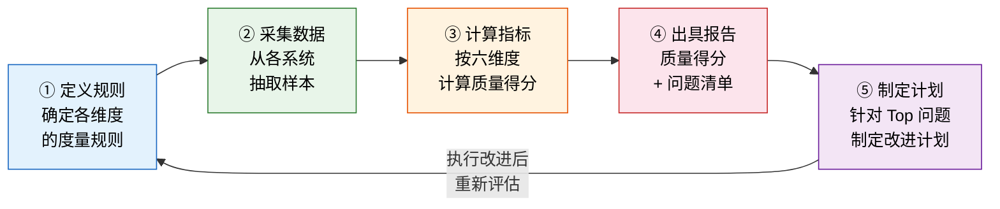
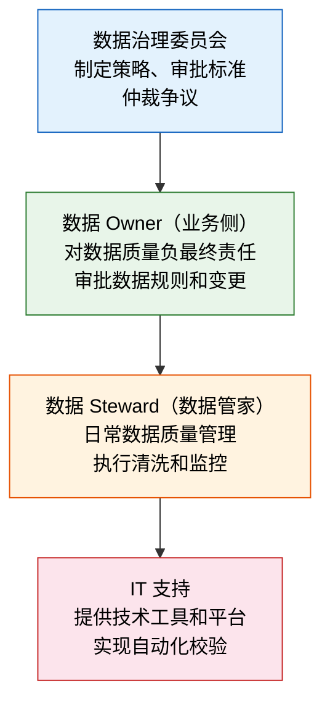
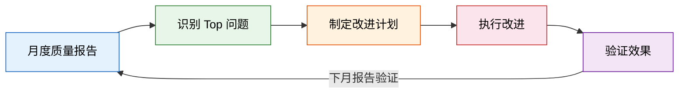

# 数据质量治理体系

> 数据质量不是"做一次清洗"就完事的，它是一个持续的管理过程。没有度量就没有改进，没有 Owner 就没有责任，没有工具就没有效率。

## 一、数据质量的六个维度

数据质量不是抽象概念，它有明确的度量维度。以下六个维度覆盖了数据质量的核心关注点。

### 1.1 完整性（Completeness）

**定义：** 必填字段是否都有值。数据记录缺失关键字段，就像一个人没有身份证号——系统无法正常处理。

**度量方法：** 必填字段填充率 = 有值记录数 / 总记录数 × 100%

**典型问题：**

| 系统 | 问题 | 影响 |
|------|------|------|
| CRM | 60% 的客户缺失税号 | 开票时才发现，退货率升高 |
| ERP | 30% 的物料缺失 ABC 分类 | 库存策略无法自动执行 |
| SRM | 供应商缺失银行信息 | 付款时需手工补录，效率低 |

**改进方法：**

- 系统层面：必填字段强制校验，不填不能保存
- 管理层面：每月统计各部门数据完整率，纳入考核
- 流程层面：数据录入时一次性采集所有必填信息

### 1.2 准确性（Accuracy）

**定义：** 数据值是否正确反映真实情况。数据"有"但"不对"，比没有更危险。

**度量方法：** 抽样核对准确率 = 抽样正确数 / 抽样总数 × 100%

**典型问题：**

| 系统 | 问题 | 影响 |
|------|------|------|
| CRM | 客户地址过时 | 发货被退回，物流成本增加 |
| ERP | 物料规格错误 | 采购错料，生产停线 |
| WMS | 库位信息不准 | 拣货效率低，找不到货 |

**改进方法：**

- 定期抽样核对：每季度对核心数据做抽样审计
- 业务反馈机制：使用者发现错误可以一键报错
- 变更留痕：关键字段变更记录前后值和变更人

### 1.3 一致性（Consistency）

**定义：** 同一实体在不同系统中是否一致。这是系统集成场景下最突出的问题。

**度量方法：** 跨系统字段匹配率 = 一致记录数 / 对比记录数 × 100%

**典型问题：**

| 场景 | 问题 | 影响 |
|------|------|------|
| ERP vs WMS | 同一物料库存数不一致 | 销售承诺量不准 |
| CRM vs ERP | 同一客户名称不一致 | 对账困难 |
| HR vs OA | 同一部门编码不一致 | 审批路由错误 |

**改进方法：**

- 建立主数据管理平台，统一数据来源
- 定期跨系统比对，生成差异报告
- 明确各系统数据的"权威来源"

### 1.4 及时性（Timeliness）

**定义：** 数据是否在业务需要时已经更新。数据虽然正确，但更新太晚，就等于错误。

**度量方法：** 数据更新延迟时间 = 数据实际更新时间 - 业务发生时间

**典型问题：**

| 场景 | 问题 | 影响 |
|------|------|------|
| 出库后 ERP 库存 | 1 天后才更新 | 销售看到虚假可用库存 |
| 供应商状态变更 | SRM 改了 ERP 没改 | 继续向淘汰供应商下单 |
| 组织架构调整 | HR 改了 OA 没改 | 审批找不到人 |

**改进方法：**

- 关键数据实时同步：库存、状态等高频变更数据
- 非关键数据定时同步：组织架构等低频变更数据
- 监控同步延迟：超过阈值自动告警

### 1.5 唯一性（Uniqueness）

**定义：** 是否存在重复记录。重复记录是最隐蔽的问题——系统不会报错，但报表会出错。

**度量方法：** 重复记录占比 = 重复记录数 / 总记录数 × 100%

**典型问题：**

| 场景 | 问题 | 影响 |
|------|------|------|
| CRM | 同一客户 3 条记录 | 客户画像不完整，销售额被拆分 |
| ERP | 同一物料 2 个编码 | 采购量统计不准 |
| SRM | 同一供应商 2 次准入 | 价格谈判力分散 |

**改进方法：**

- 新增数据时模糊匹配查重：按名称+税号查重
- 定期运行去重程序：识别疑似重复记录
- 合并重复记录：保留最完整的记录，其他标记合并

### 1.6 有效性（Validity）

**定义：** 数据值是否符合业务规则和格式约束。数据虽然"有"，但"不合法"。

**度量方法：** 规则校验通过率 = 校验通过记录数 / 校验记录数 × 100%

**典型问题：**

| 字段 | 问题 | 规则 |
|------|------|------|
| 电话号码 | 格式错误、位数不对 | 手机 11 位、固话区号+号码 |
| 统一社会信用代码 | 位数不对、校验位错误 | 18 位、第 18 位为校验位 |
| 日期 | 未来日期、逻辑不合理 | 不超过当前日期 |
| 金额 | 负数、超过上限 | 业务规则校验 |

**改进方法：**

- 录入时格式校验：正则表达式校验手机号、邮箱等
- 业务规则校验：跨字段逻辑校验
- 参考数据约束：下拉选择代替手工输入

### 1.7 六维度总览

| 维度 | 定义 | 度量指标 | 目标值 | 检测方法 |
|------|------|---------|--------|---------|
| **完整性** | 必填字段是否有值 | 必填字段填充率 | ≥ 98% | 空值扫描 |
| **准确性** | 数据值是否正确 | 抽样核对准确率 | ≥ 95% | 抽样审计 |
| **一致性** | 跨系统是否一致 | 跨系统字段匹配率 | ≥ 99% | 跨系统比对 |
| **及时性** | 数据是否及时更新 | 更新延迟时间 | < 1 小时 | 同步监控 |
| **唯一性** | 是否有重复记录 | 重复记录占比 | < 1% | 去重检测 |
| **有效性** | 数据是否符合规则 | 规则校验通过率 | ≥ 99% | 规则引擎 |

## 二、数据质量评估方法

### 2.1 评估模式

| 模式 | 频率 | 方式 | 适用场景 |
|------|------|------|---------|
| **定期评估** | 月度/季度 | 人工采集数据，计算指标，出具报告 | 数据治理起步阶段，建立基线 |
| **实时监控** | 持续 | 规则引擎自动检测，异常实时告警 | 数据治理成熟阶段，持续运营 |

建议从定期评估起步，逐步过渡到实时监控。不要一上来就建自动化平台——规则还没理清，自动化只会产出大量噪音。

### 2.2 评估流程



评估不是目的，改进才是。每次评估必须产出改进计划，否则评估就变成了"体检但不治病"。

### 2.3 评估报告模板

一份合格的数据质量评估报告应包含：

| 章节 | 内容 |
|------|------|
| 执行摘要 | 总体质量得分、环比变化、关键发现 |
| 各维度得分 | 六维度得分及趋势 |
| Top 10 问题 | 影响最大的 10 个数据质量问题 |
| 问题明细 | 按系统、按主数据域分类的问题清单 |
| 改进计划 | 针对每个问题的责任人、措施、完成时间 |
| 上期跟踪 | 上期改进计划的执行情况 |

## 三、数据质量治理组织

### 3.1 组织架构



### 3.2 各角色职责

| 角色 | 人员构成 | 核心职责 | 决策权 |
|------|---------|---------|--------|
| **数据治理委员会** | CIO + 各业务 VP | 制定数据治理策略、审批标准、仲裁争议 | 战略决策 |
| **数据 Owner** | 业务部门负责人 | 对数据质量负最终责任、审批规则和变更 | 规则审批 |
| **数据 Steward** | 业务骨干 + 数据专员 | 日常数据质量管理、执行清洗、监控质量 | 执行操作 |
| **IT 支持** | 数据平台团队 | 提供校验工具、同步平台、监控告警 | 技术实现 |

### 3.3 核心原则：数据质量是业务问题，不是 IT 问题

这个原则必须反复强调，因为太多企业把数据质量问题甩给 IT 部门：

| 错误认知 | 正确认知 |
|---------|---------|
| "数据质量差是因为系统不好用" | 系统只是工具，数据录入的源头在业务 |
| "IT 部门负责数据清洗" | IT 提供工具，业务确认数据对不对 |
| "数据质量是技术问题" | 数据质量是管理问题，技术是手段 |
| "上了 MDM 数据就好了" | MDM 只是平台，不解决"谁来录、录什么"的问题 |

**判断标准：** 如果业务部门不参与，数据治理项目一定失败。IT 可以建系统，但无法判断"这个客户名称应该是什么"。

## 四、数据质量仪表板设计

### 4.1 核心指标

仪表板应该让管理层一眼看到数据质量的总体状况和变化趋势。

| 指标 | 展示方式 | 说明 |
|------|---------|------|
| 综合质量分 | 仪表盘（0-100） | 六维度加权平均分 |
| 各维度得分 | 雷达图 | 一眼看出哪个维度最弱 |
| 质量趋势 | 折线图（近 12 个月） | 质量是改善还是恶化 |
| Top 10 问题 | 表格 | 影响最大的质量问题 |
| 各系统质量分 | 柱状图 | 对比各系统数据质量 |

### 4.2 仪表板布局

```
┌─────────────────────────────────────────────────┐
│  数据质量仪表板          综合质量分: 87/100      │
├─────────────────────┬───────────────────────────┤
│                     │                           │
│   六维度雷达图       │    质量趋势（12个月）       │
│                     │                           │
├─────────────────────┼───────────────────────────┤
│                     │                           │
│  各系统质量分柱状图   │    Top 10 问题列表         │
│                     │                           │
├─────────────────────┴───────────────────────────┤
│  告警：物料主数据完整性 92% < 目标 98%            │
│  告警：ERP-WMS 库存一致性 89% < 目标 99%          │
└─────────────────────────────────────────────────┘
```

### 4.3 告警规则

| 告警级别 | 触发条件 | 通知对象 | 处理要求 |
|---------|---------|---------|---------|
| **红色告警** | 质量分 < 70 分 | 数据 Owner + 治理委员会 | 24 小时内响应 |
| **黄色告警** | 质量分 70-85 分 | 数据 Owner + 数据 Steward | 1 周内制定改进计划 |
| **绿色正常** | 质量分 > 85 分 | 数据 Steward | 持续监控 |
| **趋势告警** | 质量分连续 3 个月下降 | 数据 Owner | 分析原因并制定对策 |

## 五、数据质量改进实践

### 5.1 预防优于纠正

数据质量改进的投入产出比：**事前预防 >> 事后清洗**。

| 阶段 | 方法 | 投入 | 效果 |
|------|------|------|------|
| **录入时预防** | 必填校验 + 格式校验 + 查重 | 低 | 最好 |
| **流转中拦截** | 接口校验 + 规则引擎 | 中 | 好 |
| **存储后清洗** | 批量清洗 + 人工确认 | 高 | 一般 |
| **报表前修正** | 手工调整 | 最高 | 最差 |

**关键做法：** 把校验规则嵌入业务流程，在数据录入时就拦截问题数据，而不是等数据进了系统再清洗。

### 5.2 自动化规则引擎

三类校验规则：

| 规则类型 | 说明 | 示例 |
|---------|------|------|
| **必填校验** | 关键字段不能为空 | 客户名称、税号不能为空 |
| **格式校验** | 数据格式必须符合规则 | 手机号 11 位数字、税号 18 位 |
| **逻辑校验** | 跨字段逻辑关系必须合理 | 出库量 ≤ 可用库存、付款金额 ≤ 订单金额 |

规则引擎的配置流程：

1. 业务部门定义规则（数据 Owner 牵头）
2. IT 实现规则（配置或开发）
3. 规则上线前灰度测试（不阻断，只告警）
4. 规则稳定后正式启用（阻断不合规数据）

### 5.3 定期清洗活动

**每季度一次"数据质量月"：**

| 周次 | 活动 | 参与者 |
|------|------|--------|
| 第 1 周 | 运行质量评估，出具问题清单 | 数据 Steward |
| 第 2 周 | 各部门认领问题，制定清洗计划 | 数据 Owner + 业务部门 |
| 第 3 周 | 执行清洗，修正问题数据 | 业务部门 + 数据 Steward |
| 第 4 周 | 验证清洗结果，计算改善幅度 | 数据 Steward + IT |

清洗不是 IT 部门的事。IT 可以提供工具（批量更新脚本、查重程序），但**数据对不对只有业务部门知道**。

### 5.4 持续改进机制



持续改进的核心是**闭环**：

1. **度量**：每月出报告，知道现状
2. **分析**：识别 Top 问题，找到根因
3. **行动**：制定改进计划，指定责任人
4. **验证**：下月报告验证改进效果

如果连续 3 个月某个维度没有改善，需要升级到数据治理委员会，从组织层面推动。

### 5.5 数据质量改进的常见误区

| 误区 | 正确做法 |
|------|---------|
| "做一次大清洗就够了" | 数据质量是持续过程，不是一次性项目 |
| "买了数据质量工具就好了" | 工具只是手段，规则和责任人才是关键 |
| "先不管，等上 MDM 再说" | 越等越脏，治理成本随时间指数增长 |
| "IT 负责数据清洗" | 业务确认数据对不对，IT 只提供工具 |
| "所有数据都要 100% 准确" | 关注核心数据，接受非核心数据的合理容差 |
