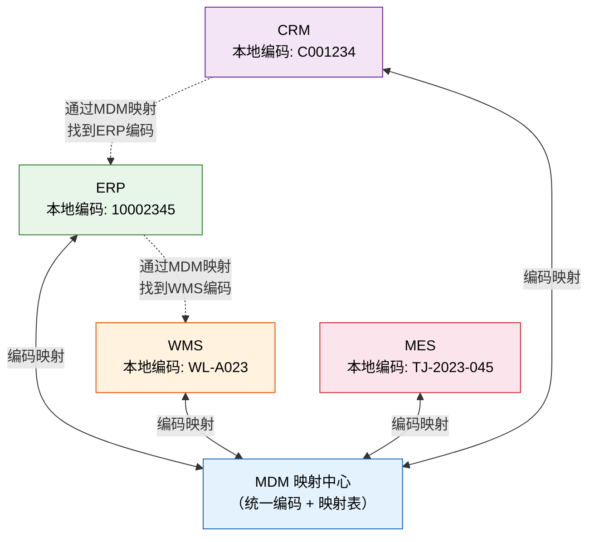
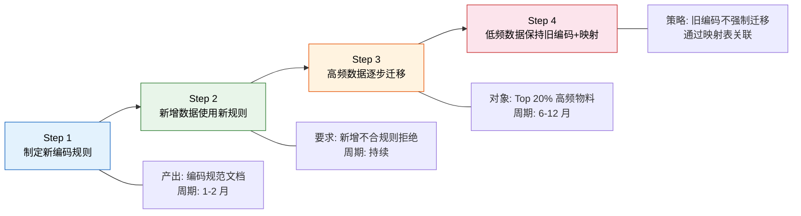

# 跨系统数据标准与编码规则

> 编码是企业数据的"身份证号"——编码不统一，所有系统集成都要做映射表。一个 10 万条物料的企业，如果 3 个系统 3 种编码，映射表就有 30 万行，每行都可能出错。

## 一、编码规则的重要性

### 1.1 编码是什么

编码是给企业核心业务实体分配的唯一标识。它不是描述性的文字，是系统间传递信息的"暗号"——编码一致，系统才能对话；编码不一致，系统只能鸡同鸭讲。

### 1.2 编码不统一的代价

| 影响领域 | 具体表现 | 代价 |
|---------|---------|------|
| **系统集成** | 每个接口都要做编码映射 | 开发成本 × 系统数 |
| **数据查询** | 同一个物料在 A 系统查不到 B 系统的记录 | 人工核对成本 |
| **报表统计** | 采购量、库存量、销售额无法汇总 | 决策数据不准 |
| **业务协同** | 采购在 SRM 下单，ERP 不认这个物料编码 | 业务流程断裂 |

**量化估算：** 如果一个企业有 5 个系统，物料编码各不相同，那么每增加一个系统集成接口，就需要维护一张 N 万行的映射表。5 个系统两两对接，就是 10 张映射表。每张表的维护成本 × 10，这就是编码不统一的代价。

### 1.3 好的编码规则的价值

| 收益 | 说明 |
|------|------|
| **降低集成成本** | 统一编码后，接口不需要做映射，开发和维护成本降低 50% 以上 |
| **提升数据质量** | 编码唯一，不会出现"一物多码"或"一码多物" |
| **简化报表** | 跨系统汇总时不需要先做编码匹配 |
| **降低人员培训成本** | 一套编码体系，员工不需要记多个系统的编码规则 |

## 二、两种编码哲学

### 2.1 有含义编码（Intelligent Coding）

编码本身承载业务信息，看编码就能知道"这是什么"。

**示例：**

| 编码 | 含义解析 |
|------|---------|
| `CG-2024-001` | CG=采购类，2024=年份，001=流水号 |
| `WL-YL-ST-001` | WL=物料，YL=原材料，ST=钢材，001=流水号 |
| `KH-HW-BJ-001` | KH=客户，HW=海外，BJ=北京，001=流水号 |

**优势：**

- 看编码知含义，无需查系统
- 人工识别方便，便于口头沟通
- 历史习惯，老员工容易接受

**劣势：**

- **业务变化后编码规则崩溃**：采购类物料后来也用于销售，"CG"这个前缀就不对了
- **位数固定限制扩展**：分类代码用了 2 位，现在有 100+ 分类，2 位不够了
- **编码规则越来越复杂**：为了塞更多信息，规则越加越长，新人根本记不住
- **重编码代价极大**：规则变了，所有历史编码要改，关联的订单、发票全受影响

### 2.2 无含义编码（Non-intelligent Coding）

编码只是唯一标识，不承载业务信息，所有含义通过属性字段表达。

**示例：**

| 编码 | 含义 |
|------|------|
| `M0012345` | 物料编号，纯流水号 |
| `C0001234` | 客户编号，纯流水号 |
| `S0005678` | 供应商编号，纯流水号 |

**优势：**

- **灵活**：业务怎么变，编码不受影响
- **可扩展**：流水号用完一位就加一位
- **简单**：规则只有一条——保证唯一
- **不受业务变化影响**：物料从采购类变成销售类，编码不变

**劣势：**

- 看编码不知含义，需要系统查询
- 老员工不习惯，觉得"没信息量"
- 需要依赖系统做查询，离开系统编码就只是一串数字

### 2.3 推荐方案：无含义编码 + 有含义分类

将编码和分类拆成两个独立字段：编码保证唯一，分类表达含义。

**为什么这样做：**

| 场景 | 有含义编码 | 无含义编码+分类 |
|------|-----------|---------------|
| 物料从采购类变成销售类 | 编码要改，历史数据全乱 | 只改分类字段，编码不变 |
| 新增分类 | 编码规则要改，位数可能不够 | 新增分类码即可 |
| 人员培训 | 要记住复杂的编码规则 | 只需记住简单的编码前缀 |
| 系统查询 | 可以按编码段筛选 | 按分类字段筛选，更灵活 |

## 三、各类主数据编码标准

### 3.1 物料编码

**规则建议：1 位类型码 + 7 位流水号**

| 字段 | 类型 | 长度 | 必填 | 规则说明 |
|------|------|------|------|---------|
| 物料编码 | 字符 | 8 | 是 | 1 位类型码 + 7 位流水号，如 M0012345 |
| 物料名称 | 字符 | 100 | 是 | 标准名称，不含规格信息 |
| 规格型号 | 字符 | 200 | 是 | 详细技术参数 |
| 物料分类 | 字符 | 20 | 是 | 分类码，如 YL（原材料）、BCP（半成品）、CP（成品） |
| 基本计量单位 | 字符 | 10 | 是 | 引用计量单位主数据 |
| ABC 分类 | 字符 | 1 | 是 | A/B/C 分类 |
| 采购类型 | 字符 | 10 | 是 | 外购/自制/委外 |
| 状态 | 字符 | 10 | 是 | 启用/停用/存档 |

**类型码定义：**

| 类型码 | 含义 | 说明 |
|--------|------|------|
| `M` | 物料（通用） | 默认类型码 |
| `R` | 原材料 | 用于生产投入的物料 |
| `S` | 半成品 | 加工中间状态的物料 |
| `F` | 成品 | 最终销售的产品 |
| `P` | 包装物 | 包装用的物料 |
| `C` | 备品备件 | 设备维修用物料 |

**禁止规则：**

- 不要在编码中嵌入分类、规格、供应商信息
- 不要用特殊字符（只允许字母和数字）
- 不要用容易混淆的字符（0/O、1/I/l）
- 不要预留分段含义位（如前 2 位表示大类）

### 3.2 客户编码

**规则建议：C + 7 位流水号**

| 字段 | 类型 | 长度 | 必填 | 规则说明 |
|------|------|------|------|---------|
| 客户编码 | 字符 | 8 | 是 | C + 7 位流水号，如 C0001234 |
| 客户全称 | 字符 | 200 | 是 | 工商注册名，与营业执照一致 |
| 客户简称 | 字符 | 50 | 是 | 日常使用名称 |
| 统一社会信用代码 | 字符 | 18 | 是 | 18 位，第 18 位为校验位 |
| 开票地址 | 字符 | 200 | 否 | 增值税发票地址 |
| 信用等级 | 字符 | 10 | 否 | AAA/AA/A/BBB/BB/B |
| 客户分类 | 字符 | 20 | 是 | 行业/区域/规模分类码 |
| 状态 | 字符 | 10 | 是 | 启用/冻结/淘汰 |

**关键原则：**

- 客户编码必须与 ERP/SRM/CRM 统一，一个客户只有一个编码
- 客户全称必须与工商注册名一致，开票名称不允许修改
- 统一社会信用代码是客户唯一标识的"硬约束"——税号相同就是同一个客户

### 3.3 供应商编码

**规则建议：S + 7 位流水号**

| 字段 | 类型 | 长度 | 必填 | 规则说明 |
|------|------|------|------|---------|
| 供应商编码 | 字符 | 8 | 是 | S + 7 位流水号，如 S0005678 |
| 供应商全称 | 字符 | 200 | 是 | 工商注册名 |
| 供应商简称 | 字符 | 50 | 是 | 日常使用名称 |
| 统一社会信用代码 | 字符 | 18 | 是 | 18 位 |
| 开户银行 | 字符 | 100 | 是 | 付款银行全称 |
| 银行账号 | 字符 | 30 | 是 | 付款账号 |
| 供应品类 | 字符 | 200 | 是 | 供应的物料分类码列表 |
| 状态 | 字符 | 10 | 是 | 准入/合格/有条件合格/淘汰 |

**与客户编码的关系：**

- 同一个法律主体可能既是客户又是供应商，此时客户编码和供应商编码分开管理
- 统一社会信用代码可以建立客户与供应商的关联关系

### 3.4 组织编码

**规则建议：O + 层级码 + 流水号**

| 字段 | 类型 | 长度 | 必填 | 规则说明 |
|------|------|------|------|---------|
| 组织编码 | 字符 | 10 | 是 | O + 层级码(1位) + 流水号 |
| 组织名称 | 字符 | 100 | 是 | 标准全称 |
| 组织简称 | 字符 | 50 | 是 | 日常使用名称 |
| 上级组织 | 字符 | 10 | 否 | 引用组织编码 |
| 组织类型 | 字符 | 20 | 是 | 集团/事业部/中心/部门/科室 |
| 组织层级 | 数值 | 1 | 是 | 1-5 层 |
| 成本中心 | 字符 | 10 | 是 | 对应财务成本中心编码 |
| 负责人 | 字符 | 20 | 是 | 组织负责人工号 |
| 状态 | 字符 | 10 | 是 | 启用/停用/合并 |

**层级码定义：**

| 层级码 | 层级 | 示例 |
|--------|------|------|
| `1` | 集团 | O100001 → XX 集团 |
| `2` | 事业部 | O200015 → 制造事业部 |
| `3` | 中心 | O300123 → 供应链中心 |
| `4` | 部门 | O400567 → 采购部 |
| `5` | 科室 | O500890 → 战略采购科 |

**关键约束：组织编码必须与成本中心一一对应。** 组织调整时，成本中心同步变更；新增组织时，必须先创建成本中心。

## 四、跨系统映射表

### 4.1 为什么需要映射表

在理想世界里，所有系统用同一套编码。但在现实中，存量系统的历史编码无法一次性改掉，映射表是过渡阶段的必要手段。

**映射表的定位：** 它不是最终方案，而是从不统一到统一之间的桥梁。

### 4.2 映射表结构

以物料编码映射为例：

| 字段 | 类型 | 说明 |
|------|------|------|
| 统一编码 | 字符 | MDM 中的标准编码 |
| 系统编码 | 字符 | 源系统中的本地编码 |
| 系统名称 | 字符 | 源系统名称（如 ERP、WMS） |
| 映射状态 | 字符 | 已验证/待验证/冲突 |
| 最后验证日期 | 日期 | 上次人工验证时间 |
| 验证人 | 字符 | 验证人姓名 |

**数据示例：**

| 统一编码 | ERP 编码 | WMS 编码 | MES 编码 | 映射状态 |
|---------|---------|---------|---------|---------|
| M0012345 | 10002345 | WL-A023 | TJ-2023-045 | 已验证 |
| M0012346 | 10002346 | WL-A024 | — | 已验证 |
| M0012347 | 10002347 | — | — | 待验证 |

### 4.3 映射架构

### 4.4 映射维护规则

| 场景 | 处理方式 |
|------|---------|
| **新增主数据** | 在 MDM 创建统一编码，各系统编码由映射表自动关联 |
| **历史数据发现** | 将存量编码录入映射表，标记"待验证" |
| **编码冲突** | 同一统一编码映射到多个系统编码（疑似一物多码），需人工确认 |
| **映射失效** | 系统编码被停用但映射未更新，定期清理失效映射 |

## 五、编码标准推行策略

### 5.1 核心原则

**新系统新规则、老系统逐步迁移。**

不要试图一次性改掉所有历史编码——那会让你同时和所有系统、所有部门为敌。渐进式推行，让每个阶段都能看到成果。

### 5.2 分步推行

### 5.3 各步骤详解

**Step 1：制定新编码规则（1-2 月）**

| 工作项 | 产出物 | 责任人 |
|--------|--------|--------|
| 制定物料编码规则 | 《物料编码规范》 | 研发 + 供应链 |
| 制定客户编码规则 | 《客户编码规范》 | 销售 + 财务 |
| 制定供应商编码规则 | 《供应商编码规范》 | 采购 + 财务 |
| 制定组织编码规则 | 《组织编码规范》 | HR + 财务 |
| 审批发布 | 高管审批后全员发布 | 数据治理委员会 |

**Step 2：新增数据使用新规则（持续）**

- 新建物料/客户/供应商/组织，必须使用新编码规则
- 系统层面：录入界面增加编码规则校验，不合规不给保存
- 管理层面：每月统计合规率，不合规的追溯录入人

**Step 3：高频数据逐步迁移（6-12 月）**

- 按 Pareto 原则，先迁移 Top 20% 高频使用的数据
- "高频"定义：过去 12 个月有业务发生的记录
- 迁移方式：旧编码标记"停用"，新编码标记"启用"，映射表维护关联关系
- 迁移后验证：确认旧编码关联的历史数据仍然可查

**Step 4：低频数据保持旧编码 + 映射表（长期）**

- 低频数据（过去 12 个月无业务发生）不强制迁移
- 通过映射表维护新旧编码关联
- 这些数据可能永远不需要迁移——如果一条物料 3 年没有业务，它的重要性不值得投入迁移成本

## 六、常见坑

### 坑 1：编码规则设计过于复杂，实施时无法执行

| 典型表现 | 后果 |
|---------|------|
| 编码规则有 5 层含义、12 位编码 | 业务人员记不住，违规率 > 50% |
| 每个字段都要校验编码段 | 系统录入效率极低，用户绕过系统自己编 |
| 规则文档 50 页 | 没人看，形同虚设 |

**正确做法：** 编码规则 1 页纸能说清。如果说不清，说明规则太复杂了。

### 坑 2：为了"有含义"在编码里塞太多信息，业务一变就乱

| 典型表现 | 后果 |
|---------|------|
| 供应商编码第 3-4 位是省份代码 | 供应商搬迁后编码与实际不符 |
| 物料编码第 2 位是物料大类 | 大类调整后编码不变，新员工被误导 |
| 客户编码包含区域代码 | 客户跨区经营后编码含义失效 |

**正确做法：** 编码只做唯一标识，分类信息用单独字段维护。编码可以"丑"，但不能"错"。

### 坑 3：各部门各系统自定编码，无人统一管理

| 典型表现 | 后果 |
|---------|------|
| 采购部有自己的供应商编码 | 与 ERP 供应商编码对不上 |
| 车间自行编制物料编码 | 一物多码，BOM 无法汇总 |
| 销售给客户编了内部代号 | CRM 里的客户和 ERP 对不上 |

**正确做法：** 编码管理权必须集中。谁定义编码、谁审批编码、谁维护编码，必须有明确的责任人。任何系统不得自行创建编码，必须通过统一入口申请。

### 坑 4：编码规则频繁变更，历史数据无法追溯

| 典型表现 | 后果 |
|---------|------|
| 今年改了一次编码规则，明年又改 | 历史报表里的旧编码没人认识 |
| 编码改了但映射表没更新 | 老订单关联的物料编码找不到对应关系 |

**正确做法：** 编码规则一旦发布，至少 3 年不变。如果必须改，旧编码不停用，新旧映射必须同步维护。编码变更必须经过数据治理委员会审批。

### 坑 5：忘记预留编码空间，流水号用完就尴尬了

| 典型表现 | 后果 |
|---------|------|
| 物料编码设计 6 位流水号，5 年后用完 | 要么改规则，要么改系统 |
| 客户编码用 4 位流水号，扩展到 5 位后所有报表格式错乱 | 改造代价远超当初多留 2 位 |

**正确做法：** 流水号至少预留 7-8 位。7 位流水号可容纳 1000 万条记录，8 位可容纳 1 亿条——对于绝大多数企业足够了。多位数的存储和显示成本在今天的系统里可以忽略不计。
