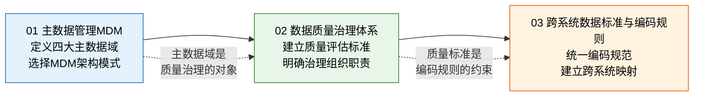

# 数据治理与主数据

> 数据治理是所有系统集成的地基——没有干净的数据，再好的系统也只是"垃圾进、垃圾出"。5 个系统 5 种物料编码、3 个系统 3 套客户名称，这些不是段子，是每天在企业里发生的现实。

## 本章导读

本章回答一个核心问题：**系统上线后数据为什么越用越脏，怎么治？**

数据治理不是技术项目，是组织问题。技术方案再完美，没有业务部门配合、没有数据 Owner、没有编码规则执行，数据只会持续腐烂。本章从主数据管理、数据质量治理、编码标准三个维度，给出可落地的实施路径。

| 维度 | 核心问题 | 对应文章 |
|------|---------|---------|
| **主数据** | 物料、客户、供应商、组织——四大主数据域怎么管？MDM 三种架构怎么选？ | [主数据管理MDM](01_主数据管理MDM.md) |
| **数据质量** | 完整性、准确性、一致性……六个维度怎么评估？谁来负责？ | [数据质量治理体系](02_数据质量治理体系.md) |
| **编码标准** | 有含义还是无含义？跨系统映射怎么做？历史编码怎么迁移？ | [跨系统数据标准与编码规则](03_跨系统数据标准与编码规则.md) |

## 文章关系

先搞清楚"管什么"（主数据域），再建立"怎么评判好不好"（质量维度），最后统一"怎么编码、怎么映射"（编码标准）。这是数据治理从定义到落地的完整路径。

## 为什么数据治理是系统集成的地基

很多企业系统集成的思路是"先把接口打通"，结果接口通了、数据乱了：

| 场景 | 没有数据治理的后果 |
|------|------------------|
| ERP → WMS 库存同步 | 同一个物料编码不同，ERP 发的料 WMS 不认 |
| CRM → ERP 客户同步 | CRM 用简称、ERP 用全称，对不上 |
| SRM → ERP 供应商同步 | SRM 新准入的供应商 ERP 里不存在，无法下采购单 |
| HR → OA 组织同步 | 部门调整后 HR 改了、OA 没改，审批流程找不到人 |

**数据治理不是"锦上添花"，是"不做就跑不起来"的基础设施。**
