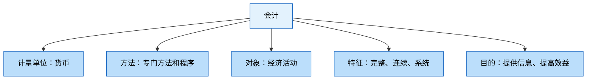
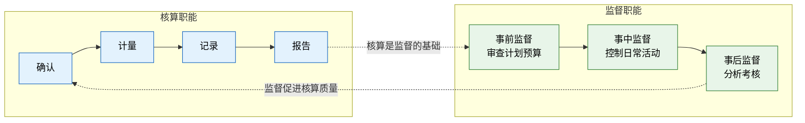
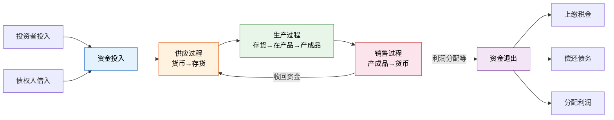
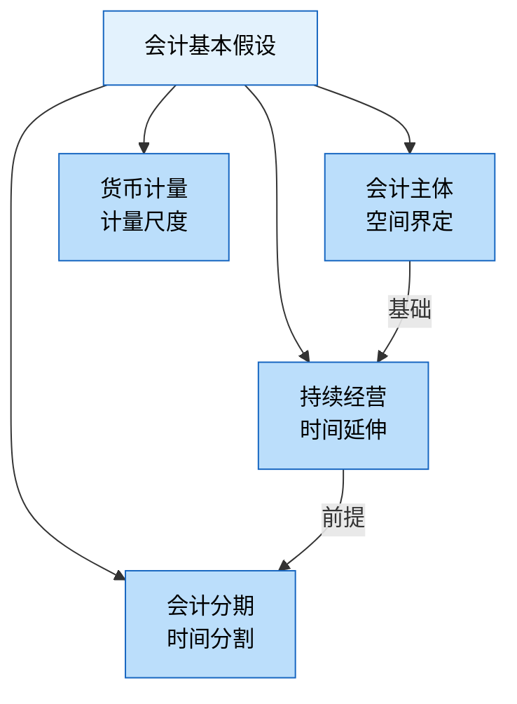

# 会计概述

> 想象你开了一个柠檬水站。第一天，你从储蓄罐里拿出50元买柠檬和糖，卖出了30杯柠檬水赚了60元，但还欠杂货店20元。你到底赚了没有？赚了多少？要回答这些问题，你需要一套"翻译规则"——把每笔交易变成可理解的信息。这套规则，就是**会计**。

---

## 一、会计的定义与职能

### 1. 会计的定义

会计是以**货币**为主要计量单位，运用专门的方法和程序，对企业和行政事业单位的经济活动进行**完整的、连续的、系统的**核算和监督，旨在提供经济信息和提高经济效益的一项管理活动。

### 2. 会计的两大基本职能

| 职能 | 含义 | 特点 | 柠檬水站类比 |
|------|------|------|-------------|
| **核算**（反映） | 对经济活动进行确认、计量、记录、报告 | 以货币为主要计量单位；完整性、连续性、系统性 | 记录每天卖了多少杯、收入多少、成本多少 |
| **监督**（控制） | 对经济活动的合法性、合理性进行审查 | 事前监督、事中监督、事后监督 | 不允许用假发票报销、控制糖的用量不超过标准 |

::: important
核算和监督是会计的**两项基本职能**，两者相辅相成：核算是监督的基础，监督是核算的保证。
:::

---

## 二、会计对象——资金运动

会计的对象是指会计核算和监督的内容，即**资金运动**。

企业资金运动表现为资金的**投入**、资金的**循环与周转**（包括供应、生产、销售三个过程）和资金的**退出**。

**柠檬水站类比**：你投入50元本金（资金投入）→ 买柠檬和糖（供应过程）→ 制作柠檬水（生产过程）→ 卖出柠檬水收回60元（销售过程）→ 支付税款和分红（资金退出）。

---

## 三、会计基本假设

会计基本假设是对会计核算所处的时间和空间环境的合理假定，是会计核算的前提条件。

| 假设 | 含义 | 核心要义 | 柠檬水站类比 |
|------|------|---------|-------------|
| **会计主体** | 会计核算的特定单位或组织 | 界定核算空间范围——"为谁记账" | 你的柠檬水站是独立于你个人家庭的一个会计主体 |
| **持续经营** | 假设企业将按当前的规模和状态持续经营下去 | 是折旧、摊销等核算方法的前提 | 假设柠檬水站不会明天就关门，所以可以分期计算利润 |
| **会计分期** | 将持续经营的生产经营活动划分为连续的、等间距的期间 | 界定核算时间范围——"按期结算" | 每周末算一次账，看这周赚了多少 |
| **货币计量** | 会计以货币作为主要计量单位 | 统一计量尺度 | 不管多少杯柠檬水，最终都换算成"元"来记录 |

::: warning
会计主体不同于法律主体。法律主体一定是会计主体，但会计主体**不一定是法律主体**。例如，企业内部的车间、分公司可以是会计主体，但不是法律主体。
:::

### 会计期间的划分

- **会计年度**：自公历1月1日起至12月31日止
- **中期**：短于一个完整的会计年度的报告期间（半年度、季度、月度）

---

## 四、会计信息质量要求

会计信息质量要求是对企业财务报告中所提供会计信息质量的基本要求，共**八项**：

| 序号 | 质量要求 | 含义 | 柠檬水站类比 |
|------|---------|------|-------------|
| 1 | **可靠性** | 以实际发生的交易为依据，如实反映 | 卖了30杯就记30杯，不能编造 |
| 2 | **相关性** | 与财务报告使用者的经济决策需要相关 | 给投资人看的报表要能帮他们做决策 |
| 3 | **可理解性** | 便于财务报告使用者理解和使用 | 记账方式要让人看得懂 |
| 4 | **可比性** | 同一企业不同期间可比，不同企业同一期间可比 | 今年和去年的记账方法一致 |
| 5 | **实质重于形式** | 按经济实质而非法律形式进行确认、计量和报告 | 融资租入的设备算你的资产，尽管法律上还不是你的 |
| 6 | **重要性** | 对重要事项单独反映，次要事项可简化 | 大额采购单列，零星开支可合并 |
| 7 | **谨慎性** | 不高估资产或收益，不低估负债或费用 | 柠檬可能坏掉，提前预估损失 |
| 8 | **及时性** | 及时收集、处理和传递会计信息 | 每天的账当天记，不能拖到月底 |

::: important
**谨慎性**是高频考点。核心原则：**不预计未实现的收益，但预计可能发生的损失**。例如：可以计提坏账准备、存货跌价准备，但不能提前确认尚未实现的销售收入。
:::

---

## 五、权责发生制与收付实现制

### 1. 两种会计基础对比

| 对比项 | 权责发生制（应计制） | 收付实现制（现金制） |
|--------|-------------------|-------------------|
| **确认标准** | 以权利和义务的发生为标准 | 以现金的收付为标准 |
| **收入确认** | 属于本期的收入，不论是否收到款 | 实际收到现金才确认收入 |
| **费用确认** | 属于本期的费用，不论是否支付款 | 实际支付现金才确认费用 |
| **适用范围** | 企业会计 | 行政事业单位预算会计 |
| **优点** | 能合理反映各期经营成果 | 简单直观，反映现金流 |

### 2. 权责发生制的应用示例

以柠檬水站为例：

| 交易事项 | 权责发生制 | 收付实现制 |
|---------|-----------|-----------|
| 本月卖出柠檬水500元，已收款300元 | 收入500元 | 收入300元 |
| 本月发生租金200元，尚未支付 | 费用200元 | 费用0元 |
| 上月预收客户定金100元，本月交货 | 收入100元（本月） | 收入100元（上月） |
| 本月预付下月广告费50元 | 费用0元（下月） | 费用50元（本月） |

::: warning
我国《企业会计准则》规定，企业应当以**权责发生制**为基础进行会计确认、计量和报告。行政事业单位预算会计实行收付实现制，财务会计实行权责发生制。
:::

---

## 六、知识体系总览

```mermaid
graph TD
    ROOT["会计概述"] --> A["定义与职能"]
    ROOT --> B["会计对象"]
    ROOT --> C["基本假设"]
    ROOT --> D["信息质量要求"]
    ROOT --> E["会计基础"]

    A --> A1["核算（确认/计量/记录/报告）"]
    A --> A2["监督（事前/事中/事后）"]

    B --> B1["资金投入"]
    B --> B2["资金循环与周转"]
    B --> B3["资金退出"]

    C --> C1["会计主体"]
    C --> C2["持续经营"]
    C --> C3["会计分期"]
    C --> C4["货币计量"]

    D --> D1["可靠性"]
    D --> D2["相关性"]
    D --> D3["可理解性"]
    D --> D4["可比性"]
    D --> D5["实质重于形式"]
    D --> D6["重要性"]
    D --> D7["谨慎性"]
    D --> D8["及时性"]

    E --> E1["权责发生制"]
    E --> E2["收付实现制"]

    style ROOT fill:#e3f2fd,stroke:#1565c0,color:#000
    style A fill:#e8f5e9,stroke:#2e7d32,color:#000
    style B fill:#fff3e0,stroke:#e65100,color:#000
    style C fill:#fce4ec,stroke:#c62828,color:#000
    style D fill:#f3e5f5,stroke:#6a1b9a,color:#000
    style E fill:#e0f7fa,stroke:#00695c,color:#000
```

---

## 七、练习题

### 练习1：选择题

**题目**：下列各项中，属于会计基本假设的是（  ）。

A. 权责发生制
B. 货币计量
C. 谨慎性
D. 重要性

**答案**：B

**解析**：会计基本假设共四个：会计主体、持续经营、会计分期、货币计量。权责发生制是会计基础，谨慎性和重要性是信息质量要求。

---

### 练习2：选择题

**题目**：下列各项中，体现谨慎性要求的是（  ）。

A. 融资租入固定资产作为自有资产入账
B. 对应收账款计提坏账准备
C. 同一企业不同时期采用相同的会计政策
D. 对重要交易单独列报

**答案**：B

**解析**：A体现实质重于形式，C体现可比性，D体现重要性。计提坏账准备是不低估可能发生的损失，体现谨慎性。

---

### 练习3：判断题

**题目**：会计主体一定是法律主体。（  ）

**答案**：错误

**解析**：法律主体一定是会计主体，但会计主体不一定是法律主体。例如企业内部的独立核算部门是会计主体但不是法律主体。

---

### 练习4：业务分析题

**题目**：柠檬水站6月份发生以下业务，分别按权责发生制和收付实现制计算6月份的收入和费用：

1. 6月3日，卖出柠檬水收到现金400元
2. 6月10日，赊销柠檬水200元，尚未收款
3. 6月15日，支付6月份摊位租金300元
4. 6月20日，支付7-9月保险费共150元
5. 6月25日，收到5月份赊销款100元

**答案**：

| 业务 | 权责发生制 | 收付实现制 |
|------|-----------|-----------|
| 1 | 收入400 | 收入400 |
| 2 | 收入200 | — |
| 3 | 费用300 | 费用300 |
| 4 | —（属于7-9月费用） | 费用150 |
| 5 | —（属于5月收入） | 收入100 |
| **合计** | **收入600，费用300** | **收入500，费用450** |

---

::: tip 面试速查
- 会计两大基本职能：**核算** + **监督**
- 四大假设：**会计主体**（空间）→ **持续经营**（时间延伸）→ **会计分期**（时间分割）→ **货币计量**（尺度）
- 八项质量要求口诀：**可靠相关可理解，可比实质重形式，重要谨慎加及时**
- 谨慎性核心：**不预计收益，预计损失**
- 企业会计基础：**权责发生制**
:::

::: info 原著参考
- 《基础会计第7版》第一章：总论——会计的定义、职能、对象、假设与基础
- 《世界上最简单的会计书》开篇：用柠檬水站引入"为什么要记账"的问题
:::
