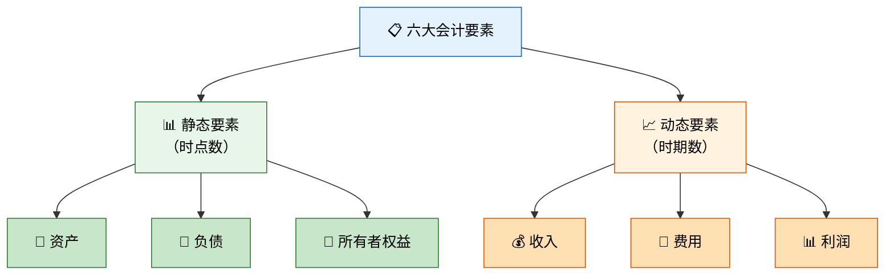
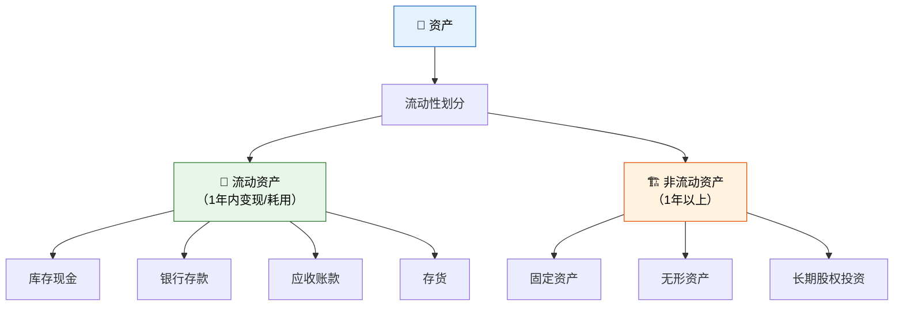
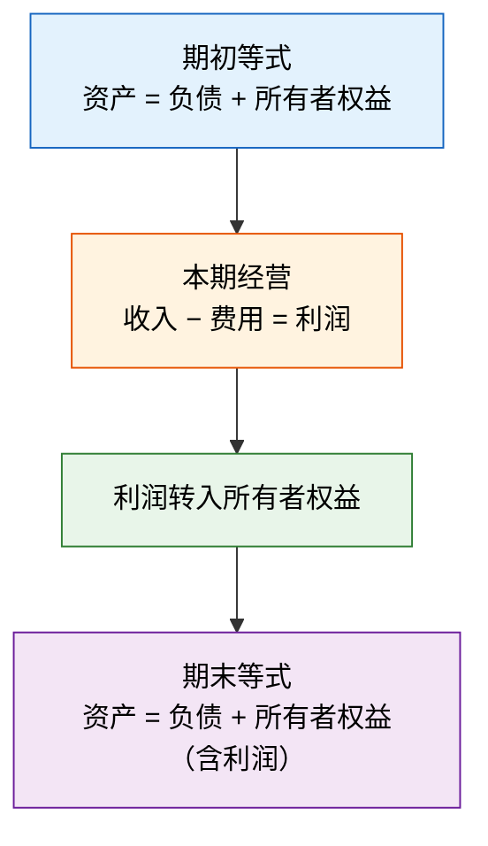
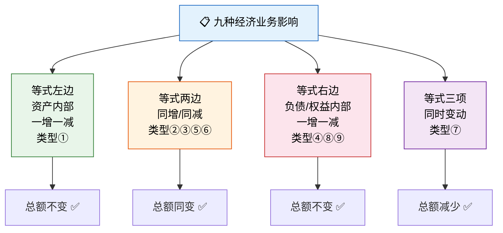

# 会计要素与会计等式

> 如果说会计是一门语言，那么会计要素就是它的"词汇"，会计等式就是它的"语法"——掌握了词汇和语法，你就能书写商业世界的任何故事。

---

## 一、六大要素详解

会计要素是对会计对象的基本分类，是设定会计报表结构和内容的依据。



---

## 二、资产

### 2.1 定义

资产是指企业**过去的交易或事项**形成的，由企业**拥有或控制**的，预期会给企业带来**经济利益**的资源。

### 2.2 确认条件

| 条件 | 说明 |
|------|------|
| 与该资源有关的经济利益很可能流入企业 | 超过 50% 的概率 |
| 该资源的成本或价值能够可靠计量 | 能确定具体金额 |

### 2.3 分类



::: tip 柠檬水站视角
你的柠檬水站有以下资产：
- 流动资产：现金 30 元、柠檬存货 10 元、顾客欠你的 5 元（应收账款）
- 非流动资产：柠檬水搅拌机 80 元（固定资产）、你的秘方 20 元（无形资产）
:::

---

## 三、负债

### 3.1 定义

负债是指企业**过去的交易或事项**形成的，预期会导致经济利益**流出**企业的**现时义务**。

### 3.2 确认条件

| 条件 | 说明 |
|------|------|
| 与该义务有关的经济利益很可能流出企业 | 需要偿还 |
| 未来流出的经济利益的金额能够可靠计量 | 能确定还款金额 |

### 3.3 分类

| 类别 | 含义 | 常见科目 |
|------|------|---------|
| **流动负债** | 1年内（含1年）偿还 | 短期借款、应付账款、应付职工薪酬、应交税费 |
| **非流动负债** | 1年以上偿还 | 长期借款、应付债券、长期应付款 |

::: tip 柠檬水站视角
你向妈妈借了 50 元作为启动资金，答应下个月还——这就是**短期借款**。你买了 30 元的糖，但说好下周才付——这就是**应付账款**。
:::

---

## 四、所有者权益

### 4.1 定义

所有者权益是指企业资产扣除负债后，由**所有者享有的剩余权益**。又称**净资产**。

> 所有者权益 = 资产 − 负债

### 4.2 来源

| 来源 | 含义 | 科目 |
|------|------|------|
| **所有者投入的资本** | 投资者直接投入的资金 | 实收资本、资本公积 |
| **直接计入所有者权益的利得和损失** | 非日常活动形成的 | 其他综合收益 |
| **留存收益** | 企业经营积累 | 盈余公积、未分配利润 |

### 4.3 所有者权益与负债的区别

| 比较维度 | 所有者权益 | 负债 |
|---------|-----------|------|
| 性质 | 剩余权益，无需偿还 | 法定义务，必须偿还 |
| 权利 | 参与经营管理、利润分配 | 按期收回本息 |
| 偿还顺序 | 在清偿负债之后 | 优先于所有者权益 |
| 风险 | 承担经营风险 | 风险较小 |

---

## 五、收入

### 5.1 定义

收入是指企业在**日常活动**中形成的，会导致所有者权益**增加**的，与所有者投入资本**无关**的经济利益的**总流入**。

### 5.2 三个关键限定

| 限定 | 说明 |
|------|------|
| **日常活动** | 区别于营业外收入（如出售固定资产的收益） |
| **导致所有者权益增加** | 借款不会增加所有者权益，故不是收入 |
| **与所有者投入无关** | 股东追加投资不是收入 |

### 5.3 分类

| 类别 | 含义 | 举例 |
|------|------|------|
| **主营业务收入** | 主要经营活动产生的收入 | 制造企业销售产品、商业企业销售商品 |
| **其他业务收入** | 非主要经营活动产生的收入 | 销售材料、出租固定资产 |

::: warning 收入 vs 利得
- **收入**：日常活动产生，计入"营业收入"
- **利得**：非日常活动产生，如出售固定资产净收益，计入"营业外收入"或"资产处置损益"
:::

---

## 六、费用

### 6.1 定义

费用是指企业在**日常活动**中发生的，会导致所有者权益**减少**的，与向所有者分配利润**无关**的经济利益的**总流出**。

### 6.2 分类

| 类别 | 含义 | 举例 |
|------|------|------|
| **生产费用** | 为生产产品发生的费用 | 直接材料、直接人工、制造费用 |
| **期间费用** | 不计入产品成本，直接计入当期损益 | 管理费用、销售费用、财务费用 |

::: tip 柠檬水站视角
- 柠檬和糖的成本 → 生产费用（计入产品成本）
- 租摊位的租金 → 销售费用
- 借钱付的利息 → 财务费用
:::

---

## 七、利润

### 7.1 定义

利润是指企业在一定会计期间的**经营成果**，包括收入减去费用后的净额、直接计入当期利润的利得和损失等。

### 7.2 三个层次

| 层次 | 计算公式 |
|------|---------|
| **营业利润** | 营业收入 − 营业成本 − 税金及附加 − 期间费用 ± 投资收益等 |
| **利润总额** | 营业利润 + 营业外收入 − 营业外支出 |
| **净利润** | 利润总额 − 所得税费用 |

---

## 八、会计等式

### 8.1 基本会计等式（静态等式）

$$\text{资产} = \text{负债} + \text{所有者权益}$$

这是资产负债表的理论基础，反映某一时点的财务状况。

```mermaid
graph LR
    A["🏢 资产<br/>100,000"] = B["📑 负债<br/>40,000"] + C["👑 所有者权益<br/>60,000"]

    style A fill:#e3f2fd,stroke:#1565c0,color:#000
    style B fill:#fff3e0,stroke:#e65100,color:#000
    style C fill:#e8f5e9,stroke:#2e7d32,color:#000
```

### 8.2 扩展会计等式（动态等式）

$$\text{资产} + \text{费用} = \text{负债} + \text{所有者权益} + \text{收入}$$

或等价地：

$$\text{资产} = \text{负债} + \text{所有者权益} + (\text{收入} - \text{费用})$$

扩展等式是利润表的理论基础，反映某一时期的经营成果如何影响财务状况。

### 8.3 等式间的逻辑关系



---

## 九、经济业务对会计等式的九种影响

无论发生什么经济业务，都不会破坏基本会计等式的平衡关系。九种类型如下：

| 类型 | 经济业务举例 | 资产 | 负债 | 所有者权益 |
|------|------------|------|------|-----------|
| ① | 从银行提取现金 | +− | | |
| ② | 购买材料，货款未付 | + | + | |
| ③ | 用银行存款偿还应付账款 | − | − | |
| ④ | 向银行借款偿还应付账款 | | +− | |
| ⑤ | 接受投资者投入资本 | + | | + |
| ⑥ | 向投资者分配利润 | − | | − |
| ⑦ | 用银行存款代投资者偿还债务 | − | − | − |
| ⑧ | 将应付债券转为股本 | | − | + |
| ⑨ | 盈余公积转增资本 | | | +− |

> **核心规律**：等式两边同增同减总额不变，等式一边一增一减总额不变。

### 九种影响的 T 字账示例

**类型①：资产内部一增一减（总额不变）**

> 从银行提取现金 5,000 元

```
库存现金          银行存款
──────┬──────    ──────┬──────
 5,000 │                │ 5,000
```

**类型②：资产与负债同增（总额增加）**

> 购买材料 10,000 元，货款未付

```
原材料            应付账款
──────┬──────    ──────┬──────
10,000 │          10,000│
```

**类型③：资产与负债同减（总额减少）**

> 用银行存款偿还应付账款 8,000 元

```
银行存款          应付账款
──────┬──────    ──────┬──────
      │ 8,000     8,000│
```

**类型④：负债内部一增一减（总额不变）**

> 向银行借款 20,000 元偿还应付账款

```
短期借款          应付账款
──────┬──────    ──────┬──────
20,000│          20,000│
```

**类型⑤：资产与所有者权益同增（总额增加）**

> 投资者投入资本 100,000 元存入银行

```
银行存款          实收资本
──────┬──────    ──────┬──────
100,000│        100,000│
```

**类型⑥：资产与所有者权益同减（总额减少）**

> 向投资者分配利润 30,000 元，用银行存款支付

```
银行存款          利润分配
──────┬──────    ──────┬──────
      │ 30,000    30,000│
```

**类型⑦：资产、负债、所有者权益同减**

> 用银行存款 5,000元代投资者偿还其个人债务

```
银行存款          其他应付款    实收资本
──────┬──────    ──────┬──────    ──────┬──────
      │ 5,000     5,000│          5,000│
```

**类型⑧：负债减少、所有者权益增加（总额不变）**

> 将可转换债券 50,000 元转为股本

```
应付债券          实收资本
──────┬──────    ──────┬──────
50,000│          50,000│
```

**类型⑨：所有者权益内部一增一减（总额不变）**

> 将盈余公积 20,000 元转增资本

```
盈余公积          实收资本
──────┬──────    ──────┬──────
20,000│          20,000│
```

---

## 十、九种影响的汇总记忆图



---

## 十一、六大要素速查表

| 要素 | 定义关键词 | 属于 | 报表位置 |
|------|-----------|------|---------|
| 资产 | 过去形成、拥有或控制、带来经济利益 | 静态要素 | 资产负债表左方 |
| 负债 | 过去形成、现时义务、经济利益流出 | 静态要素 | 资产负债表右方 |
| 所有者权益 | 剩余权益、资产减负债 | 静态要素 | 资产负债表右方 |
| 收入 | 日常活动、权益增加、与投入无关 | 动态要素 | 利润表 |
| 费用 | 日常活动、权益减少、与分配无关 | 动态要素 | 利润表 |
| 利润 | 经营成果、收入减费用加减利得损失 | 动态要素 | 利润表 |

---

## 十二、练习题

### 练习1：选择题

**（1）** 下列各项中，属于流动资产的是（  ）。

A. 长期股权投资　　B. 应收账款　　C. 固定资产　　D. 无形资产

::: details 答案与解析
**答案：B**

应收账款是企业在日常经营中应向客户收取的款项，通常在1年内收回，属于流动资产。长期股权投资、固定资产和无形资产都属于非流动资产。
:::

**（2）** 引起资产和负债同时增加的业务是（  ）。

A. 用银行存款购买原材料　　B. 向银行借款存入银行
C. 收回应收账款存入银行　　D. 用银行存款偿还应付账款

::: details 答案与解析
**答案：B**

向银行借款存入银行：银行存款（资产）增加，短期借款/长期借款（负债）增加，资产与负债同增。A 是资产内部一增一减，C 是资产内部一增一减，D 是资产与负债同减。
:::

**（3）** 下列各项中，不影响所有者权益总额的是（  ）。

A. 收到投资者投入资本　　B. 宣告分配现金股利
C. 提取盈余公积　　D. 实现利润

::: details 答案与解析
**答案：C**

提取盈余公积是所有者权益内部的一增一减（未分配利润减少，盈余公积增加），不影响所有者权益总额。A 使权益增加，B 使权益减少，D 使权益增加。
:::

### 练习2：综合分析题

某企业期初资产总额 500,000 元，负债总额 200,000 元。本期发生以下经济业务：

1. 收到投资者投入资本 100,000 元，存入银行
2. 用银行存款购买设备一台 50,000 元
3. 向银行借款 30,000 元偿还应付账款
4. 用银行存款偿还短期借款 20,000 元

要求：计算该企业期末的资产总额、负债总额和所有者权益总额。

::: details 答案与解析

**期初：** 资产 = 500,000，负债 = 200,000，所有者权益 = 500,000 − 200,000 = 300,000

**逐笔分析：**

| 业务 | 对资产的影响 | 对负债的影响 | 对所有者权益的影响 |
|------|------------|------------|-----------------|
| ①投资者投入 | +100,000 | | +100,000 |
| ②购买设备 | +50,000, −50,000 | | |
| ③借款还应付 | | +30,000, −30,000 | |
| ④偿还短期借款 | −20,000 | −20,000 | |

**期末：**
- 资产 = 500,000 + 100,000 + 0 − 20,000 = **580,000 元**
- 负债 = 200,000 + 0 + 0 − 20,000 = **180,000 元**
- 所有者权益 = 300,000 + 100,000 = **400,000 元**

**验证：** 580,000 = 180,000 + 400,000 ✅
:::

### 练习3：判断九种类型

判断下列经济业务分别属于哪种类型：

1. 用现金购买办公用品
2. 赊购原材料
3. 向银行借款存入银行
4. 用银行存款上缴税金
5. 将资本公积转增资本

::: details 答案与解析

1. **类型⑥**：资产减少、所有者权益减少（库存现金减少，购买办公用品产生费用→费用增加等价于所有者权益减少。若购入作为存货则属于类型①资产内部一增一减）
2. **类型②**：资产与负债同增（原材料增加，应付账款增加）
3. **类型②**：资产与负债同增（银行存款增加，短期借款增加）
4. **类型③**：资产与负债同减（银行存款减少，应交税费减少）
5. **类型⑨**：所有者权益内部一增一减（资本公积减少，实收资本增加）
:::

---

::: tip 面试速查
- 六大要素：**资产、负债、所有者权益**（静态）+ **收入、费用、利润**（动态）
- 基本等式：**资产 = 负债 + 所有者权益**
- 扩展等式：**资产 + 费用 = 负债 + 所有者权益 + 收入**
- 九种类型核心：**等式永远平衡**
- 所有者权益 = 净资产 = 资产 − 负债
- 收入是日常活动，利得是非日常活动
:::

::: info 原著参考
- 《基础会计第7版》第二章：会计要素与会计等式
- 《世界上最简单的会计书》第二章：毛利——引入收入、费用、利润的概念
:::
