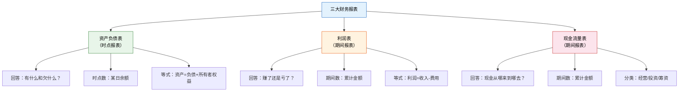
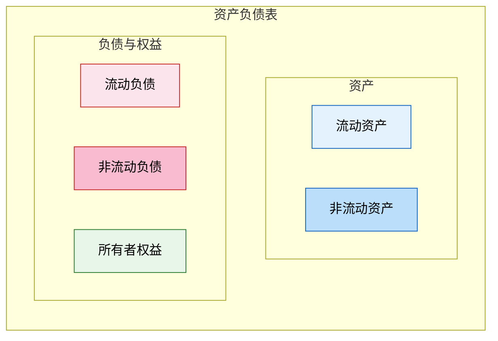
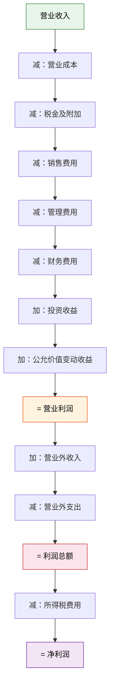
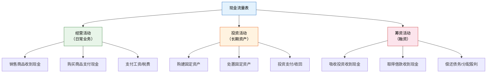
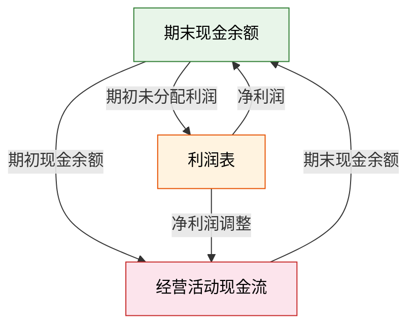
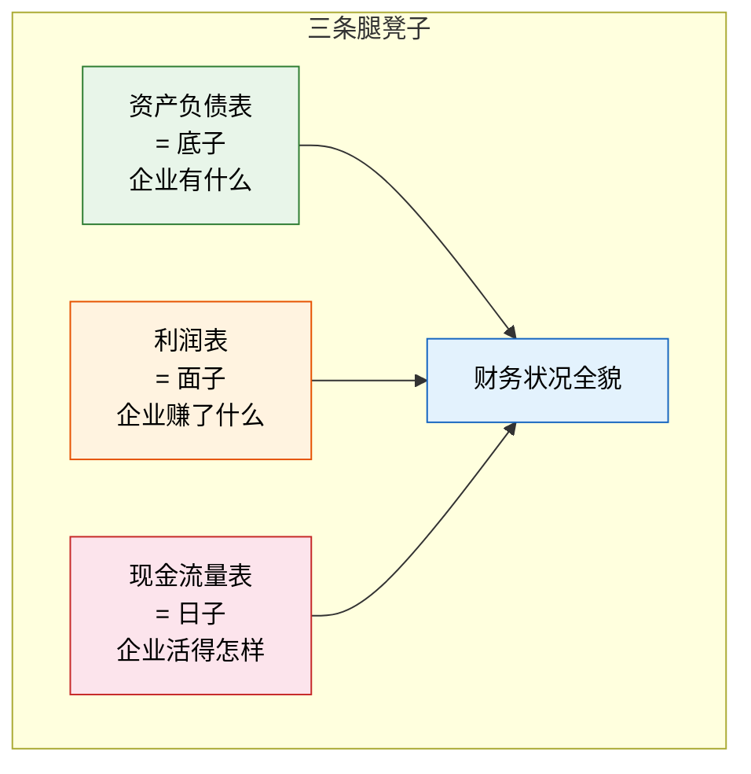

# 三大财务报表

> 柠檬水站经营了一个月，你想知道三个问题：我现在"有什么"（资产）和"欠什么"（负债）？这个月我"赚了还是亏了"？我的"现金从哪来、到哪去"了？三大财务报表分别回答这三个问题——资产负债表是"快照"，利润表是"录像"，现金流量表是"流水"。

---

## 一、三大报表总览

::: important
三张表就像一张凳子的三条腿——少了任何一条，你都看不到企业财务状况的全貌。资产负债表告诉你"底子"，利润表告诉你"面子"，现金流量表告诉你"日子"。
:::

---

## 二、资产负债表

### 1. 结构与编制原理

资产负债表是反映企业在**某一特定日期**财务状况的报表，基于**资产 = 负债 + 所有者权益**这一等式编制。

### 2. 报告式与账户式

| 格式 | 排列方式 | 中国采用 |
|------|---------|---------|
| **账户式** | 左边资产，右边负债和所有者权益 | ✓ |
| **报告式** | 上下排列：资产→负债→所有者权益 | |

### 3. 柠檬水站资产负债表示例

**柠檬水站 20XX年6月30日 资产负债表（简表）**

| 资产 | 金额 | 负债和所有者权益 | 金额 |
|------|------|----------------|------|
| **流动资产** | | **流动负债** | |
| 货币资金 | 95 | 应付账款 | 25 |
| 存货 | 35 | 应交税费 | 5 |
| 流动资产合计 | **130** | 流动负债合计 | **30** |
| | | **非流动负债** | |
| **非流动资产** | | 长期借款 | — |
| 固定资产 | 20 | 非流动负债合计 | **—** |
| | | 负债合计 | **30** |
| | | **所有者权益** | |
| | | 实收资本 | 80 |
| | | 未分配利润 | 40 |
| | | 所有者权益合计 | **120** |
| **资产总计** | **150** | **负债和所有者权益总计** | **150** |

### 4. 编制方法

| 项目 | 填列方法 |
|------|---------|
| 货币资金 | 库存现金 + 银行存款 + 其他货币资金 |
| 存货 | 原材料 + 在产品 + 库存商品 - 存货跌价准备 |
| 应收账款 | 应收账款明细账借方余额 + 预收账款明细账借方余额 - 坏账准备 |
| 应付账款 | 应付账款明细账贷方余额 + 预付账款明细账贷方余额 |
| 固定资产 | 固定资产原值 - 累计折旧 - 固定资产减值准备 |
| 未分配利润 | 本年利润 + 利润分配（未分配利润） |

::: warning
资产负债表是**时点报表**，反映的是某一天（如6月30日）的财务状况，而不是一个期间的情况。期初数 + 本期变化 = 期末数。
:::

---

## 三、利润表

### 1. 结构与编制原理

利润表是反映企业在**一定会计期间**经营成果的报表，基于**利润 = 收入 - 费用**这一等式编制。

### 2. 多步式利润表

我国企业利润表采用**多步式**格式，分步骤计算利润：

| 步骤 | 内容 | 公式 |
|------|------|------|
| 第一步 | 营业利润 | 营业收入 - 营业成本 - 税金及附加 - 期间费用 + 投资收益等 |
| 第二步 | 利润总额 | 营业利润 + 营业外收入 - 营业外支出 |
| 第三步 | 净利润 | 利润总额 - 所得税费用 |

### 3. 柠檬水站利润表示例

**柠檬水站 20XX年6月 利润表（简表）**

| 项目 | 金额 |
|------|------|
| 一、营业收入 | 80 |
| 减：营业成本 | 45 |
| 减：税金及附加 | 3 |
| 减：销售费用 | 15 |
| 减：管理费用 | 2 |
| 二、营业利润 | **15** |
| 加：营业外收入 | — |
| 减：营业外支出 | — |
| 三、利润总额 | **15** |
| 减：所得税费用 | 3.75（15×25%） |
| 四、净利润 | **11.25** |

::: tip
利润表是**期间报表**，反映的是一个时间段（如一个月、一个季度、一年）的经营成果。
:::

---

## 四、现金流量表

### 1. 三大活动分类

现金流量表将企业的现金收支按活动性质分为三大类：

### 2. 三大活动判断规则

| 活动 | 判断标准 | 柠檬水站举例 |
|------|---------|-------------|
| **经营活动** | 日常业务产生的现金收支 | 卖柠檬水收现金、买柠檬付现金 |
| **投资活动** | 长期资产的购建和处置 | 买搅拌机、卖旧桌子 |
| **筹资活动** | 吸收投资和借款及偿还 | 向父母借款、业主追加投资 |

### 3. 柠檬水站现金流量表示例

**柠檬水站 20XX年6月 现金流量表（简表）**

| 项目 | 金额 |
|------|------|
| **一、经营活动产生的现金流量** | |
| 销售商品收到的现金 | 80 |
| 购买商品支付的现金 | -60 |
| 支付给职工的现金 | — |
| 支付的各项税费 | -3.75 |
| 经营活动现金流量净额 | **16.25** |
| **二、投资活动产生的现金流量** | |
| 购建固定资产支付的现金 | — |
| 投资活动现金流量净额 | **0** |
| **三、筹资活动产生的现金流量** | |
| 吸收投资收到的现金 | 100 |
| 偿还债务支付的现金 | -5 |
| 筹资活动现金流量净额 | **95** |
| **四、现金及现金等价物净增加额** | **111.25** |

::: warning
现金流量表关注的是**现金的实际收付**，不管收入和费用是否属于本期（这与利润表的权责发生制不同）。即使一笔赊销被确认为收入，只要没收到现金，就不会出现在现金流量表的经营活动中。
:::

---

## 五、三表钩稽关系

三张报表不是孤立的，它们之间存在严密的勾稽关系：

### 具体钩稽关系

| 钩稽关系 | 说明 |
|---------|------|
| 利润表 → 资产负债表 | 利润表的净利润 = 资产负债表未分配利润的当期增加额 |
| 现金流量表 → 资产负债表 | 现金流量表的期末现金余额 = 资产负债表的货币资金 |
| 利润表 → 现金流量表 | 净利润经过调整（加非付现费用、减非收现收入等）= 经营活动现金净流量 |

### 钩稽关系验证（柠檬水站）

| 关系 | 验证 |
|------|------|
| 净利润→未分配利润 | 净利润11.25元 = 未分配利润40元（假设期初28.75元+本期11.25元） |
| 现金流量→货币资金 | 期末现金111.25元 = 资产负债表货币资金95元（注：差异因部分现金用于购买存货等） |

::: important
三表钩稽是审计和财务分析的重要检查手段。如果三张报表之间的钩稽关系不成立，说明报表编制有误。
:::

---

## 六、三张报表的"三条腿凳子"比喻

| 场景 | 资产负债表 | 利润表 | 现金流量表 |
|------|-----------|--------|-----------|
| 企业利润好但现金流差 | 资产可能虚高（应收多） | 净利润高 | 经营现金流为负 → "赚了纸面利润" |
| 企业现金流好但利润差 | 货币资金多 | 净利润低 | 经营现金流为正 → "日子还行但效率低" |
| 企业资产负债率高 | 负债占比较大 | 利息费用高 | 筹资现金流大 → "借钱过日子" |

---

## 七、练习题

### 练习1：选择题

**题目**：下列各项中，属于资产负债表项目的是（  ）。

A. 营业收入
B. 管理费用
C. 未分配利润
D. 经营活动现金流量

**答案**：C

**解析**：A和B属于利润表项目，D属于现金流量表项目。未分配利润属于所有者权益，是资产负债表项目。

---

### 练习2：选择题

**题目**：企业购买固定资产支付的现金，在现金流量表中属于（  ）。

A. 经营活动
B. 投资活动
C. 筹资活动
D. 不在现金流量表中反映

**答案**：B

**解析**：购建和处置长期资产（固定资产、无形资产等）属于投资活动。

---

### 练习3：判断题

**题目**：资产负债表反映的是企业一定期间的经营成果。（  ）

**答案**：错误

**解析**：资产负债表反映的是企业在某一特定日期的财务状况，是时点报表，不是期间报表。利润表才是反映一定期间经营成果的报表。

---

### 练习4：综合题

**题目**：柠檬水站7月份发生以下业务，请编制简要的三张报表：

1. 期初：现金50元，存货30元，固定资产20元，应付账款15元，实收资本70元，未分配利润15元
2. 购入柠檬40元（现金支付30元，赊购10元）
3. 卖出柠檬水收入70元（全部收现）
4. 支付租金10元
5. 结转销售成本38元
6. 所得税率25%

**答案**：

**利润表**：

| 项目 | 金额 |
|------|------|
| 营业收入 | 70 |
| 减：营业成本 | 38 |
| 减：销售费用 | 10 |
| 营业利润 | 22 |
| 减：所得税（25%） | 5.5 |
| 净利润 | 16.5 |

**资产负债表**（期末）：

| 资产 | 金额 | 负债和权益 | 金额 |
|------|------|-----------|------|
| 货币资金 | 80 | 应付账款 | 25 |
| 存货 | 32 | 负债合计 | 25 |
| 固定资产 | 20 | 实收资本 | 70 |
| | | 未分配利润 | 37 |
| 资产总计 | **132** | 负债和权益总计 | **132** |

钩稽验证：未分配利润 = 15 + 16.5 = 31.5...（需要调整存货等细节）

**现金流量表**（简要）：

| 项目 | 金额 |
|------|------|
| 经营活动：销售收现70-采购付现30-租金10-税费5.5 | 24.5 |
| 筹资活动：— | 0 |
| 现金净增加 | 24.5 |
| 期初现金 | 50 |
| 期末现金 | 74.5 |

（注：实际编制中需要更精确的调整，此处为简化演示）

---

::: tip 面试速查
- 资产负债表：**时点报表**，资产=负债+所有者权益
- 利润表：**期间报表**，净利润=收入-费用，多步式
- 现金流量表：**期间报表**，三大活动（经营/投资/筹资）
- 三表钩稽：净利润→未分配利润；现金净增加→货币资金；净利润调整→经营现金流
- 资产负债表=底子，利润表=面子，现金流量表=日子
:::

::: info 原著参考
- 《基础会计第7版》第八章：财务报告——资产负债表、利润表、现金流量表的编制
- 《世界上最简单的会计书》第9-12章：用柠檬水站完整数据编制三张报表，用"三条腿凳子"比喻解释三表关系
:::
