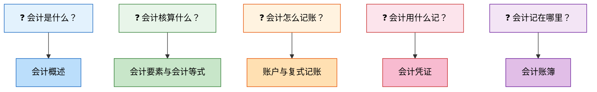

# 会计基础

> 会计基础就像建房子的地基——虽然看不见，但决定了整栋楼能盖多高。掌握这些基本功，后续的账务处理、报表编制才能游刃有余。

## 本章概览

本章是整个财务知识体系的起点，回答五个核心问题：

## 文章目录

| 序号 | 文章 | 核心知识点 |
|------|------|-----------|
| 1 | [会计概述](01_会计概述.md) | 会计定义、职能、对象、四大假设、八项质量要求、权责发生制 |
| 2 | [会计要素与会计等式](02_会计要素与会计等式.md) | 六大要素、基本等式、扩展等式、9种经济业务影响 |
| 3 | [账户与复式记账](03_账户与复式记账.md) | T字账、借贷记账法、各类账户结构、会计分录、试算平衡 |
| 4 | [会计凭证](04_会计凭证.md) | 原始凭证、记账凭证、填制要求、审核与保管 |
| 5 | [会计账簿](05_会计账簿.md) | 账簿种类、平行登记、对账结账、三种错账更正方法 |

---

## 学习建议

::: important
会计基础的核心是**借贷记账法**。前面几节为借贷记账法提供"为什么"，后面几节提供"怎么用"。如果学习中间遇到困惑，回到"借贷"这个核心重新理解。
:::
