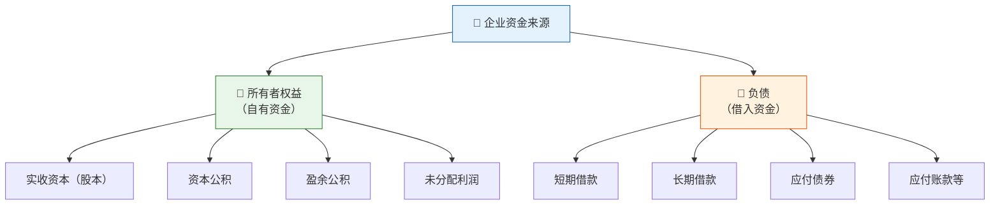
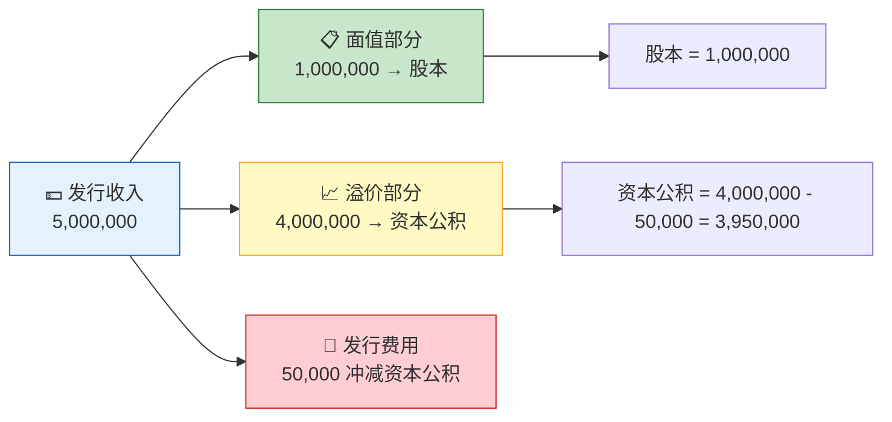
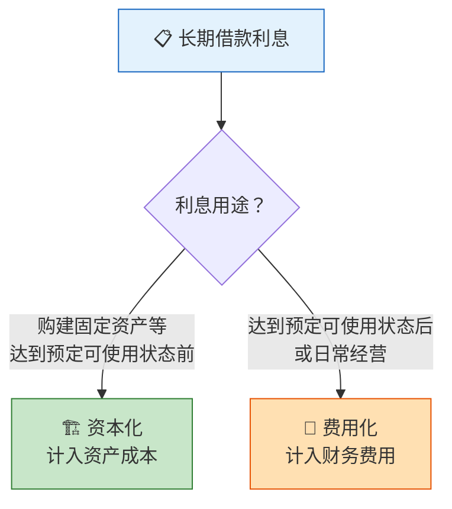
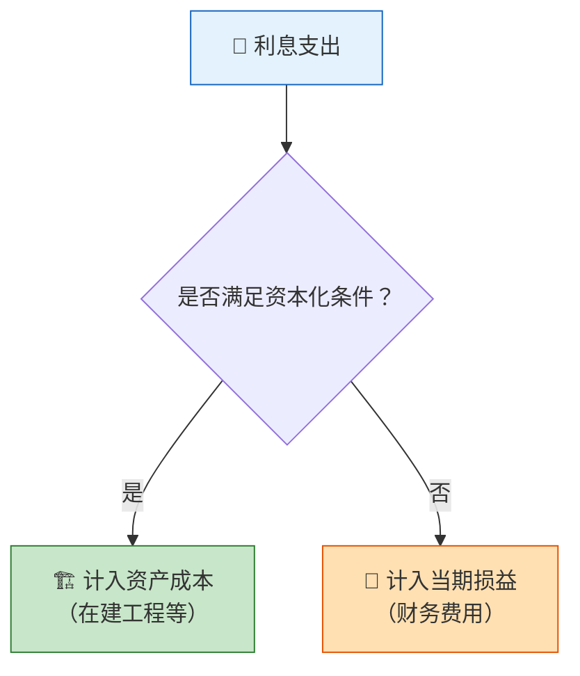

> 企业如同一座大厦，筹资便是打地基——地基的深度决定了大厦的高度。所有者投入的资本是基石，债权人借入的资金是框架，两者共同撑起了企业的资金结构。

## 一、企业资金来源概述

企业的资金来源可分为两大类：**所有者权益**（自有资金）和**负债**（借入资金）。



| 资金来源 | 性质 | 偿还义务 | 特点 |
|----------|------|----------|------|
| 所有者权益 | 自有 | 无需偿还 | 风险低、成本高（分红期望） |
| 负债 | 借入 | 到期还本付息 | 风险高、成本低（利息税前扣除） |

::: important 筹资决策的权衡
- **债务筹资**：利息可在税前扣除（税盾效应），但增加财务风险
- **权益筹资**：无固定还款压力，但稀释原有股东的控制权和收益权
:::

---

## 二、实收资本的核算

实收资本是企业实际收到的投资者投入的资本，是所有者权益的核心组成部分。在股份有限公司中称为**股本**。

### 2.1 接受现金资产投资

**【例1】** A公司由甲、乙两位投资者共同投资设立，注册资本为1,000,000元。甲投资600,000元，乙投资400,000元，款项已存入银行。

```
借：银行存款              1,000,000
    贷：实收资本——甲       600,000
        实收资本——乙       400,000
```

### 2.2 接受非现金资产投资

投资者可以以固定资产、无形资产、原材料等非现金资产出资，但需按**投资合同或协议约定的价值**入账（不公允的除外）。

**【例2】** 丙公司收到投资者投入的一台设备，投资合同约定价值为200,000元（与公允价值一致），增值税进项税额为26,000元。

```
借：固定资产              200,000
    应交税费——应交增值税（进项税额）  26,000
    贷：实收资本——某投资者   226,000
```

### 2.3 股份有限公司发行股票

股份有限公司通过发行股票筹集资本。股票面值计入"股本"，超出面值的部分计入"资本公积——股本溢价"。

**【例3】** 某股份有限公司发行普通股1,000,000股，每股面值1元，发行价5元/股，发行手续费50,000元从发行收入中扣除。

```
实际收到金额 = 1,000,000 × 5 - 50,000 = 4,950,000（元）

借：银行存款              4,950,000
    贷：股本              1,000,000
        资本公积——股本溢价  3,950,000
```



---

## 三、资本公积的核算

资本公积是企业收到投资者出资额超出其在注册资本（或股本）中所占份额的部分，以及其他资本公积。

### 3.1 资本溢价

在有限责任公司中，新加入的投资者往往需要投入比其应占注册资本份额更多的资本，这是对原投资者享有企业前期留存收益的补偿。

**【例4】** 某有限责任公司原由甲、乙各出资500,000元设立，注册资本1,000,000元。经营两年后，丙希望加入并占1/3的股权，丙实际投入700,000元。

```
丙占注册资本份额 = 1,000,000 × 1/3 ≈ 333,333（元）
资本溢价 = 700,000 - 333,333 = 366,667（元）

借：银行存款              700,000
    贷：实收资本——丙       333,333
        资本公积——资本溢价  366,667
```

### 3.2 股本溢价

见前述【例3】，此处不再赘述。

### 3.3 资本公积转增资本

经股东大会决议，资本公积可用于转增资本。

```
借：资本公积
    贷：实收资本（或股本）
```

::: warning 注意
资本公积转增资本时，**不得将资本溢价（股本溢价）以外的其他资本公积**用于转增。其他资本公积（如其他综合收益等）需待相关资产处置后方可转增。
:::

---

## 四、短期借款的核算

短期借款是指企业向银行或其他金融机构借入的期限在**1年以内（含1年）**的各种借款。

### 4.1 核算流程


**【例5】** 某企业7月1日向银行借入短期借款300,000元，期限6个月，年利率6%，利息按月计提、按季支付。

**（1）7月1日借入时：**

```
借：银行存款              300,000
    贷：短期借款           300,000
```

**（2）7月末计提利息：**

```
月利息 = 300,000 × 6% ÷ 12 = 1,500（元）

借：财务费用              1,500
    贷：应付利息           1,500
```

**（3）9月末支付第一季度利息：**

```
借：应付利息              3,000    （7、8月已计提）
    财务费用              1,500    （9月当月利息）
    贷：银行存款           4,500
```

**（4）12月31日到期归还本金及最后一季度利息：**

```
借：短期借款              300,000
    应付利息              3,000    （10、11月已计提）
    财务费用              1,500    （12月当月利息）
    贷：银行存款           304,500
```

### 4.2 T型账户示例

```
              短期借款
  ───────────────┬────────────────
                  300,000  (7.1 借入)
  ───────────────┴────────────────
  借方            300,000    贷方

              应付利息
  ───────────────┬────────────────
  3,000 (9月末支付) │ 1,500 (7月末)
                   │ 1,500 (8月末)
                   │ 1,500 (9月末计提)
  ───────────────┴────────────────
```

---

## 五、长期借款的核算

长期借款是指企业向银行或其他金融机构借入的期限在**1年以上**（不含1年）的各项借款。

### 5.1 利息的资本化与费用化

长期借款利息的处理取决于借款用途：



::: warning 资本化时点判断
- **开始资本化**：资产支出已发生、借款费用已发生、购建活动已开始——三个条件同时满足
- **暂停资本化**：购建活动发生非正常中断且中断超过3个月
- **停止资本化**：资产达到预定可使用或可销售状态
:::

**【例6】** 某企业1月1日向银行借入2,000,000元用于建造厂房，期限3年，年利率8%，每年末付息、到期还本。厂房于第二年6月30日达到预定可使用状态。

**（1）第一年（全年利息资本化）：**

```
年利息 = 2,000,000 × 8% = 160,000（元）

借：在建工程              160,000
    贷：应付利息           160,000

借：应付利息              160,000
    贷：银行存款           160,000
```

**（2）第二年（1-6月资本化，7-12月费用化）：**

```
1-6月利息（资本化）= 2,000,000 × 8% × 6/12 = 80,000（元）
7-12月利息（费用化）= 80,000（元）

借：在建工程               80,000
    财务费用               80,000
    贷：应付利息            160,000

借：应付利息              160,000
    贷：银行存款           160,000
```

**（3）第三年（全年费用化）：**

```
借：财务费用              160,000
    贷：应付利息           160,000

借：应付利息              160,000
    贷：银行存款           160,000
```

**（4）到期归还本金：**

```
借：长期借款——本金        2,000,000
    贷：银行存款           2,000,000
```

---

## 六、应付债券的核算

应付债券是企业依照法定程序发行、约定在一定期限内还本付息的有价证券。

### 6.1 债券发行价格

| 发行条件 | 发行价格 | 面值与实际利率关系 |
|----------|----------|-------------------|
| 票面利率 > 市场利率 | 溢价发行 | 发行价 > 面值 |
| 票面利率 = 市场利率 | 平价发行 | 发行价 = 面值 |
| 票面利率 < 市场利率 | 折价发行 | 发行价 < 面值 |

### 6.2 平价发行核算

**【例7】** 某企业1月1日平价发行面值1,000,000元、期限3年、年利率6%的债券，每年末付息、到期还本。

**（1）发行时：**

```
借：银行存款              1,000,000
    贷：应付债券——面值     1,000,000
```

**（2）每年末计提利息并支付：**

```
年利息 = 1,000,000 × 6% = 60,000（元）

借：财务费用（或在建工程）  60,000
    贷：应付利息            60,000

借：应付利息              60,000
    贷：银行存款            60,000
```

**（3）到期还本：**

```
借：应付债券——面值       1,000,000
    贷：银行存款           1,000,000
```

### 6.3 溢价发行核算（简化处理）

**【例8】** 若上例债券溢价发行，发行价1,050,000元。

```
借：银行存款              1,050,000
    贷：应付债券——面值     1,000,000
        应付债券——利息调整   50,000
```

每期利息调整摊销额 = 溢价总额 ÷ 期数 = 50,000 ÷ 3 ≈ 16,667（元/年，简化直线法）

```
借：财务费用              43,333
    应付债券——利息调整     16,667
    贷：应付利息            60,000
```

::: info 实际利率法
在实务中，利息调整的摊销应采用**实际利率法**，每期确认的利息费用 = 期初债券摊余成本 × 实际利率。此处采用直线法仅为简化示例。
:::

---

## 七、利息核算总结

| 利息类型 | 核算科目 | 归属方向 |
|----------|----------|----------|
| 短期借款利息 | 财务费用 | 费用化（全部） |
| 长期借款——日常经营 | 财务费用 | 费用化 |
| 长期借款——购建资产（资本化期间） | 在建工程等 | 资本化 |
| 应付债券利息 | 财务费用/在建工程 | 视用途而定 |



---

## 八、综合练习题

### 练习1

甲公司发生以下经济业务：
（1）收到国家投入资本2,000,000元，存入银行。
（2）收到某企业投入一台设备，评估价值500,000元（与公允价值一致），增值税进项税额65,000元。
（3）向银行借入6个月期借款800,000元，年利率4.8%，按月计提利息、到期一次还本付息。
（4）上述借款到期，归还本金和利息。

**要求：** 编制上述业务的会计分录。

::: details 参考答案

**（1）**

```
借：银行存款              2,000,000
    贷：实收资本——国家     2,000,000
```

**（2）**

```
借：固定资产              500,000
    应交税费——应交增值税（进项税额）  65,000
    贷：实收资本——某企业   565,000
```

**（3）** 借入时：

```
借：银行存款              800,000
    贷：短期借款           800,000
```

每月计提利息：月利息 = 800,000 × 4.8% ÷ 12 = 3,200（元）

```
借：财务费用              3,200
    贷：应付利息           3,200
```

**（4）** 到期归还本金和利息：

```
借：短期借款              800,000
    应付利息              16,000    （前5个月已计提）
    财务费用              3,200     （第6个月利息）
    贷：银行存款           819,200
```

:::

### 练习2

某股份有限公司委托证券公司发行普通股5,000,000股，每股面值1元，发行价4元/股，证券公司按发行收入的3%收取手续费。

**要求：** 计算计入"股本"和"资本公积"的金额，并编制会计分录。

::: details 参考答案

发行总收入 = 5,000,000 × 4 = 20,000,000（元）
手续费 = 20,000,000 × 3% = 600,000（元）
实际收到金额 = 20,000,000 - 600,000 = 19,400,000（元）
股本 = 5,000,000 × 1 = 5,000,000（元）
资本公积——股本溢价 = 19,400,000 - 5,000,000 = 14,400,000（元）

```
借：银行存款              19,400,000
    贷：股本              5,000,000
        资本公积——股本溢价  14,400,000
```

:::

---

::: tip 面试速查
1. **实收资本 vs 资本公积**：实收资本是法定资本，资本公积是超出份额的溢价
2. **资本化 vs 费用化**：购建资产达到预定可使用状态前的利息→资本化；之后的→费用化
3. **溢价发行债券**：利息调整科目在贷方，摊销时在借方（冲减）
4. **折价发行债券**：利息调整科目在借方，摊销时在贷方（增加）
5. **短期借款利息**：一律费用化，计入财务费用
:::

::: info 原著参考
- 《基础会计第7版》第四章：企业主要经济业务的核算——筹资业务
- 《世界上最简单的会计书》：第8-10章，通过柠檬汁摊的故事讲述筹资与借款
:::
