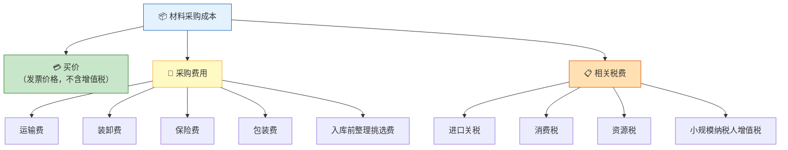
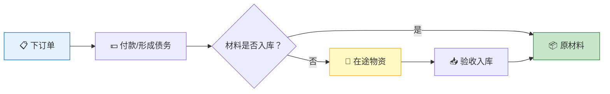
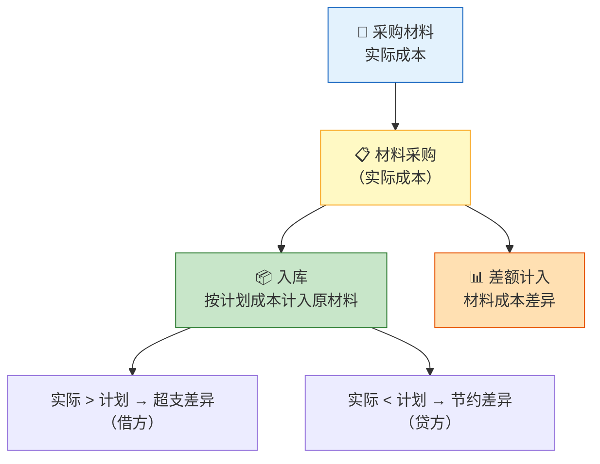
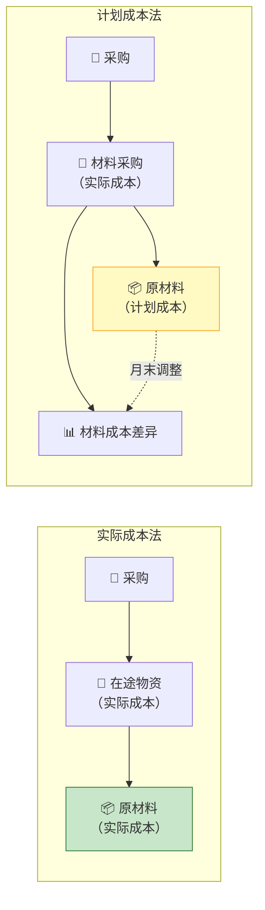

> 采购是企业供应链的起点——如同厨师选材，材料的质量与成本决定了最终产品的品质与利润。理解采购业务的核算，是掌握企业成本控制的第一步。

## 一、材料采购成本构成

材料的采购成本包括购买材料从采购到入库前所发生的一切合理、必要的支出。



::: warning 增值税的特殊处理
一般纳税人购入材料支付的增值税进项税额，**不计入材料采购成本**，而是计入"应交税费——应交增值税（进项税额）"单独核算。但以下情况例外：
- 小规模纳税人购入材料的增值税计入成本
- 取得普通发票的增值税计入成本
- 不可抵扣的进项税额计入成本
:::

### 1.1 共同采购费用的分摊

当一次采购多种材料时，共同发生的采购费用需要按照合理标准分摊：

| 分摊标准 | 适用场景 |
|----------|----------|
| 重量比例 | 运输费等与重量相关的费用 |
| 买价比例 | 保险费等与价值相关的费用 |
| 体积比例 | 仓储费等与体积相关的费用 |

**【例1】** 某企业购入A材料1,000千克、单价50元，B材料2,000千克、单价30元，共支付运输费900元（按重量分摊）。

```
A材料分摊运输费 = 900 × 1,000/(1,000+2,000) = 300（元）
B材料分摊运输费 = 900 × 2,000/(1,000+2,000) = 600（元）

A材料总成本 = 1,000 × 50 + 300 = 50,300（元）
B材料总成本 = 2,000 × 30 + 600 = 60,600（元）
```

---

## 二、实际成本法下的核算

实际成本法下，材料的收发结存均按实际成本计价。适用于材料品种较少、收发业务不多的企业。

### 2.1 核算科目设置

| 科目 | 用途 |
|------|------|
| 在途物资 | 已付款但尚未验收入库的材料 |
| 原材料 | 已验收入库的材料 |
| 应交税费——应交增值税（进项税额） | 可抵扣的增值税 |
| 应付账款 | 已收货但尚未付款 |
| 应付票据 | 采用商业汇票结算 |
| 预付账款 | 预先支付的购货款 |

### 2.2 采购业务核算流程



### 2.3 典型业务处理

**【例2】** 某企业（一般纳税人）3月发生以下采购业务：

**（1）3月5日，购入甲材料，增值税专用发票注明价款100,000元，增值税13,000元，运输费1,000元（增值税90元），款项已通过银行转账支付，材料已验收入库。**

```
材料采购成本 = 100,000 + 1,000 = 101,000（元）
进项税额合计 = 13,000 + 90 = 13,090（元）

借：原材料——甲材料       101,000
    应交税费——应交增值税（进项税额）  13,090
    贷：银行存款           114,090
```

**（2）3月10日，购入乙材料，增值税专用发票注明价款200,000元，增值税26,000元，对方代垫运费2,000元，开出商业承兑汇票一张，材料尚未到达。**

```
借：在途物资——乙材料     202,000
    应交税费——应交增值税（进项税额）  26,000
    贷：应付票据           228,000
```

**（3）3月15日，上述乙材料到达并验收入库。**

```
借：原材料——乙材料       202,000
    贷：在途物资——乙材料   202,000
```

**（4）3月20日，购入丙材料，材料已入库，但月末发票账单未到，按暂估价150,000元入账。**

月末暂估入账：

```
借：原材料——丙材料       150,000
    贷：应付账款——暂估应付账款  150,000
```

下月初红字冲回：

```
借：原材料——丙材料       150,000（红字）
    贷：应付账款——暂估应付账款  150,000（红字）
```

::: important 暂估入账规则
月末货到单未到时，需按暂估价入账；下月初用红字冲回，等发票到达后再按实际金额入账。这是**权责发生制**的要求——存货和负债已经存在，不能因为发票未到而不确认。
:::

---

## 三、应付账款与应付票据

### 3.1 应付账款

应付账款是企业因购买材料、商品和接受劳务供应等而应付给供应单位的款项。

**含现金折扣的应付账款**——采用**总价法**核算：

**【例3】** 某企业购入材料一批，价款80,000元，增值税10,400元。付款条件为2/10, 1/20, n/30。

**（1）购入时（按总价入账）：**

```
借：原材料                80,000
    应交税费——应交增值税（进项税额）  10,400
    贷：应付账款           90,400
```

**（2）若10天内付款（享受2%折扣）：**

```
折扣金额 = 80,000 × 2% = 1,600（元）
实际支付 = 90,400 - 1,600 = 88,800（元）

借：应付账款              90,400
    贷：银行存款           88,800
        财务费用           1,600
```

**（3）若30天后付款（无折扣）：**

```
借：应付账款              90,400
    贷：银行存款           90,400
```

### 3.2 应付票据

应付票据是由出票人出票、委托付款人在指定日期无条件支付确定的金额给收款人的票据。

| 类型 | 特点 |
|------|------|
| 银行承兑汇票 | 银行承兑，信用度高，需向银行支付手续费 |
| 商业承兑汇票 | 企业承兑，信用度相对较低，无需支付手续费 |

---

## 四、预付账款的核算

预付账款是企业按照合同规定预付给供应单位的款项。

**【例4】** 某企业按合同预付供货方材料款50,000元，后收到材料价款60,000元，增值税7,800元，补付余款。

**（1）预付货款时：**

```
借：预付账款              50,000
    贷：银行存款           50,000
```

**（2）收到材料时：**

```
借：原材料                60,000
    应交税费——应交增值税（进项税额）  7,800
    贷：预付账款           67,800
```

**（3）补付余款时：**

```
补付金额 = 67,800 - 50,000 = 17,800（元）

借：预付账款              17,800
    贷：银行存款           17,800
```

::: tip 预付账款的双重性质
预付账款明细账可能出现贷方余额（表示应付账款），此时在资产负债表中应重分类至"应付账款"项目列示。同理，应付账款明细账的借方余额应重分类至"预付账款"。
:::

---

## 五、计划成本法下的核算

计划成本法下，材料的日常收发均按**计划成本**计价，月末通过"材料成本差异"科目调整为实际成本。适用于材料品种繁多、收发频繁的企业。

### 5.1 核算科目

| 科目 | 用途 |
|------|------|
| 材料采购 | 归集实际采购成本 |
| 原材料 | 按计划成本记录收发 |
| 材料成本差异 | 实际成本与计划成本的差额 |

### 5.2 核算流程



**【例5】** 某企业采用计划成本法核算，甲材料计划单价100元/千克。本月购入甲材料1,000千克，实际买价102,000元，增值税13,260元，运输费3,000元，款项已付，材料已入库。

**（1）采购时：**

```
借：材料采购              105,000
    应交税费——应交增值税（进项税额）  13,260
    贷：银行存款           118,260
```

**（2）入库时（按计划成本）：**

```
计划成本 = 1,000 × 100 = 100,000（元）

借：原材料——甲材料       100,000
    贷：材料采购           100,000
```

**（3）结转材料成本差异：**

```
超支差异 = 105,000 - 100,000 = 5,000（元）

借：材料成本差异          5,000
    贷：材料采购            5,000
```

### 5.3 材料成本差异率

月末需计算材料成本差异率，以便将发出材料的计划成本调整为实际成本：

$$
\text{材料成本差异率} = \frac{\text{月初结存材料成本差异} + \text{本月收入材料成本差异}}{\text{月初结存材料计划成本} + \text{本月收入材料计划成本}} \times 100\%
$$

$$
\text{发出材料实际成本} = \text{发出材料计划成本} \times (1 + \text{材料成本差异率})
$$

::: warning 超支与节约的符号
- **超支差异**（实际 > 计划）：差异率正数，发出材料时调增计划成本
- **节约差异**（实际 < 计划）：差异率负数，发出材料时调减计划成本
:::

---

## 六、两种成本法比较

| 比较项目 | 实际成本法 | 计划成本法 |
|----------|-----------|-----------|
| 计价基础 | 实际采购成本 | 计划成本 + 差异调整 |
| 日常核算 | 每次收发按实际成本 | 每次收发按计划成本 |
| 科目设置 | 在途物资、原材料 | 材料采购、原材料、材料成本差异 |
| 适用范围 | 品种少、收发不多 | 品种多、收发频繁 |
| 优点 | 成本真实准确 | 简化日常核算，便于成本控制 |
| 缺点 | 工作量大 | 月末调整，日常成本为近似值 |



---

## 七、增值税进项税额专题

### 7.1 可抵扣的进项税额

一般纳税人购入货物或接受应税劳务支付的增值税，符合规定的可以从销项税额中抵扣：

| 项目 | 抵扣凭证 | 备注 |
|------|----------|------|
| 购入材料 | 增值税专用发票 | 最常见 |
| 运输费用 | 增值税专用发票 | 运输费9%税率 |
| 农产品 | 收购发票或销售发票 | 按9%计算抵扣 |
| 进口货物 | 海关完税凭证 | 需经海关认证 |

### 7.2 不可抵扣的进项税额

- 用于简易计税方法计税项目的购进货物
- 用于免征增值税项目的购进货物
- 用于集体福利或个人消费的购进货物
- 非正常损失的购进货物

**【例6】** 某企业购入一批材料用于职工福利，价款30,000元，增值税3,900元。

```
借：应付职工薪酬——职工福利费  33,900
    贷：银行存款               33,900
```

::: warning 进项税额转出
已抵扣进项税额的购进货物，事后改变用途（如用于集体福利、发生非正常损失等），应作**进项税额转出**处理：

```
借：应付职工薪酬/待处理财产损溢等
    贷：应交税费——应交增值税（进项税额转出）
```
:::

---

## 八、综合练习题

### 练习1

某企业（一般纳税人）发生以下经济业务：
（1）购入A材料2,000千克，单价80元/千克，增值税率13%，运输费3,000元，款项已付，材料已入库。
（2）购入B材料1,000千克，单价60元/千克，增值税率13%，开出商业承兑汇票，材料尚未到达。
（3）上述B材料到达，验收入库，另支付入库整理费500元。
（4）月末，购入C材料已入库但发票未到，按暂估价40,000元入账。

**要求：** 编制上述业务的会计分录。

::: details 参考答案

**（1）**

```
A材料成本 = 2,000 × 80 + 3,000 = 163,000（元）
进项税额 = 2,000 × 80 × 13% = 20,800（元）

借：原材料——A材料       163,000
    应交税费——应交增值税（进项税额）  20,800
    贷：银行存款           183,800
```

**（2）**

```
借：在途物资——B材料     60,000
    应交税费——应交增值税（进项税额）  7,800
    贷：应付票据           67,800
```

**（3）**

```
B材料总成本 = 60,000 + 500 = 60,500（元）

借：原材料——B材料       60,500
    贷：在途物资——B材料   60,000
        银行存款            500
```

**（4）** 月末暂估入账：

```
借：原材料——C材料       40,000
    贷：应付账款——暂估应付账款  40,000
```

:::

### 练习2

某企业采用计划成本法核算甲材料，甲材料计划单价50元/千克。月初结存200千克，材料成本差异（节约）1,000元。本月购入甲材料800千克，实际成本42,000元，已入库。本月生产领用甲材料600千克。

**要求：**
1. 编制购入和入库的会计分录
2. 计算本月材料成本差异率
3. 计算本月发出材料的实际成本和月末结存材料的实际成本

::: details 参考答案

**1. 购入时：**

```
借：材料采购              42,000
    应交税费——应交增值税（进项税额）  5,460
    贷：银行存款           47,460
```

入库时（计划成本 = 800 × 50 = 40,000元）：

```
借：原材料——甲材料       40,000
    贷：材料采购           40,000
```

结转差异（超支差异 = 42,000 - 40,000 = 2,000元）：

```
借：材料成本差异          2,000
    贷：材料采购            2,000
```

**2. 材料成本差异率：**

$$
\text{差异率} = \frac{-1,000 + 2,000}{200 \times 50 + 800 \times 50} \times 100\% = \frac{1,000}{50,000} \times 100\% = 2\%
$$

**3. 发出材料实际成本：**

$$
\text{发出材料计划成本} = 600 \times 50 = 30,000\text{（元）}
$$
$$
\text{发出材料实际成本} = 30,000 \times (1 + 2\%) = 30,600\text{（元）}
$$

$$
\text{月末结存计划成本} = 10,000 + 40,000 - 30,000 = 20,000\text{（元）}
$$
$$
\text{月末结存实际成本} = 20,000 \times (1 + 2\%) = 20,400\text{（元）}
$$

:::

---

::: tip 面试速查
1. **采购成本** = 买价 + 采购费用 + 相关税费（不含可抵扣的增值税）
2. **在途物资 vs 材料采购**：实际成本法用"在途物资"，计划成本法用"材料采购"
3. **暂估入账**：月末货到单未到，暂估入账，下月初红字冲回
4. **材料成本差异率** = （月初差异 + 本月收入差异）÷（月初计划成本 + 本月收入计划成本）
5. **现金折扣总价法**：购入时按总价入账，享受折扣时冲减财务费用
6. **增值税进项**：可抵扣的不计入成本，不可抵扣的计入成本
:::

::: info 原著参考
- 《基础会计第7版》第四章：采购业务的核算——材料采购成本、实际成本法、计划成本法
- 《世界上最简单的会计书》：第5-7章，通过采购原料的故事讲述资产与存货
:::
