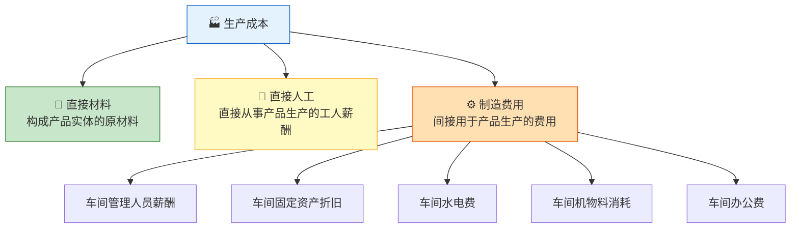
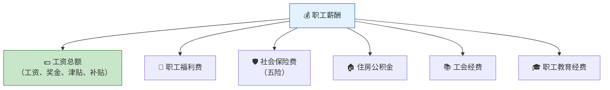
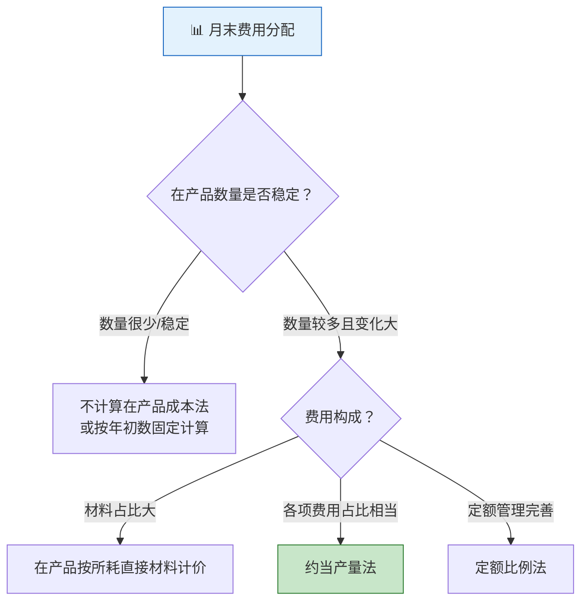
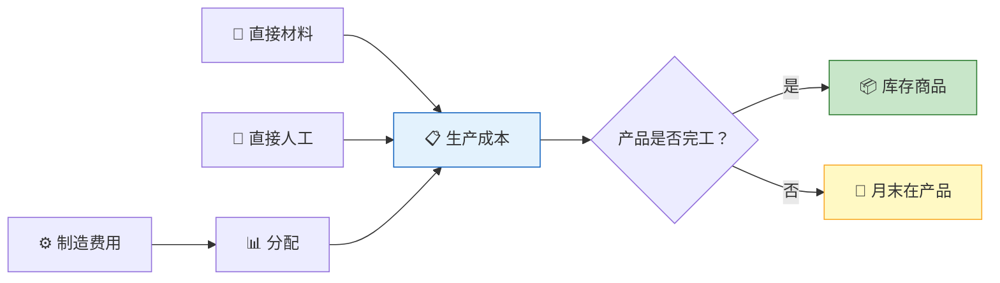

> 生产是将原材料变成产品的炼金术——而会计的任务，就是精确地记录每一滴汗水、每一份材料、每一笔开销究竟化作了什么。生产成本的核算，是企业成本管理的核心。

## 一、生产成本构成

生产成本是企业为生产一定种类和数量的产品所发生的各项费用总和。



| 成本项目 | 内容 | 计入方式 |
|----------|------|----------|
| 直接材料 | 原材料、辅助材料、包装物等 | 直接计入产品成本 |
| 直接人工 | 生产工人工资、社保、公积金等 | 直接计入产品成本 |
| 制造费用 | 车间间接费用 | 分配计入产品成本 |

::: important 直接费用 vs 间接费用
- **直接费用**：能直接分清受益对象的费用→直接计入"生产成本"
- **间接费用**：不能直接分清受益对象的费用→先归集到"制造费用"，月末分配计入"生产成本"
:::

---

## 二、材料费用的归集与分配

### 2.1 材料发出的计价方法

实际成本法下，发出材料的计价方法包括：

| 方法 | 特点 | 适用场景 |
|------|------|----------|
| 个别计价法 | 逐一辨认，成本最准确 | 贵重物品、不可替代存货 |
| 先进先出法 | 先入库的先发出 | 物价上涨时发出成本低、利润高 |
| 月末一次加权平均法 | 月末计算一次加权平均单价 | 收发频繁的企业 |
| 移动加权平均法 | 每次收货后重新计算均价 | 电算化程度高的企业 |

**月末一次加权平均法公式：**

$$
\text{加权平均单价} = \frac{\text{月初结存金额} + \text{本月收入金额}}{\text{月初结存数量} + \text{本月收入数量}}
$$

**【例1】** 某企业月初结存甲材料100千克，单价20元；本月购入400千克，单价22元；本月发出300千克。

$$
\text{加权平均单价} = \frac{100 \times 20 + 400 \times 22}{100 + 400} = \frac{2,000 + 8,800}{500} = 21.60\text{（元/千克）}
$$
$$
\text{发出材料成本} = 300 \times 21.60 = 6,480\text{（元）}
$$

### 2.2 材料费用的分配

多种产品共同耗用同一种材料时，需按合理标准分配：

**【例2】** 某企业生产A、B两种产品，共同耗用甲材料30,600元。A产品产量100件，单位消耗定额5千克；B产品产量200件，单位消耗定额4千克。按定额消耗量比例分配。

```
A产品定额消耗量 = 100 × 5 = 500（千克）
B产品定额消耗量 = 200 × 4 = 800（千克）
分配率 = 30,600 ÷ (500 + 800) = 23.5385（元/千克）

A产品应负担 = 500 × 23.5385 = 11,769.23（元）
B产品应负担 = 800 × 23.5385 = 18,830.77（元）
```

### 2.3 材料发出的会计分录

**【例3】** 某企业本月领用材料情况如下：

| 用途 | 金额（元） |
|------|-----------|
| A产品直接领用 | 50,000 |
| B产品直接领用 | 40,000 |
| A、B产品共同耗用 | 18,000（A负担10,000，B负担8,000） |
| 车间一般耗用 | 5,000 |
| 行政管理部门 | 3,000 |

```
借：生产成本——A产品      60,000
    生产成本——B产品      48,000
    制造费用               5,000
    管理费用               3,000
    贷：原材料            116,000
```

---

## 三、职工薪酬的核算

### 3.1 职工薪酬的构成



### 3.2 职工薪酬的计提与分配

**【例4】** 某企业本月应付工资总额200,000元，其中：生产工人工资120,000元（A产品80,000元、B产品40,000元），车间管理人员工资30,000元，行政管理人员工资50,000元。按工资总额的14%计提职工福利费。

**（1）分配工资：**

```
借：生产成本——A产品      80,000
    生产成本——B产品      40,000
    制造费用               30,000
    管理费用               50,000
    贷：应付职工薪酬——工资  200,000
```

**（2）计提福利费：**

```
借：生产成本——A产品      11,200
    生产成本——B产品       5,600
    制造费用               4,200
    管理费用               7,000
    贷：应付职工薪酬——职工福利费  28,000
```

**（3）实际发放工资：**

```
借：应付职工薪酬——工资   200,000
    贷：银行存款           200,000
```

### 3.3 生产工人工资的分配

当生产工人同时生产多种产品时，需按工时比例分配：

$$
\text{工资分配率} = \frac{\text{生产工人工资总额}}{\text{各产品实际工时之和}}
$$

**【例5】** 某车间生产工人工资共66,000元，A产品耗用工时3,000小时，B产品耗用工时2,000小时。

```
工资分配率 = 66,000 ÷ (3,000 + 2,000) = 13.2（元/小时）
A产品应负担 = 3,000 × 13.2 = 39,600（元）
B产品应负担 = 2,000 × 13.2 = 26,400（元）
```

---

## 四、制造费用的归集与分配

### 4.1 制造费用的归集

制造费用包括车间为生产产品和提供劳务而发生的各项间接费用。

**【例6】** 某企业本月车间发生以下费用：

```
借：制造费用              85,000
    贷：累计折旧           30,000    （车间设备折旧）
        原材料             15,000    （车间机物料消耗）
        应付职工薪酬       34,200    （车间管理人员工资及福利费）
        银行存款            5,800    （车间水电费、办公费等）
```

### 4.2 制造费用的分配

月末，将归集的制造费用按一定标准分配计入各产品成本：

| 分配标准 | 计算公式 | 适用场景 |
|----------|----------|----------|
| 生产工时 | 分配率 = 制造费用总额 ÷ 各产品工时之和 | 机械化程度相近 |
| 生产工人工资 | 分配率 = 制造费用总额 ÷ 各产品工人工资之和 | 工资水平相近 |
| 机器工时 | 分配率 = 制造费用总额 ÷ 各产品机器工时之和 | 机械化程度高 |
| 直接材料成本 | 分配率 = 制造费用总额 ÷ 各产品直接材料之和 | 材料费占比大 |

**【例7】** 某车间本月归集制造费用85,000元，A产品耗用工时3,000小时，B产品耗用工时2,000小时。按生产工时比例分配。

```
制造费用分配率 = 85,000 ÷ (3,000 + 2,000) = 17（元/小时）
A产品应负担 = 3,000 × 17 = 51,000（元）
B产品应负担 = 2,000 × 17 = 34,000（元）

借：生产成本——A产品      51,000
    生产成本——B产品      34,000
    贷：制造费用           85,000
```

---

## 五、辅助生产费用的分配

辅助生产车间为基本生产车间和企业管理部门提供服务，其费用需要分配。

### 5.1 分配方法比较

| 方法 | 特点 | 优缺点 |
|------|------|--------|
| 直接分配法 | 不考虑辅助车间之间的交互分配 | 简单但不准确 |
| 交互分配法 | 先在辅助车间之间交互分配，再对外分配 | 准确但复杂 |
| 计划成本分配法 | 按计划单位成本分配，差异计入管理费用 | 便于成本控制 |

### 5.2 直接分配法示例

**【例8】** 某企业有供电和机修两个辅助车间。供电车间费用24,000元，供电40,000度（其中机修车间用4,000度）；机修车间费用18,000元，提供修理工时6,000小时（其中供电车间用600小时）。

基本生产车间用电32,000度，修理4,200小时；管理部门用电4,000度，修理1,200小时。

**直接分配法（不分配给对方辅助车间）：**

```
供电车间对外分配率 = 24,000 ÷ (40,000 - 4,000) = 0.6667（元/度）
机修车间对外分配率 = 18,000 ÷ (6,000 - 600) = 3.3333（元/小时）

基本生产车间电费 = 32,000 × 0.6667 = 21,333.33（元）
管理部门电费 = 4,000 × 0.6667 = 2,666.67（元）
基本生产车间修理费 = 4,200 × 3.3333 = 14,000（元）
管理部门修理费 = 1,200 × 3.3333 = 4,000（元）
```

---

## 六、完工产品与在产品之间的费用分配

月末，如果既有完工产品又有在产品，就需要将生产费用在两者之间进行分配。

### 6.1 分配方法概览



### 6.2 约当产量法（重点）

约当产量法是将月末在产品数量按其完工程度折算为相当于完工产品的数量，然后按比例分配费用。

$$
\text{在产品约当产量} = \text{在产品数量} \times \text{完工程度（%）}
$$

$$
\text{费用分配率} = \frac{\text{月初在产品成本} + \text{本月生产费用}}{\text{完工产品数量} + \text{在产品约当产量}}
$$

::: warning 完工程度的确定
- **直接材料**：如果材料在生产开始时一次投入，完工程度为100%；如果随加工进度陆续投入，完工程度按加工程度计算
- **直接人工和制造费用**：按加工程度（通常为50%假设均匀投入）
:::

**【例9】** 某企业生产A产品，月初在产品成本：直接材料10,000元，直接人工3,000元，制造费用2,000元。本月发生：直接材料60,000元，直接人工24,000元，制造费用16,000元。本月完工400件，月末在产品100件，加工程度50%，材料在生产开始时一次投入。

**（1）直接材料分配（材料一次投入，在产品完工程度100%）：**

```
材料分配率 = (10,000 + 60,000) ÷ (400 + 100) = 140（元/件）
完工产品材料费 = 400 × 140 = 56,000（元）
在产品材料费 = 100 × 140 = 14,000（元）
```

**（2）直接人工分配（在产品完工程度50%）：**

```
在产品约当产量 = 100 × 50% = 50（件）
人工分配率 = (3,000 + 24,000) ÷ (400 + 50) = 60（元/件）
完工产品人工费 = 400 × 60 = 24,000（元）
在产品人工费 = 50 × 60 = 3,000（元）
```

**（3）制造费用分配（在产品完工程度50%）：**

```
制造费用分配率 = (2,000 + 16,000) ÷ (400 + 50) = 40（元/件）
完工产品制造费用 = 400 × 40 = 16,000（元）
在产品制造费用 = 50 × 40 = 2,000（元）
```

**（4）汇总：**

| 成本项目 | 完工产品成本 | 月末在产品成本 | 合计 |
|----------|-------------|---------------|------|
| 直接材料 | 56,000 | 14,000 | 70,000 |
| 直接人工 | 24,000 | 3,000 | 27,000 |
| 制造费用 | 16,000 | 2,000 | 18,000 |
| **合计** | **96,000** | **19,000** | **115,000** |

---

## 七、产品入库的核算

产品完工验收入库后，应将完工产品成本从"生产成本"转入"库存商品"。

**接【例9】：**

```
借：库存商品——A产品      96,000
    贷：生产成本——A产品   96,000
```

### 7.1 生产成本明细账

```
              生产成本——A产品
  ───────────────────┬──────────────────
  月初在产品          │
    直接材料  10,000  │
    直接人工   3,000  │
    制造费用   2,000  │
  ───────────────────│
  本月发生            │
    直接材料  60,000  │ 结转完工产品  96,000
    直接人工  24,000  │
    制造费用  16,000  │
  ───────────────────┴──────────────────
  月末在产品  19,000
    直接材料  14,000
    直接人工   3,000
    制造费用   2,000
```

### 7.2 生产业务全流程



---

## 八、综合练习题

### 练习1

某企业本月生产甲产品，月初在产品成本15,000元（其中直接材料10,000元，直接人工3,000元，制造费用2,000元）。本月发生：领用原材料80,000元（其中甲产品直接领用55,000元，车间一般耗用5,000元，管理部门耗用3,000元，乙产品直接领用17,000元）；生产工人工资50,000元（甲产品30,000元，乙产品20,000元）；车间管理人员工资10,000元；车间设备折旧8,000元；车间水电费7,000元。制造费用按生产工时分配（甲产品3,000小时，乙产品2,000小时）。甲产品本月完工500件，月末在产品100件，加工程度50%，材料一次投入。

**要求：**
1. 归集和分配制造费用
2. 计算甲产品完工产品成本和月末在产品成本
3. 编制产品入库的会计分录

::: details 参考答案

**1. 制造费用归集：**

```
制造费用 = 5,000 + 10,000 + 8,000 + 7,000 = 30,000（元）
```

按工时分配：

```
分配率 = 30,000 ÷ (3,000 + 2,000) = 6（元/小时）
甲产品应负担 = 3,000 × 6 = 18,000（元）
乙产品应负担 = 2,000 × 6 = 12,000（元）
```

**2. 甲产品成本计算：**

| 成本项目 | 月初在产品 | 本月发生 | 合计 | 完工产品（500件） | 月末在产品（100件） |
|----------|-----------|----------|------|-------------------|-------------------|
| 直接材料 | 10,000 | 55,000 | 65,000 | 54,166.67 | 10,833.33 |
| 直接人工 | 3,000 | 30,000 | 33,000 | 30,000 | 3,000 |
| 制造费用 | 2,000 | 18,000 | 20,000 | 18,181.82 | 1,818.18 |
| **合计** | **15,000** | **103,000** | **118,000** | **102,348.49** | **15,651.51** |

计算过程：
- 直接材料：材料一次投入，在产品完工程度100%
  - 分配率 = 65,000 ÷ (500 + 100) = 108.3333
  - 完工 = 500 × 108.3333 = 54,166.67；在产品 = 100 × 108.3333 = 10,833.33
- 直接人工：在产品约当产量 = 100 × 50% = 50件
  - 分配率 = 33,000 ÷ (500 + 50) = 60
  - 完工 = 500 × 60 = 30,000；在产品 = 50 × 60 = 3,000
- 制造费用：在产品约当产量 = 50件
  - 分配率 = 20,000 ÷ (500 + 50) = 36.3636
  - 完工 = 500 × 36.3636 ≈ 18,181.82；在产品 = 50 × 36.3636 ≈ 1,818.18

**3. 产品入库：**

```
借：库存商品——甲产品    102,348.49
    贷：生产成本——甲产品  102,348.49
```

:::

### 练习2

某企业采用计划成本法核算材料。本月生产领用甲材料计划成本100,000元，材料成本差异率为-2%。

**要求：** 编制领用材料和分摊差异的会计分录。

::: details 参考答案

领用材料：

```
借：生产成本              100,000
    贷：原材料            100,000
```

分摊差异（节约差异，用红字或贷方）：

```
差异额 = 100,000 × (-2%) = -2,000（元）

借：生产成本              2,000（红字）
    贷：材料成本差异       2,000（红字）
```

实际成本 = 100,000 × (1 - 2%) = 98,000（元）

:::

---

::: tip 面试速查
1. **生产成本三要素**：直接材料 + 直接人工 + 制造费用
2. **制造费用分配**：按工时/工资/机器工时/材料成本比例分配
3. **约当产量法**：在产品数量 × 完工程度 = 约当产量
4. **材料一次投入**：在产品材料完工程度为100%
5. **材料陆续投入**：在产品材料完工程度与加工程度一致
6. **完工入库**：借记"库存商品"，贷记"生产成本"
7. **计划成本法发出**：需分摊材料成本差异调整为实际成本
:::

::: info 原著参考
- 《基础会计第7版》第四章：生产业务的核算——生产成本、制造费用、完工产品成本
- 《世界上最简单的会计书》：第11-14章，通过制作柠檬汁的过程讲述成本归集与分配
:::
