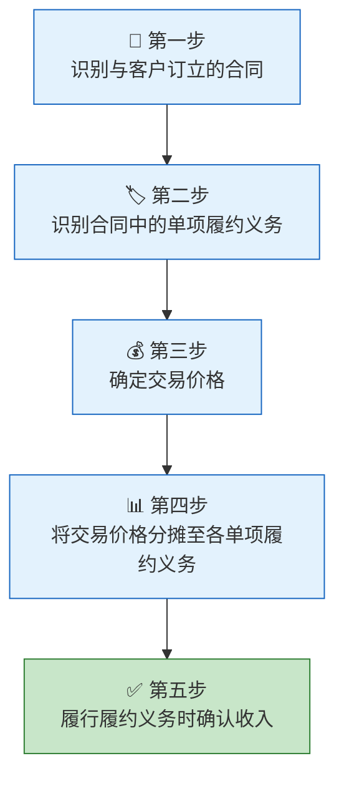
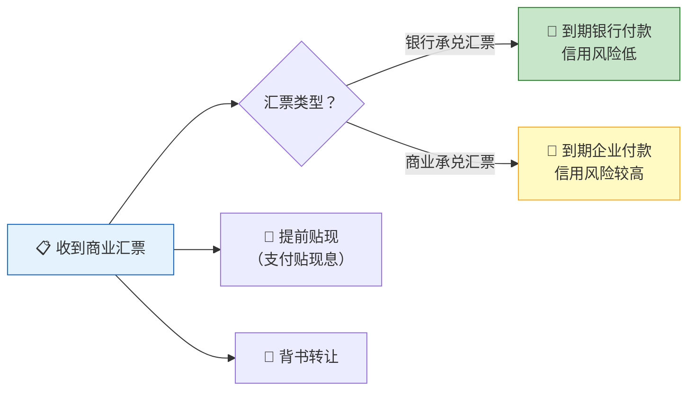
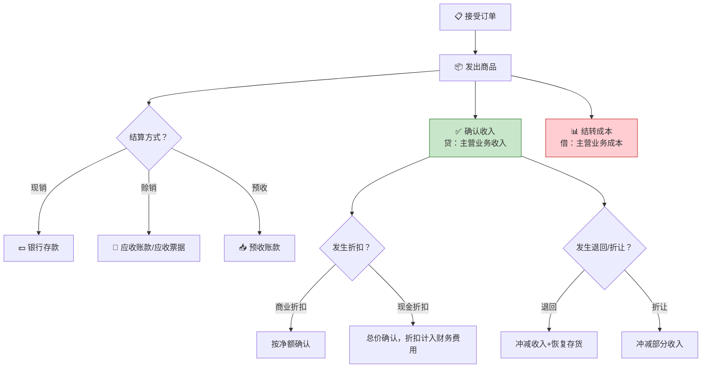

> 销售是企业价值的变现时刻——产品如同箭矢，只有命中靶心（客户）才能转化为收入。而销售业务核算，就是精确地记录这支箭从离弦到中的全过程：收入何时确认？折扣如何处理？应收款如何管理？

## 一、收入的确认条件

### 1.1 五步法模型（新收入准则）

根据《企业会计准则第14号——收入》，收入确认采用**五步法模型**：



### 1.2 收入确认时点

| 类型 | 确认方式 | 典型案例 |
|------|----------|----------|
| 某一时点履行 | 控制权转移时确认 | 销售商品、零售 |
| 某一时段履行 | 按履约进度确认 | 建造合同、长期服务 |

**商品控制权转移的迹象：**
- 企业已收取价款或取得收款权利
- 客户已拥有商品的法定所有权
- 客户已实物占有商品
- 商品所有权上的主要风险和报酬已转移
- 客户已接受商品

::: important 核心原则
新收入准则的核心是**控制权转移**——只有当客户取得了商品的控制权，企业才能确认收入。这与旧准则"风险和报酬转移"的判断标准有所不同，但实务中两者通常同时满足。
:::

---

## 二、主营业务收入与成本

### 2.1 一般商品销售

**【例1】** 某企业（一般纳税人）销售甲产品500件，单价200元/件，增值税率13%，款项已通过银行收讫。该批产品成本为60,000元。

**（1）确认收入：**

```
销售收入 = 500 × 200 = 100,000（元）
增值税销项税额 = 100,000 × 13% = 13,000（元）

借：银行存款              113,000
    贷：主营业务收入       100,000
        应交税费——应交增值税（销项税额）  13,000
```

**（2）结转成本：**

```
借：主营业务成本           60,000
    贷：库存商品——甲产品   60,000
```

### 2.2 尚未收到货款的销售

**【例2】** 某企业向B公司销售乙产品一批，价款80,000元，增值税10,400元，产品已发出，款项尚未收到。

```
借：应收账款——B公司      90,400
    贷：主营业务收入       80,000
        应交税费——应交增值税（销项税额）  10,400
```

### 2.3 采用商业汇票结算的销售

**【例3】** 某企业向C公司销售产品，价款150,000元，增值税19,500元，收到C公司开出并承兑的商业汇票一张。

```
借：应收票据              169,500
    贷：主营业务收入       150,000
        应交税费——应交增值税（销项税额）  19,500
```

---

## 三、其他业务收入与成本

其他业务收入是企业主营业务以外的其他经营活动实现的收入。

| 业务类型 | 收入科目 | 成本科目 |
|----------|----------|----------|
| 销售商品（主营） | 主营业务收入 | 主营业务成本 |
| 销售材料 | 其他业务收入 | 其他业务成本 |
| 出租资产 | 其他业务收入 | 其他业务成本 |
| 提供非主营劳务 | 其他业务收入 | 其他业务成本 |

**【例4】** 某企业销售一批多余的原材料，售价30,000元，增值税3,900元，款项已收。该材料账面成本为25,000元。

**（1）确认收入：**

```
借：银行存款              33,900
    贷：其他业务收入       30,000
        应交税费——应交增值税（销项税额）  3,900
```

**（2）结转成本：**

```
借：其他业务成本           25,000
    贷：原材料             25,000
```

---

## 四、增值税销项税额

### 4.1 销项税额计算

$$
\text{销项税额} = \text{不含税销售额} \times \text{增值税税率}
$$

一般纳税人常见税率：

| 税率 | 适用范围 |
|------|----------|
| 13% | 货物销售、加工修理修配劳务、有形动产租赁 |
| 9% | 交通运输、建筑、不动产租赁、销售不动产 |
| 6% | 现代服务、金融服务、生活服务 |
| 0% | 出口货物 |

### 4.2 含税价格换算

$$
\text{不含税销售额} = \frac{\text{含税销售额}}{1 + \text{增值税税率}}
$$

**【例5】** 某零售企业销售商品一批，含税售价56,500元，增值税率13%。

```
不含税销售额 = 56,500 ÷ (1 + 13%) = 50,000（元）
销项税额 = 50,000 × 13% = 6,500（元）

借：银行存款              56,500
    贷：主营业务收入       50,000
        应交税费——应交增值税（销项税额）  6,500
```

---

## 五、应收账款与应收票据

### 5.1 应收账款

应收账款是企业因销售商品、提供劳务等经营活动应收取的款项。

**应收账款的入账价值** = 不含税价款 + 增值税 + 代购货方垫付的运杂费等

**【例6】** 某企业向D公司销售产品，价款100,000元，增值税13,000元，以银行存款代垫运费2,000元，款项尚未收到。

```
借：应收账款——D公司      115,000
    贷：主营业务收入       100,000
        应交税费——应交增值税（销项税额）  13,000
        银行存款            2,000
```

### 5.2 应收票据

应收票据是企业因销售商品等而收到的商业汇票。



**【例7】** 某企业收到一张面值50,000元、期限3个月的无息商业承兑汇票。2个月后向银行贴现，贴现率6%。

```
贴现息 = 50,000 × 6% × 1/12 = 250（元）
贴现净额 = 50,000 - 250 = 49,750（元）

借：银行存款              49,750
    财务费用                250
    贷：应收票据            50,000
```

---

## 六、预收账款的核算

预收账款是企业按照合同规定预收的款项，属于**负债**（尚未履约）。

**【例8】** 某企业按合同预收E公司货款30,000元。后发出商品，价款50,000元，增值税6,500元，余款已收。

**（1）预收货款时：**

```
借：银行存款              30,000
    贷：预收账款——E公司   30,000
```

**（2）发出商品确认收入时：**

```
借：预收账款——E公司      56,500
    贷：主营业务收入       50,000
        应交税费——应交增值税（销项税额）  6,500
```

**（3）收到补付余款时：**

```
补付金额 = 56,500 - 30,000 = 26,500（元）

借：银行存款              26,500
    贷：预收账款——E公司   26,500
```

::: tip 预收账款的双重性质
预收账款明细账可能出现借方余额（表示应收账款），此时应重分类至"应收账款"项目列示。
:::

---

## 七、商业折扣与现金折扣

### 7.1 商业折扣

商业折扣是为促销而给予的价格扣除，**直接按扣除折扣后的净额确认收入**。

**【例9】** 某企业向F公司销售产品，标价100,000元，给予10%商业折扣，增值税率13%。

```
实际售价 = 100,000 × (1 - 10%) = 90,000（元）
销项税额 = 90,000 × 13% = 11,700（元）

借：应收账款              101,700
    贷：主营业务收入       90,000
        应交税费——应交增值税（销项税额）  11,700
```

### 7.2 现金折扣（总价法）

现金折扣是为鼓励客户提前付款而给予的债务扣除，采用**总价法**核算——按不扣除折扣的总额确认收入，实际享受折扣时计入**财务费用**。

| 符号 | 含义 |
|------|------|
| 2/10 | 10天内付款享受2%折扣 |
| 1/20 | 20天内付款享受1%折扣 |
| n/30 | 30天内付款无折扣 |

::: warning 关键区别
| 折扣类型 | 对收入的影响 | 对增值税的影响 | 会计处理 |
|----------|-------------|---------------|----------|
| 商业折扣 | 按净额确认收入 | 按净额计算销项税额 | 交易时即体现 |
| 现金折扣 | 按总额确认收入 | 不影响销项税额 | 实际享受时计入财务费用 |
:::

**【例10】** 某企业向G公司销售产品，价款200,000元，增值税26,000元，付款条件为2/10, 1/20, n/30。

**（1）销售时（按总价）：**

```
借：应收账款              226,000
    贷：主营业务收入       200,000
        应交税费——应交增值税（销项税额）  26,000
```

**（2）若G公司在10天内付款（享受2%折扣）：**

```
折扣金额 = 200,000 × 2% = 4,000（元）
实际收款 = 226,000 - 4,000 = 222,000（元）

借：银行存款              222,000
    财务费用                4,000
    贷：应收账款           226,000
```

**（3）若G公司在20天内付款（享受1%折扣）：**

```
折扣金额 = 200,000 × 1% = 2,000（元）
实际收款 = 226,000 - 2,000 = 224,000（元）

借：银行存款              224,000
    财务费用                2,000
    贷：应收账款           226,000
```

**（4）若超过折扣期付款：**

```
借：银行存款              226,000
    贷：应收账款           226,000
```

---

## 八、销售退回与折让

### 8.1 销售退回

销售退回是企业售出的商品由于质量、品种不符合要求等原因而发生的退货。

**【例11】** 某企业上月销售给H公司的产品（价款50,000元，增值税6,500元，成本35,000元）因质量问题被退回，产品已入库，款项已退还。

**（1）冲减收入：**

```
借：主营业务收入           50,000
    应交税费——应交增值税（销项税额）  6,500
    贷：银行存款            56,500
```

**（2）恢复存货：**

```
借：库存商品              35,000
    贷：主营业务成本       35,000
```

### 8.2 销售折让

销售折让是企业因售出商品的质量不合格等原因而在售价上给予的减让，**不退回商品**。

**【例12】** 某企业售给I公司商品价款80,000元，增值税10,400元，因质量问题同意给予5%的折让。

```
折让金额 = 80,000 × 5% = 4,000（元）
折让增值税 = 4,000 × 13% = 520（元）

借：主营业务收入           4,000
    应交税费——应交增值税（销项税额）  520
    贷：应收账款            4,520
```

---

## 九、销售费用的核算

销售费用是企业销售商品和材料、提供劳务过程中发生的各项费用。

| 费用项目 | 核算内容 |
|----------|----------|
| 运输费 | 销售商品发生的运输费 |
| 装卸费 | 销售商品发生的装卸费 |
| 包装费 | 销售商品发生的包装费 |
| 保险费 | 销售商品发生的保险费 |
| 广告费 | 为销售商品而发生的广告宣传费 |
| 展览费 | 商品展览发生的费用 |
| 销售人员薪酬 | 专设销售机构的职工薪酬 |

**【例13】** 某企业本月以银行存款支付广告费20,000元、销售运费5,000元（增值税450元），计提销售人员工资30,000元。

```
借：销售费用              55,000
    应交税费——应交增值税（进项税额）  450
    贷：银行存款           25,450
        应付职工薪酬——工资  30,000
```

---

## 十、销售业务全流程



---

## 十一、综合练习题

### 练习1

某企业（一般纳税人）本月发生以下经济业务：
（1）向甲公司销售A产品1,000件，单价150元，增值税率13%，收到商业承兑汇票。A产品单位成本80元。
（2）向乙公司销售B产品，标价200,000元，给予20%商业折扣，增值税率13%，款项已收。B产品成本120,000元。
（3）向丙公司销售产品，价款100,000元，增值税13,000元，付款条件2/10, n/30。丙公司在第8天付款。
（4）上月销售给丁公司的产品因质量问题被退回，原价50,000元，增值税6,500元，成本30,000元，产品已入库，款项已退还。

**要求：** 编制上述业务的会计分录。

::: details 参考答案

**（1）**

```
借：应收票据              169,500
    贷：主营业务收入       150,000
        应交税费——应交增值税（销项税额）  19,500

借：主营业务成本           80,000
    贷：库存商品——A产品   80,000
```

**（2）**

```
实际售价 = 200,000 × 80% = 160,000（元）
销项税额 = 160,000 × 13% = 20,800（元）

借：银行存款              180,800
    贷：主营业务收入       160,000
        应交税费——应交增值税（销项税额）  20,800

借：主营业务成本          120,000
    贷：库存商品——B产品  120,000
```

**（3）** 销售时：

```
借：应收账款              113,000
    贷：主营业务收入       100,000
        应交税费——应交增值税（销项税额）  13,000
```

第8天付款（享受2%折扣）：

```
折扣 = 100,000 × 2% = 2,000（元）

借：银行存款              111,000
    财务费用                2,000
    贷：应收账款           113,000
```

**（4）**

```
借：主营业务收入           50,000
    应交税费——应交增值税（销项税额）  6,500
    贷：银行存款            56,500

借：库存商品              30,000
    贷：主营业务成本       30,000
```

:::

### 练习2

某企业本月销售商品收入500,000元（不含增值税），增值税率13%，发生销售折让20,000元（含税），实际收到货款543,400元。该批商品成本为300,000元。另支付广告费15,000元。

**要求：** 编制相关会计分录，并计算本月销售毛利。

::: details 参考答案

**（1）销售时：**

```
借：应收账款              565,000
    贷：主营业务收入       500,000
        应交税费——应交增值税（销项税额）  65,000
```

**（2）发生销售折让：**

```
折让不含税金额 = 20,000 ÷ 1.13 ≈ 17,699.12（元）
折让增值税 = 20,000 - 17,699.12 = 2,300.88（元）

借：主营业务收入           17,699.12
    应交税费——应交增值税（销项税额）  2,300.88
    贷：应收账款            20,000
```

**（3）收到货款：**

```
借：银行存款              543,400
    贷：应收账款           543,400    （565,000 - 20,000 - 1,600差额调整）
```

::: info 计算验证
应收账款余额 = 565,000 - 20,000 = 545,000，实际收款543,400，差额1,600可能为现金折扣。若存在现金折扣：

```
借：银行存款              543,400
    财务费用                1,600
    贷：应收账款           545,000
```

:::

**（4）结转成本：**

```
借：主营业务成本          300,000
    贷：库存商品           300,000
```

**（5）支付广告费：**

```
借：销售费用              15,000
    贷：银行存款           15,000
```

**销售毛利** = (500,000 - 17,699.12) - 300,000 = 182,300.88（元）

:::

---

::: tip 面试速查
1. **收入确认五步法**：识别合同→识别履约义务→确定交易价格→分摊→确认收入
2. **商业折扣**：按净额确认收入和增值税
3. **现金折扣（总价法）**：按总额确认收入，折扣计入财务费用
4. **销售退回**：冲减收入+恢复存货（冲减成本）
5. **销售折让**：只冲减收入，不冲减成本
6. **应收账款入账价值** = 价款 + 增值税 + 代垫运费
7. **含税价格换算**：不含税价 = 含税价 ÷ (1 + 税率)
8. **销售费用**：广告费、运输费、销售人员薪酬等，计入当期损益
:::

::: info 原著参考
- 《基础会计第7版》第四章：销售业务的核算——收入确认、应收款项、折扣与退回
- 《世界上最简单的会计书》：第15-17章，通过销售柠檬汁的故事讲述收入与应收款项
:::
