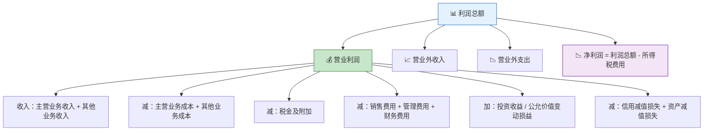
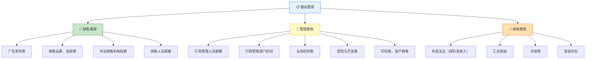
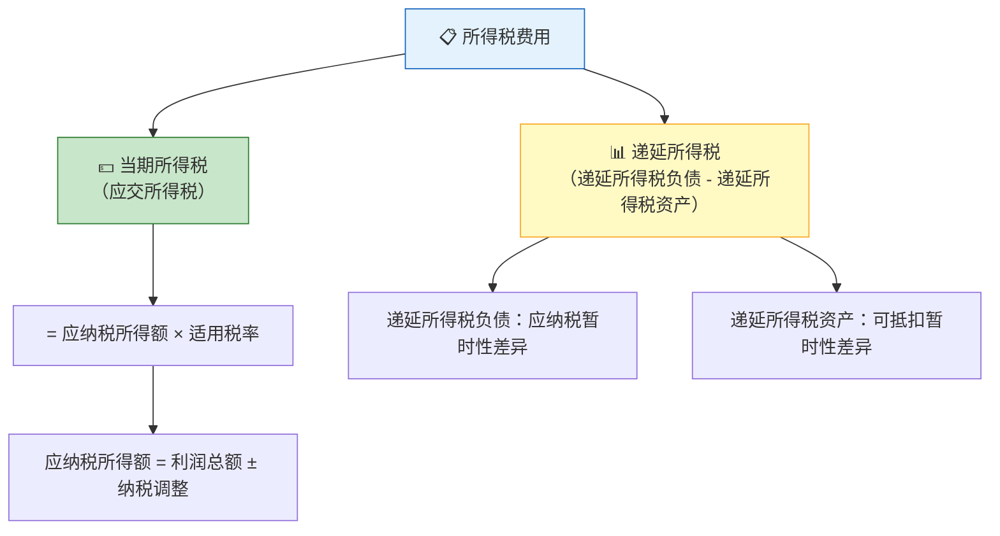
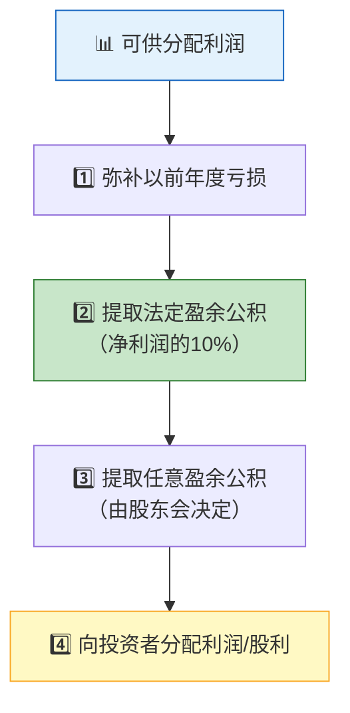
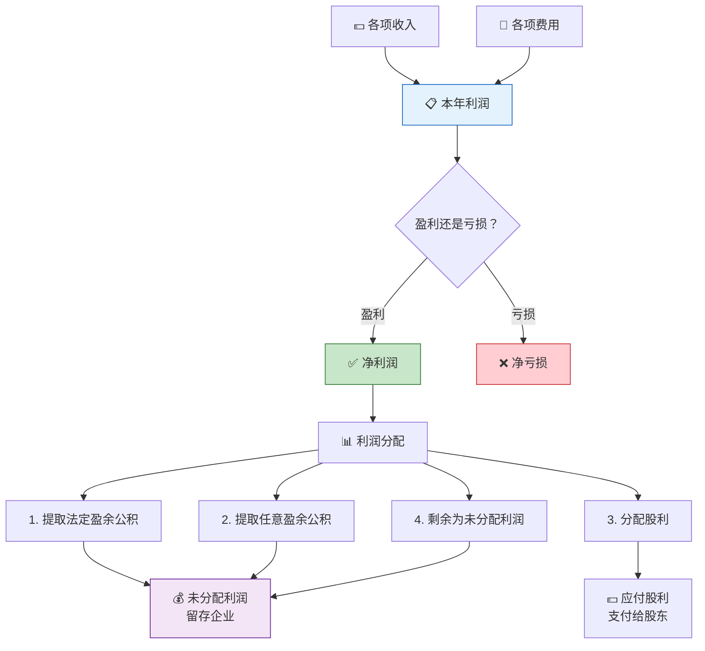

> 利润是企业的终极答案——但这个答案并非一个简单的数字，而是一道经过收入减去费用、加上利得减去损失后的精密算式。理解利润的形成与分配，就掌握了企业经营的最终成绩单。

## 一、利润的构成

### 1.1 利润的三个层次



### 1.2 利润计算公式

**营业利润** = 营业收入 - 营业成本 - 税金及附加 - 销售费用 - 管理费用 - 财务费用 + 投资收益（-投资损失）+ 公允价值变动收益（-公允价值变动损失）- 信用减值损失 - 资产减值损失 + 资产处置收益（-资产处置损失）

**利润总额** = 营业利润 + 营业外收入 - 营业外支出

**净利润** = 利润总额 - 所得税费用

| 层次 | 含义 | 关注重点 |
|------|------|----------|
| 营业利润 | 核心经营成果 | 反映企业可持续盈利能力 |
| 利润总额 | 含非经常性损益 | 反映企业综合盈利水平 |
| 净利润 | 扣除所得税后 | 反映股东最终可得收益 |

::: important 营业利润是核心
分析师更关注**营业利润**而非利润总额，因为营业利润反映的是企业可持续的经营能力。营业外收支具有偶发性，不应作为利润的主要来源。
:::

---

## 二、期间费用的核算

期间费用是企业在日常活动中发生的、不能直接归属于某个特定产品成本的费用，直接计入当期损益。

### 2.1 三大期间费用



### 2.2 期间费用核算示例

**【例1】** 某企业本月发生以下期间费用：

**（1）以银行存款支付广告费30,000元：**

```
借：销售费用              30,000
    贷：银行存款           30,000
```

**（2）计提行政管理人员工资80,000元：**

```
借：管理费用              80,000
    贷：应付职工薪酬——工资  80,000
```

**（3）计提短期借款利息5,000元：**

```
借：财务费用              5,000
    贷：应付利息           5,000
```

**（4）以银行存款支付银行手续费200元：**

```
借：财务费用                200
    贷：银行存款             200
```

**（5）收到银行存款利息收入1,000元：**

```
借：银行存款              1,000
    贷：财务费用           1,000
```

::: warning 容易混淆的费用归属
| 费用 | 正确归属 | 常见错误 |
|------|----------|----------|
| 车间设备折旧 | 制造费用 | 误入管理费用 |
| 行政办公设备折旧 | 管理费用 | 误入制造费用 |
| 销售人员差旅费 | 销售费用 | 误入管理费用 |
| 印花税 | 税金及附加/管理费用 | 误入应交税费 |
| 银行手续费 | 财务费用 | 误入管理费用 |
:::

---

## 三、营业外收支

### 3.1 营业外收入

营业外收入是企业发生的与其日常活动无直接关系的各项利得。

| 项目 | 内容 |
|------|------|
| 非流动资产处置利得 | 固定资产、无形资产处置净收益 |
| 非货币性资产交换利得 | 交换中产生的收益 |
| 债务重组利得 | 债务重组中获得的收益 |
| 政府补助 | 与日常活动无关的政府补助 |
| 盘盈利得 | 现金等盘盈 |
| 捐赠利得 | 接受捐赠产生的收益 |

**【例2】** 某企业收到与日常活动无关的政府补助50,000元。

```
借：银行存款              50,000
    贷：营业外收入         50,000
```

### 3.2 营业外支出

| 项目 | 内容 |
|------|------|
| 非流动资产处置损失 | 固定资产、无形资产处置净损失 |
| 债务重组损失 | 债务重组中承担的损失 |
| 公益性捐赠支出 | 对外公益性捐赠 |
| 非常损失 | 自然灾害等造成的损失 |
| 盘亏损失 | 固定资产盘亏净损失 |

**【例3】** 某企业因自然灾害损失原材料一批，成本20,000元，增值税进项税额2,600元需转出，保险公司赔付15,000元。

```
净损失 = 20,000 + 2,600 - 15,000 = 7,600（元）

借：其他应收款——保险公司  15,000
    营业外支出             7,600
    贷：原材料             20,000
        应交税费——应交增值税（进项税额转出）  2,600
```

::: warning 营业外收支 vs 其他业务收支
- **其他业务收支**：与日常活动相关（如销售材料、出租资产）
- **营业外收支**：与日常活动无直接关系（如捐赠、罚款、自然灾害损失）
:::

---

## 四、所得税费用

### 4.1 所得税费用构成

所得税费用 = **当期所得税** + **递延所得税**



### 4.2 当期所得税（应交所得税）

$$
\text{应交所得税} = \text{应纳税所得额} \times \text{适用税率}
$$

$$
\text{应纳税所得额} = \text{利润总额} + \text{纳税调增项目} - \text{纳税调减项目}
$$

**常见纳税调整项目：**

| 类型 | 项目 | 调整方向 |
|------|------|----------|
| 调增 | 超标准的业务招待费 | + |
| 调增 | 超标准的公益性捐赠 | + |
| 调增 | 罚款、滞纳金 | + |
| 调减 | 国债利息收入 | - |
| 调减 | 前五年内未弥补亏损 | - |

### 4.3 递延所得税（简化理解）

| 概念 | 含义 | 产生原因 |
|------|------|----------|
| 暂时性差异 | 资产/负债的账面价值与计税基础之差 | 会计准则与税法规定不同 |
| 应纳税暂时性差异 | 未来要多交税→产生递延所得税负债 | 账面价值 > 计税基础 |
| 可抵扣暂时性差异 | 未来可以少交税→产生递延所得税资产 | 账面价值 < 计税基础 |

**【例4】** 某企业本年利润总额1,000,000元，其中国债利息收入20,000元，非公益性捐赠30,000元，所得税税率25%。

```
应纳税所得额 = 1,000,000 - 20,000 + 30,000 = 1,010,000（元）
当期所得税 = 1,010,000 × 25% = 252,500（元）

借：所得税费用          252,500
    贷：应交税费——应交所得税  252,500
```

::: info 资产负债表债务法
在完整的会计处理中，所得税费用的确认采用**资产负债表债务法**，需要分别计算递延所得税资产和递延所得税负债的变动。上述例题假设无暂时性差异，所得税费用等于当期所得税。若存在暂时性差异：

```
借：所得税费用              XXX
    递延所得税资产           XXX（增加额）
    贷：应交税费——应交所得税  XXX
        递延所得税负债         XXX（增加额）
```
:::

---

## 五、本年利润的结转

### 5.1 两种方法

| 方法 | 特点 | 适用 |
|------|------|------|
| 账结法 | 每月末将损益类科目转入"本年利润" | 一般企业 |
| 表结法 | 平时不结转，年末一次结转 | 简化处理 |

### 5.2 账结法示例

**【例5】** 某企业月末各损益类科目余额如下：

| 科目 | 余额（元） | 科目 | 余额（元） |
|------|-----------|------|-----------|
| 主营业务收入 | 800,000（贷） | 主营业务成本 | 500,000（借） |
| 其他业务收入 | 100,000（贷） | 其他业务成本 | 60,000（借） |
| 营业外收入 | 20,000（贷） | 税金及附加 | 10,000（借） |
| | | 销售费用 | 50,000（借） |
| | | 管理费用 | 80,000（借） |
| | | 财务费用 | 20,000（借） |
| | | 营业外支出 | 10,000（借） |
| | | 所得税费用 | 47,500（借） |

**（1）结转各项收入：**

```
借：主营业务收入          800,000
    其他业务收入          100,000
    营业外收入            20,000
    贷：本年利润          920,000
```

**（2）结转各项费用：**

```
借：本年利润              777,500
    贷：主营业务成本       500,000
        其他业务成本       60,000
        税金及附加         10,000
        销售费用           50,000
        管理费用           80,000
        财务费用           20,000
        营业外支出         10,000
        所得税费用         47,500
```

**（3）计算本月净利润：**

```
净利润 = 920,000 - 777,500 = 142,500（元）
```

### 5.3 T型账户示例

```
                        本年利润
  ─────────────────────────┬─────────────────────────
  主营业务成本   500,000   │ 主营业务收入  800,000
  其他业务成本    60,000   │ 其他业务收入  100,000
  税金及附加     10,000   │ 营业外收入    20,000
  销售费用       50,000   │
  管理费用       80,000   │
  财务费用       20,000   │
  营业外支出     10,000   │
  所得税费用     47,500   │
  ─────────────────────────┼─────────────────────────
                           │ 余额（净利润）142,500
```

---

## 六、利润分配的顺序与核算

### 6.1 利润分配顺序



::: important 法定盈余公积的规定
- 计提比例：净利润的**10%**
- 计提基数：**弥补亏损后的净利润**
- 停止计提：累计额达到注册资本的**50%**时可不再提取
- 用途：弥补亏损、转增资本、分配股利
:::

### 6.2 年末结转本年利润

**【例6】** 某企业全年实现净利润2,000,000元，年末结转至"利润分配——未分配利润"。

```
借：本年利润            2,000,000
    贷：利润分配——未分配利润  2,000,000
```

::: warning 若为亏损
若全年亏损，做相反分录：

```
借：利润分配——未分配利润
    贷：本年利润
```
:::

### 6.3 提取盈余公积

**【例7】** 沿用【例6】，该企业按净利润的10%提取法定盈余公积，5%提取任意盈余公积。

```
法定盈余公积 = 2,000,000 × 10% = 200,000（元）
任意盈余公积 = 2,000,000 × 5% = 100,000（元）

借：利润分配——提取法定盈余公积  200,000
    利润分配——提取任意盈余公积  100,000
    贷：盈余公积——法定盈余公积   200,000
        盈余公积——任意盈余公积   100,000
```

### 6.4 向投资者分配利润

**【例8】** 该企业决定向投资者分配现金股利500,000元。

```
借：利润分配——应付现金股利  500,000
    贷：应付股利            500,000
```

实际支付时：

```
借：应付股利              500,000
    贷：银行存款           500,000
```

### 6.5 利润分配明细科目结转

年末，需将"利润分配"其他明细科目余额转入"利润分配——未分配利润"：

**【例9】** 结转上述利润分配各明细科目。

```
借：利润分配——未分配利润    800,000
    贷：利润分配——提取法定盈余公积  200,000
        利润分配——提取任意盈余公积  100,000
        利润分配——应付现金股利     500,000
```

### 6.6 未分配利润的计算

```
年末未分配利润 = 年初未分配利润 + 本年净利润 - 提取盈余公积 - 分配股利
              = 0 + 2,000,000 - 300,000 - 500,000
              = 1,200,000（元）
```

---

## 七、利润形成与分配全流程



---

## 八、综合练习题

### 练习1

某企业2025年度有关资料如下：
- 主营业务收入1,500,000元，主营业务成本900,000元
- 其他业务收入200,000元，其他业务成本120,000元
- 税金及附加30,000元
- 销售费用100,000元，管理费用150,000元，财务费用20,000元
- 营业外收入50,000元（其中国债利息收入20,000元），营业外支出30,000元（其中非公益性捐赠10,000元、税收滞纳金5,000元）
- 所得税税率25%
- 按净利润的10%提取法定盈余公积，按5%提取任意盈余公积，向投资者分配现金股利200,000元

**要求：**
1. 计算营业利润、利润总额、应纳税所得额、所得税费用、净利润
2. 编制结转收入、费用的会计分录
3. 编制提取盈余公积和分配股利的会计分录
4. 计算年末未分配利润

::: details 参考答案

**1. 计算：**

```
营业利润 = (1,500,000 + 200,000) - (900,000 + 120,000) - 30,000 - 100,000 - 150,000 - 20,000
         = 1,700,000 - 1,120,000 - 300,000
         = 280,000（元）

利润总额 = 280,000 + 50,000 - 30,000 = 300,000（元）

纳税调增 = 10,000（非公益性捐赠）+ 5,000（税收滞纳金）= 15,000（元）
纳税调减 = 20,000（国债利息收入）

应纳税所得额 = 300,000 + 15,000 - 20,000 = 295,000（元）
所得税费用 = 295,000 × 25% = 73,750（元）

净利润 = 300,000 - 73,750 = 226,250（元）
```

**2. 结转收入和费用：**

```
借：主营业务收入        1,500,000
    其他业务收入          200,000
    营业外收入            50,000
    贷：本年利润        1,750,000

借：本年利润            1,523,750
    贷：主营业务成本     900,000
        其他业务成本     120,000
        税金及附加        30,000
        销售费用         100,000
        管理费用         150,000
        财务费用          20,000
        营业外支出        30,000
        所得税费用        73,750
```

**3. 年末结转本年利润、提取盈余公积和分配股利：**

```
借：本年利润              226,250
    贷：利润分配——未分配利润  226,250

法定盈余公积 = 226,250 × 10% = 22,625（元）
任意盈余公积 = 226,250 × 5% = 11,312.50（元）

借：利润分配——提取法定盈余公积  22,625
    利润分配——提取任意盈余公积  11,312.50
    贷：盈余公积——法定盈余公积   22,625
        盈余公积——任意盈余公积   11,312.50

借：利润分配——应付现金股利  200,000
    贷：应付股利              200,000
```

**4. 结转利润分配明细科目及年末未分配利润：**

```
借：利润分配——未分配利润    233,937.50
    贷：利润分配——提取法定盈余公积  22,625
        利润分配——提取任意盈余公积  11,312.50
        利润分配——应付现金股利     200,000

年末未分配利润 = 226,250 - 233,937.50 = -7,687.50（元）
```

::: warning 计算验证
上述分配金额超过了净利润（226,250 < 233,937.50），意味着动用了年初未分配利润。若年初未分配利润足够，则可行；否则需调整分配方案。实务中，利润分配应以可供分配利润为上限。
:::

---

### 练习2

某企业年初未分配利润为500,000元（贷方），本年实现净利润3,000,000元。按10%提取法定盈余公积，经股东大会决议分配现金股利1,000,000元、股票股利800,000元。

**要求：** 编制全部利润分配的会计分录，并计算年末未分配利润。

::: details 参考答案

**（1）年末结转本年利润：**

```
借：本年利润            3,000,000
    贷：利润分配——未分配利润  3,000,000
```

**（2）提取法定盈余公积：**

```
法定盈余公积 = 3,000,000 × 10% = 300,000（元）

借：利润分配——提取法定盈余公积  300,000
    贷：盈余公积——法定盈余公积   300,000
```

**（3）分配现金股利：**

```
借：利润分配——应付现金股利  1,000,000
    贷：应付股利              1,000,000
```

**（4）分配股票股利：**

::: info 股票股利的处理
股票股利在宣告时不做会计处理，在实际发放时才进行账务处理（将未分配利润转增股本和资本公积）。

```
实际发放时：

借：利润分配——转作股本的股利  800,000
    贷：股本                      800,000
```

（假设按面值发放，若溢价发行还需计入资本公积）
:::

**（5）结转利润分配明细科目：**

```
借：利润分配——未分配利润    2,100,000
    贷：利润分配——提取法定盈余公积  300,000
        利润分配——应付现金股利     1,000,000
        利润分配——转作股本的股利   800,000
```

**年末未分配利润** = 500,000 + 3,000,000 - 2,100,000 = **1,400,000（元）**

:::

---

::: tip 面试速查
1. **利润三层次**：营业利润→利润总额→净利润
2. **营业利润** = 收入 - 成本 - 期间费用 + 投资收益 - 减值损失等
3. **所得税费用** = 当期所得税 + 递延所得税
4. **账结法**：每月末将损益类科目转入"本年利润"
5. **利润分配顺序**：弥补亏损→提取法定盈余公积→提取任意盈余公积→分配股利
6. **法定盈余公积** = 弥补亏损后净利润的10%，累计达注册资本50%可不再提取
7. **未分配利润** = 年初未分配利润 + 本年净利润 - 本年利润分配
8. **股票股利**：宣告时不处理，发放时转增股本
:::

::: info 原著参考
- 《基础会计第7版》第四章：利润形成与分配的核算——期间费用、所得税、利润分配
- 《世界上最简单的会计书》：第18-20章，通过年末结算的故事讲述利润归集与分配
:::
