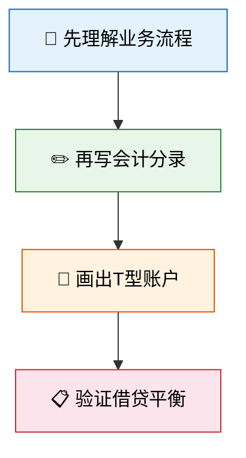

# 企业经济业务核算

> 如果说"会计基础"是学会了字母和语法，那么"企业经济业务核算"就是用这些字母写出完整的文章——从筹资开业到采购生产，从销售回款到利润分配，沿着企业经营的完整链条，掌握每一笔业务的账务处理。

## 本章概览

本章按照企业经营活动的自然流程，逐一讲解五大核心业务的核算方法：

## 文章目录

| 序号 | 文章 | 核心知识点 |
|------|------|-----------|
| 1 | [筹资与投资业务](01_筹资与投资业务.md) | 实收资本、资本公积、短期/长期借款、交易性金融资产 |
| 2 | [采购与存货业务](02_采购与存货业务.md) | 材料采购、应付账款/票据、增值税进项、存货计价方法 |
| 3 | [生产与成本业务](03_生产与成本业务.md) | 生产成本、制造费用分配、完工产品与在产品 |
| 4 | [销售与利润业务](04_销售与利润业务.md) | 收入确认、应收账款、坏账准备、利润形成与分配 |
| 5 | [固定资产与折旧](05_固定资产与折旧.md) | 固定资产确认、四种折旧方法、处置与资本化支出 |

---

## 学习建议

::: important
本章的核心是**会计分录的编制**。每学一个业务，务必亲手写出分录，画出T型账户，确保"有借必有贷，借贷必相等"。只看不练，等于没学。
:::
