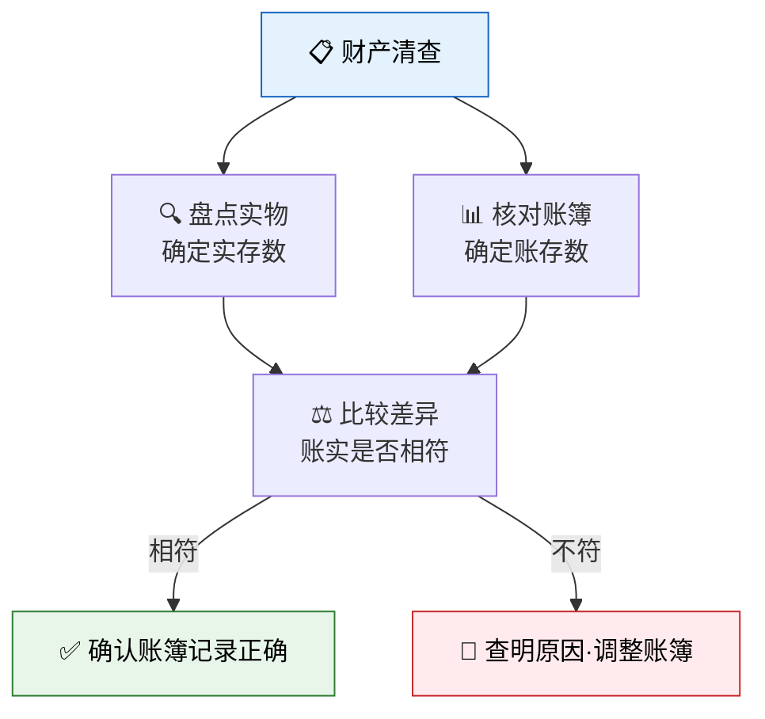
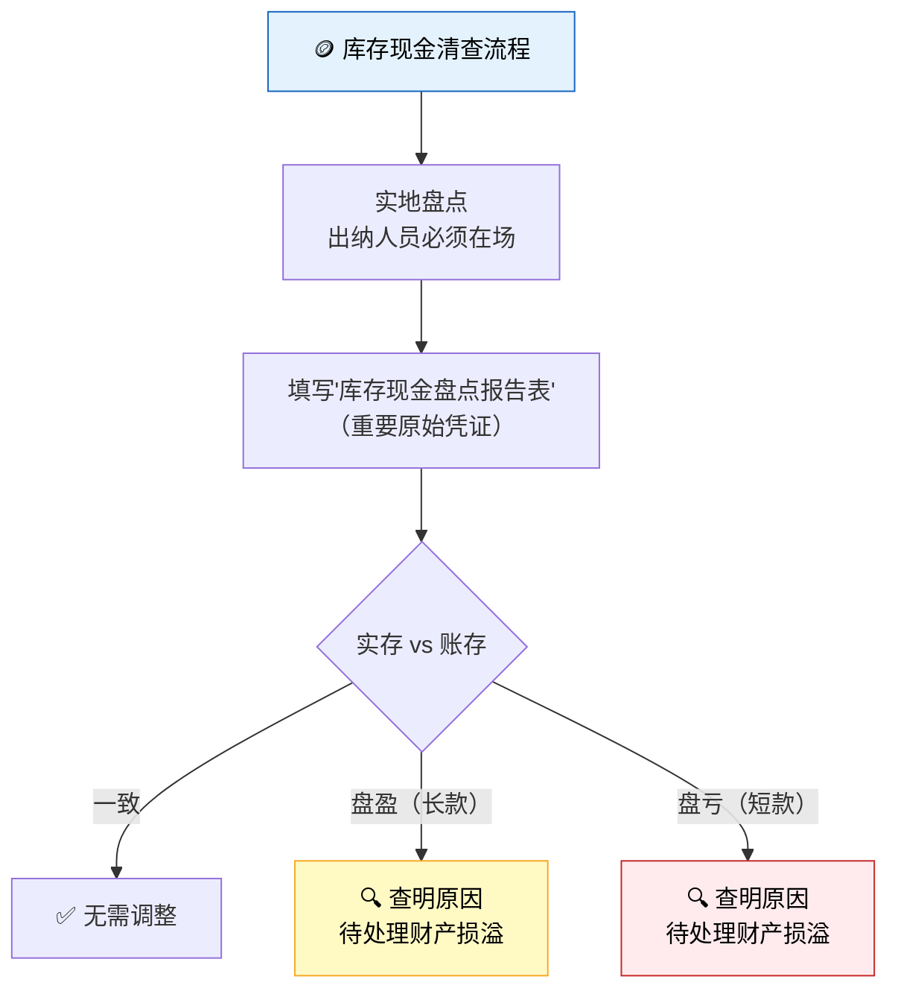
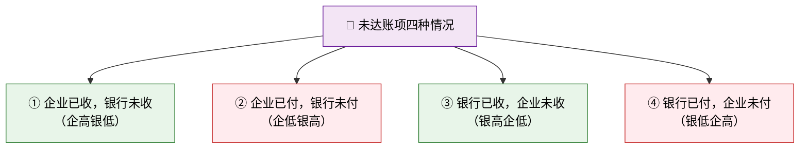
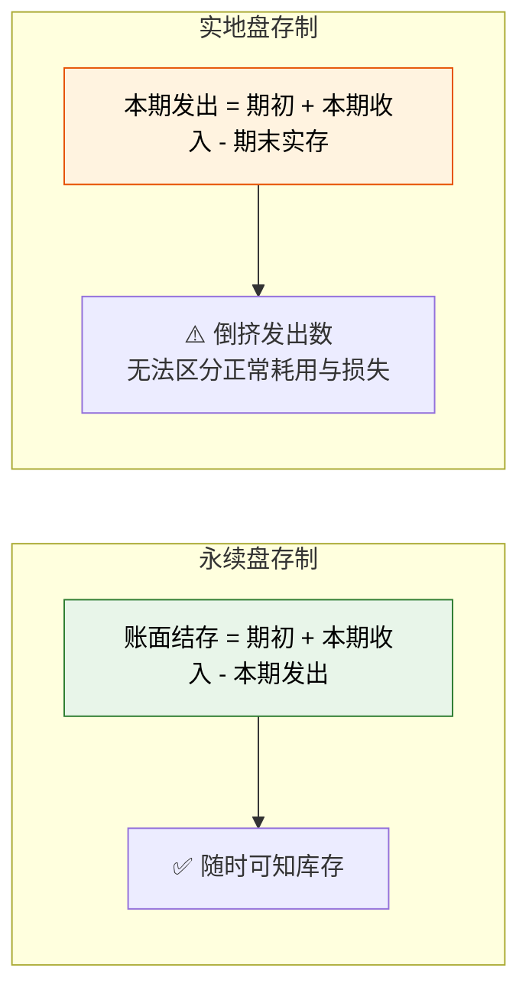
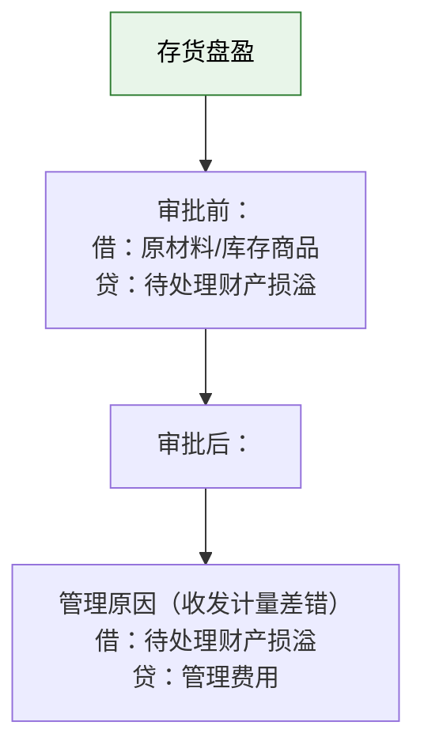
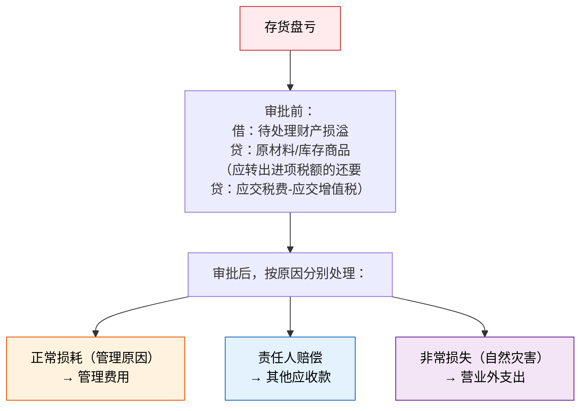
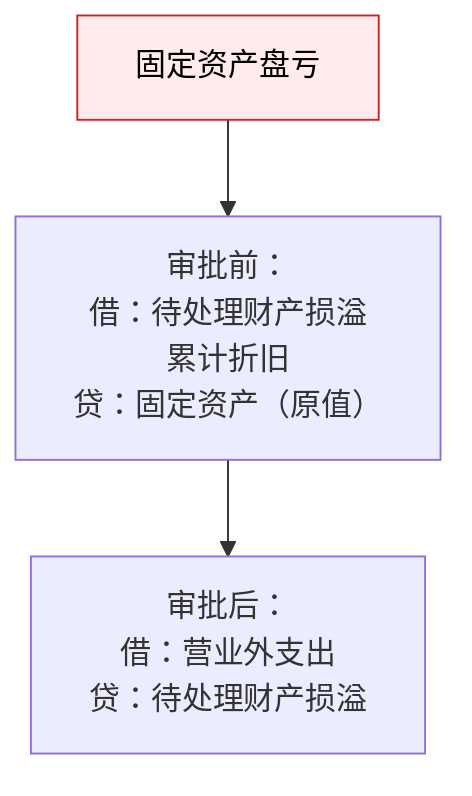
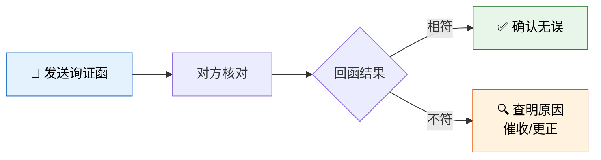
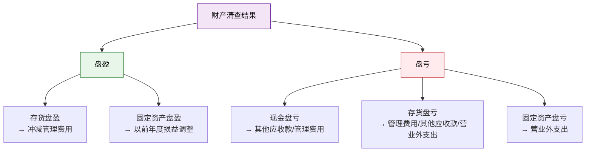

> 柠檬水站做了半个月的生意，小明翻开账本一看：账上写着库存柠檬50个，可去仓库一数——只剩42个。是账记错了，还是柠檬"长了腿"？财产清查就是找出这种"账"与"实"之间差异的过程，它是会计循环中保证信息真实性的最后一道防线。

## 一、财产清查概述

### 什么是财产清查

财产清查是指通过对实物资产、货币资金和往来款项的盘点与核对，确定其实存数，查明实存数与账存数是否相符的一种会计专门方法。



### 财产清查的分类

| 分类标准 | 类别 | 含义 | 柠檬水站举例 |
|---------|------|------|-------------|
| **按范围** | 全面清查 | 对全部财产进行盘点核对 | 学期末清点所有资产 |
| | 局部清查 | 对部分财产进行盘点核对 | 每天清点库存现金 |
| **按时间** | 定期清查 | 按预先计划安排的时间进行 | 月末、季末、年末盘点 |
| | 不定期清查 | 根据特殊需要临时进行 | 更换出纳时盘点现金 |

::: tip 全面清查的适用情形
以下情况必须进行全面清查：
1. 年终决算前
2. 单位撤销、合并或改变隶属关系前
3. 中外合资、国内合资前
4. 企业股份制改造前
5. 开展全面的资产评估、清产核资时
:::

---

## 二、货币资金的清查

### （一）库存现金的清查

库存现金清查采用**实地盘点法**，即通过清点库存现金的实有数，再与现金日记账的账面余额进行核对。



**库存现金盘点报告表**格式：

| 项目 | 金额 | 备注 |
|------|------|------|
| 账存金额 | | |
| 实存金额 | | |
| 盘盈（长款） | | |
| 盘亏（短款） | | |

::: important 现金清查要点
- 盘点时**出纳人员必须在场**
- 不允许以"白条"抵库
- 发现盘盈盘亏，必须编制**库存现金盘点报告表**作为原始凭证
:::

### （二）银行存款的清查

银行存款清查采用**与开户银行核对账目的方法**，即将企业的银行存款日记账与银行对账单逐笔核对。

**未达账项**是导致企业账面余额与银行对账单余额不一致的主要原因。



### 银行存款余额调节表——示例

柠檬水站7月31日银行存款日记账余额为 **¥58,000**，银行对账单余额为 **¥62,000**，经逐笔核对发现以下未达账项：

| 未达账项 | 金额 | 类型 |
|---------|------|------|
| 企业送存转账支票 ¥5,000，银行尚未入账 | 5,000 | ① 企业已收，银行未收 |
| 企业开出转账支票 ¥7,000，持票人尚未到银行办理 | 7,000 | ② 企业已付，银行未付 |
| 银行代收货款 ¥4,000，企业尚未收到通知 | 4,000 | ③ 银行已收，企业未收 |
| 银行代扣水电费 ¥2,000，企业尚未收到通知 | 2,000 | ④ 银行已付，企业未付 |

**银行存款余额调节表：**

| 项目 | 金额 | 项目 | 金额 |
|------|------|------|------|
| 企业银行存款日记账余额 | 58,000 | 银行对账单余额 | 62,000 |
| 加：银行已收，企业未收 | 4,000 | 加：企业已收，银行未收 | 5,000 |
| 减：银行已付，企业未付 | 2,000 | 减：企业已付，银行未付 | 7,000 |
| **调节后余额** | **60,000** | **调节后余额** | **60,000** |

::: warning 银行存款余额调节表的注意事项
1. 调节后余额相等，说明记账基本正确
2. **银行存款余额调节表不是原始凭证**，不能据以调账
3. 未达账项必须在收到有关凭证后才能入账
4. 调节表只起对账作用，不是更改账簿记录的依据
:::

---

## 三、存货的清查

### （一）存货盘存制度

| 制度 | 含义 | 优点 | 缺点 |
|------|------|------|------|
| **永续盘存制** | 逐日逐笔登记存货的增减变动，随时结出账面结存数 | 能随时掌握存货的收发存情况 | 工作量大 |
| **实地盘存制** | 平时只记收入，不记发出，期末通过实地盘点确定结存数，倒挤出本期发出数 | 简化日常核算 | 不能随时反映结存，不利于存货管理 |



### （二）存货清查的账务处理

存货清查也是通过**实地盘点**进行的，盘点后编制"实存账存对比表"。

#### 1. 存货盘盈的处理



**柠檬水站示例**：月末盘点时发现柠檬多出5个，价值¥10。

```
审批前：
借：原材料                    10
    贷：待处理财产损溢            10

审批后（属于收发计量差错）：
借：待处理财产损溢             10
    贷：管理费用                 10
```

#### 2. 存货盘亏的处理



**柠檬水站示例**：盘点发现纸杯缺少20个，价值¥8。经查明，¥3属于正常损耗，¥5属于员工小李疏忽（由其赔偿）。

```
审批前：
借：待处理财产损溢              8
    贷：原材料                   8

审批后：
借：管理费用                   3
    其他应收款——小李             5
    贷：待处理财产损溢             8
```

---

## 四、固定资产清查

固定资产清查同样采用**实地盘点法**，将固定资产卡片与实物逐一核对。

### 固定资产盘盈

固定资产盘盈按**前期差错**处理，通过"以前年度损益调整"科目核算：

```
借：固定资产（重置成本）
    贷：以前年度损益调整
```

### 固定资产盘亏



**柠檬水站示例**：盘点发现少了一台搅拌机，原值¥200，已提折旧¥80。

```
审批前：
借：待处理财产损溢             120
    累计折旧                   80
    贷：固定资产               200

审批后：
借：营业外支出                120
    贷：待处理财产损溢          120
```

---

## 五、往来款项的清查

往来款项（应收账款、应付账款等）的清查采用**函证法**，即向对方单位发函询证。



::: important 往来款项清查要点
1. 往来款项清查后应编制**往来款项清查报告表**
2. 对于无法收回的应收账款，经批准后作坏账处理
3. 对于无法支付的应付账款，经批准后计入**营业外收入**
4. 函证分为积极函证和消极函证两种方式
:::

---

## 六、财产清查结果账务处理总结



### 核心科目——"待处理财产损溢"

| 阶段 | 借方 | 贷方 |
|------|------|------|
| **审批前** | 盘亏数（资产减少） | 盘盈数（资产增加） |
| **审批后** | 转出盘盈的处理 | 转出盘亏的处理 |
| **期末** | 余额=尚未处理的盘亏 | 余额=尚未处理的盘盈 |

::: warning
"待处理财产损溢"科目在期末结账前必须处理完毕，**年末一般无余额**。如果尚未获得批准，应先按估计数处理，日后差异再调整。
:::

---

## 七、练习题

### 练习1：银行存款余额调节

某企业6月30日银行存款日记账余额为 ¥85,000，银行对账单余额为 ¥100,000，经核对发现：

1. 企业已收销货款 ¥10,000，银行未入账
2. 企业已付材料款 ¥15,000，银行未入账
3. 银行已收托收款 ¥12,000，企业未入账
4. 银行已付水电费 ¥2,000，企业未入账

请编制银行存款余额调节表。

### 练习2：存货盘盈盘亏处理

某企业月末盘点发现：甲材料盘盈200元（收发计量差错），乙材料盘亏500元，其中300元属于正常损耗，200元应由保管员赔偿。

请编制审批前和审批后的会计分录。

### 练习3：固定资产盘亏

企业年末盘点发现少了一台设备，原值¥50,000，已提折旧¥30,000。经批准作营业外支出处理。

请编制相关会计分录。

---

### 详细解答

#### 练习1答案

| 项目 | 金额 | 项目 | 金额 |
|------|------|------|------|
| 企业银行存款日记账余额 | 85,000 | 银行对账单余额 | 100,000 |
| 加：银行已收，企业未收 | 12,000 | 加：企业已收，银行未收 | 10,000 |
| 减：银行已付，企业未付 | 2,000 | 减：企业已付，银行未付 | 15,000 |
| **调节后余额** | **95,000** | **调节后余额** | **95,000** |

#### 练习2答案

```
审批前：
（盘盈）借：原材料——甲材料          200
            贷：待处理财产损溢          200

（盘亏）借：待处理财产损溢            500
            贷：原材料——乙材料          500

审批后：
（盘盈处理）借：待处理财产损溢         200
              贷：管理费用              200

（盘亏处理）借：管理费用              300
              其他应收款——保管员       200
              贷：待处理财产损溢        500
```

#### 练习3答案

```
审批前：
借：待处理财产损溢             20,000
    累计折旧                   30,000
    贷：固定资产               50,000

审批后：
借：营业外支出                20,000
    贷：待处理财产损溢          20,000
```

---

::: tip 面试速查
- **财产清查分类**：全面/局部 × 定期/不定期
- **库存现金清查**：实地盘点法，出纳必须在场
- **银行存款清查**：与银行对账，编制银行存款余额调节表
- **未达账项**四种：企收银未收、企付银未付、银收企未收、银付企未付
- **银行存款余额调节表**只起对账作用，**不是原始凭证**
- **存货盘存制度**：永续盘存制（随时反映）vs 实地盘存制（倒挤发出）
- **盘盈处理**：存货→管理费用（冲减），固定资产→以前年度损益调整
- **盘亏处理**：正常损耗→管理费用，责任人赔偿→其他应收款，非常损失→营业外支出
- **"待处理财产损溢"**期末一般无余额
:::

::: info 原著参考
本节内容主要参考《基础会计第7版》第八章"财产清查"。柠檬水站盘点类比例子基于《世界上最简单的会计书》中关于期末存货清点的叙事。
:::
